# Toolbars

Source: https://m3.material.io/components/toolbars/specs

## Variants

*Docked toolbar; Floating toolbar*

### Baseline variant

The baseline bottom app bar is no longer recommended. It should be replaced with the docked toolbar, which is very similar and more flexible.

*Bottom app bar (not recommended)*

| Variant | M3 | M3 Expressive |
| --- | --- | --- |
| Docked toolbar | -- | Available |
| Floating toolbar | -- | Available |
| Bottom app bar | Available | Not recommended. Use docked toolbar. |

## Configurations

*Standard and vibrant toolbars; Vertical floating toolbar; Floating toolbar with FAB*

| Category | Configuration | M3 | M3 Expressive |
| --- | --- | --- | --- |
| Color | Standard (default) | Available as bottom app bar | Available |
| Color | Vibrant | -- | Available |
| Floating toolbar layout | Horizontal (default) | -- | Available |
| Floating toolbar layout | Vertical | -- | Available |
| Other elements | With FAB | Available as bottom app bar | Available* |

## Tokens & specs

Browse the component elements, attributes, tokens, and their values. [Jump to baseline bottom app bar specs](https://m3.material.io/m3/pages/toolbars/specs#ad142675-3e3b-43b8-ba53-12c1f0b7138d)

- Token sets: Toolbar - Color - Standard; Toolbar - Color - Vibrant; Toolbar - Docked; Toolbar - Floating; Toolbar - Floating - FAB
- Columns: Token
- Visible groups: Enabled; Disabled; Hovered; Focused; Pressed

## Anatomy

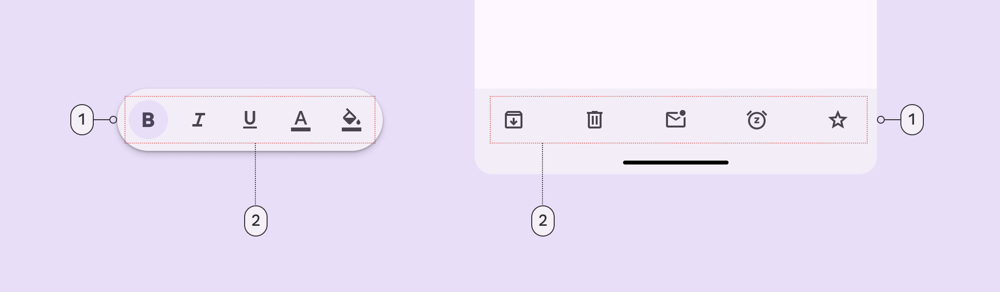

*Container; Placed components*

### Flexibility & slots

When configuring a toolbar, think of it as a container with several slots.

Each slot can be a different element. The most common elements are icon buttons (When configuring a toolbar, think of it as a container with several slots. Each slot can be a different element. The most common elements are icon buttons, buttons, and text fields. [More on icon buttons](https://m3.material.io/m3/pages/icon-buttons/specs)), buttons (Buttons let people take action and make choices with one tap. [More on buttons](https://m3.material.io/m3/pages/common-buttons/specs)), and text fields (Text fields let users enter text into a UI. [More on text fields](https://m3.material.io/m3/pages/text-fields/overview)).

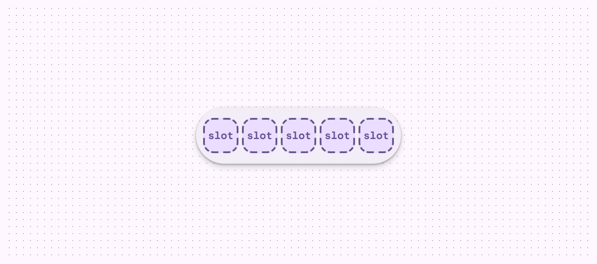

*A toolbar is essentially a container with configurable slots*

## Color

Color values are implemented through design tokens. For design, this means working with color values that correspond with tokens. For implementation, a color value will be a token that references a value. [Learn more about design tokens](https://m3.material.io/m3/pages/design-tokens/overview)

### Standard

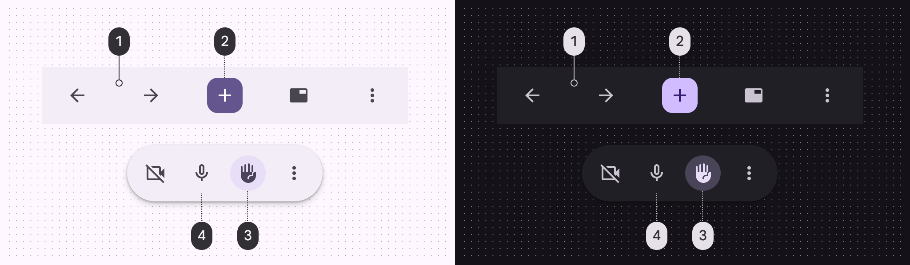

*Surface container; Filled button (Primary, On primary); Toggle tonal button (Secondary container, On secondary container); Standard button (Primary)*

### Vibrant

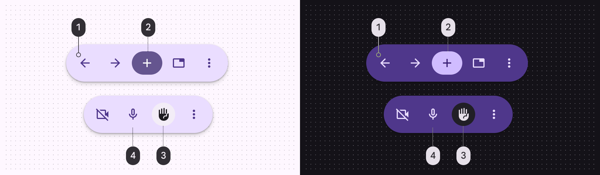

*Primary container; Filled button (Primary, On primary); Toggle tonal button: (Surface container, On surface); Standard button (On primary container)*

## Measurements

By default all toolbars are 64dp high, center-aligned, have equal padding between items, and have a minimum outside padding of 16dp.

### Docked toolbar

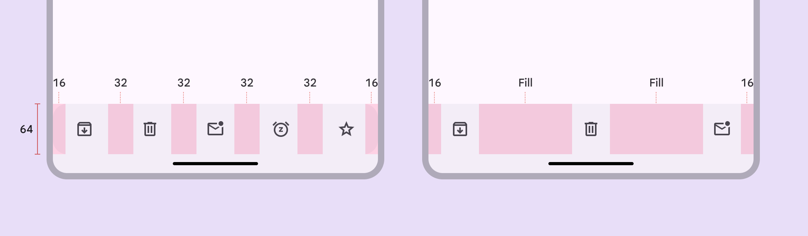

*Default margins and padding; Margins and padding with leading, middle, and trailing content*

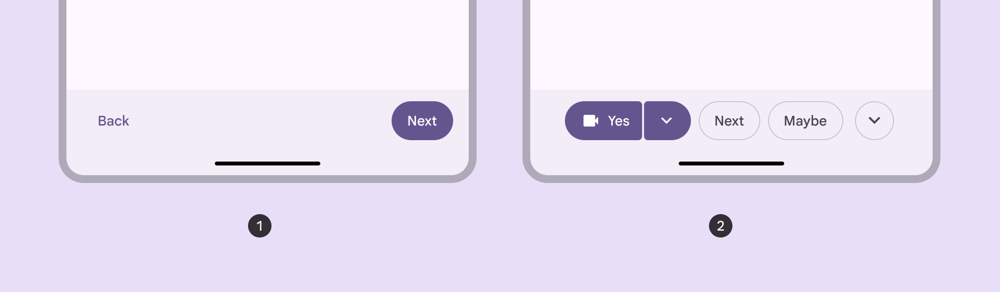

*Left and right alignment; Center-aligned, 8dp padding between items*

### Floating toolbar

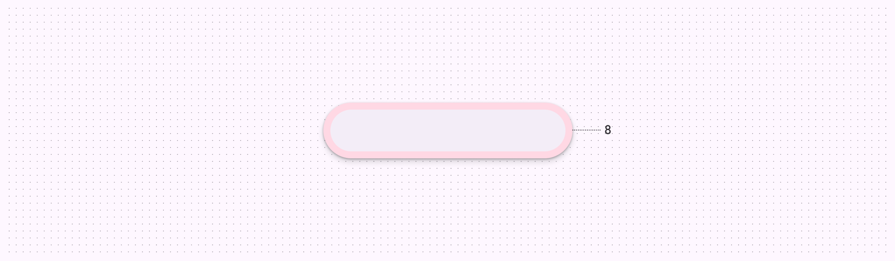

*Default padding of floating toolbar*

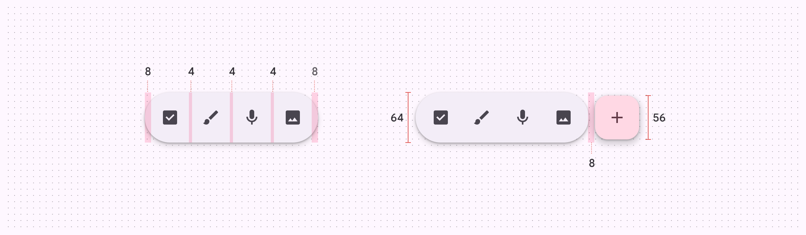

*Floating toolbar size and padding measurements*

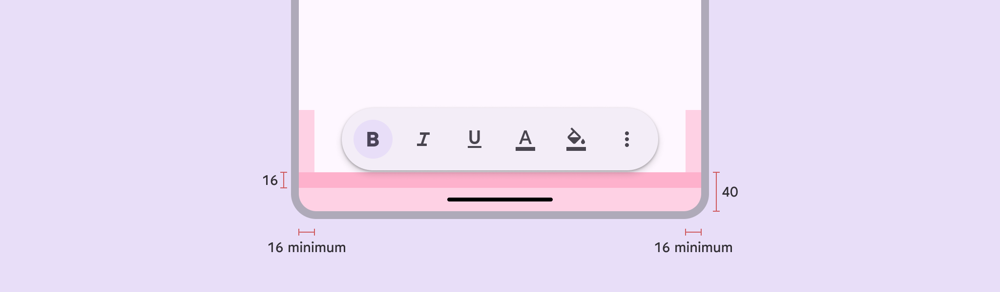

*Floating toolbar margins*

## Bottom app bar (baseline)

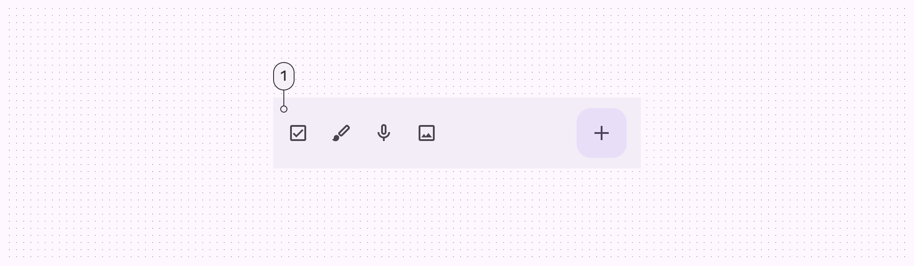

*Container*

### Tokens & specs

Bottom app bar tokens are in one token set.

- Token sets: Bottom app bar (baseline); Toolbar - Docked; Toolbar - Floating; Toolbar - Color - Standard; Toolbar - Color - Vibrant; Toolbar - Floating - FAB
- Columns: Token; Value
- Visible groups: Enabled

### Color

Color values are implemented through design tokens. For designers, this means working with color values that correspond with tokens. In implementation, a color value will be a token that references a value. [Learn more about design tokens](https://m3.material.io/m3/pages/design-tokens/overview)

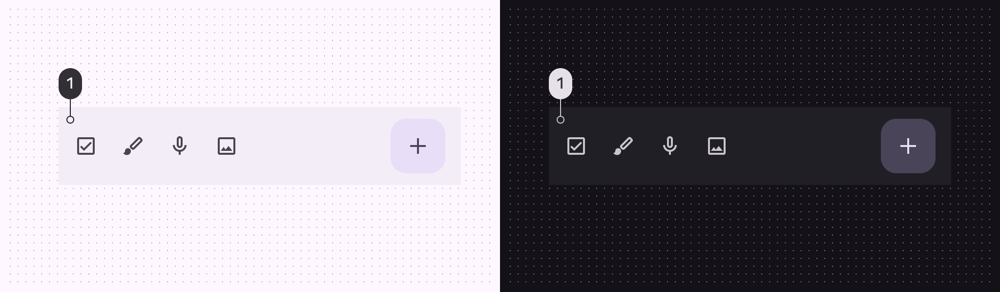

*Surface container*

### Measurements

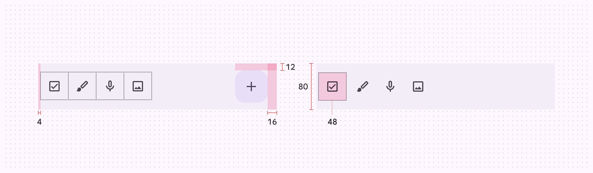

*Bottom app bar padding and size measurements*

### Common layouts

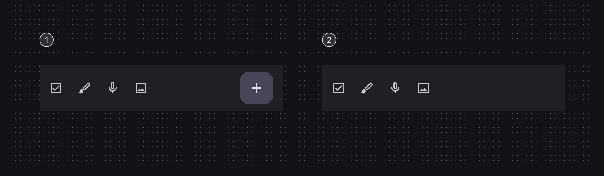

*Icon buttons and FAB; Icon buttons and no FAB*
