# Toolbars

Source: https://m3.material.io/components/toolbars/xr

Extended reality (XR) interfaces have special design requirements, like showing apps in 3D space. Material has an XR-specific toolbar with custom specs and guidance. Read [XR developer documentation](https://developer.android.com/design/ui/xr/guides/foundations) for more details.

## Variants

There is one toolbar orbiter (Orbiters are floating elements that control the content within spatial panels. [More on orbiters](https://developer.android.com/design/ui/xr/guides/spatial-ui#orbiters)). It closely aligns with the floating toolbar (Floating toolbars float on top of page content and can provide contextual, dynamic actions. [More on toolbars](https://m3.material.io/m3/pages/toolbars/overview)). It can be configured to be horizontal or vertical.

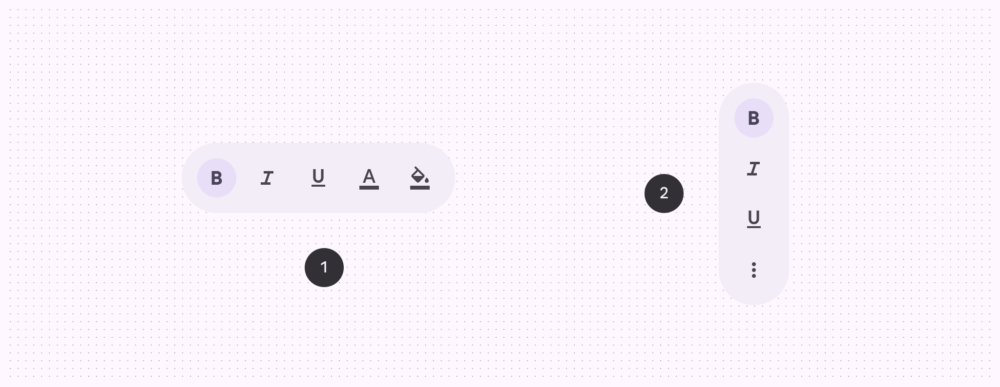

*Horizontal floating toolbar; Vertical floating toolbar*

## Anatomy

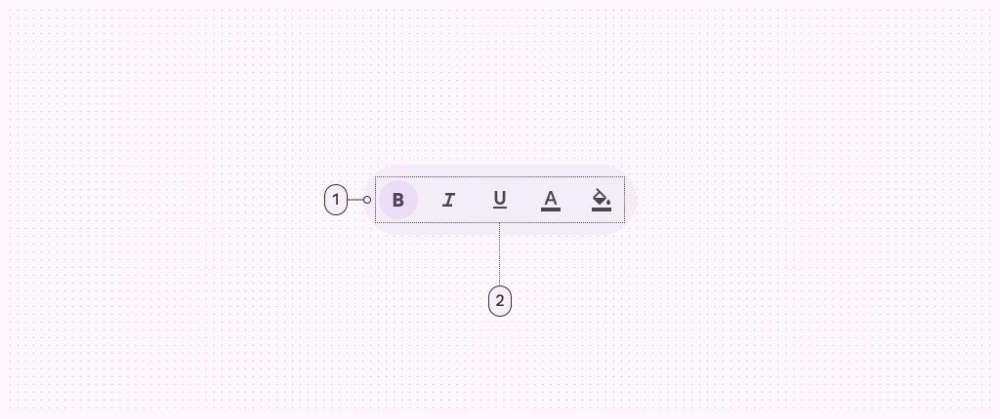

*Container; Placed components*

## Color & elevation

XR uses color to communicate the elevation of UI elements and orbiters. With [spatial elevation](https://developer.android.com/design/ui/xr/guides/spatial-ui#spatial-elevation), the toolbar displays above the spatial panel (In Android XR, a spatial panel is a container for UI elements, interactive components, and immersive content. [More on spatial panels](https://developer.android.com/design/ui/xr/guides/spatial-ui#spatial-panels)) on the Z-axis. Elevated toolbars can use any of these color options:

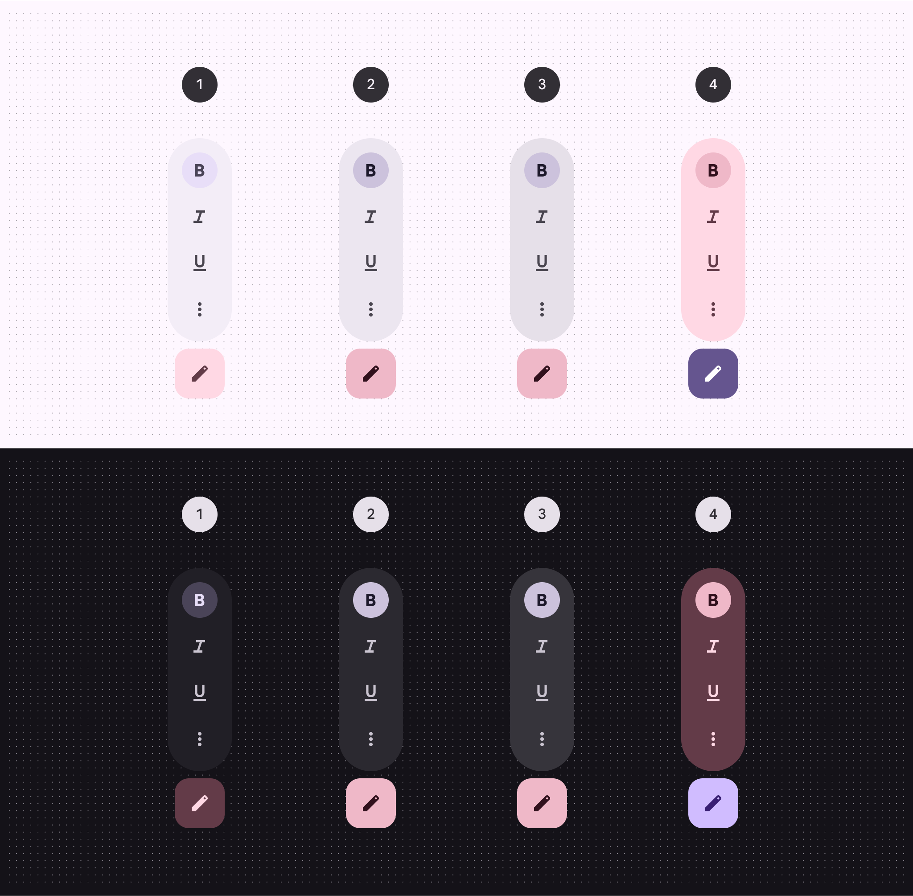

*Surface container; Surface container high; Surface container highest; Tertiary container*

## Measurements

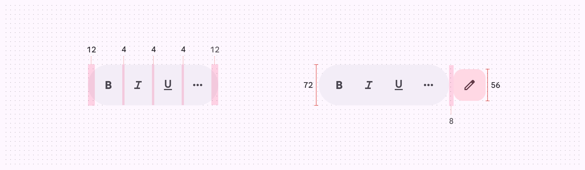

*Measurements for toolbar orbiters*

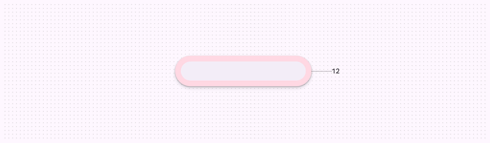

*Padding for toolbar orbiters*

## Usage

A toolbar can appear in an orbiter (Orbiters are floating elements that control the content within spatial panels. [More on orbiters](https://developer.android.com/design/ui/xr/guides/spatial-ui#orbiters)) for a more immersive experience. Currently, this spatial capability is only available in full space (Full space is Android XR’s immersive mode and supports spatial components. [More on full space](https://developer.android.com/design/ui/xr/guides/foundations#modes)). In home space (Home space is compatible with mobile and large screen apps, but doesn’t support spatial components. [More on home space](https://developer.android.com/design/ui/xr/guides/foundations#modes)), use a regular toolbar on the same plane as the body content to mimic a 2D experience.

[Video: Animation showing a toolbar changing from 2D to 3D.](assets/asset-006-a-toolbar-s-behavior-and-placement-changes-from-fcba8f4099.webp)

*A toolbar’s behavior and placement changes from a 2D to a 3D experience*

## Behavior

### Local context (recommended)

When placed in local context, the toolbar orbiter is centered at the bottom of the spatial panel it controls.

It repositions in response to layout or content changes.

[Video: A toolbar orbiter placed in local context.](assets/asset-007-in-most-cases-toolbars-should-be-placed-in-1cf0f7841b.webp)

*In most cases, toolbars should be placed in local context. The orbiter is centered and anchored to the bottom of the panel it controls.*

### Global context

When placed in global context, the toolbar orbiter is centered at the bottom of the app.

It stays anchored to the app during layout or content changes.

[Video: A toolbar orbiter placed in global context.](assets/asset-008-caution-in-global-context-toolbar-orbiters-are-centered-ea758f2d86.webp)

*Caution In global context, toolbar orbiters are centered and anchored to the bottom of the app. This use case is less common, as toolbars usually contain actions that control a specific panel.*

### Expand & collapse

Toolbar orbiters with more than five items can expand and collapse to reveal or hide additional content.

When a toolbar orbiter expands, it stays within the bounds of the adjacent spatial panel.

Alternatively, more complex toolbars can be split into multiple toolbars.

[Video: A spatial panel with a Google document has a toolbar orbiter that expands from 5 to 10 items.](assets/asset-009-toolbar-orbiters-can-expand-to-reveal-additional-content-a4c734de81.webp)

*Toolbar orbiters can expand to reveal additional content, but should stay within the bounds of the adjacent spatial panel*

### Additional toolbars

In some cases, full space apps can have more than one toolbar orbiter, placed in either global or local context.

[Video: An app switches between 1 and 2 toolbar orbiters.](assets/asset-010-caution-limit-the-use-of-multiple-toolbars-to-331369adb8.webp)

*Caution Limit the use of multiple toolbars to rare cases when additional spatialization improves usability*

## Placement

### Offset & inset positioning

In full space, a toolbar orbiter can be positioned adjacent to or overlap a spatial panel.

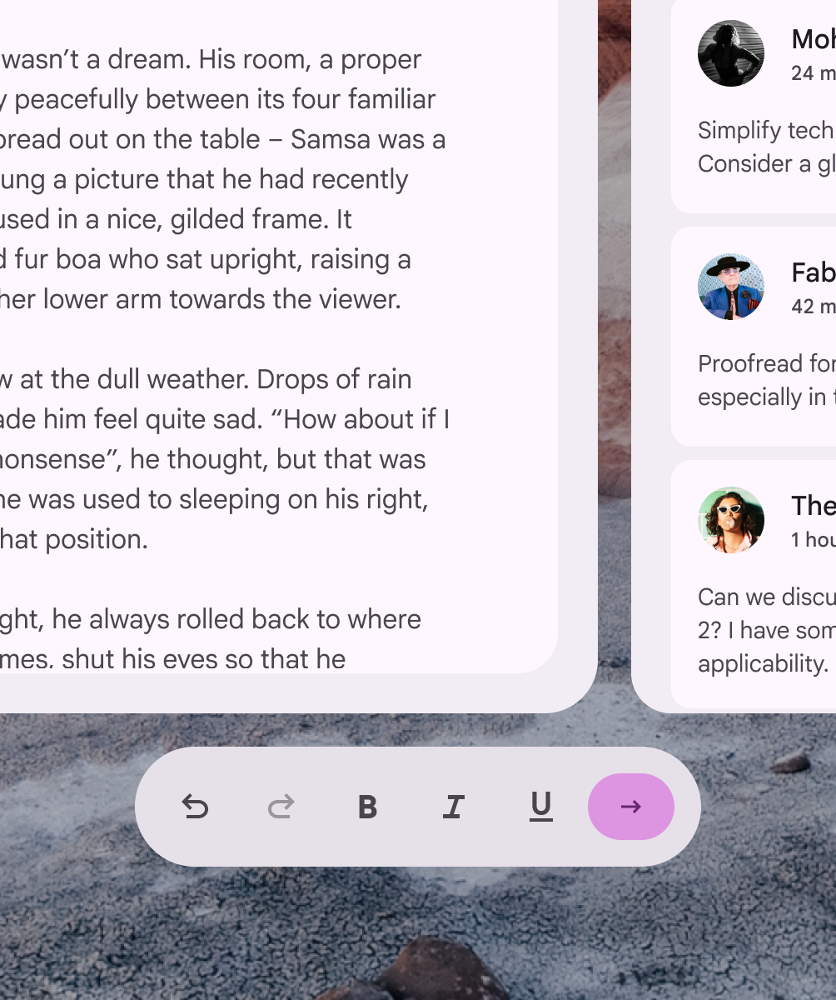

*Offset by 20dp or; Inset by 12dp*

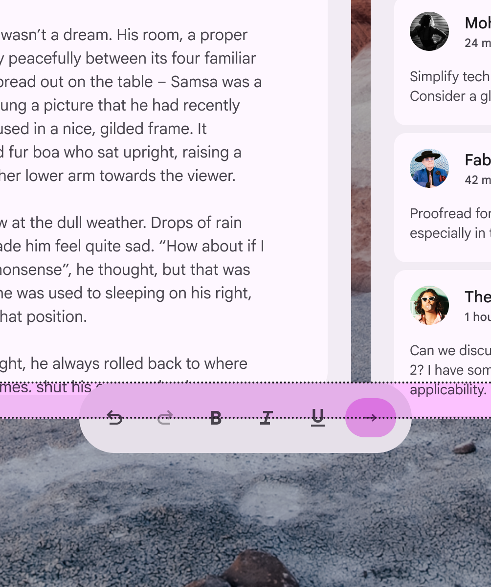

*Don’t To prevent content obstruction, don’t overlap the toolbar orbiter and spatial panel above a 12dp inset threshold*

### Horizontal alignment

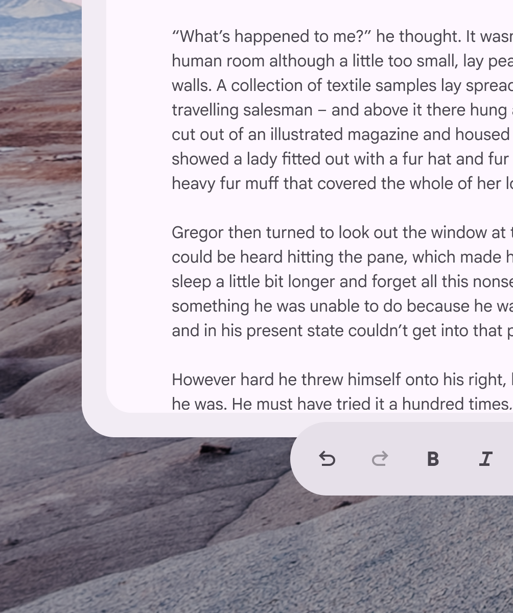

*Do Always align the toolbar orbiter within the horizontal bounds of nearby spatial panels*

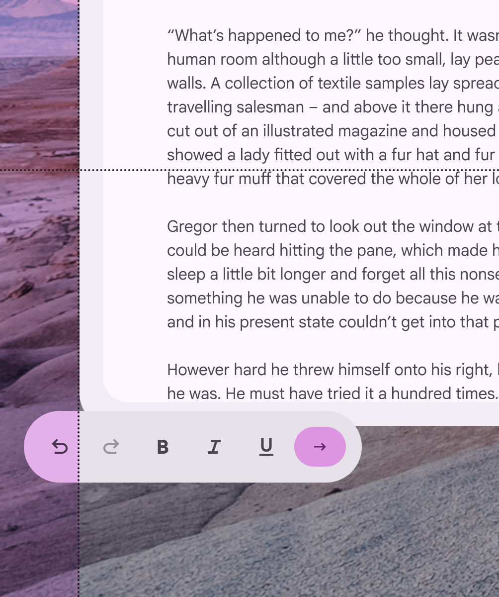

*Don’t The toolbar orbiter shouldn’t exceed the width of adjacent spatial panels*

### Vertical alignment

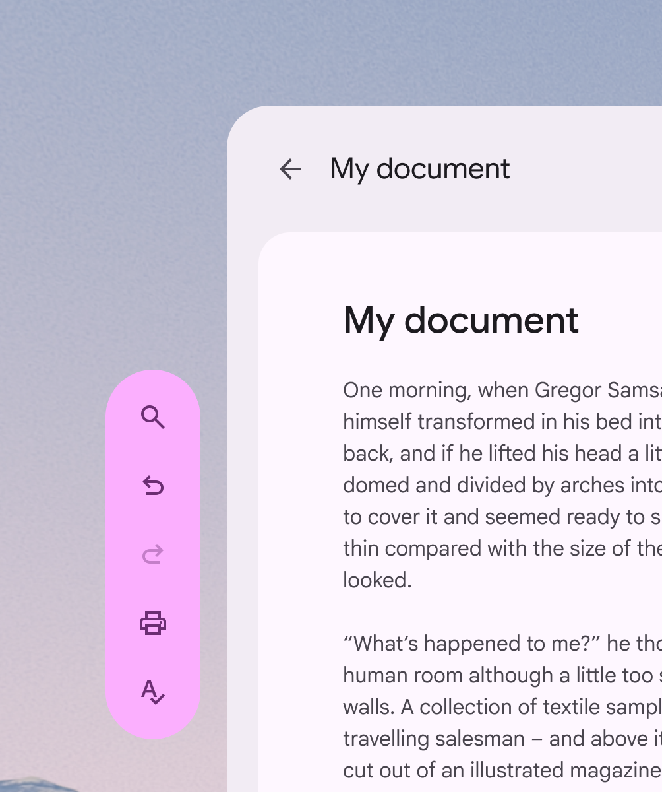

*Do Always align the toolbar orbiter within the vertical bounds of nearby spatial panels*

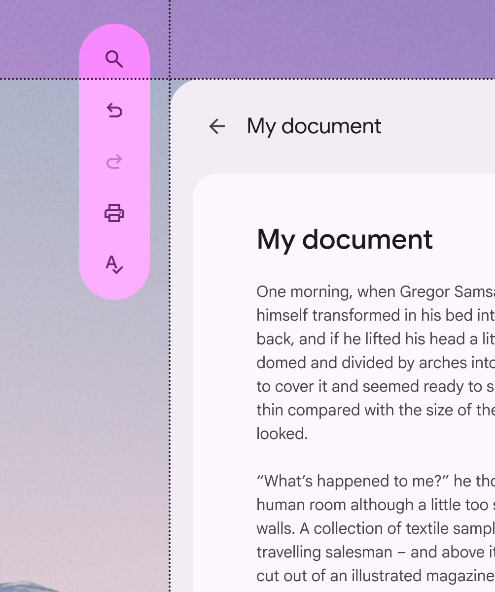

*Don’t The toolbar orbiter shouldn’t exceed the height of adjacent spatial panels*

### Spatial panel alignment

By default, toolbar orbiters are center-aligned to the spatial panel. Their placement can be adjusted to accommodate specific user needs, such as improved ergonomics or [right-to-left (RTL) languages](https://m3.material.io/m3/pages/understanding-layout/bidirectionality-rtl).

*Depending on the configuration (horizontal or vertical) of the toolbar orbiter, it can align to the center, left, right, top, or bottom of a spatial panel*

Avoid placing a vertical toolbar orbiter between spatial panels. This negatively affects the interface structure and can make it difficult to find.

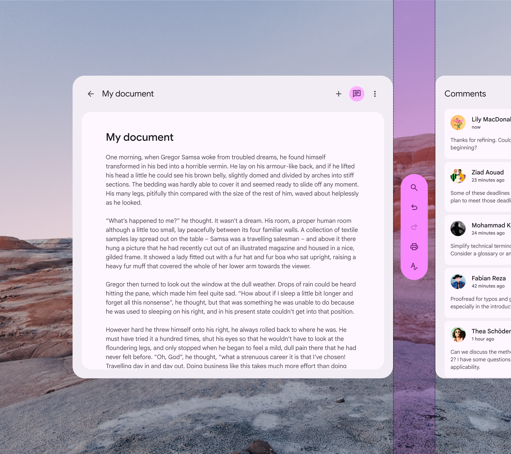

*Don’t Don't place a vertical toolbar orbiter between spatial panels*

## Accessibility considerations

[XR accessibility](https://developer.android.com/design/ui/xr/guides/get-started#make-app) guidelines are still evolving. XR toolbars should follow applicable Material [toolbar accessibility standards](https://m3.material.io/m3/pages/toolbars/accessibility).
