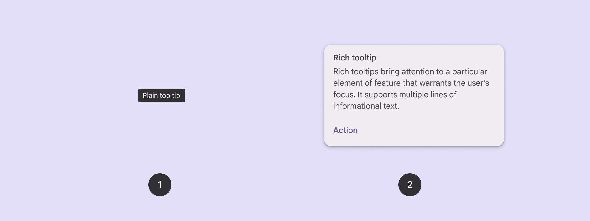
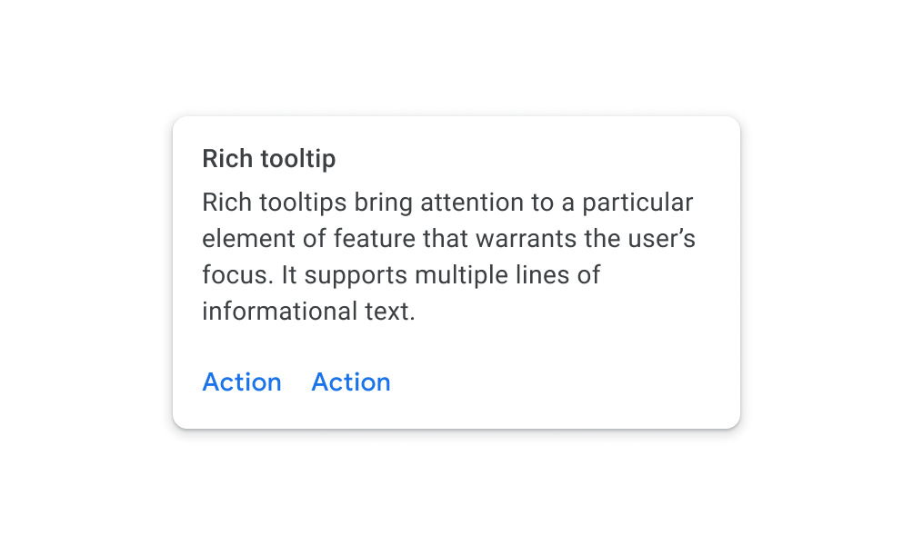
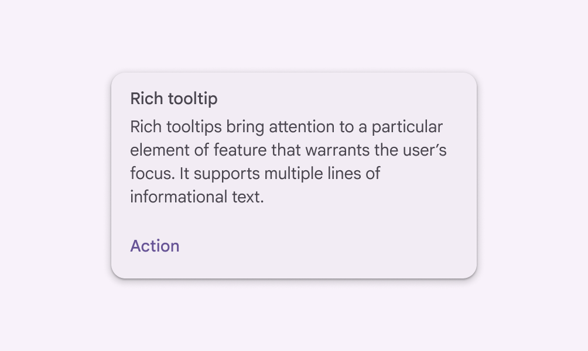

# Tooltips

Source: https://m3.material.io/components/tooltips/overview

- Use tooltips to add additional context to a button (Buttons let people take action and make choices with one tap. [More on buttons](https://m3.material.io/m3/pages/common-buttons/overview)) or other UI element
- Two variants: plain (Plain tooltips briefly describe a UI element. They're often used for labelling UI elements with no text, like icon-only buttons and fields.) and rich (Rich tooltips provide additional context about a UI element. They can optionally contain a subhead, buttons, and hyperlinks.)
- Use plain tooltips to describe elements or actions of icon buttons (Icon buttons help people take minor actions with one tap. [More on icon buttons](https://m3.material.io/m3/pages/icon-buttons/overview))
- Use rich tooltips to provide more details, like describing the value of a feature
- Rich tooltips can include an optional title, link, and buttons

*Plain tooltip; Rich tooltip*

## Availability & resources

| Type | Resource | Status |
| --- | --- | --- |
| Design | [Design Kit (Figma)](https://www.figma.com/community/file/1035203688168086460) | Available |
| Implementation | Flutter | Unavailable |
| Implementation | [Jetpack Compose](https://developer.android.com/develop/ui/compose/components/tooltip) | Available |
| Implementation | MDC-Android | Unavailable |
| Implementation | Web | Unavailable |

## Differences from M2

- Color: New color mappings and compatibility with dynamic color (Dynamic color takes a single color from a user's wallpaper or in-app content and creates an accessible color scheme assigned to elements in the UI. [More on dynamic color](https://m3.material.io/m3/pages/dynamic/choosing-a-source))
- Shape: Rich tooltips (Rich tooltips provide additional context about a UI element. They can optionally contain a subhead, buttons, and hyperlinks.) have more rounded corners

*M2: Rich tooltips have slightly rounded corners*

*M3: Rich tooltips have more rounded corners and support dynamic color*
