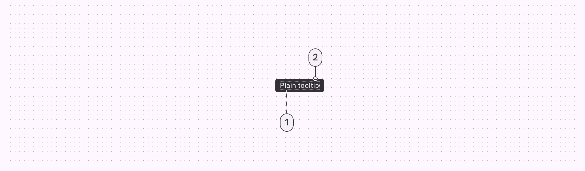
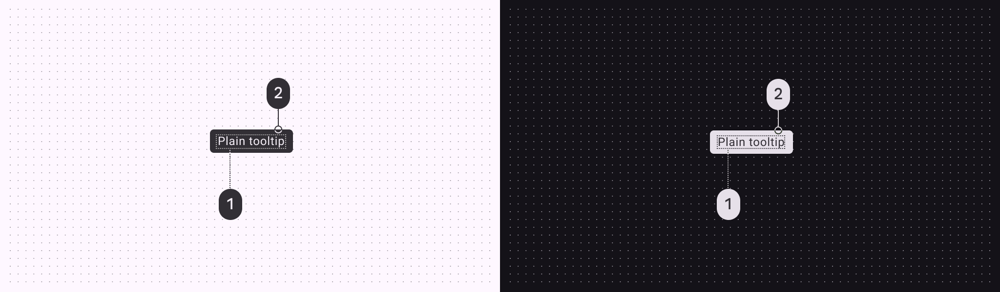
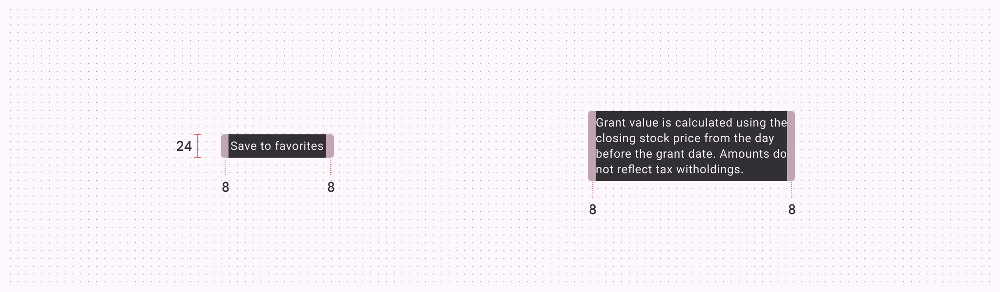
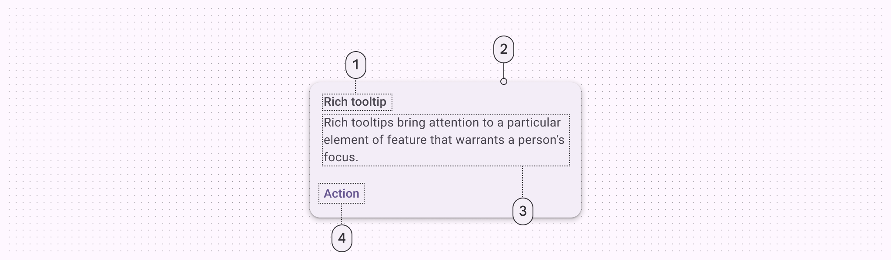
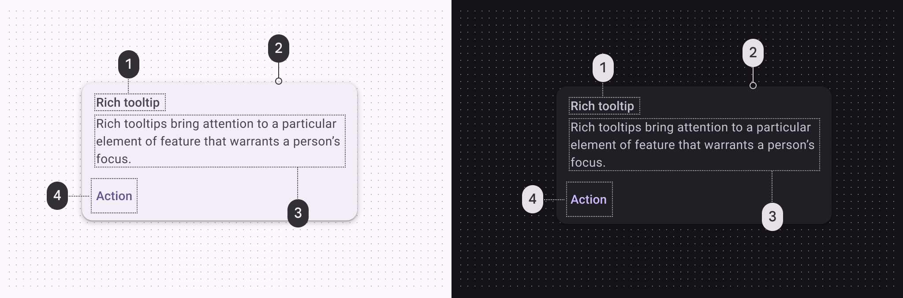
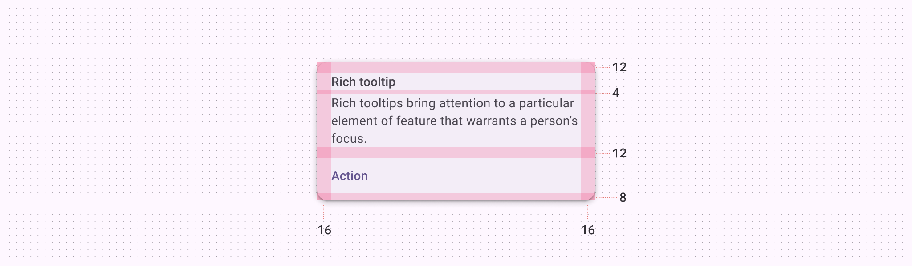
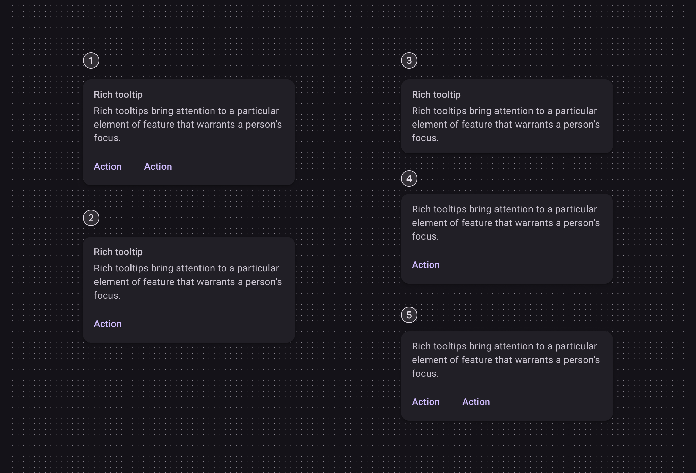

# Tooltips

Source: https://m3.material.io/components/tooltips/specs

## Tokens & specs

Select a component variant below to see its attributes, tokens, and values.

- Token sets: Tooltip - Plain; Tooltip - Rich
- Columns: Token
- Visible groups: Enabled

## Plain tooltip

*Supporting text; Container*

### Plain tooltip colors

Color values are implemented through design tokens (Design tokens are the building blocks of all UI elements. The same tokens are used in designs, tools, and code. [More on tokens](https://m3.material.io/m3/pages/design-tokens/overview)). For design, this means working with color values that correspond with tokens. For implementation, a color value will be a token that references a value. [Learn more about design tokens](https://m3.material.io/m3/pages/design-tokens/overview)

*Inverse on surface; Inverse surface*

### Plain tooltip measurements

*Plain tooltip padding and size measurements*

| Attribute | Value |
| --- | --- |
| Container height | 24dp |
| Padding | 8dp |

## Rich tooltip

*Subhead; Container; Supporting text; Text button*

### Rich tooltip colors

Color values are implemented through design tokens (Design tokens are the building blocks of all UI elements. The same tokens are used in designs, tools, and code. [More on tokens](https://m3.material.io/m3/pages/design-tokens/overview)). For design, this means working with color values that correspond with tokens. For implementation, a color value will be a token that references a value. [Learn more about design tokens](https://m3.material.io/m3/pages/design-tokens/overview)

*On surface variant; Surface container; On surface variant; Primary*

### Rich tooltip measurements

*Rich tooltip padding and size measurements*

| Attribute | Value |
| --- | --- |
| Top padding | 12dp |
| Bottom padding | 8dp |
| Left and right padding | 16dp |

### Rich tooltip configurations

Rich tooltips (Rich tooltips provide additional context about a UI element. They can optionally contain a subhead, buttons, and hyperlinks.) can have a headline, body, and up to two buttons (Buttons let people take action and make choices with one tap. [More on buttons](https://m3.material.io/m3/pages/common-buttons/overview)). The headline and number of buttons can be configured.

*Subhead, supporting text, and two buttons; Subhead, supporting text, and one button; Subhead and supporting text; Supporting text and one button; Supporting text and two buttons*
