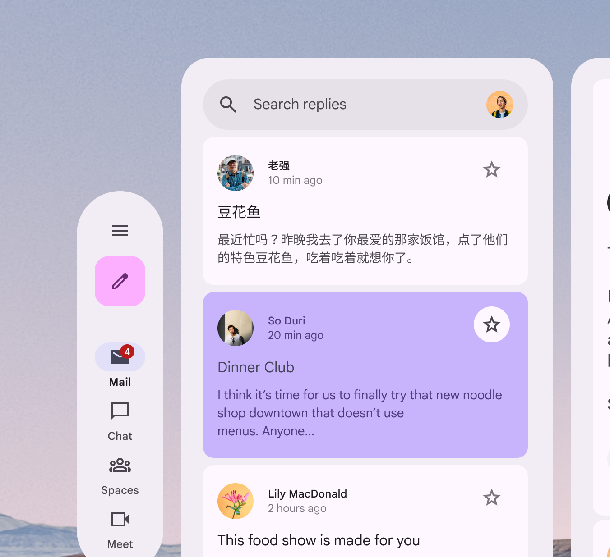
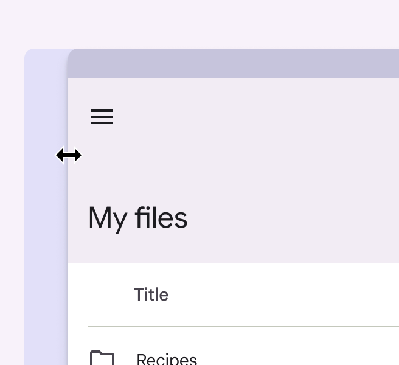
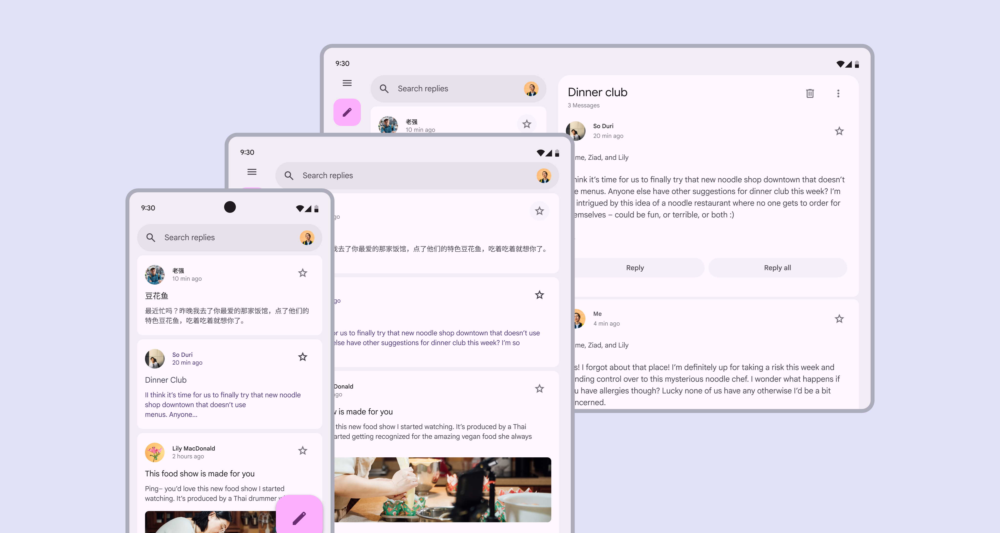
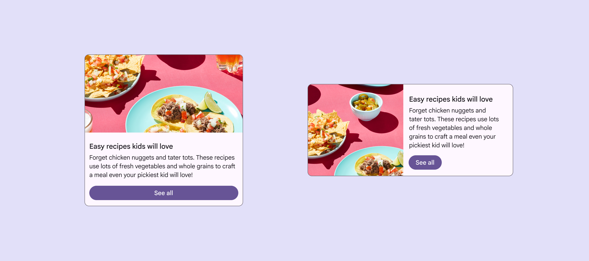
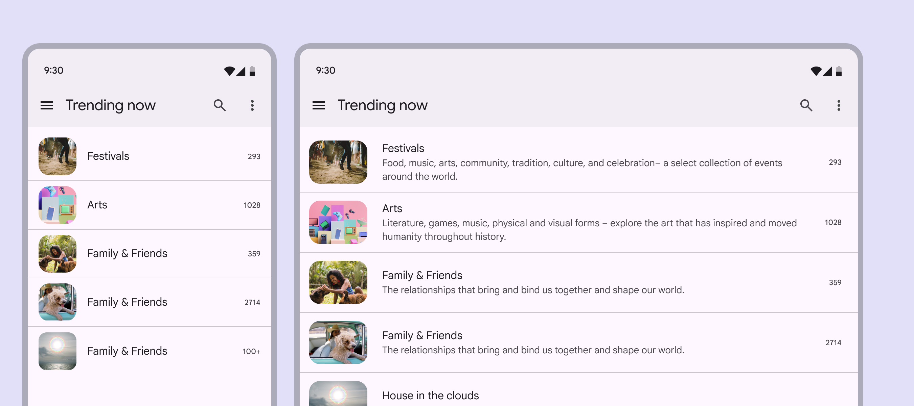
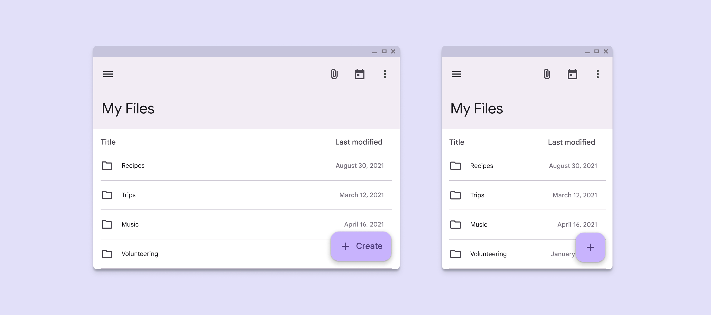

# Adaptive design

Source: https://m3.material.io/foundations/adaptive-design

## What does adaptive mean?

Adaptive design is a collection of techniques that allows an interface to respond or change to contexts like:

- The user: Preferences and user settings
- The device: Watch, phone, foldable, tablet, desktop, or XR devices
- Usage: Screens may dynamically change as the user resizes windows or changes orientation, or when a user switches between devices

Designing adaptive experiences goes beyond customizable properties like color, typography, and shape. Individual components and entire layouts can adapt based on device and user context.

## Conditions

A condition is a signal that determines when and how an app should adapt. The Material adaptive system supports platform, window size, and input modality conditions.

*Device conditions include full-screen, windowed, and spatialized environments, as well as device states like posture*

*Window size conditions include window size classes and orientation*

*Input modality conditions include methods like touch, stylus, peripherals, eye, and hand tracking*

## Layout

The Material adaptive system uses panes (Panes are layout containers that house other components and elements within a single app. A pane can be: fixed, flexible, floating, or semi permanent. [More on panes](https://m3.material.io/m3/pages/understanding-layout/parts-of-layout#73de653a-fc57-4a7c-bc3b-5b9e94207de8)) and window size classes (A window size class is an opinionated breakpoint, the window size at which a layout needs to change to match available space, device conventions, and ergonomics. [Learn more](https://m3.material.io/foundations/layout/applying-layout/window-size-classes)) to organize content and adapt interface layouts. Panes are the building blocks of layout; a pane is a single destination in the product. For example, in a messaging app, the list of messages is one pane, and a specific conversation thread is another. As the pane or window resizes—or as someone navigates the product—panes may change size, enter and exit the screen, and reorganize themselves to make the experience more usable or easier to navigate. These patterns are called adaptive strategies. Material has three adaptive strategies that create a cohesive experience across window sizes: [show and hide](https://m3.material.io/m3/pages/applying-layout/pane-layouts#562b310f-5dff-4349-8a05-a8903450d13e), [levitate](https://m3.material.io/m3/pages/applying-layout/pane-layouts#d692ea5e-2dda-4071-a1f6-8c1dc5a82f5d), and [reflow](https://m3.material.io/m3/pages/applying-layout/pane-layouts#b281ceac-8abb-4397-b247-48484fb188ac).

*Like the panes of glass that make up a window in the real world, panes in Material design are the primary segments of a digital layout, and can change based on context*

## Components

Components can adapt in appearance, placement, and behavior based on factors like:

- Where components are placed in relation to their containers, content, and pane boundaries
- How components use space
- How components enable usage across different device and input types

Most Material components respond using three main strategies: resizing, hiding and showing, and presentation changes.

### Resizing

Components should resize in response to their content and their placement in a layout. For example, buttons (Buttons let people take action and make choices with one tap. [More on buttons](https://m3.material.io/m3/pages/common-buttons/overview)) may scale along with their parent container, or hug their contents and maintain a left or right alignment.

*Buttons can hug their contents or span their containers based on context*

### Hiding & showing

Components should hide and show information, or collapse and expand to selectively reveal content that best suits the space. For example, list (Lists are continuous, vertical indexes of text and images. [More on lists](https://m3.material.io/m3/pages/lists/overview)) items may reveal descriptions or other additional information as their parent container scales.

*List items can reveal more text on a tablet*

### Presentation changes

Presentation changes include the orientation of elements and changes to specific properties, like color, type, and shape.

Components can also change configurations. For example:

- When a window size increases, a FAB (Floating action buttons (FABs) help people take primary actions. [More on FABs](https://m3.material.io/m3/pages/fab/overview)) can change sizes, like from medium to large
- Navigation bars (Navigation bars let people switch between UI views on smaller devices. [More on navigation bars](https://m3.material.io/m3/pages/navigation-bar/overview)) can change nav items from vertical to horizontal

*The extended FAB can change to a standard FAB when the app window is made smaller*

## Getting started & resources

Canonical layouts, which address some of the most common layouts across apps, are the recommended starting point for adaptive designs. Learn more about each of the [canonical layouts](https://m3.material.io/foundations/layout/canonical-layouts/overview) in Material guidance, and look at inspirational examples on the [Android Developers site](https://developer.android.com/large-screens/gallery).
