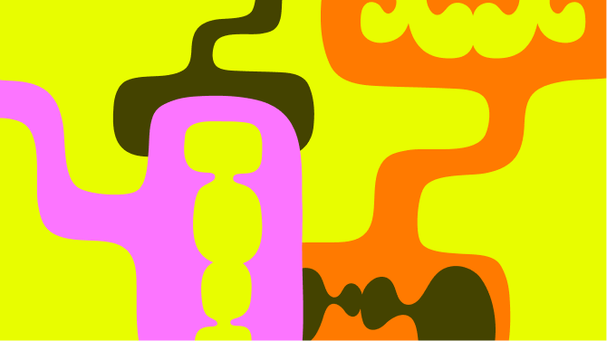

# Building for all

Source: https://m3.material.io/foundations/building-for-all/user-needs

Product teams can't always represent all of their users, but they can better understand different people’s experiences and needs by working with communities, organizations, experts, and researchers. Including perspectives of those who are often overlooked leads to building more helpful products for everyone.

## Dimensions of experience

Considering people’s attributes and environments can help:

- Ensure you take into account a variety of lived experiences
- Discover insights into who to collaborate with to gather different perspectives
- Expand product benefits to more people

Keep this evolving list in mind when you conduct research and design, comprehensive testing, and marketing:

- Age
- Culture
- Disability
- Education and literacy
- Ethnicity
- Gender
- Geography and global relevance
- Physical attributes
- Race
- Religion
- Sexual orientation
- Socioeconomic status
- Technology proficiency
