# Alt text

Source: https://m3.material.io/foundations/content-design/alt-text

## How to write great alt text

### Overview

Alternative text (alt text) refers to off-screen text that is used by screen reader accessibility software. Screen readers read out visible content such as paragraph and button text, as well as hidden content, including alt text for icons and headings.

Alt text also displays when an image doesn’t load. It tells people what they need to know about an image if they can’t see it.

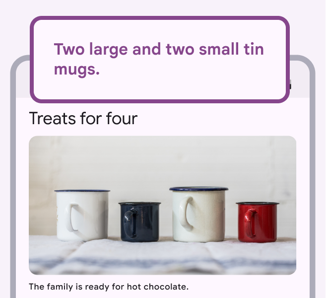

*Do Write alt text for images to provide context to screen reader users. Alt text: Two large and two small tin mugs.*

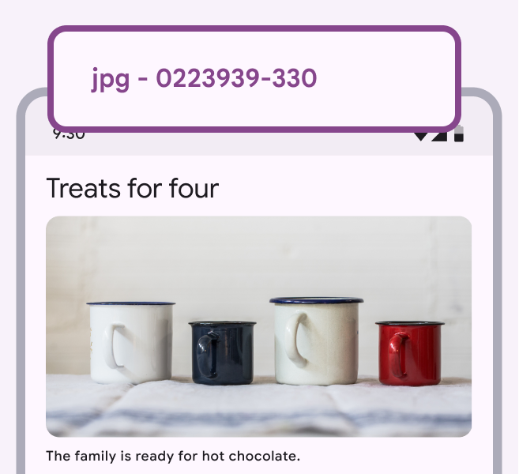

*Don’t Avoid leaving the automatically generated file number as alt text. Alt text: jpg - 0223939-330*

### When to use alt text

If you remove the image from the page and no information is lost, then the image is decorative and doesn’t need alt text or a caption.

An image can be marked decorative using a null alt attribute, such as alt=”” in HTML, which will hide the content from screen reader users.

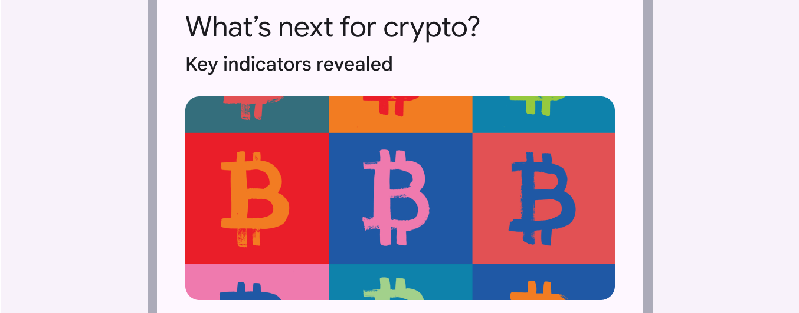

*Images that don’t add information don’t need alt text. Alt text: “”*

### Focus on the meaning of the image

Describe the context and overall meaning, rather than focusing on the details. For example, in a shopping app, focus on the item for sale rather than the things around it.

Alt text can also help improve SEO, but its primary purpose should be to make sites usable for all.

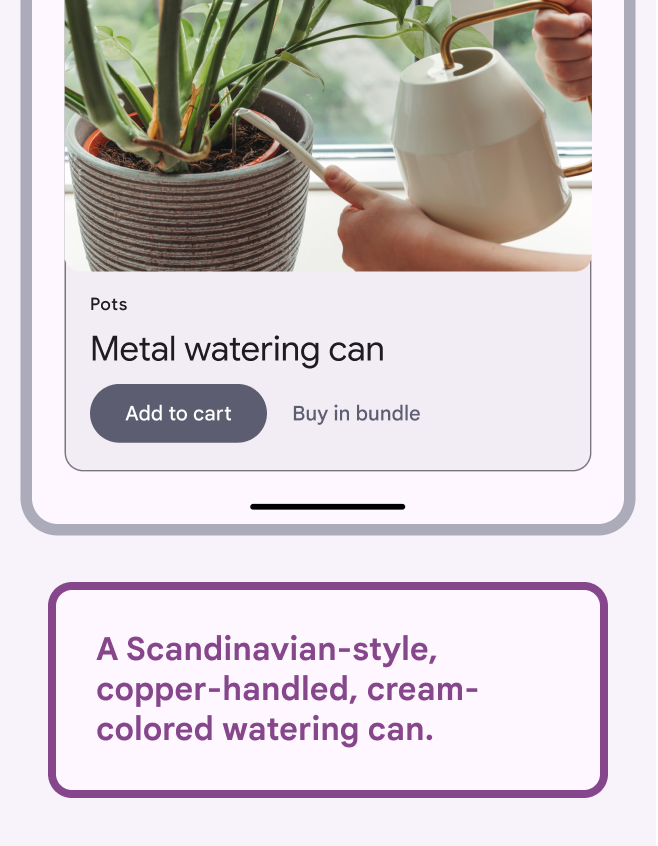

*Do Focus on the important part of the image. Alt text: A Scandinavian-style, copper-handled, cream-colored watering can.*

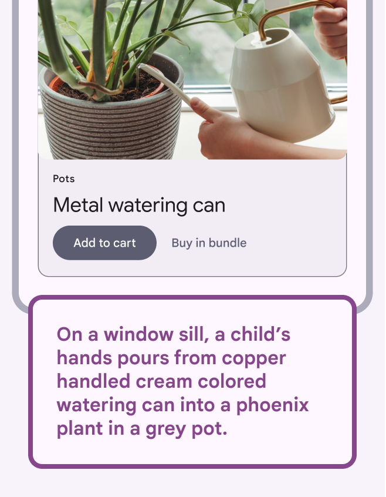

*Don’t Avoid detailed descriptions that don’t contribute to the image’s meaning. Alt text: On a window sill, a child’s hands pours from copper handled cream colored watering can into a phoenix plant in a grey pot.*

### Keep it short

The recommended length for alt text is 140 characters.

If alt text is too long, it may be cut off by some screen readers, which is a poor user experience.

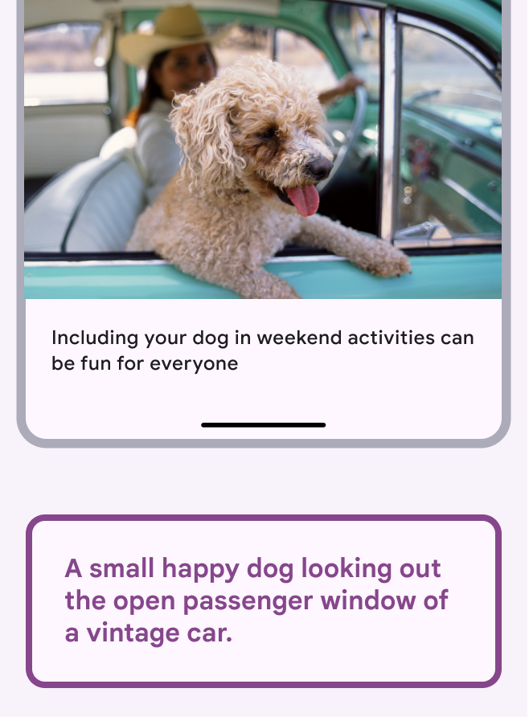

*Do Write brief alt text. Alt text: A small happy dog hanging out the passenger window of a vintage car.*

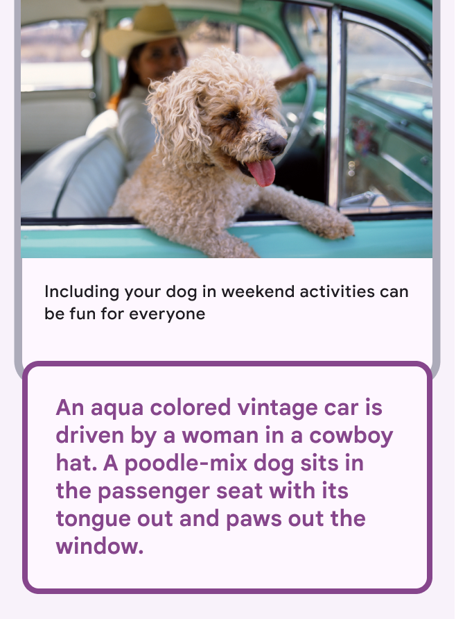

*Don’t write more than 140 characters of alt text. Alt text: An aqua colored vintage car is driven by a woman in a cowboy hat. A poodle-mix dog sits in the passenger seat with its tongue out and paws out the window.*

### Don’t start alt text with “image of”

Screen readers announce “image” when they come across an image. If your start your alt text with “image of” a screen reader will announce “image, image of.”

*Do Describe the image, rather than the format. Alt text: A wooden box of artisan sourdough bread is carried by a baker.*

*Don’t Avoid writing “image of." The screen reader will announce it’s an image. Alt text: Image of a wooden box of artisan sourdough bread is carried by a baker.*

## Context and nearby text

### Context matters

Use adjacent text to establish the context and word choices for alt text. Adjacent text includes all of the text near an image, such as body text, captions, and headlines.

Don’t repeat the caption in alt text. It’s against best practices because the user will hear the same text twice, which is a poor experience.

Be consistent in your word choices. For example, don’t use “antique” in a caption and “vintage” in the alt text.

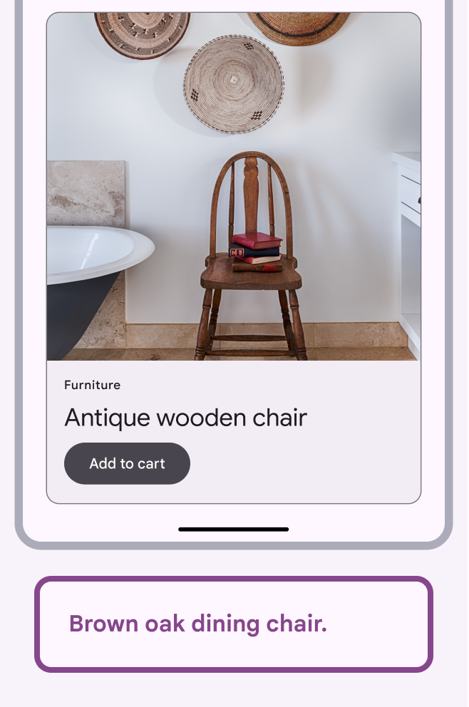

*Do Alt text should always relate to the context. Alt text: Brown oak dining chair.*

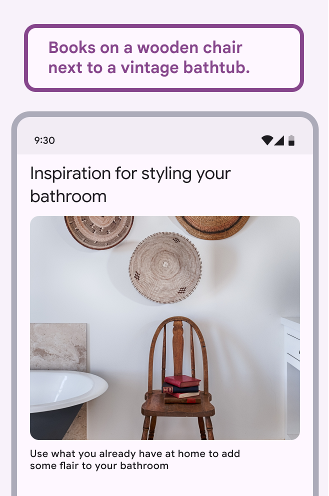

*Do Change alt text for an image depending on where it’s used. Alt text: Books on a wooden chair next to a vintage bathtub.*

### Alt text is subjective

Alt text is another layer of creative expression and should support the goals and style of its context.

The same image should have different alt text in different settings. Use the information in the app or article and the caption to decide what to emphasize in the alt text.

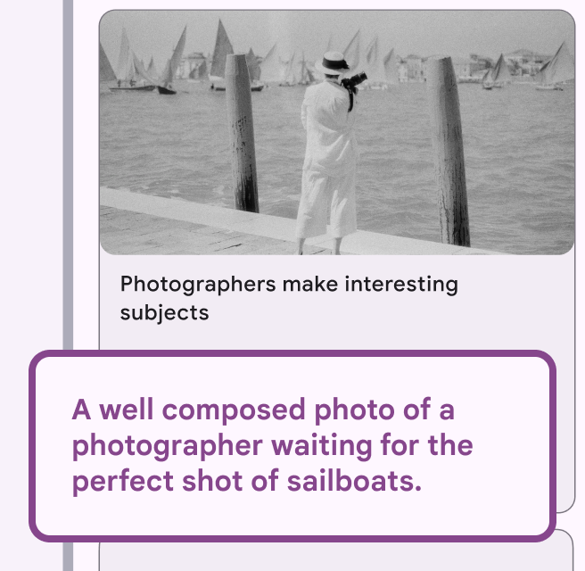

*Do Make alt text consistent with the caption. Alt text: A well composed photo of a photographer waiting for the perfect shot of sailboats.*

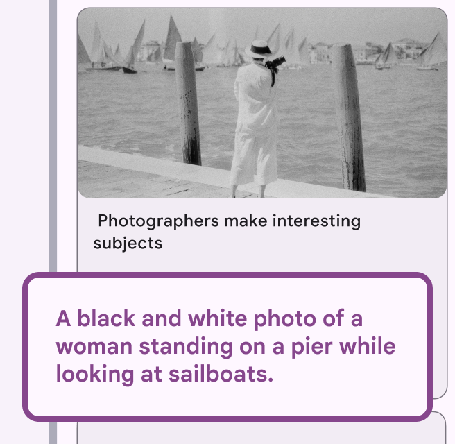

*Don’t ignore the caption. Information in alt text should correspond to adjacent text. Alt text: A black and white photo of a woman standing on a pier while looking at sailboats.*

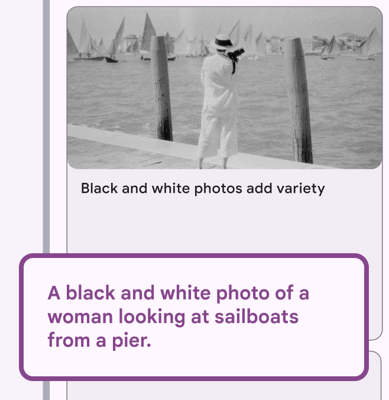

*Do Focus on the meaning of the image. Alt text: A black and white photo of woman looking at sailboats from a pier.*

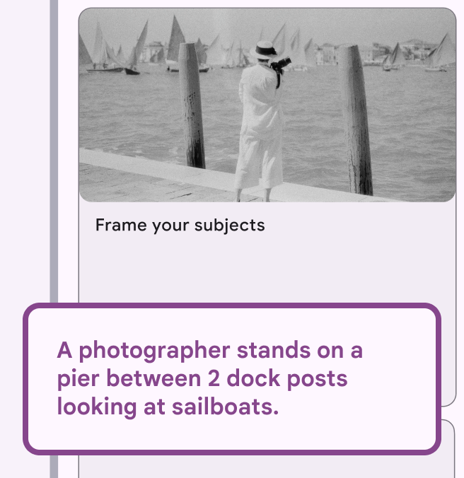

*Do Use alt text to reinforce ideas in the caption. Alt text: A photographer stands on a pier between 2 dock posts looking at sailboats.*

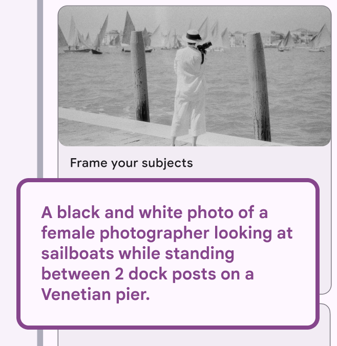

*Don’t write alt text with details that aren’t relevant to the context of the image. Alt text: A black and white photo of a female photographer looking at sailboats while standing between 2 dock posts on a Venetian pier.*

### Captions should benefit all users

A caption should be useful to someone who can see the image clearly, as well as a screen reader user.

Good captions support the image rather than duplicating its information. A well-written caption makes it easier to write alt text.

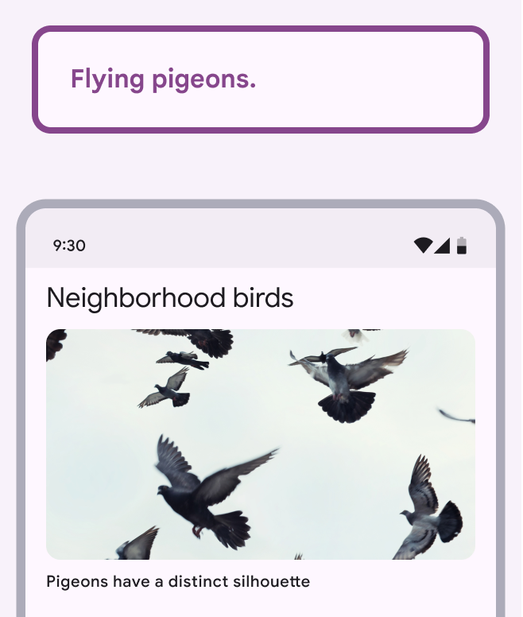

*Do Capture the meaning of the image in a few words. Alt text: Flying pigeons.*

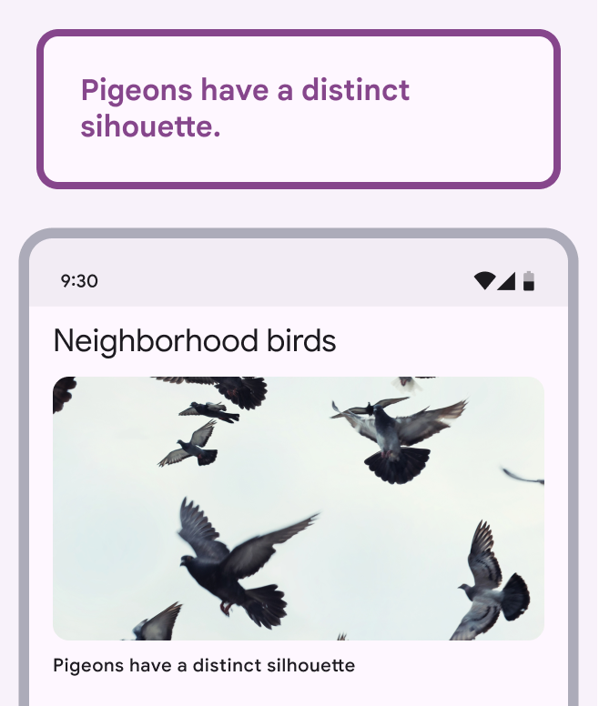

*Don’t repeat the caption as the alt text. Alt text: Pigeons have a distinct silhouette.*

## Types of imagery

### When to describe the type of image

Occasionally it benefits users to name the type of image. This can include:

- Chart
- Infographic
- Map
- Graph
- Screenshot
- Headshot
- Diagram

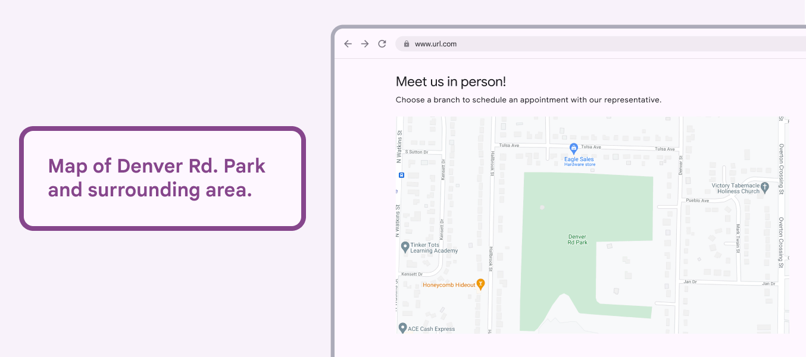

*Caution Be careful when using alt text that describes the type of image. Alt text: Map of Denver Rd. Park and surrounding area.*

### Charts and graphs

Alt text is particularly important for visualizations such as charts and graphs. Visualizations can either be editorial and meant to support a specific purpose or key takeaway, or more open-ended and used for general data analysis. Consider the core purpose of the chart or graph, and what information someone would need to use it. Link to the data that generated the chart or graph, if it’s available.

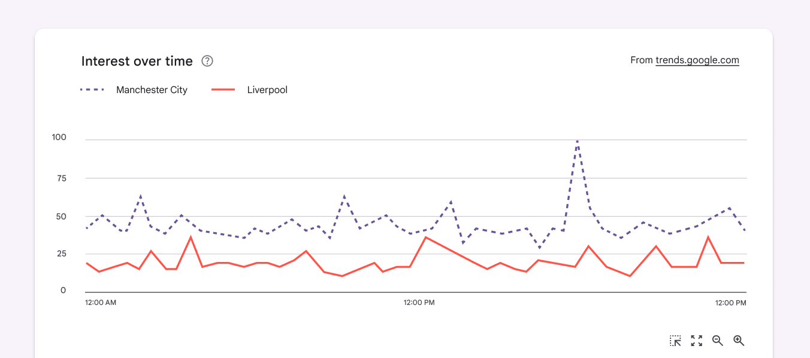

*Summarize the main purpose of the data. Here, the chart involves interest in Manchester City and Liverpool.*

When possible, explain the key takeaways and meaning in context, rather than detailing every data point. A general formula for chart alt text would be: “Summary of [data type] + [reason for showing the chart].”

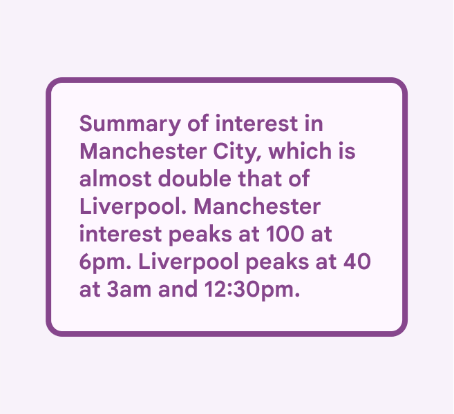

*Do Capture the meaning of the chart, along with key data points Alt text: Summary of interest in Manchester City, which is almost double that of Liverpool. Manchester interest peaks at 100 at 6pm. Liverpool peaks at 40 at 3am and 12:30pm.*

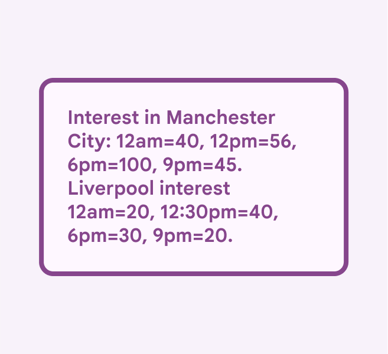

*Don’t Avoid copying data points Alt text: Interest in Manchester City: 12am=40, 12pm=56, 6pm=100, 9pm=45. Liverpool interest 12am=20, 12:30pm=40, 6pm=30, 9pm=20.*

Charts for editorial use Charts with an editorial focus are used to support a key takeaway. This takeaway and the main data points confirming it should be the focus of the alt text. To create the alt text, leverage existing content from the body text, labels, and any text in the graph. For example, a chart from a weekly digest showing highlights of physical activity may have a written summary of the total change in step count. This can be used in the alt text.

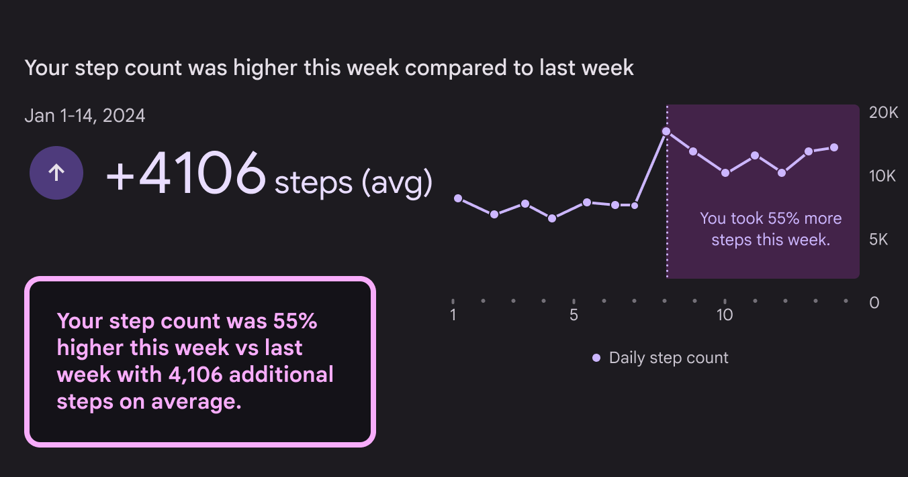

*Do In charts with an editorial focus, highlight the main takeaway and metrics Alt text: Your step count was 55% higher this week vs last week with 4,106 additional steps on average.*

Charts for analysis

Charts for analysis are meant to be reviewed as a whole, and offer pieces of data to be analyzed. They can be dense, appear alongside related charts, and have many takeaways. For charts that have one or two key takeaways, include these insights in the alt text. To avoid introducing unintentional bias in charts with many possible takeaways, highlight opportunities for exploration, such as a link to the data’s source. Emphasize key data points or mention that there isn’t a single takeaway.

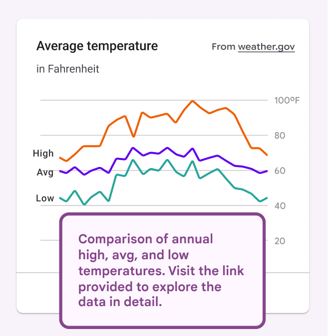

*Do In charts used for analysis, mention the general structure, and highlight opportunities for more investigation Alt text: Comparison of annual high, avg, and low temperatures. Visit the link provided to explore the data in detail.*

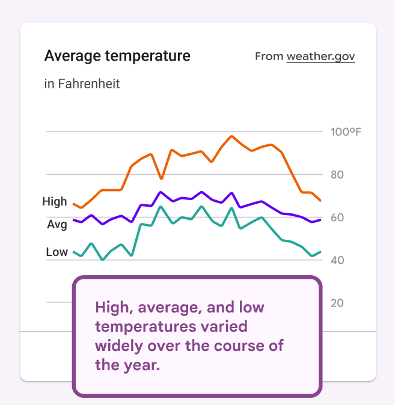

*Don’t summarize a chart used for analysis Alt text: High, average, and low temperatures varied widely over the course of the year.*

Use interactive charts

To improve the screen reader experience, consider using interactive charts instead of static images, especially for complex visualizations that are used for analysis. For interactive charts, a tooltip can show additional detail for specific data points. See [Top Tips for Data Accessibility](https://m3.material.io/blog/data-visualization-accessibility) for more ways to make these visualizations accessible.

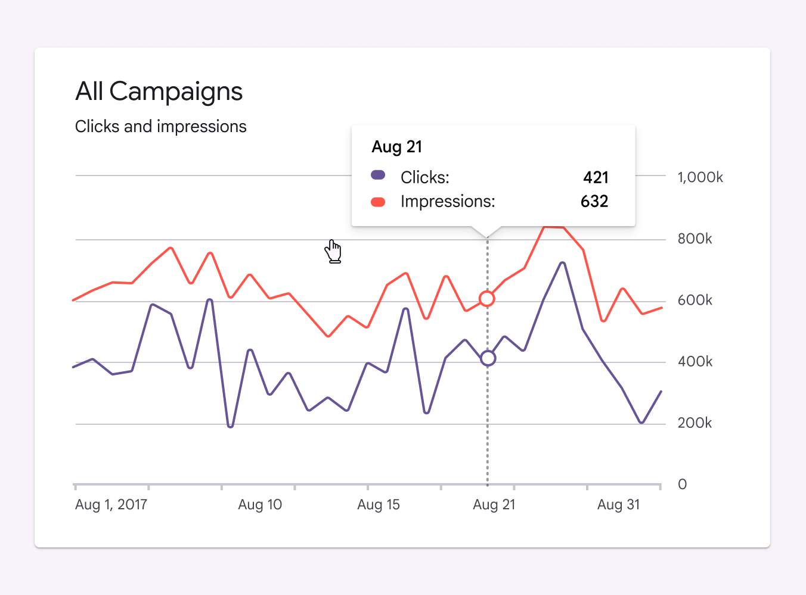

*Use interactive charts for complicated visualizations*

### Video and motion alt text

As with still images, if the animated information isn’t elsewhere on the screen, then it is informative and needs alt text. Long-form video content uses video description to narrate the visual elements of a video, so it doesn’t need alt text.

[Video: A tooltip labeled “star” appears when a cursor hovers over a star icon.](assets/asset-027-summarize-the-action-in-a-video-or-animation-14ec23d21e.webp)

*Summarize the action in a video or animation*

Alt text on informative GIFs or motion assets should highlight the important points. Think of a heading or title you might give it, and that’s likely your alt text.

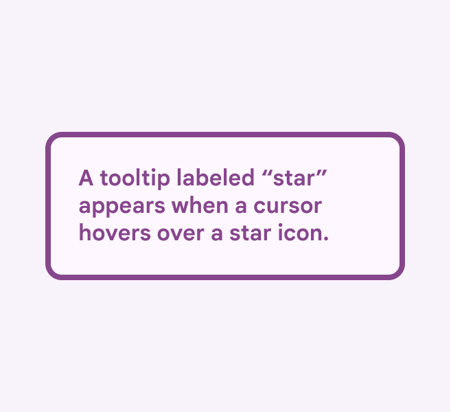

*Do Write alt text that summarizes the motion asset. Alt text: A tooltip labeled “star” appears when a cursor hovers over a star icon.*

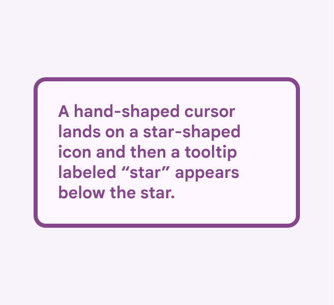

*Don’t write about every aspect of the motion. Alt text: A hand-shaped cursor lands on a star-shaped icon and then a tooltip labeled “star” appears below the star.*
