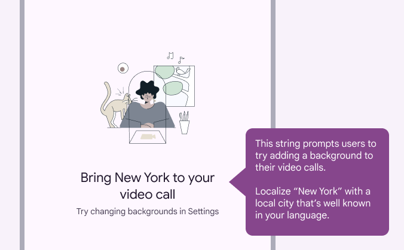
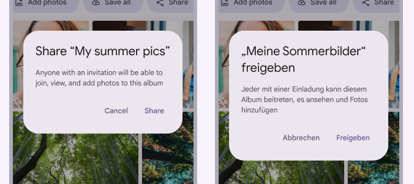
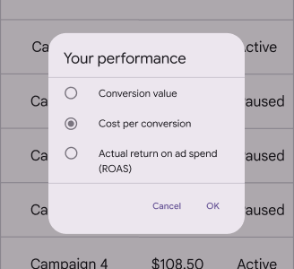
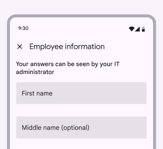
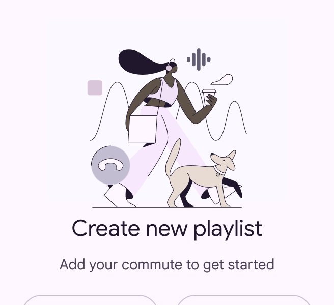
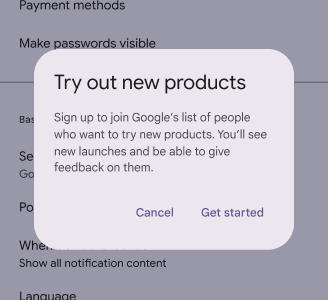
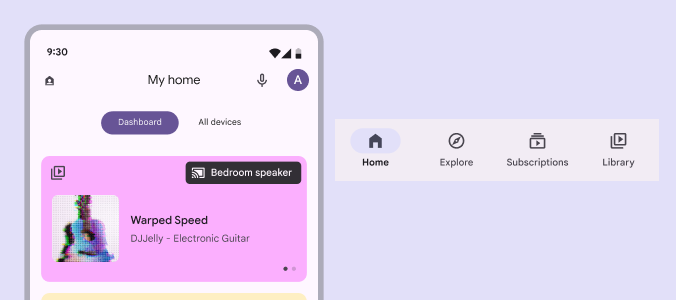

# Global writing

Source: https://m3.material.io/foundations/content-design/global-writing/word-choice

## Word choice

### Use global examples & explain local references

References to local places, holidays, and companies won’t always make sense to global audiences.

*Do Use generalized, global examples. Most countries and cultures have holidays.*

*Don’t call out a specific country or culture’s holiday*

If it doesn’t make sense to use a global example, explain the reference in the message description so the translator can substitute a locale-specific example. Some instances where local references should be called out include:

- Locations
- Names (common first names and nicknames)
- Currencies
- Temperatures
- Date formats
- Providers (internet and cable)

*Caution Help translators understand the context by adding message descriptions*

### Use short, simple sentences

Break text into shorter sentences. Use bullets or separate content into sections with headings.

Other languages average at 1.5 times longer than English, so text that’s short may be long when translated.

*Many languages, like German, are longer than English*

### Avoid abbreviations

Abbreviations don’t translate well and can be confusing out of context. Spell things out whenever possible.

However, common abbreviations for time are acceptable.

*Do Use clear names to refer to things*

*Caution Avoid abbreviations. If they're used, provide their meaning in message descriptions.*

### Clarify pronouns

Using pronouns, like “it,” can get tricky when translators are working with small, unconnected strings of text and when nouns have genders in many languages. Repeat the noun, or clarify the noun in a message description.

*Do Using nouns instead of, or in addition to, pronouns can help clarify future and past user actions*

*Don’t Avoid using pronouns when it’s unclear what nouns they’re referring to, especially when explaining user actions*

### Clarify “this” and “that”

Don’t start a sentence with "this" or "that" unless it's immediately followed by the noun. When the noun is unclear, the sentence is more difficult to translate.

*Do Make sure it’s clear who text is referring to*

*Don’t Avoid using “this” and “that”*

### Avoid idiomatic, colloquial, and polite expressions

Idiomatic or colloquial phrases can be confusing if the meaning isn’t clear. If you use them, clarify the purpose and context of the phrase to help the translator choose an appropriate alternative.

Avoid polite expressions, such as “Please,” “Sorry,” and “Thank you,” especially in error messages. However, "please" may be used when asking the user to do something inconvenient.

*Do Clear, everyday language can be used in an expressive and whimsical way when paired with imagery*

*Don’t Idiomatic phrases can be difficult for everyone to understand and for translators to localize*

### Reduce technical jargon

Technical terms don't always translate. Descriptions should be simple, and in some cases literal, to avoid confusion when translating.

*Do Plain language is easier for everyone to understand*

*Don’t Confusing language makes it difficult for people to understand the actions they’re taking*

### Clarify ambiguities

Some words have multiple meanings. For example, “traffic,” “filter,” and “change” can be used as either nouns or verbs. Avoid using both meanings of the word in the same string or body of text. If a word has the potential to be confusing, provide as much context as possible in the message description so the translation will be accurate.

*Clarify words that have multiple meanings. “Home” could reference a homepage or where someone lives.*
