# Notifications

Source: https://m3.material.io/foundations/content-design/notifications

Notifications should:

- Be about the user, not the product
- Be precise, timely, actionable, contextual, and relevant
- Give users easy controls to opt out
- Not be used to send unsolicited ads

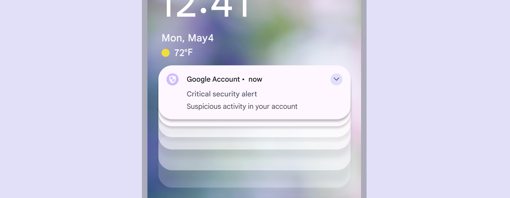

### Put important information at the top

Put the most important info at the beginning and make it easy to understand. People skim rather than read, often in an F shape. When it makes sense, try to move the most critical information to the front of sentences, rather than the end, where it may get overlooked or truncated.

*Do Prioritize the most important information*

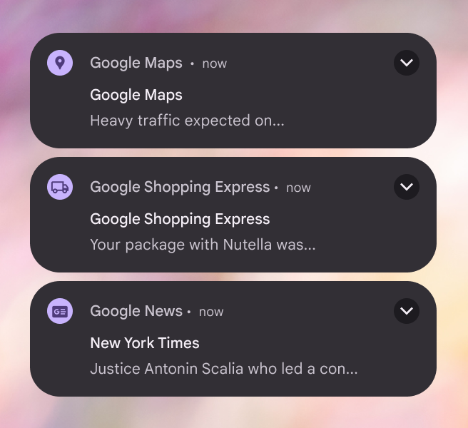

*Don’t Don't waste characters on app names, niceties, or unimportant information*

### Tell users what they can do

If you’re prompting someone to take action, make that clear. CTAs should be concise, specific, and actionable. If you know what motivates people to take action, add it.

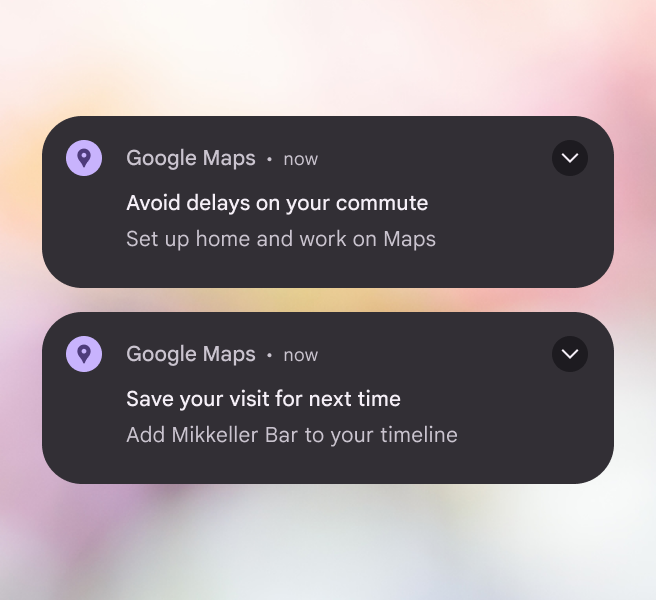

*Do Clearly guide the user to their next action*

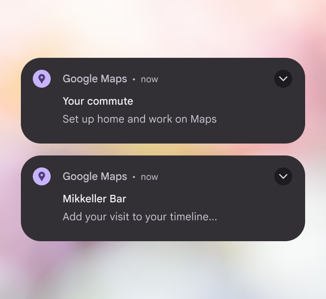

*Don’t Don't bury next steps*

### Make it relevant and personal

A notification shouldn’t be sent to everyone. The more you broaden the audience and the message for a notification, the more you risk being irrelevant. Consider user segments, in-app behavior, and personalized information to make sure notifications go to people who will benefit most from them.

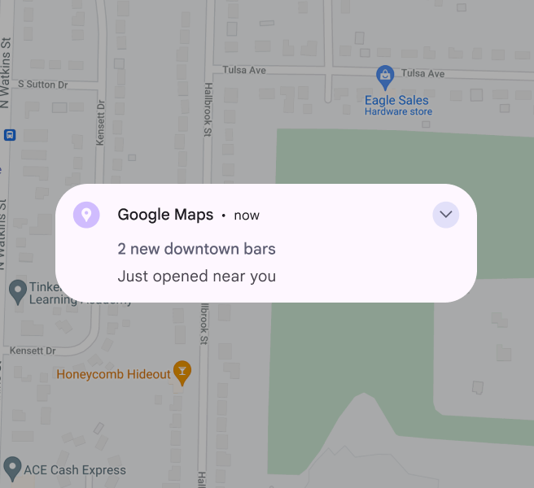

*Do Be specific to capture user attention*

*Don’t be so generic as to lose value*

### Avoid dynamic text

Dynamic text are words that are implemented by engineering to change based on the user or context, like adding a user’s campaign name to headline or “good afternoon” when users log in at certain times. Try not to use dynamic text in notifications. It often breaks character limits, especially in headlines when translated. Text that gets truncated in the headline will not expand, even in expandable notifications. If you must use dynamic text in the headline, try to pair it with no more than one additional word. Create a backup notification that fits the character count when your primary notification won’t.

*Do Place dynamic text in the notification body, where there is more space. If you place dynamic text in the title, keep it very short.*

*Don’t place dynamic text in a long notification title*

### Mind your characters

Stay within these suggested character counts so text doesn’t get cut off:

- Title: <29 chars
- Collapsed body: <40 chars
- Expanded body: <80 chars; start with collapsed body and add to it
- Button: 1-2 buttons (1-2 words each)

There’s more room for text on later versions of Android, but these limits are still recommended to prevent truncation on smaller devices.

*Do Keep notifications short and information-dense*

### SMS messages

SMS helps users get messages when they might not have access to their Google Account. It’s used for important or urgent communication only. SMS breaks into multiple messages after a certain number of characters, resulting in increased costs. To avoid this, stick to the following character limits:

- Latin languages: <160 characters
- Non-latin languages: <134 characters

If translation is needed, let translators know about the character limits in the message description.

*Do SMS messages should be brief and important*

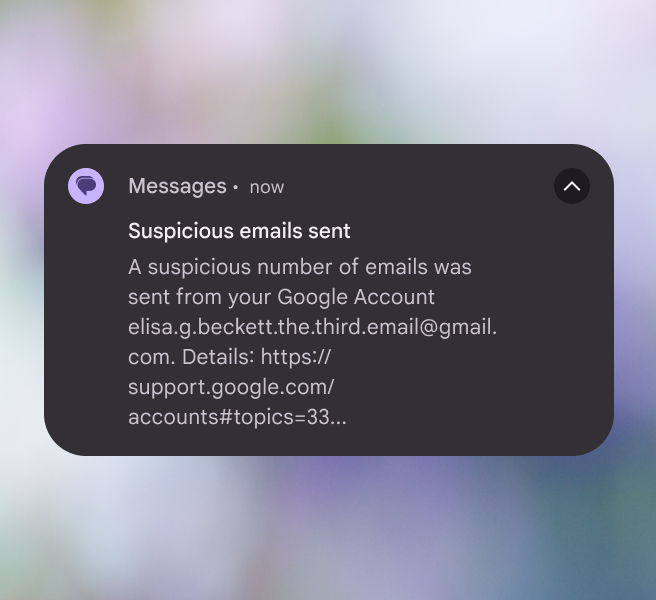

*Don’t use full emails or website links for text length*

### Emoji with caution

Use emoji sparingly. Many don’t translate and aren’t universally understood across cultures. Experiments show that face and hand gesture emoji perform better than generic emoji because they tell a better story. Emoji should enhance content, not replace it. Since it’s not clear to users whether emoji mean we’re sympathizing with them or attempting to project our feelings onto them, don’t use emoji to accentuate bad news. In experiments, there was a strong negative reaction to negative emoji, such as frowning face, anguished face, and weary face. Gen Z adds another cultural nuance to emoji by [inventing new meanings](https://www.textnow.com/blog/the-next-generation-of-emojis-gen-z-explained/) that go beyond the official or literal [definitions](https://emojipedia.org/).

*Do Use emoji only to enhance a message*

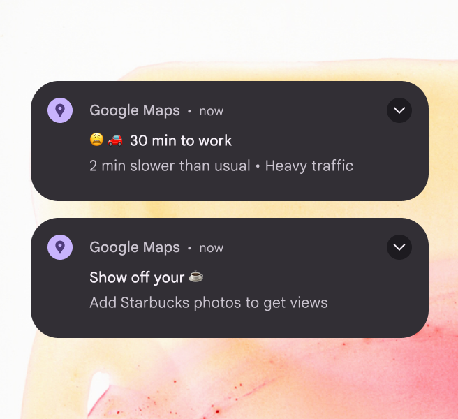

*Don’t add negative emotions to a message. Don’t replace words with emoji.*

### Don’t overdo delight

What seems funny or cute may not come across that way. When vying for limited user attention, be useful. Don’t focus on delight: delicately added and tested polish can better support Google’s brand.

*Do Prioritize straightforward and useful messages*

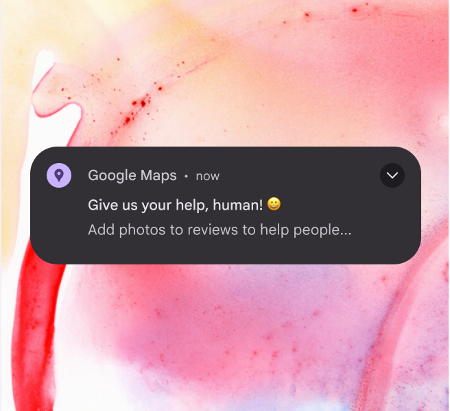

*Don’t Jokes aren’t appropriate for notifications*

### Be day-specific

Use the days of the week. Don’t use “today,” “tomorrow,” “tonight,” or similar words. About 20% of users don’t see notifications on the day they’re sent, so “tomorrow” might be read when it’s “today” for the user. An exception is when a notification auto-dismisses at a specific timestamp.

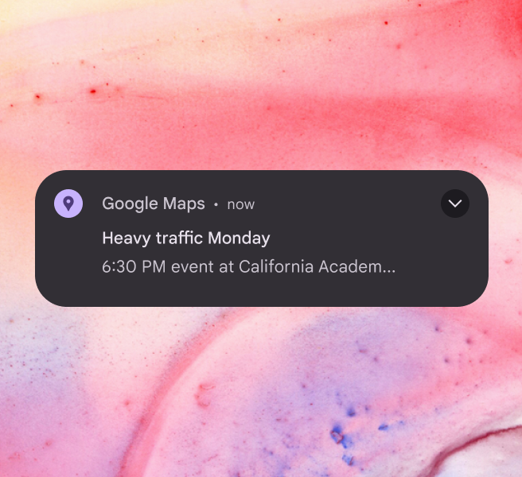

*Do Specify the day of the week so that it makes sense if someone reads it the following day*

*Don’t use relative terms like “today” or “tomorrow”*

### Don’t interrupt the flow

If you have notifications or emails related to the onboarding process, make sure they don’t trigger during onboarding.

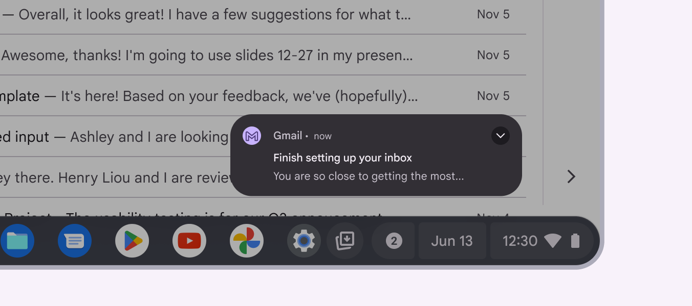

*Don’t Don't prompt the user with a notification or email that might interrupt an important moment*

### Don’t name the product (again)

An app’s name or logo is already included in a notification’s design. Use the limited space for other information.

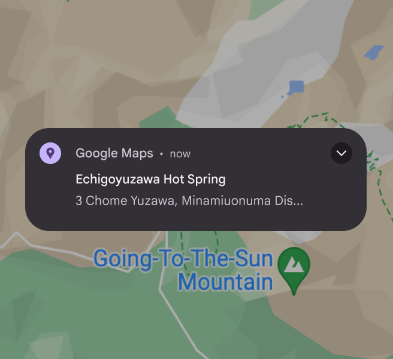

*Do Use the available space for useful information*

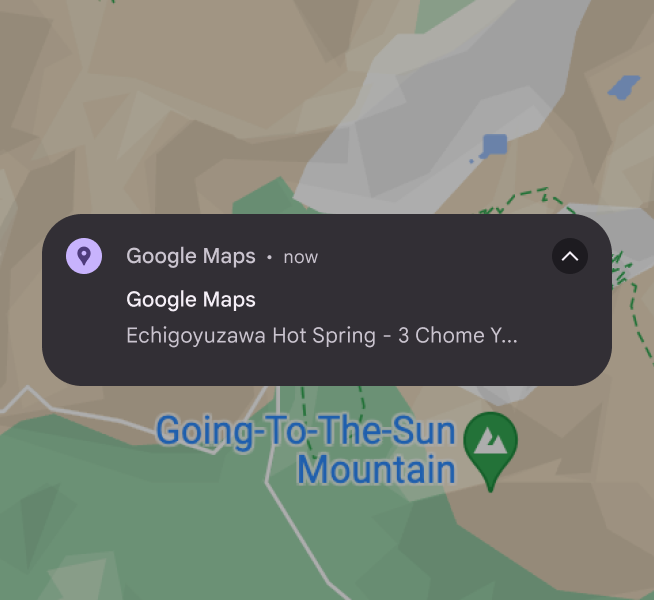

*Don’t waste space repeating information that is already included by the OS*

### Opting in and out

Give users a way to opt-out of notifications in context. If you don’t, they’ll have to dig into settings and may get frustrated. If you do offer opt-outs or opt-ins, make it clear what benefit the user is getting or losing.

*Do Make it easy for users to start or stop receiving notifications*
