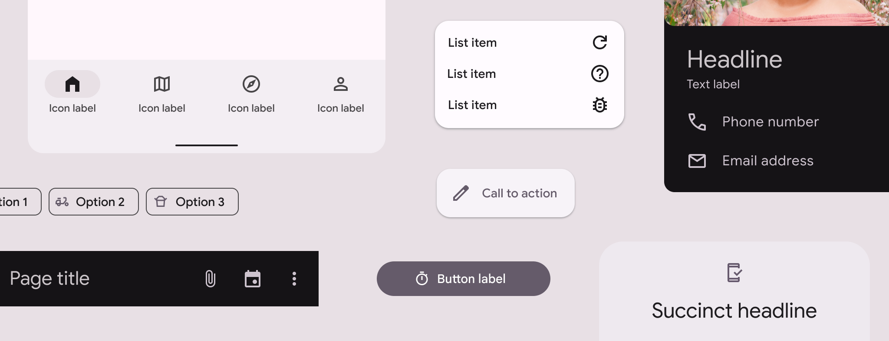

# Content design

Source: https://m3.material.io/foundations/content-design/overview

- UI text should be clear to anyone
- Follow [Associated Press (AP) Style](http://www.apstylebook.com/) unless noted otherwise

## Resources

| Type | Resource |
| --- | --- |
| Design | [AP Stylebook](https://www.apstylebook.com/) |

## What’s new

- Updated content and organization
- Updated guidance on first-person pronouns
- New examples and illustrations
