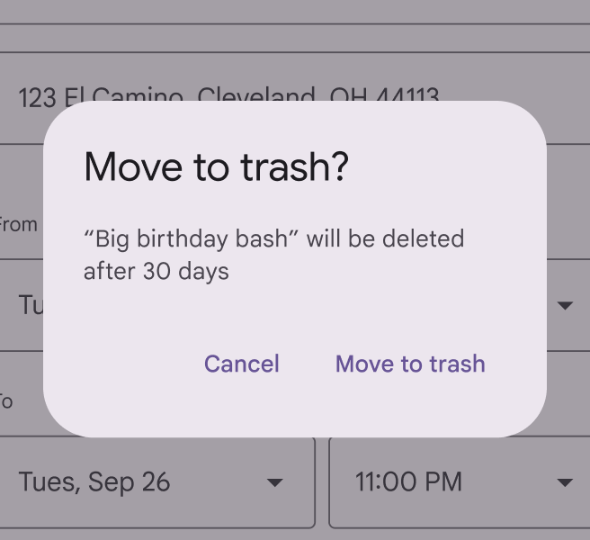
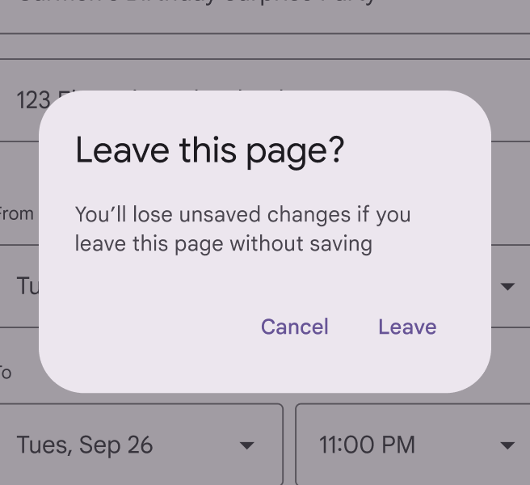
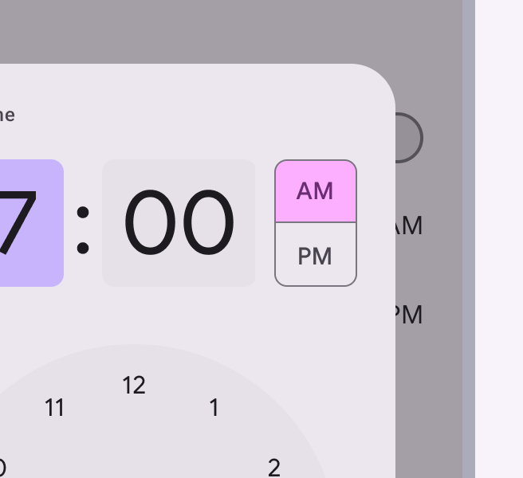

# Style guide

Source: https://m3.material.io/foundations/content-design/style-guide/ux-writing-best-practices

### Explain consequences

Emphasize the results of the user’s potential action in neutral, direct language. Avoid cautions or warnings that might sound alarming, intimidating, or condescending. Focus instead on communicating the consequences of a function.

*Do Tell users what will happen if they take an action and how they can undo it*

*Don’t misrepresent consequences or try to influence a user’s decision*

### Use scannable words and formats

People scan UI text in search of the most meaningful content to them. Help by using specific titles and headings that clearly describe a topic. When users are skimming or hurrying through an action, this organization helps them avoid mistakes and unintentional actions.

*Use headings and subheads to prioritize and group information*

### Use sentence case

Unless otherwise specified, use sentence-style capitalization, where only the first letter of the first word in a sentence or phrase is capitalized. All text, including titles, headings, labels, menu items, navigation components, app bars, and buttons should use sentence-style capitalization.

Products and branded terms may also be capitalized.

*Do Capitalize the first word of a sentence or phrase*

*Don’t use title case capitalization. Instead, use sentence case.*

### Use abbreviations sparingly

Spell out words whenever possible. Shortened forms of words can be difficult for people to understand and screen readers to read. Avoid Latin abbreviations in UI text such as e.g. or etc. Instead, use full phrases like "for example," or "and more."

*Do When an abbreviation is appropriate, make sure it’s formatted and spelled correctly to avoid confusion*

*Don’t Avoid using abbreviations when there’s space to spell out a word*
