# Design tokens

Source: https://m3.material.io/foundations/design-tokens/overview

- Tokens point to style values like colors, fonts, and measurements
- Use design tokens instead of hardcoded values
- Each token is named for how or where it’s used (for example, md.comp.fab.primary.container.color sets the container color for a FAB)
- Even if a token’s end value is changed, its name and use remain the same
- Material Design has three classes of tokens: [reference](https://m3.material.io/m3/pages/design-tokens/overview#6a0933c0-50f5-4dd6-b055-b7c4ff2c1535), [system](https://m3.material.io/m3/pages/design-tokens/overview#7f084930-cf5f-4b7e-b83c-614888f18a77), and [component](https://m3.material.io/m3/pages/design-tokens/overview#b4d6bb35-ee69-4908-bcb4-b33b0a1997e2)

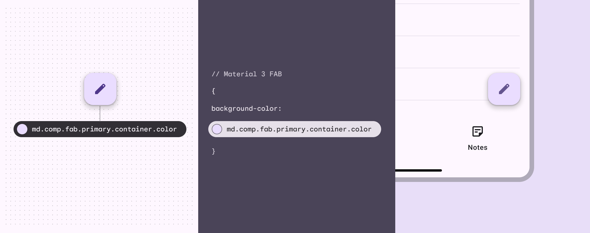

*Using design tokens instead of hardcoded values can streamline the work of building, maintaining, and scaling products with a design system*

## Resources

| Type | Link | Status |
| --- | --- | --- |
| Design | [Design Kit](http://goo.gle/m3-design-kit) (Figma) | Available |
| Design | [Material Theme Builder Figma plugin](https://goo.gle/material-theme-builder-figma) | Available |
| Implementation | [Material baseline theme and tokens](https://github.com/material-foundation/material-tokens) (DSP) | Available |

## What’s a design token?

Design tokens are small, reusable design decisions that make up a design system's visual style. Tokens replace static values with self-explanatory names.

A design token consists of 2 things:

1. A code-like name, such as md.ref.palette.secondary90
2. An associated value, such as #E8DEF8

The token's value can be one of several things: A color, typeface, measurement, or even another token.

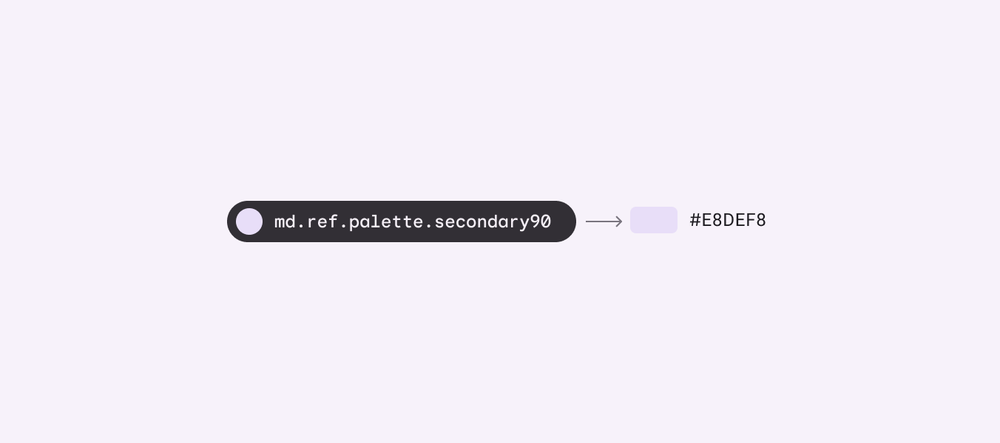

*Example of a reference token and its color value*

Design tokens meaningfully connect style choices that would otherwise lack a clear relationship.

For example, if a designer's mock-ups and an engineer's implementation both reference the same token for the “secondary container color,” then they can be confident that the same color is being used in both places. This applies even if the hex value assigned to that token gets updated.

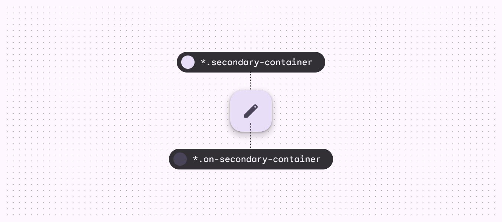

*Example of tokens assigned to the secondary and on secondary color roles of a FAB’s container and icon, respectively*

## Why are tokens important?

Tokens make it possible for a design system to have a single source of truth – a repository where style choices are recorded and changes can be tracked. Because tokens are reusable and purpose-driven, they can define system-wide updates to themes and contexts. For example, you can use tokens to systematically apply a high-contrast color palette for improved visibility, or change the typographic scale to ensure that text is legible on a TV screen. By using tokens for design and implementation, style updates propagate consistently through an entire product or suite of products. They also help designers and engineers "speak the same language,” reducing confusion during handoff from design to implementation.

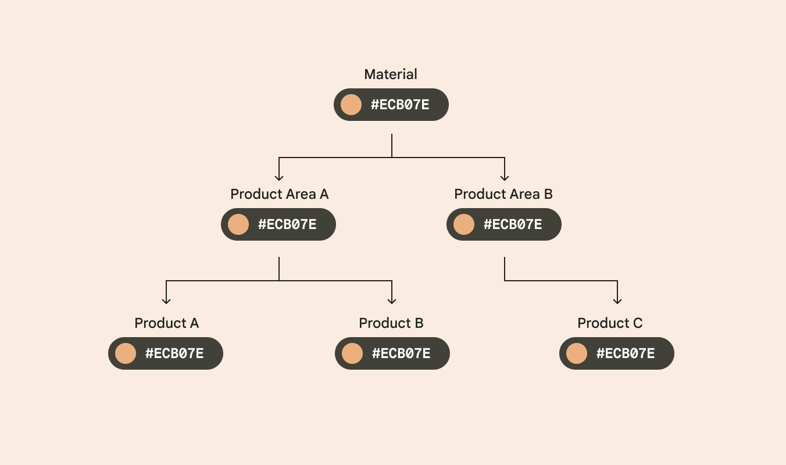

*As design systems evolve, certain values will change. With design tokens, we can track changes and ensure consistency across our products.*

## Deciding if tokens are right for you

#### Tokens will be most helpful if:

- You plan to update the design of your product or are building a product from scratch
- Your design system is applied across a suite of products or platforms
- You want to make it easy to maintain or update styles in the future
- You want to get the most out of the Material Design system, including features like dynamic color

#### Tokens will be less helpful if:

- You have an existing app using hard-coded values that is unlikely to change in the next year or two
- Your product does not have a design system

## Tokens & Material Design

In the past, Material styles were communicated through guidelines, design files, tools, and platform-specific component libraries. With design tokens, you can now download, customize, and apply Material styles and integrate them across your design and development process. Tokens allow decisions to be documented in a platform-agnostic and shareable format.

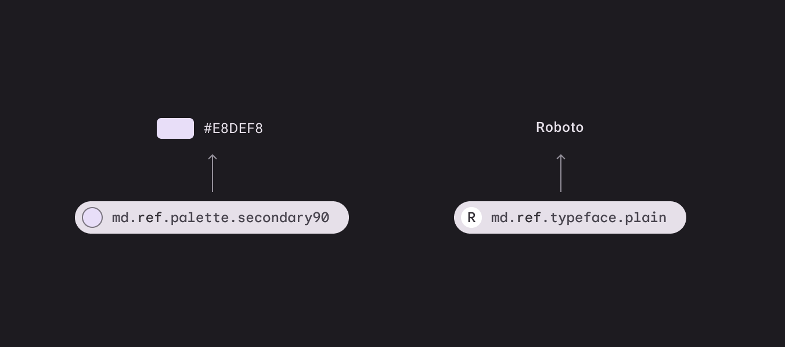

*Design tokens provide a central repository for design choices, with a variety of integration points for engineers and designers*

On this site, you’ll see tokens listed in interactive modules. These modules let you quickly look up the default baseline value stored by tokens for color, font, font size, font weight, etc. They also show the relationship between a role, its system token, reference token, and stored pre-set value.

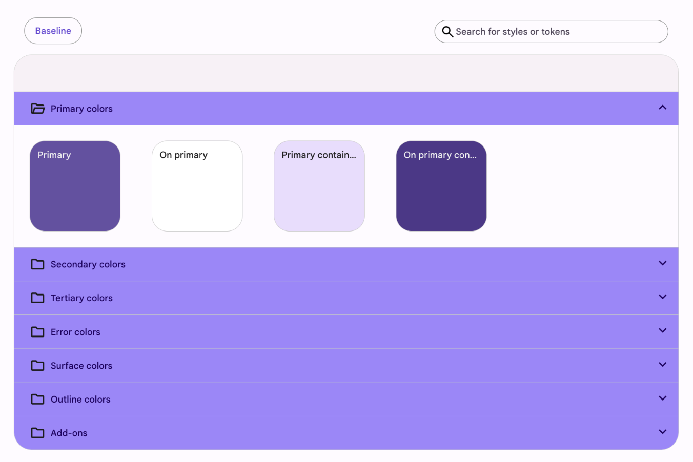

*Example of a token module*

You’ll also see tokens in the specs tabs of component articles. Tokens are first grouped by state (enabled, disabled, hover, etc) and then by element, which is the part of the component that a token or value applies to, such as the container or label text. Columns include:

- Name – The component style aspect that the token applies to, such as color or font
- Token ID – The token defining the component style aspect
- Description – Optional descriptive info
- Context/value – The value stored in the token for a given context

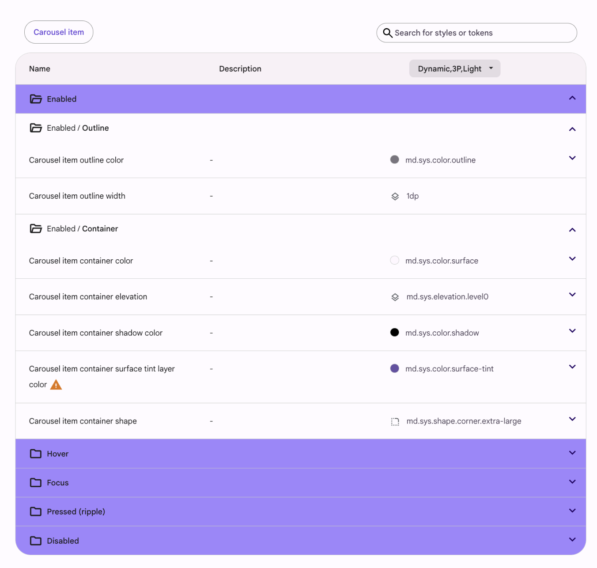

*The diagram and token module for elevated button*

### How to use token modules

Let's say you need to verify the color role for a filled button's label text.

Navigate to Common buttons > Specs, find the token module for filled buttons, and search for the "label text" tokens under elements.

Copy the color token and paste it in code, or compare it to the color role in Figma.

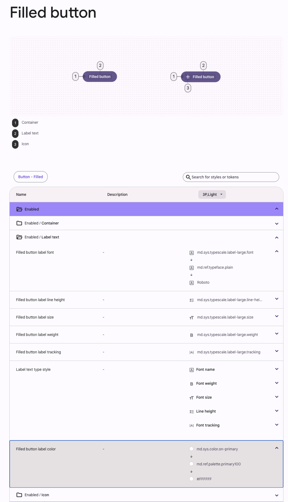

*Diagram and token table for filled button label color*

## Parts of a token name

The parts of a token name are separated by periods and proceed from the most general information ("md") to the most specific ("on-secondary").

1. All token names in a design system start with the system name (such as “md” for Material Design)
2. An abbreviation for the token class: “ref” for reference tokens, “sys” for system tokens, and “comp” for component tokens
3. The token ends with descriptive words communicating the token’s role

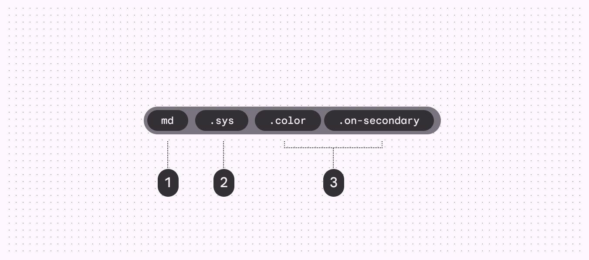

*Communicates design system; Communicates token class; Communicates token’s purpose*

## Classes of tokens

There are three classes of tokens in Material:

1. Reference tokens All available tokens with associated values.
2. System tokens Decisions and roles that give the design system its character, from color and typography, to elevation and shape.
3. Component tokens The design properties assigned to elements in a component, such as the color of a button icon.

With three classes of tokens, teams can update design decisions globally or apply a change to a single component.

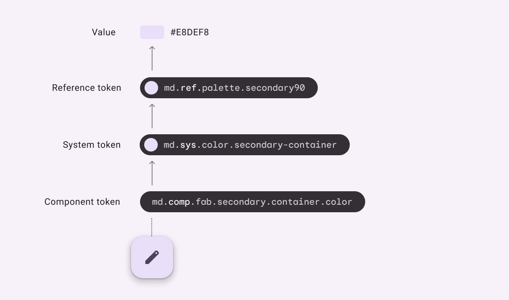

*A button that receives its container color through a system of three tokens that define scalable color values. The color tokens point to a specific hex value that can easily change without impacting the token syntax.*

### Reference tokens

These tokens make up all of the style options available in a design system.

They usually point to a static value – such as a color hex code or font size – but can also point to other reference tokens. Reference tokens don't change based on context.

By providing a list of options, reference tokens give your team a starting point of approved colors, typography, measurements, etc.

All reference tokens start with the prefix ref.

*Color and typography reference tokens and their values*

### System tokens

These are the decisions that systematize the design language for a specific theme or context.

System tokens define the purpose a reference token serves in the UI.

This is where theming occurs. The system token can point to different reference tokens depending on the context, such as a light or dark theme.

Whenever possible, system tokens should point to reference tokens rather than static values.

All system tokens start with the prefix sys.

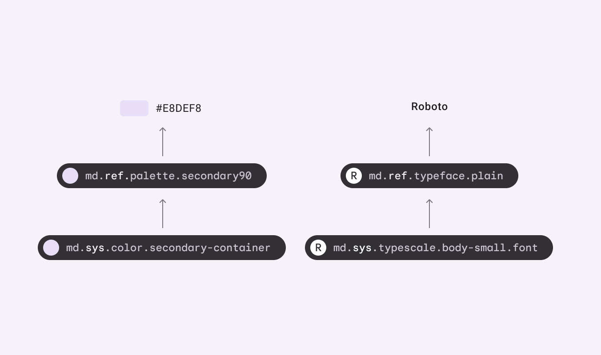

*System tokens, reference tokens, and their values*

### Component tokens (in development)

These represent the elements required to compose a component, such as containers, label text, icons, states, and their values such as size, shape, color, or elevation.

Whenever possible, component tokens should point to a system or reference token, and not contain hardcoded values such as hex codes.

Not every stylistic choice of a component will be able to be expressed as a token, but whenever a design choice applies to multiple components of similar intent, a token should be used.

All component tokens start with the prefix comp.

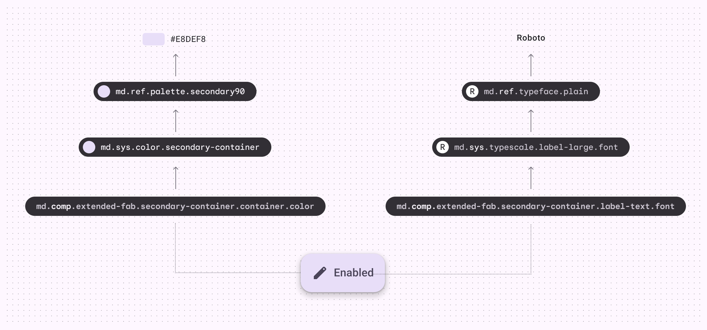

*Component tokens, system tokens, reference tokens, and their values*

## Contexts

Tokens can point to different values depending on a set of conditions. These conditions are called contexts and their resulting values are called contextual values. Examples of different contexts include: device form factors, dark theme, dense layouts, and right-to-left writing systems. You can think of a context as a kind of tag. If a token value is tagged with dark theme then it will override the default token value in a dark theme context.

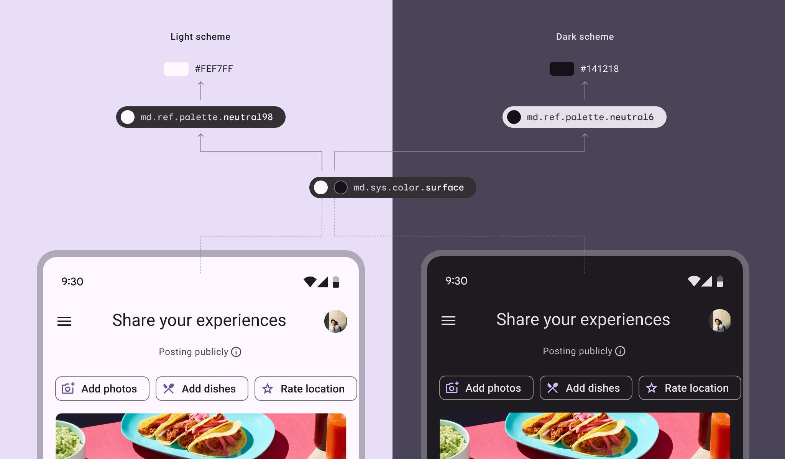

*The same system token for background color can point to different reference tokens depending on the context: Light theme or dark theme*
