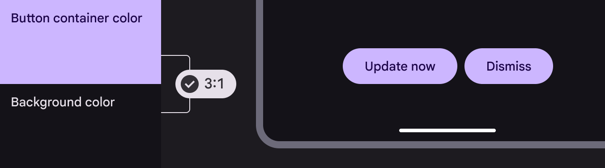
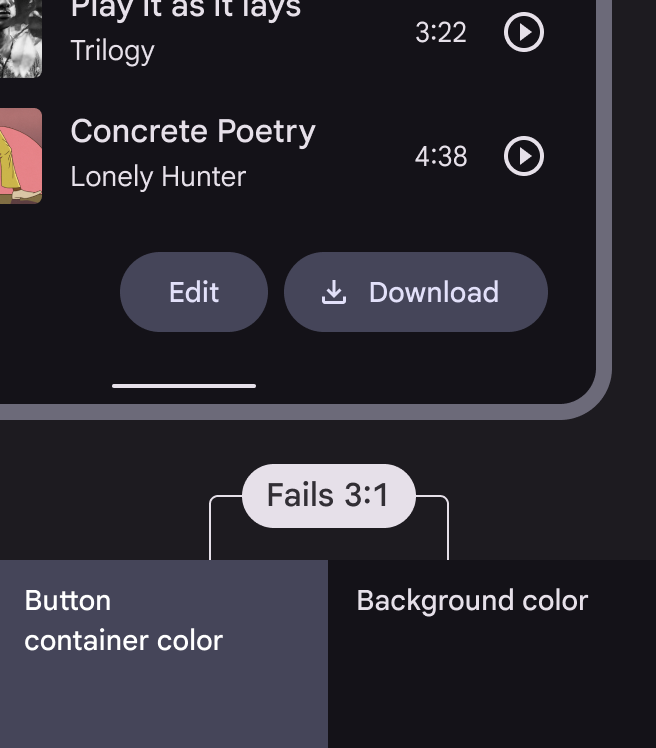
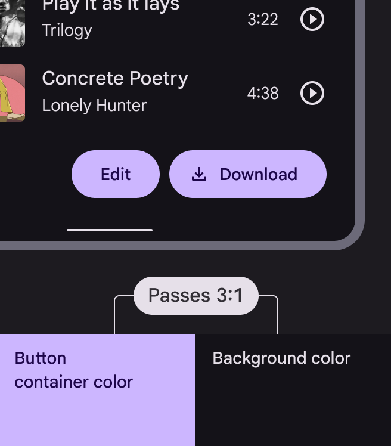
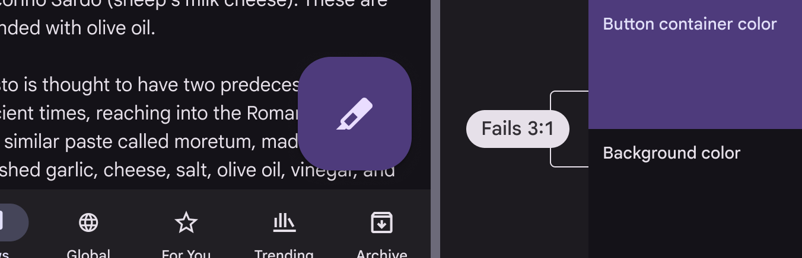
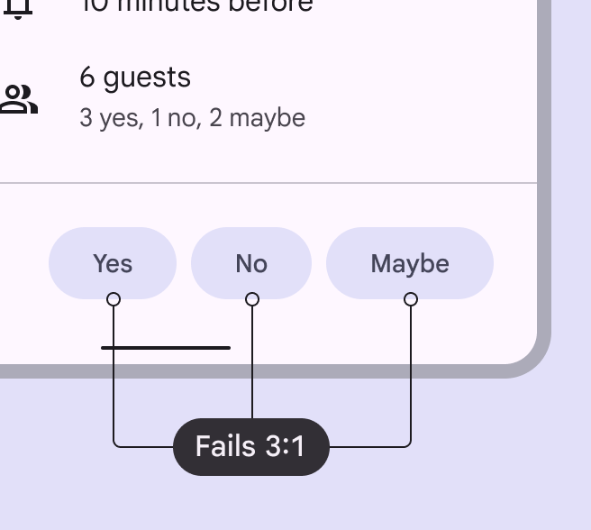
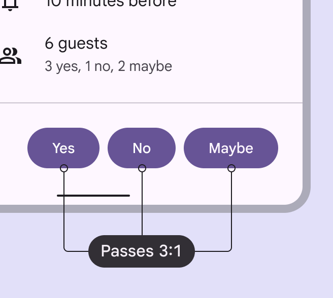

# Designing

Source: https://m3.material.io/foundations/designing/color-contrast

## Color & contrast

Color and contrast can be used to help users see and interpret your app’s content, interact with the right elements, and understand actions.

Color can help communicate mood, tone, and critical information. Primary, secondary, and accent colors can be selected to support usability. Sufficient color contrast between elements can help users with low vision see and use your app.

### Contrast ratios

Color contrast is important for users to distinguish various text and non-text elements. Higher contrast makes the imagery easier to see, while low-contrast images may be difficult for some users to differentiate in bright or low light conditions, such as on a very sunny day or at night.

Contrast ratios represent how different one color is from another color, commonly written as 1:1 or 21:1. The greater the difference is between the two numbers in the ratio, the greater the difference in relative luminance between the colors. The contrast ratio between a color and its background ranges from 1-21 based on its luminance (the intensity of light emitted) according to the World Wide Web Consortium (W3C).

The W3C recommends the following contrasts for body text and image text

| Text type | Color contrast ratio |
| --- | --- |
| Large text (at 14 pt bold/18 pt regular and up) and graphics | At least 3:1 against the background |
| Small text | At least 4.5:1 against the background |

Disabled states do not need to meet contrast requirements.

### Clustering elements

Some non-text elements, such as button containers, should meet a contrast ratio of 3:1 between their container color and the color of their background. Consider the following patterns for combining elements and tones, which are grounded in Material's research into contrast and functional changes when elements are combined.

[Learn more about color contrast for accessibility](https://m3.material.io/m3/pages/color/how-the-system-works#e1e92a3b-8702-46b6-8132-58321aa600bd)

Elements that are clustered with others, such as a group of buttons, require the user to distinguish each one from the group.

These elements benefit from 3:1 contrast between themselves and the background.

*The contrast of the button container color against the background color is less than Material's required contrast of 3:1*

*The container color exceeds Material's required minimum contrast of 3:1 against background color*

Elements that stand on their own and apart from other elements on the screen, such as a FAB, are already distinguishable to users because of their prominence. These elements don’t benefit from 3:1 contrast between themselves and the background.

*Standalone components, such as FABs, don’t need to meet Material's minimum contrast of 3:1 between the container and background colors because of their prominence*

When placing components together in a cluster, use components or types of components that each achieve at least 3:1 contrast between themselves and the background.

*Each button's container color has less than Material's required minimum contrast of 3:1 against the UI background, leading to poor contrast support for users with low vision*

*Each button's container color has contrast of at least 3:1 against the UI background, leading to better contrast support for users with low vision*
