# Inputs

Source: https://m3.material.io/foundations/interaction/inputs

- Design for touch, keyboard, and mouse interactions
- Embrace multiple input methods and gestures within your app

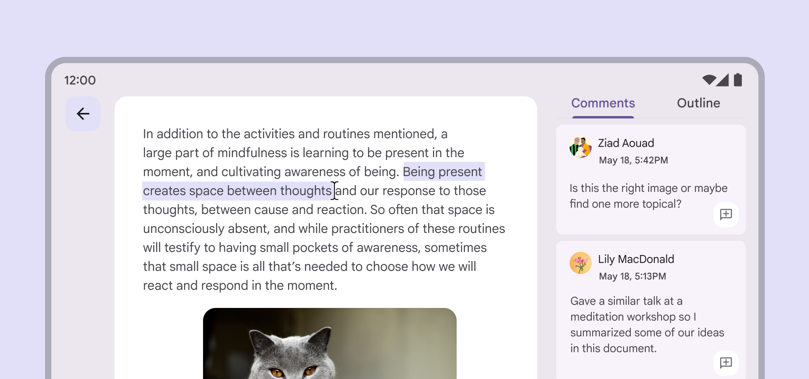

*Designing for inputs allows people to use the inputs they prefer, like a mouse to highlight text on a tablet*

## External inputs for devices

People can use external inputs like a mouse, keyboard, or stylus with their phone, tablet, foldable, TV, laptop, or desktop computer. When someone connects an external input to their device, they expect it to behave in familiar and useful ways. Designing for different input methods can make a product more usable and accessible on all screen sizes.

### Common features of external inputs

#### Mouse

- Left and right click
- Mouse wheel
- Extra buttons

#### Trackpad

- Left and right click
- Gestures
- Haptics

#### Physical keyboard

- Replaces virtual keyboard
- Media keys
- Modifier keys

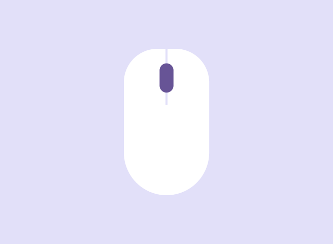

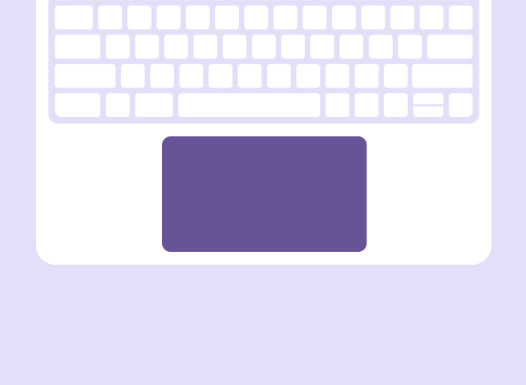

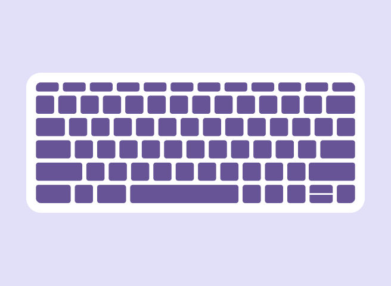

### Input device behaviors

Depending on the input device, designers and developers can implement behaviors that meet standard conventions and user expectations.

| Input device action | Anticipated behavior |
| --- | --- |
| Mouse and trackpad movement | Show a mouse cursor on the screen |
| Primary click | Treat mouse clicks differently than touch events |
| Secondary click | Activate context menus |
| Hover | Change component states |
| Highlight | Allow text to be selected by the mouse cursor |
| Mouse wheel and trackpad two finger drag | Scroll list vertically and horizontally |
| Trackpad pinch | Zoom an element or page |
| Physical keyboard | Hide and show on screen keyboard |

## Mouse and cursor interactions

When an external mouse input device is used, a mouse cursor should be shown, regardless of the device type. A mouse may be connected to tablets, laptops, phones, foldables, and more. On some devices, it's possible to use an external input device simultaneously with touch input. On devices that don't specifically recognize mouse or stylus input, the mouse is treated as touch input.

### Primary click

A mouse click or stylus tap should demonstrate the same feedback as touch input. One example of this is showing the ripple for a pressed state.

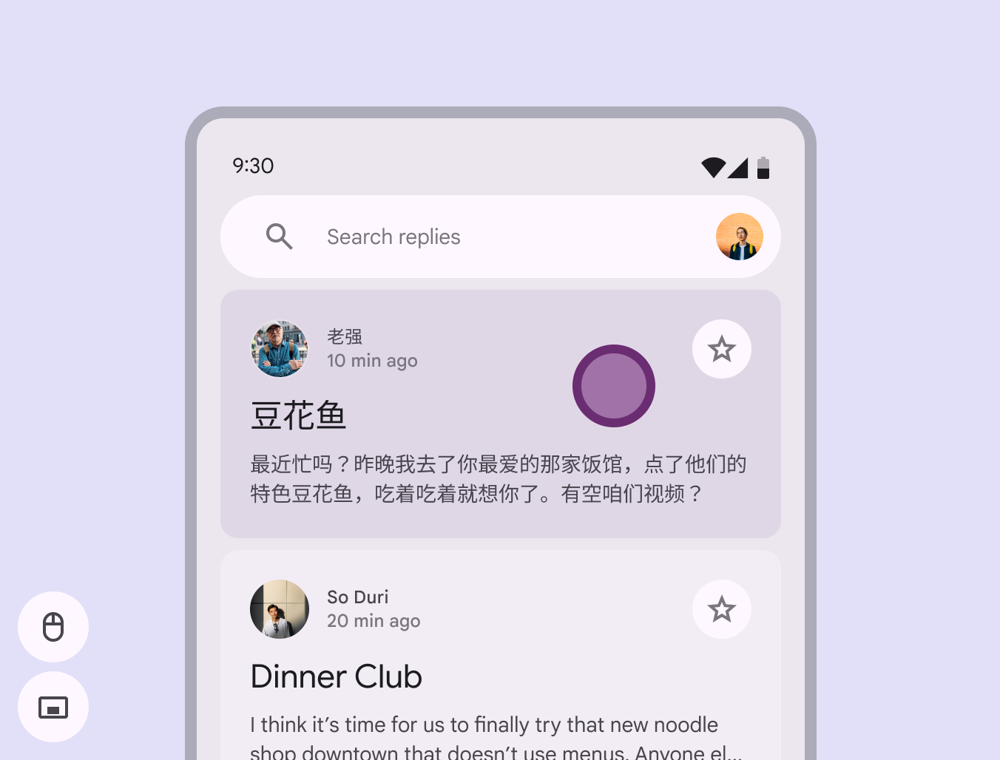

*A visible mouse cursor is seen when the external input is connected*

### Secondary click

#### Context menus

A secondary click (whether using a single button or two fingers on a trackpad) should activate a context menu. The context menu shows additional options for the object that's clicked. See [menus](https://m3.material.io/m3/pages/menus/overview) for more usage and guidelines.

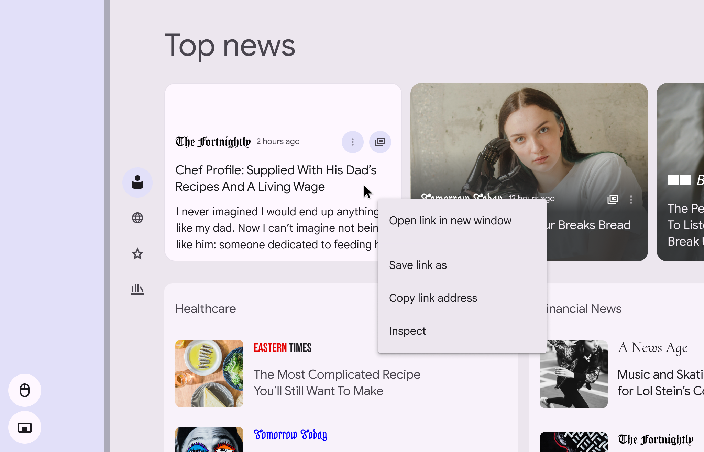

*The context menu should appear when right clicking with a mouse or trackpad*

### Hover

When using a mouse cursor, help users discover interactive objects by enabling visual changes. When the mouse rests on an interactive element, the hover state is a valuable cue for interaction. See [states](https://m3.material.io/m3/pages/interaction-states/applying-states#71c347c2-dd75-485b-892e-04d2900bd844) for styles and guidelines. Hovering with a cursor (or stylus) should also invoke tooltips when applicable. See [tooltips](https://m3.material.io/m3/pages/tooltips/overview) for guidance.

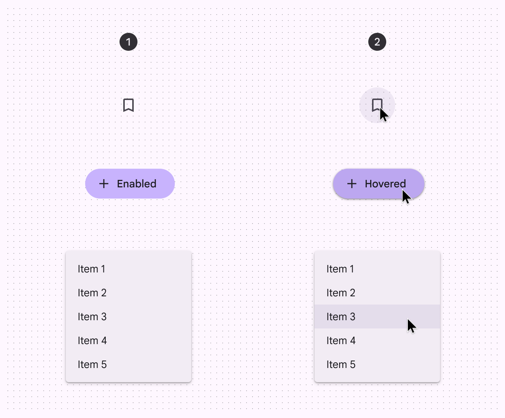

*Components without a hover state; Components with a hover state change applied*

### Cursors

Cursors appear when using external input devices like a mouse or trackpad. The cursor can change to communicate more information about interactive elements.

#### Pointer

By default, external input control should be rendered as a pointer.

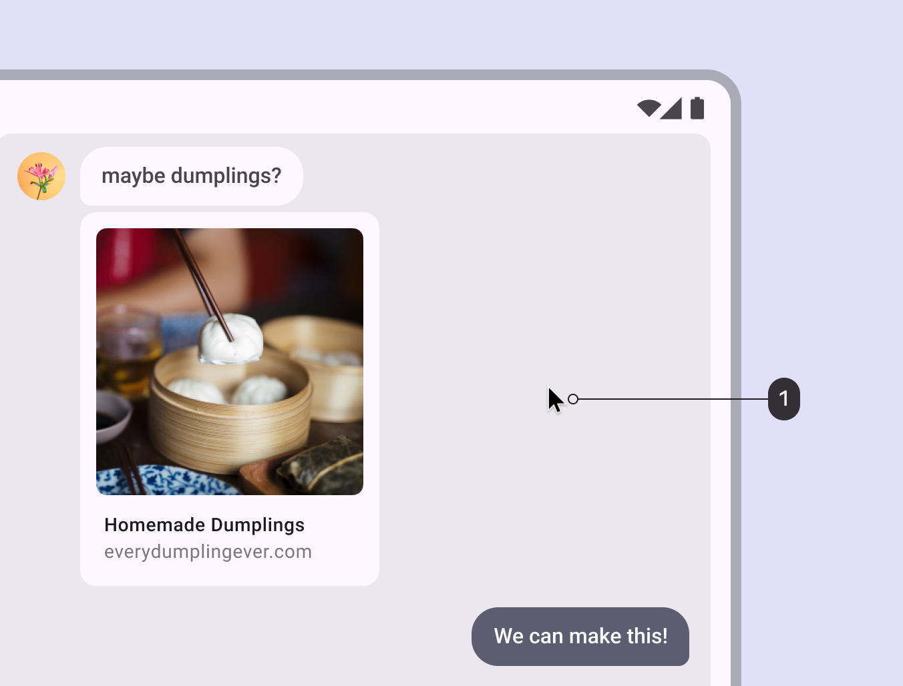

*A pointer provides a visible indicator for input controls*

#### Hand

The cursor should appear as a hand to indicate links or linked images.

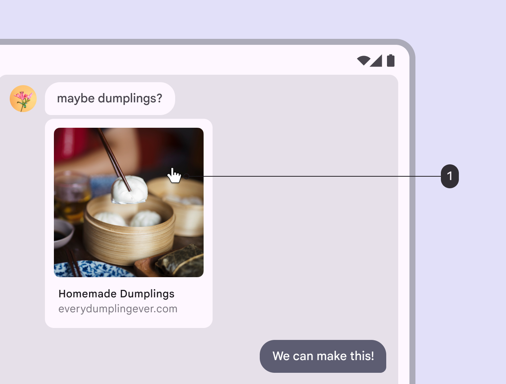

*The hand cursor is used for links and clickable images*

#### Resize arrows

The cursor should change to resize arrows on the boundaries of resizable elements.

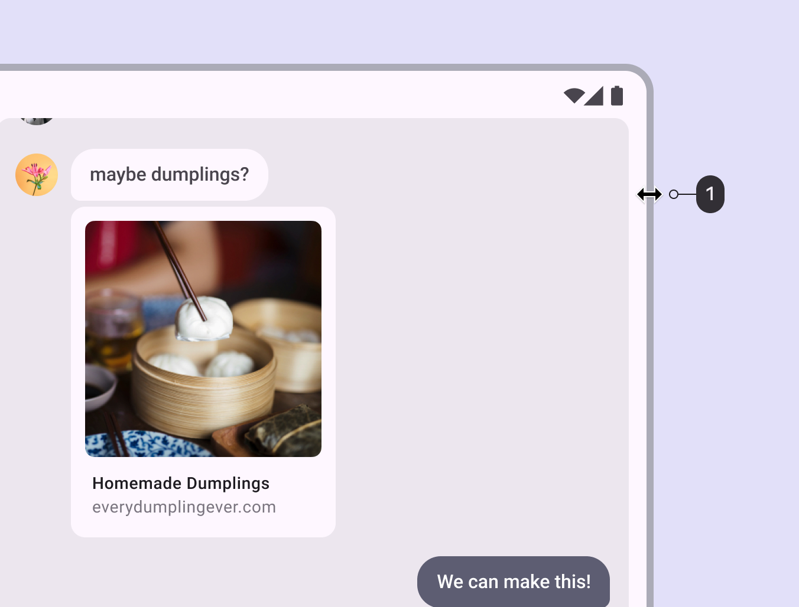

*Resize arrows indicate an element can be resized*

#### I-beam

The cursor should appear as an I-beam when hovering on text. When manipulating editable text, the following interactions apply:

- Single click places the cursor
- Double click selects a word
- Triple click selects a paragraph
- Single click deselects text and repositions the cursor

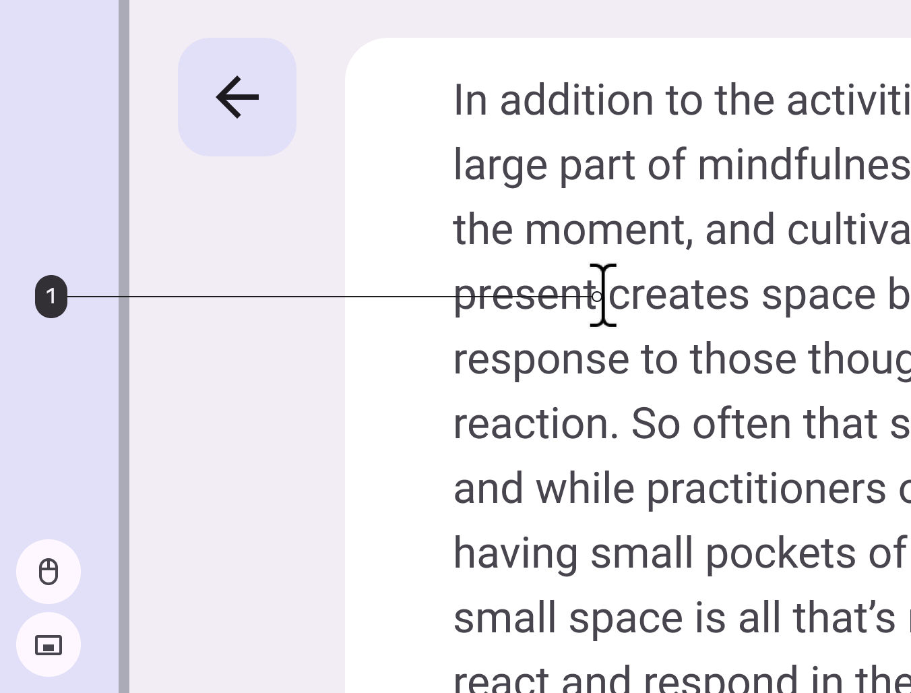

*An I-beam cursor indicates selectable text*

### Text selection

When selecting text using a mouse, trackpad, or stylus:

- Highlight the selected area using a single color
- Don’t show touch controls next to the highlighted area

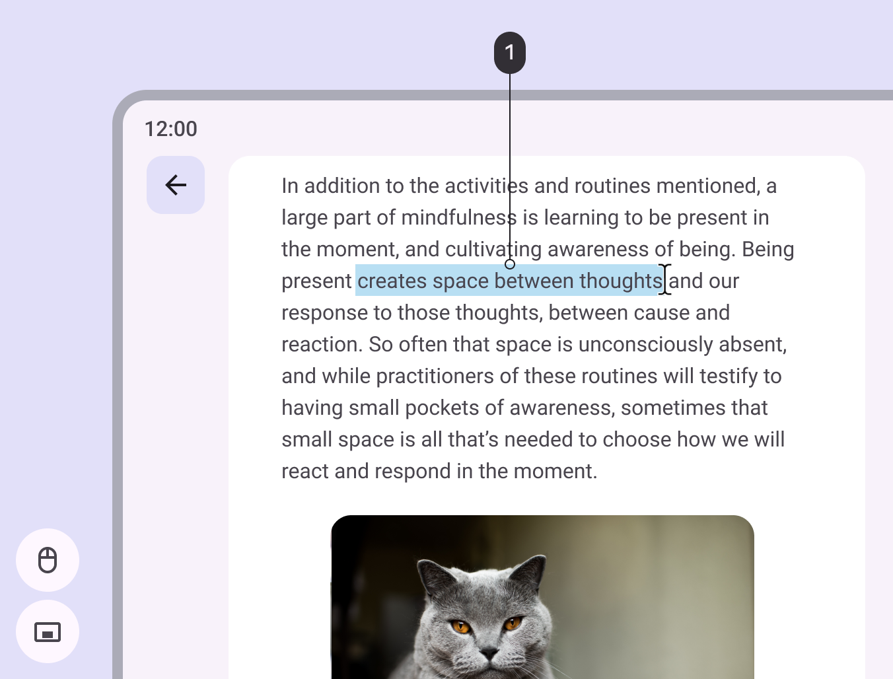

*Selected text shows a visible highlight*

### Text selection with touch control

When interacting using touch, always show touch controls, even if other inputs are connected. When using a mouse, trackpad, or stylus, show the I-beam and context menu, even if it's a touch device.

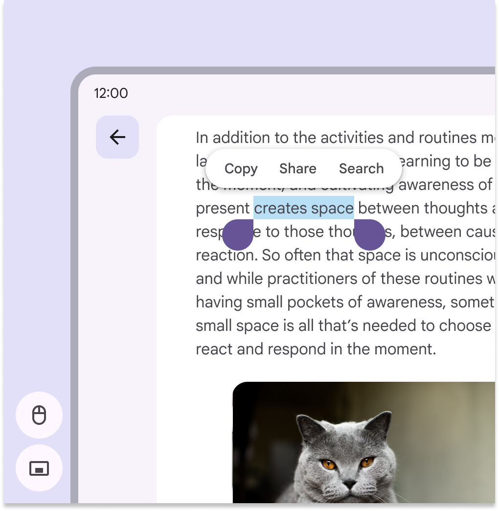

*When using a touchscreen to select text, show touch controls*

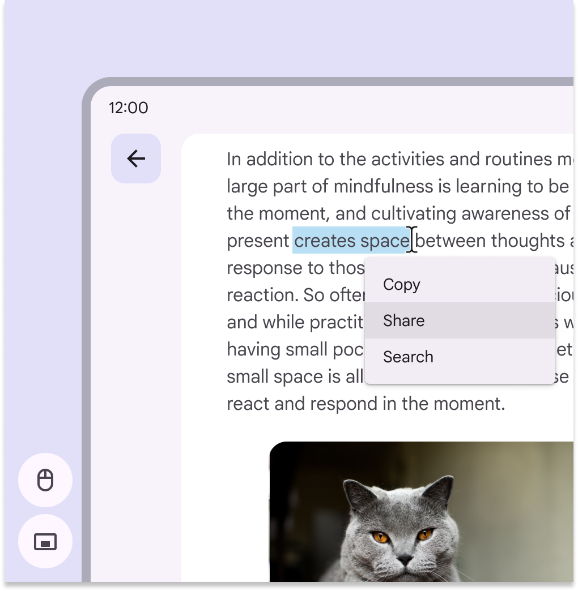

*When using a mouse, trackpad, or stylus to select text, use the right-click context menu*

### Stylus input

When using a stylus, cursors are usually not necessary, unless they communicate tool properties such as brush size or shape.

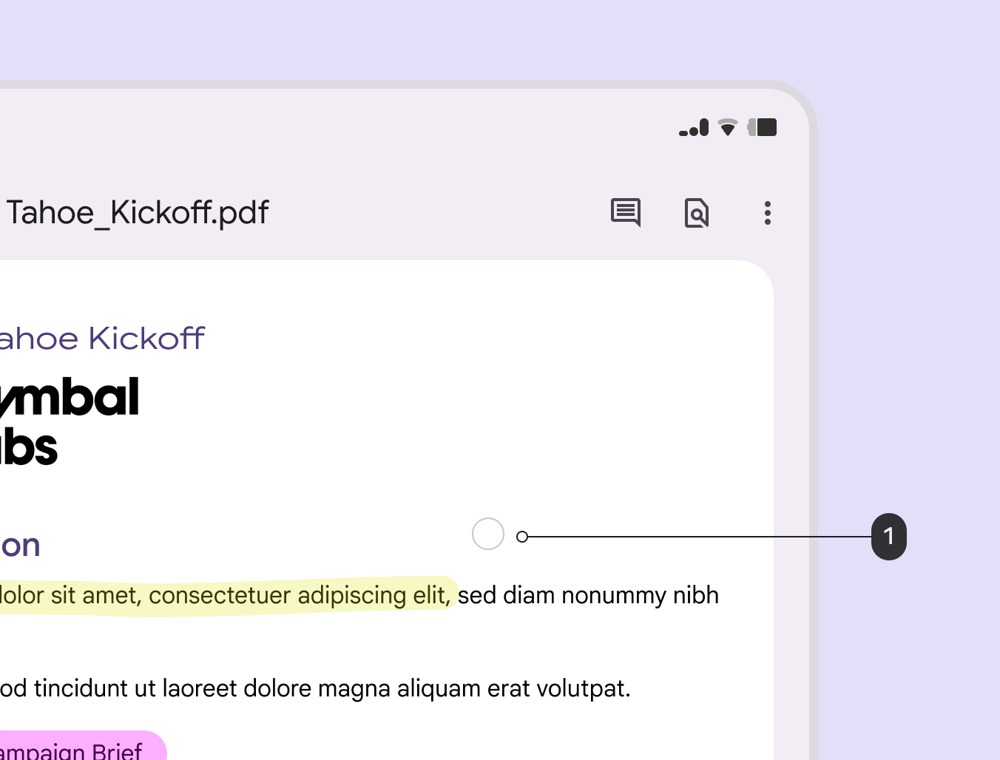

*The circle cursor indicates the selected stylus tool and size*

## Mouse wheel and trackpad gestures

When an external mouse or touchpad is used, the mouse wheel and trackpad gesture allow more actions.

### Vertical scroll

When a cursor is positioned on a list, the mouse wheel and two-finger touchpad gesture should allow vertical scrolling of the list.

[Video: Stationary cursor over a scrolling field controlled by a mouse wheel or trackpad.](assets/asset-016-scrolling-a-vertical-list-using-the-mouse-wheel-ba36e09af3.webp)

*Scrolling a vertical list using the mouse wheel or trackpad gestures. Note that only the detail panel under the cursor scrolls.*

### Touch scroll & mouse text selection

Upon touch and drag gesture, the text area will scroll. With a mouse interaction, dragging in a text area will select the text.

[Video: Animation of a swipe gesture to scroll the screen.](assets/asset-017-on-a-touch-screen-dragging-upward-scrolls-the-b0682826c4.webp)

*On a touch screen, dragging upward scrolls the field down*

[Video: Animation showing a dragging gesture with a mouse to select text and image.](assets/asset-018-when-using-a-mouse-dragging-upward-selects-text-eb34ff5844.webp)

*When using a mouse, dragging upward selects text and images*

### Horizontal scroll

Mouse users should be able to scroll with a mouse wheel to navigate horizontally scrolling fields. Trackpad users should be able to scroll using a two-finger horizontal gesture.

[Video: A news feed of horizontally scrolling cards.](assets/asset-019-carousels-can-scroll-horizontally-using-a-scroll-wheel-6a302f6219.webp)

*Carousels can scroll horizontally using a scroll wheel or trackpad*

## Physical keyboard

When a physical keyboard is connected to a device, either externally or as a built-in laptop keyboard, users should be able to perform any actions that the virtual keyboard provides, and more.

### Show and hide virtual keyboard

A virtual keyboard should appear or hide in response to the presence of a physical keyboard.

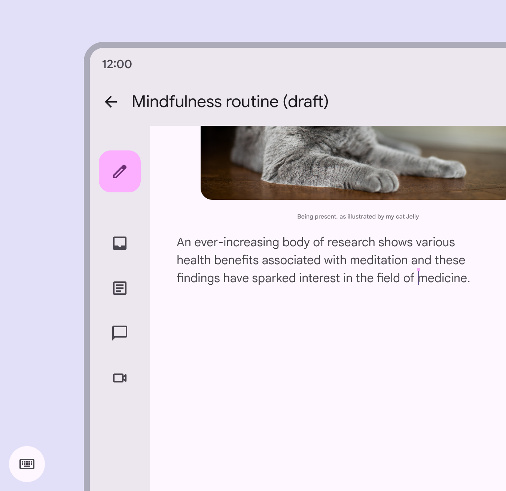

*Do When a physical keyboard is attached, hide the virtual keyboard*

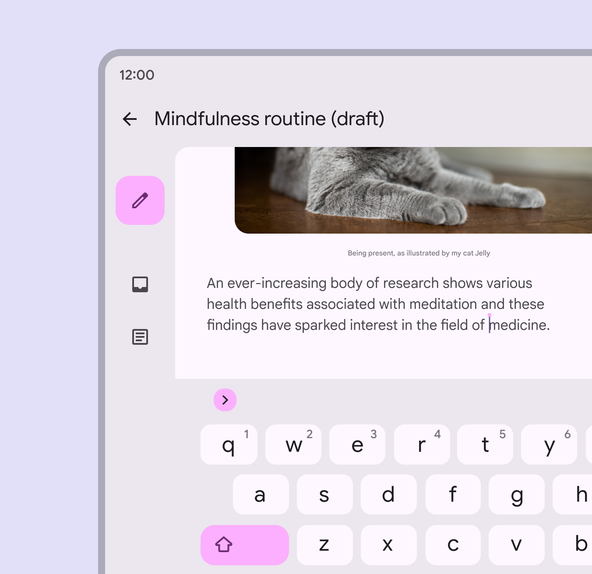

*Do When a physical keyboard is removed, show the virtual keyboard*

### Common keyboard interactions

#### Enter key

People typically expect the E nter key on a physical keyboard to be enabled by developers to allow a common function like sending a message.

[Video: A message being typed into a chat, and sent using the Enter key.](assets/asset-022-the-enter-key-typically-triggers-actions-like-sending-abeb0d131f.webp)

*The Enter key typically triggers actions like sending a message*

#### Spacebar control

People typically expect the Spacebar (or available media keys) to be enabled to play and pause music or video.

[Video: A video being paused and resumed by pressing the Spacebar.](assets/asset-023-pressing-space-usually-pauses-and-plays-media-62ee93427f.webp)

*Pressing Space usually pauses and plays media*

#### Tab focus

When keyboard users navigate a page using Tab, the focus on interactive items must follow a logical order. On most pages, that means left to right, top to bottom. When focused from a keyboard or other input device, the focus state includes a ring-like keyboard focus indicator.

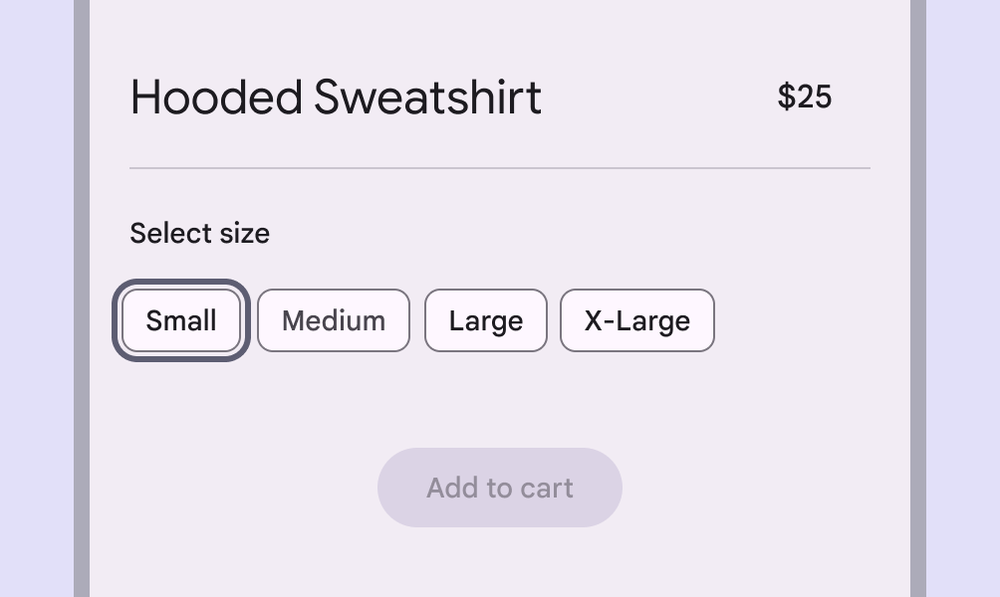

*Tab focus includes a visible keyboard focus indicator*

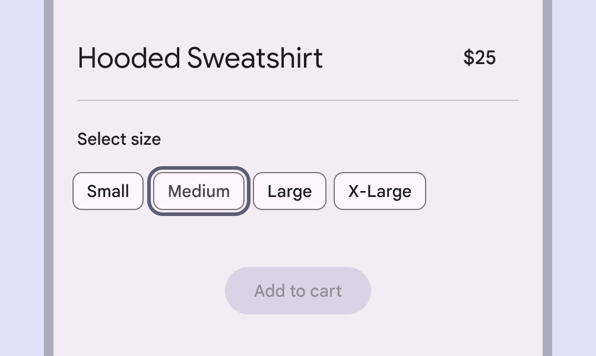

*The focus state moves elements as the user presses Tab on their keyboard*

#### Escape key

People typically expect the Escape key on a physical keyboard to dismiss elements, remove focus, or clear selections.

[Video: Escape key dismisses menu.](assets/asset-026-the-escape-key-should-dismiss-any-visible-modal-268648395c.webp)

*The Escape key should dismiss any visible modal elements like menus, dialogs, or bottom sheets*

[Video: Escape key removes focus indicator from icon.](assets/asset-027-the-escape-key-should-remove-any-visible-focus-ce20f55085.webp)

*The Escape key should remove any visible focus indicators and set the focus order to 0*

[Video: Escape key dismisses text cursor and leaves text itself unchanged.](assets/asset-028-the-escape-key-should-remove-the-text-cursor-563740eb14.webp)

*The Escape key should remove the text cursor when typing, but should not remove already-typed text*
