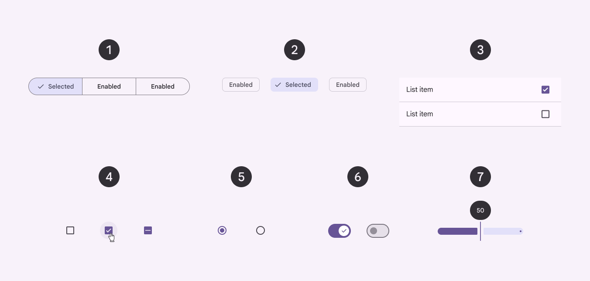
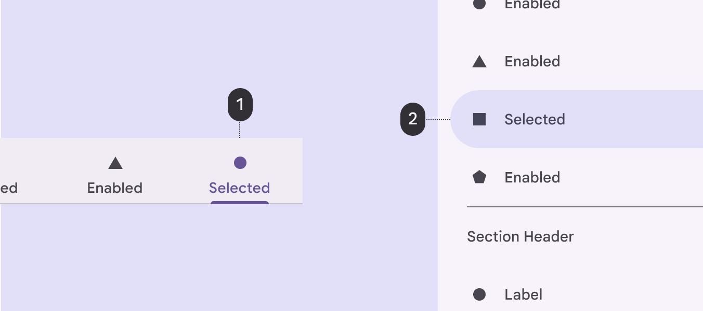

# Selection

Source: https://m3.material.io/foundations/interaction/selection

- Selection is shown through changes to surface color or other visible elements
- An entire component can be selected, or just certain parts in a component
- Selection can be performed via tap, cursor, keyboard, or voice

## Resources

| Type | Link | Status |
| --- | --- | --- |
| Design | [Design Kit (Figma)](http://goo.gle/m3-design-kit) | Available |

## Selection indicators

Selections are displayed using a check mark icon, a checkbox component, a change in surface color, or a combination.

Selections are inherited by the following components:

- Cards
- Checkboxes
- Chips
- Data tables
- Icon buttons
- List items
- Menu items
- Pickers
- Radio buttons
- Segmented buttons
- Sliders
- Switch

*Segmented buttons; Chips; List items; Checkboxes; Radio buttons; Switch; Slider*

The following components use an active indicator to represent which item is currently selected:

- Navigation bar
- Navigation drawer
- Navigation rail
- Tabs

The color and shape of the active indicator varies between components. In these components, only one item should be selected at a time.

*Tab; Navigation drawer*

## Types of selection

### Touch

On touch devices, select items using:

- Long press touch or two-finger touch
- Selection shortcut, if available, such as tapping an avatar

[Video: Touch used to select 3 list items one after another.](assets/asset-003-items-in-a-list-selected-via-touch-f78e3de297.webp)

*Items in a list selected via touch*

### Entering and exiting selection mode

To select an item and enter selection mode, long press the item or use a shortcut, such as tapping the item’s avatar. To select additional items, tap each of them.

To exit a selection mode, tap each selected item until they’re unselected, or tap an action on the toolbar.

[Video: List items are tapped to select and unselect them.](assets/asset-004-entering-and-exiting-selection-mode-48b6b0f014.webp)

*Entering and exiting selection mode*

### Larger selections

To select multiple items simultaneously, long press and drag across items. Don’t use this gesture combination if it is already in use to pick up and move items, like cards.

[Video: Long press and drag used to select multiple images in a photo feed.](assets/asset-005-do-long-press-and-drag-can-be-used-e16b465d8e.webp)

*Do Long press and drag can be used together to select items in batches*

[Video: Long press and drag combination used to move cards, but can’t be used to batch select items while in use.](assets/asset-006-don-t-if-the-long-press-and-drag-0e3f8019ac.webp)

*Don’t If the long press and drag combination is already in use to pick up and move components, like cards, then the combined gesture can’t also be used for selecting items in batches*

### Click

On desktop, checkboxes are always visible when selection is the primary activity. When selection is secondary, checkboxes (or other indicators) are displayed:

- As a single checkbox for that item on hover
- For all items after one item is selected

To make a selection, hover over an item to reveal a checkbox. The checkbox can then be clicked.

[Video: Checkboxes being selected and unselected.](assets/asset-007-checkboxes-are-visible-by-default-in-this-table-2c8a511a44.webp)

*Checkboxes are visible by default in this table because selection is a primary activity*
