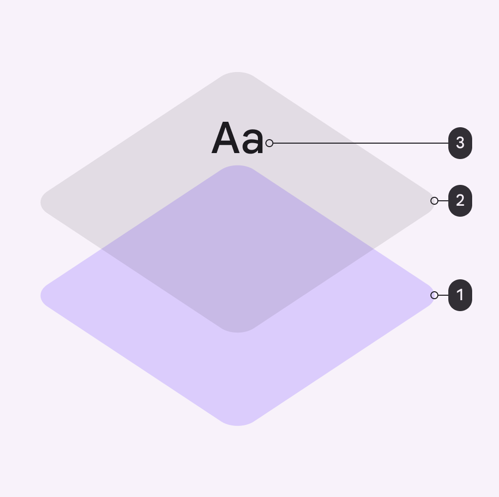
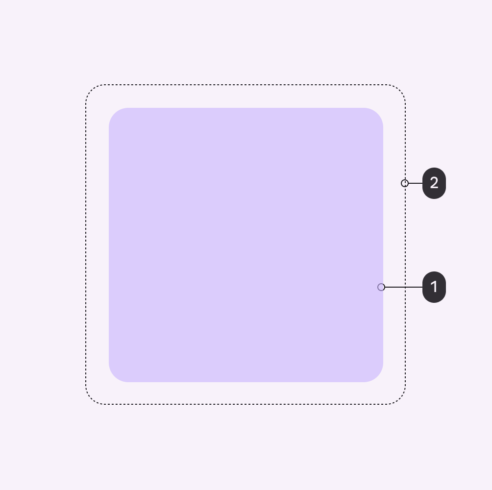
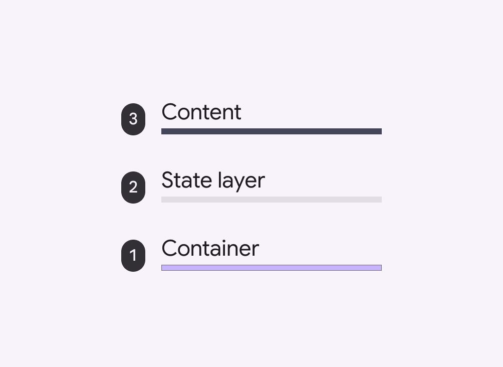
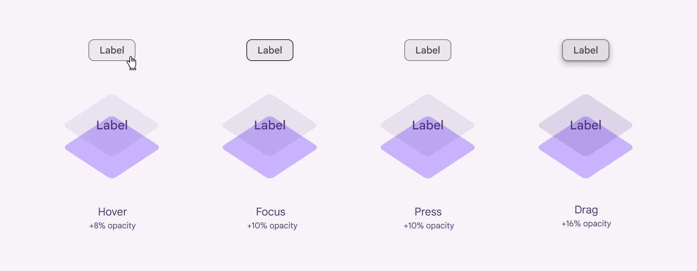

# States

Source: https://m3.material.io/foundations/interaction/states/state-layers

## State layers

A state layer is a semi-transparent covering on an element that indicates its state. State layers provide a systematic approach to visualizing states by using opacity. A layer can be applied to an entire element or in a circular shape and only one state layer can be applied at a given time.

To transition from an enabled style to a stateful style requires the addition of a state layer.

The state layer is an overlay with a fixed opacity for each state and uses the same color as the content.

For example, if the enabled style uses the secondary container color for the container and on secondary container for content, the state layer will be an overlay using the on secondary container color.

If the enabled style uses the surface color for the container and the primary color role for content, then the state layer will be an overlay using the primary color.

*Container; State layer; Content*

The size of state layers is 40dp while the interactive target size is 48dp.

*State layer; Interactive target*

### On colors

By default, a component’s state layer color is derived from the color of its content, either the color of an icon or label text if no icon is present.

An [on color](https://m3.material.io/m3/pages/color-roles#19e75989-7485-4f5b-a769-940c4e4364bc) is a color role used by the content. Each container color has its own corresponding on color. For example, if a container color is secondary container, the content will use the on secondary container color role.

*Order of surface layers shows the state layer (2) between the container (1) and content (3) layers*

### State layer tokens & values

The state layer uses a fixed percentage for the opacity for each state. A state layer uses the color used by content (usually the [on color](https://m3.material.io/m3/pages/color-roles#19e75989-7485-4f5b-a769-940c4e4364bc)) and the percentage opacity for its respective state.

*Hover +8% opacity; Focus +10% opacity; Press +10% opacity; Drag +16% opacity*

- Token sets: State opacities
