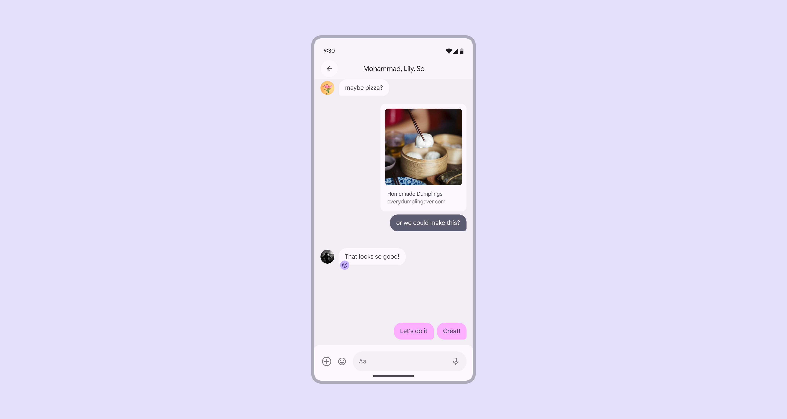
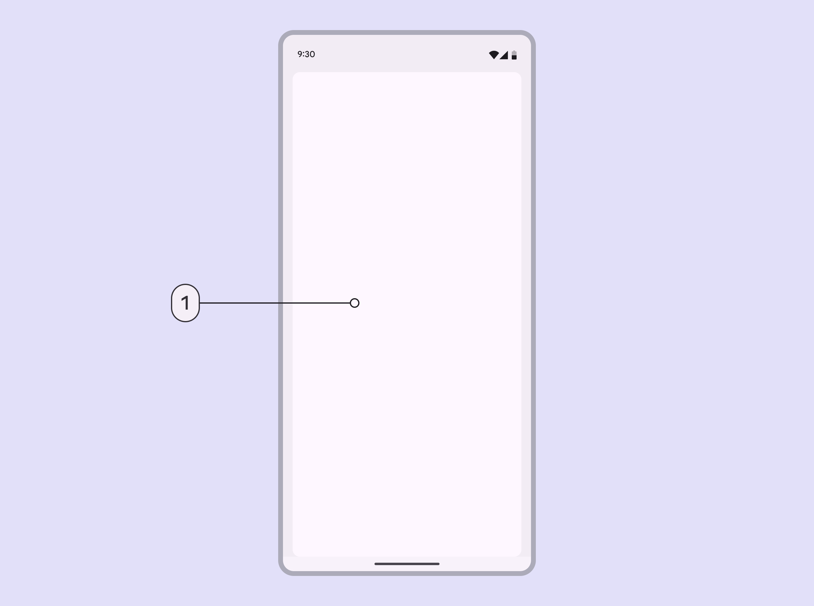

# Applying layout

Source: https://m3.material.io/foundations/layout/applying-layout/compact

Layouts for compact window size classes are for screen widths smaller than 600dp.

*Compact window size layouts focus on a single view*

## Navigation

Use a navigation bar or modal navigation drawer

Place navigation components close to the edge of the screen where they’re easier to reach.

*Mobile app with a navigation bar*

## Body region

Use a single pane layout.

*Single pane layout*

## Spacing

Margins are 16dp from the left and right edge of the window.

*16dp margins*

## Special considerations

A compact layout will need to transition dynamically to a medium or expanded layout when:

- A foldable device is unfolded
- A mobile device is rotated from portrait to landscape
- A tablet exits split-screen mode
- An app is resized to be larger in multi-window mode
- A free-form window is resized
