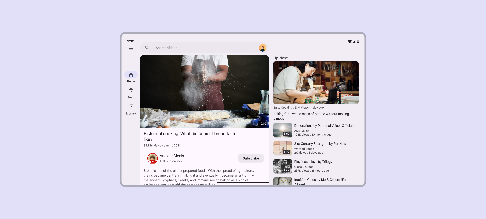
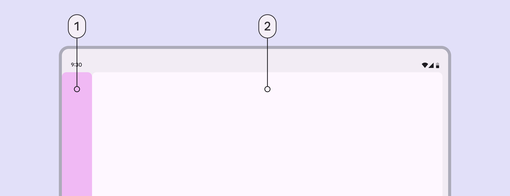
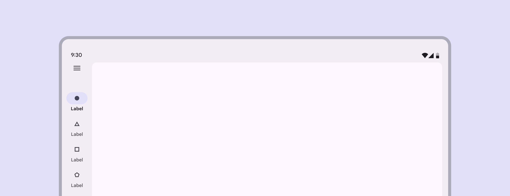
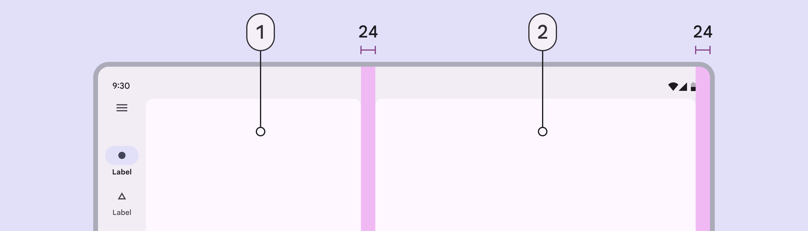

# Applying layout

Source: https://m3.material.io/foundations/layout/applying-layout/expanded

Layouts for expanded window size classes are for screen widths 840dp to 1199dp.

*Video app on an expanded window size class*

## Navigation

Place navigation components close to edges of the window where they’re easier to reach.

Use a navigation rail or persistent navigation drawer.

The navigation rail can be hidden in secondary destinations as long as the primary destination can still be accessed using a back button.

For sorting, filtering, or secondary navigation, use tabs or other components directly in the body.

*Navigation; Body*

## Body pane

Use a single pane layout or two-pane layout.

A two-pane layout is often best for expanded window classes. However, a single pane layout can work when displaying visually dense or information-dense content, such as videos.

*An expanded window size class with a single pane layout*

When using a fixed and flexible layout, the fixed pane should have a width of 360dp by default.

An expanded window size class with a two-pane layout

A split-pane layout uses two flexible panes and visually centers the spacer by default.

[Video: A nav rail and a pane fill 50% of the window. A second pane fills the remaining 50%.](assets/asset-004-an-expanded-window-size-class-with-a-single-9bfa0d67ba.webp)

*An expanded window size class with a single pane layout*

## Spacing

Expanded layouts have a left and right margin of 24dp.

The spacer between panes is 24dp.

*Pane; Second pane*

## Special considerations

An expanded layout will need to transition dynamically to a compact or medium layout when:

- A foldable device is folded
- A tablet is rotated from landscape to portrait
- The app goes from full-screen to split-screen
- Multi-window mode is initiated
- A free-form window is resized

[Video: Two paned layout of an email app in an expanded window class layout.](assets/asset-006-email-app-in-an-expanded-window-class-size-7cb524b8ce.webp)

*Email app in an expanded window class size*
