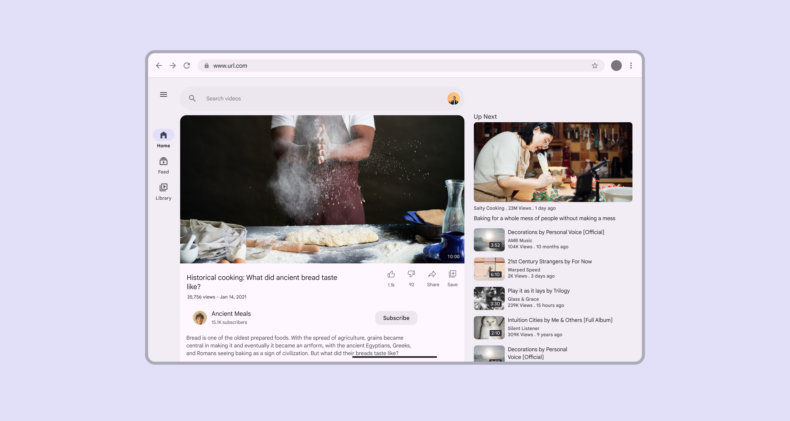
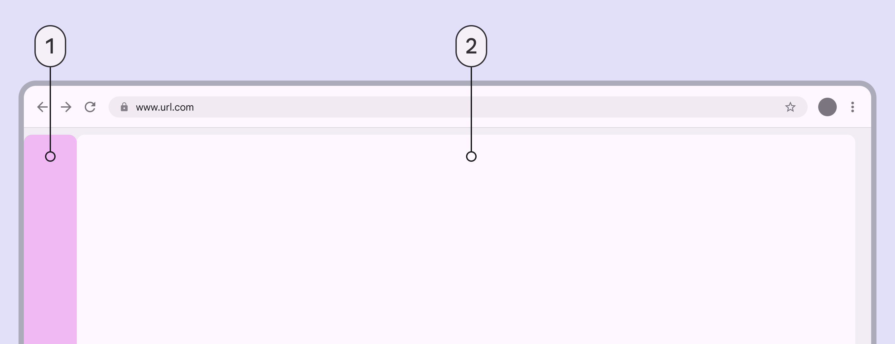
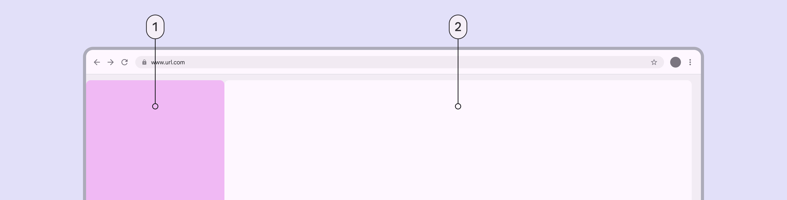
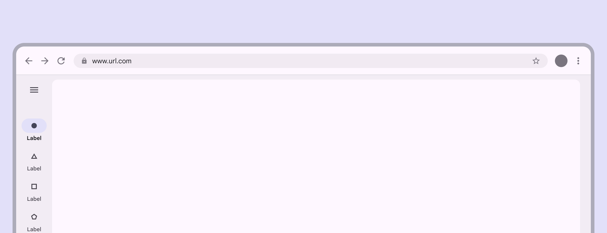
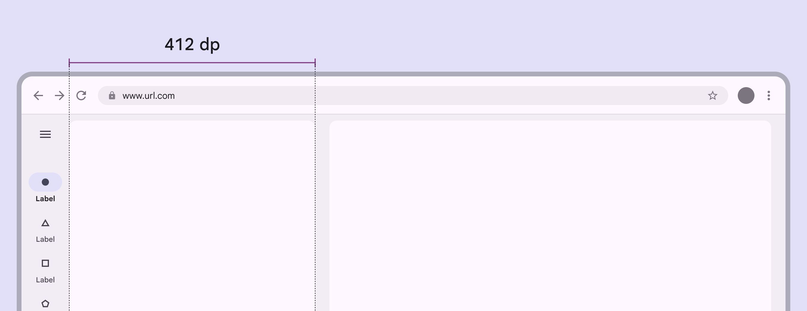
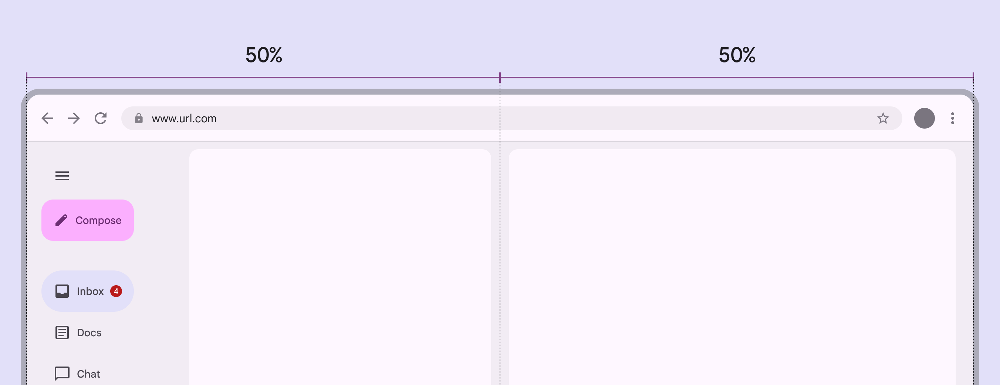
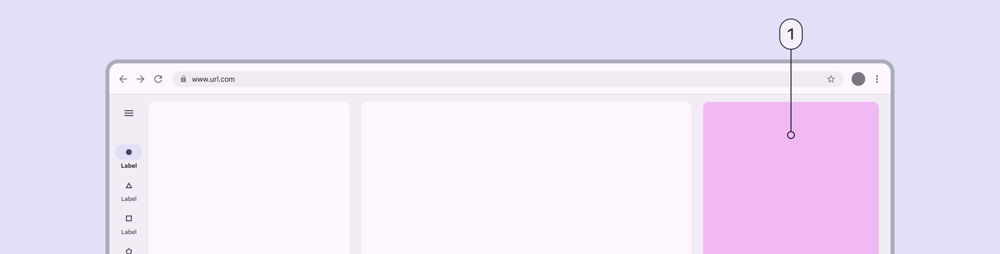
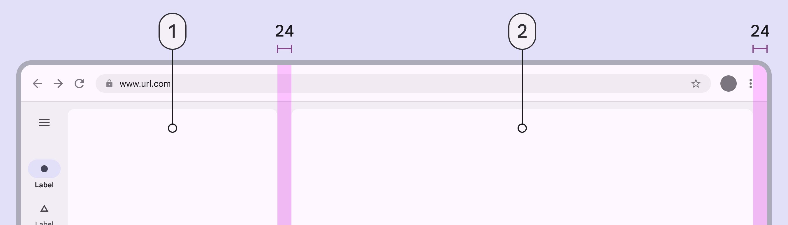
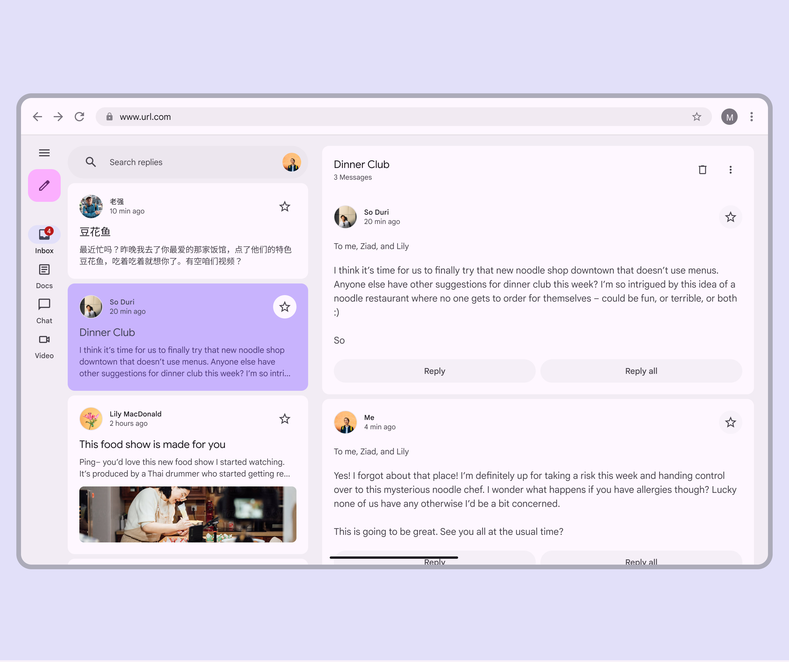

# Applying layout

Source: https://m3.material.io/foundations/layout/applying-layout/large-extra-large

Layouts for large window size classes are for screen widths from 1200dp to 1599dp.

Layouts for extra-large window size classes are for screen widths of 1600dp and larger.

These window size classes are most useful for creating web experiences tailored to laptop and desktop devices. Your product may not need large and extra-large window size classes. Consider your platform’s conventions and users when making decisions on which window size classes to design for.

*Video app on an large window size class*

## Navigation

Use a navigation rail or persistent navigation drawer, depending on the amount of body content. For sorting, filtering, or secondary navigation, use tabs or other components directly in the body.

*Navigation; Body*

A navigation drawer is best suited for extra-large windows, where there's still plenty of room for body content. Consider collapsing the navigation drawer into a navigation rail when space is needed, or when on pages deeper in the page hierarchy.

*Navigation; Body*

## Body pane

A two-pane layout is often best for large and extra-large window sizes. However, a single pane layout can work when displaying visually dense or information dense content, such as videos.

*Use a single pane layout for dense content or media*

When using a fixed and flexible layout, the fixed pane should have a width of 412dp by default.

*Fixed panes should be 412dp in large and extra large windows*

When using a split-pane layout, the spacer should be visually centered by default, even when using a navigation drawer.

*In split-pane layouts, navigation components should shrink the left pane so the spacer remains centered*

## Additional panes

The extra-large window size class supports using a standard side sheet as a third pane. When the side sheet is present, the navigation drawer can remain visible, collapse into a navigation rail, or hide completely. Don't use more than three panes. Note: Fixed panes in this window size are recommended to be 412dp, but side sheets have a default maximum width of 400dp.

*Standard side sheet (third pane)*

## Spacing

Large and extra-large layouts have a left and right margin of 24dp.

The spacer between panes is 24dp.

## Special considerations

Large and extra-large layouts will need to transition dynamically to a smaller layout when:

- The app goes from full-screen to split-screen
- Multi-window mode is initiated
- A free-form window is resized

Special attention to typographic elements such as [line length](https://m3.material.io/m3/pages/typography/applying-type) to ensure readability must be considered on large and extra-large layouts.

