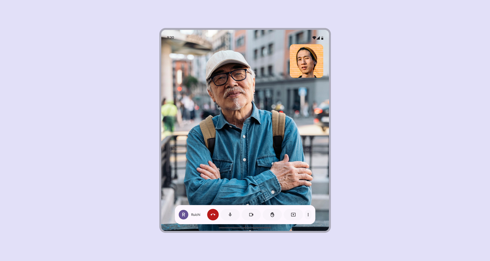
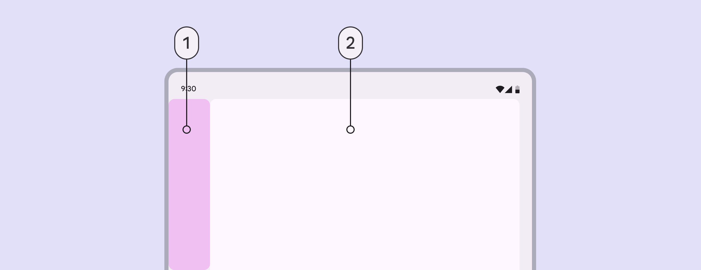
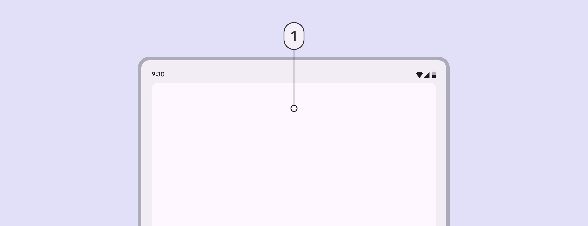
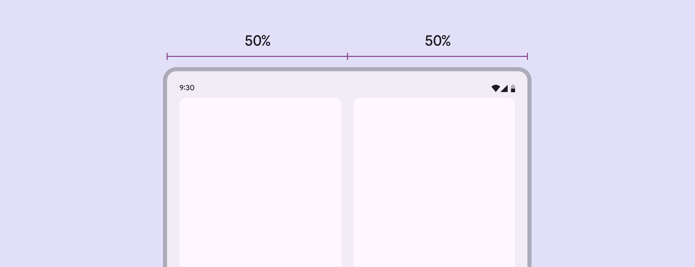
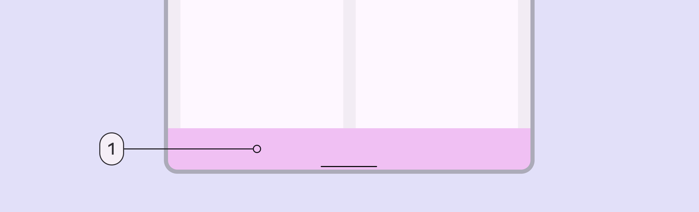
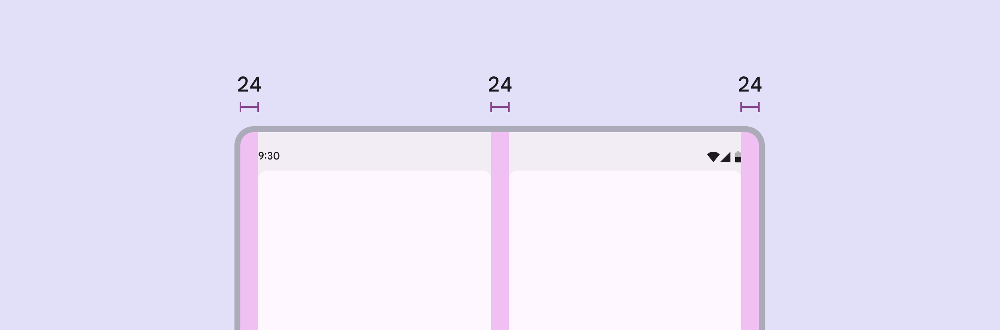
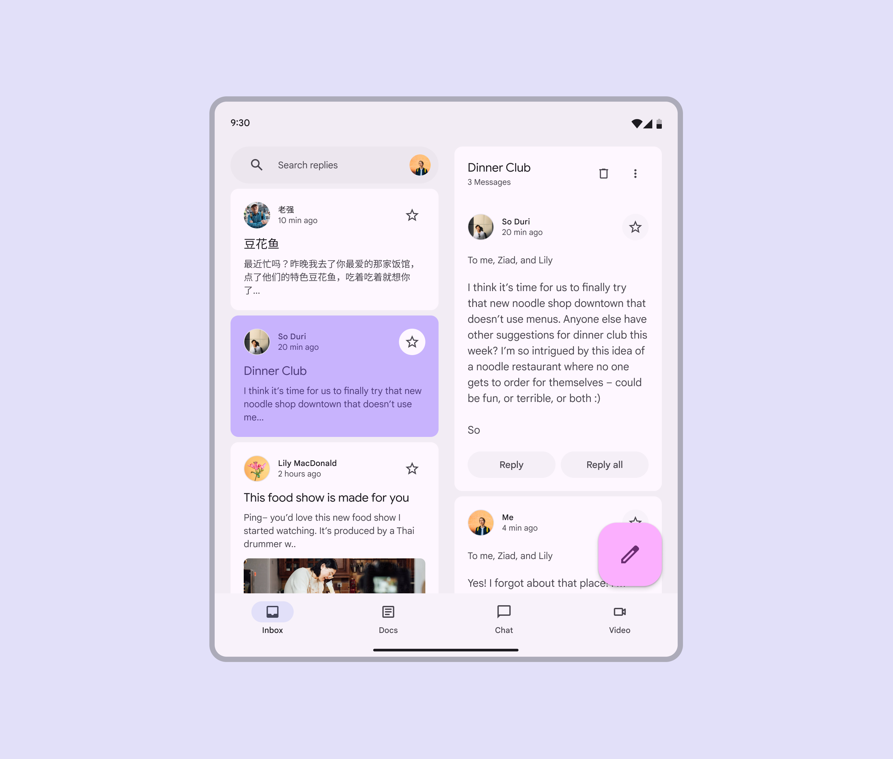
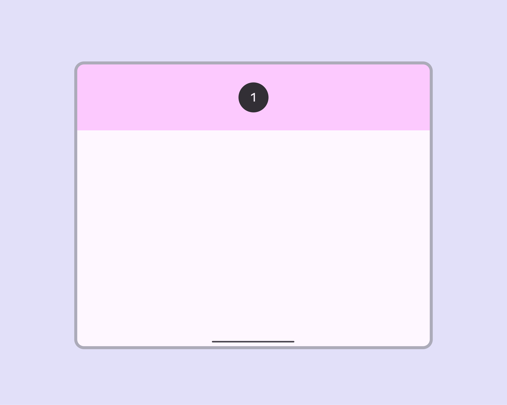
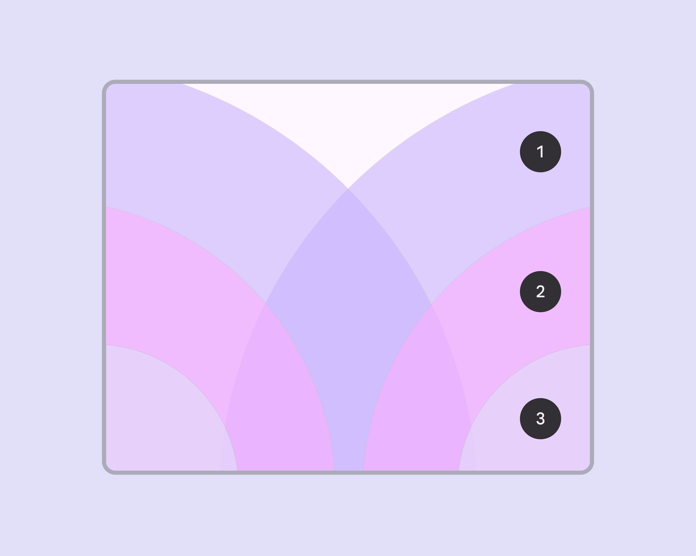

# Applying layout

Source: https://m3.material.io/foundations/layout/applying-layout/medium

Layouts for medium window size classes are for screen widths from 600dp to 839dp.

*Video call app in a medium window size class*

## Navigation

Place navigation components close to edges of the window where they’re easier to reach.

Use a navigation rail or modal navigation drawer for single-pane layouts. Use a navigation bar for two-pane layouts.

The navigation rail can be hidden in secondary destinations as long as the primary destination can still be accessed using a back button.

*Navigation area; Body area*

## Body region

A single pane layout is recommended because of limited screen width. However, a two-pane layout is possible for content with lower information density, such as a settings screen.

*1. Single pane layout*

Each pane in a two-pane layouts should take up 50% of the window width. Avoid setting custom widths. A drag handle can be used to expand or collapse panes to be 100% of the window width.

*Two-pane layout*

When adding navigation to a two-pane layout, use a navigation bar or a modal navigation drawer. This allows the panes to fully use the available window width.

*Navigation bar*

## Spacing

Medium layouts have margins of 24dp.

The spacer between panes is also 24dp.

*Margins and spacer are 24dp*

## Special considerations

A medium layout will need to transition dynamically to a compact or expanded layout when:

- A foldable device is folded
- A tablet is rotated from portrait to landscape
- The app goes from full-screen to split-screen
- Multi-window mode is initiated
- A free-form window is resized

*Email app in a medium layout*

### Reachability

For horizontal tablets and unfolded foldables, the top 25% of the screen is likely out of reach, unless the grip is adjusted. To accommodate device and hand sizes, limit the amount of interactions that are placed in the upper 25% of the screen.

Additionally, avoid placing essential interactive elements too close to the bottom edge of the screen. Some users, particularly those with larger hands, might struggle to reach this area.

*Limit interactions in the upper quarter of the screen (1). The top 25% of the screen can be hard to reach.*

Specify interactions in a layout with these ergonomic regions in mind:

1. Users can reach this area by extending their fingers, which makes it inconvenient
2. Users can reach this area comfortably
3. Reaching this area is challenging when holding the device

*Placing critical and frequently used elements close to the screen's bottom edge and corners makes them harder to reach*
