# Applying layout

Source: https://m3.material.io/foundations/layout/applying-layout/pane-layouts

## Choosing a pane layout

All layouts are made up of 1–3 panes. The type of layout and amount of panes you choose should depend on the window size class (Window size classes are opinionated breakpoints where layouts need to change to optimize for available space, device conventions, and ergonomics. [More on window size classes](https://m3.material.io/m3/pages/applying-layout/window-size-classes)) and the type of product being built.

| Window size | Recommended pane total | Other pane totals |
| --- | --- | --- |
| Compact | 1 | -- |
| Medium | 1 | 2 |
| Expanded | 2 | 1 |
| Large | 2 | 1 |
| Extra-large | 2 | 1, 3 |

Panes can be:

- Fixed: Width doesn’t change based on available space
- Flexible: Responsive to available space, and can grow and shrink

All layouts need at least one flexible pane.

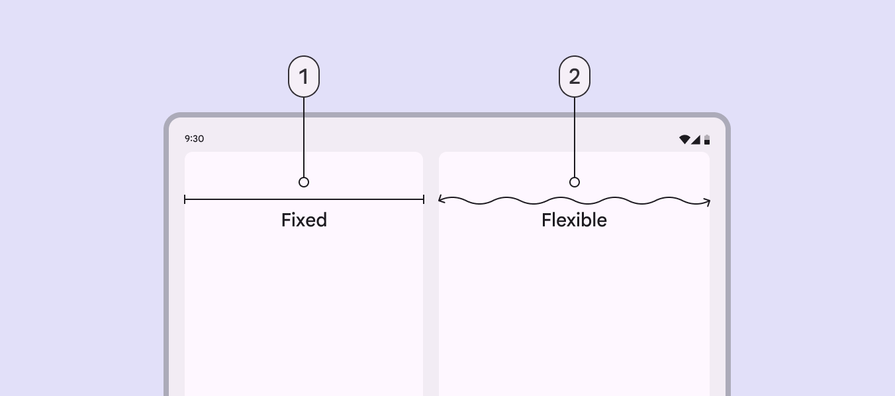

*Fixed pane; Flexible pane*

Panes can be permanent or temporary. Temporary panes can appear and be dismissed when necessary, affecting the layout and size of other panes.

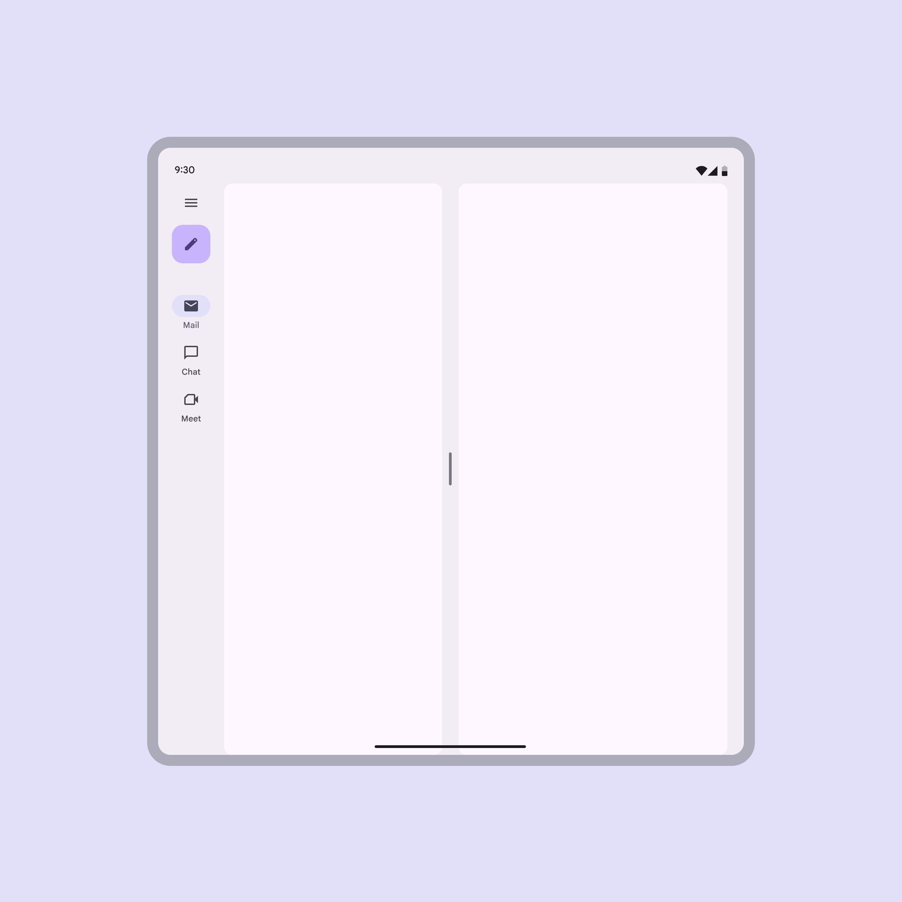

*Panes can be displayed permanently side by side*

[Video: Right pane with a close button being dismissed. The left pane fills the available space.](assets/asset-003-temporary-panes-can-be-dismissed-4f15c4363c.webp)

*Temporary panes can be dismissed*

### Single-pane layouts

Single-pane layouts use one flexible pane that extends to the available space in a layout’s width. They can be used in any window size, but are recommended for compact and medium window sizes.

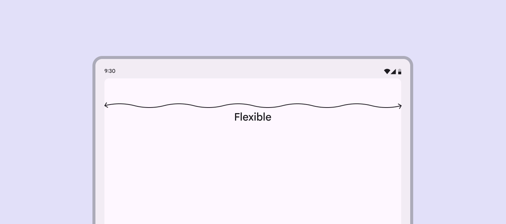

*A single flexible pane adapts to any window size*

### Two-pane layouts

#### Split-pane layout

A split-pane layout keeps the spacer visually centered. It’s best for foldable devices and dynamic layouts.

When a navigation rail or drawer is present, it only reduces the size of one pane. The other pane remains at 50% of the window width.

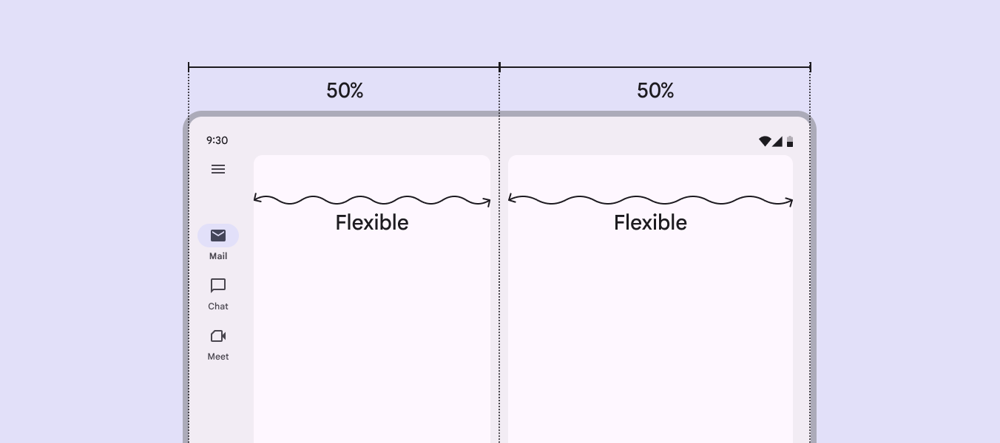

*The navigation and first pane are 50% of the window width to keep the spacer visually centered*

With a navigation bar, or no navigation, both panes span 50% of the window width by default.

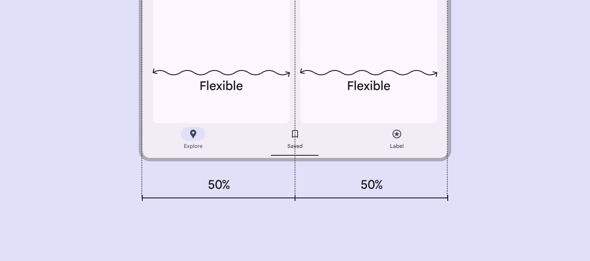

*With no navigation rail visible, split-pane layouts set each pane to 50% width by default*

#### Fixed and flexible layout

This layout is common for expanded, large, and extra-large windows. The fixed and flexible panes can appear in whichever order is best for the content.

The fixed pane is often temporary, and used for side sheets or lists with light information density.

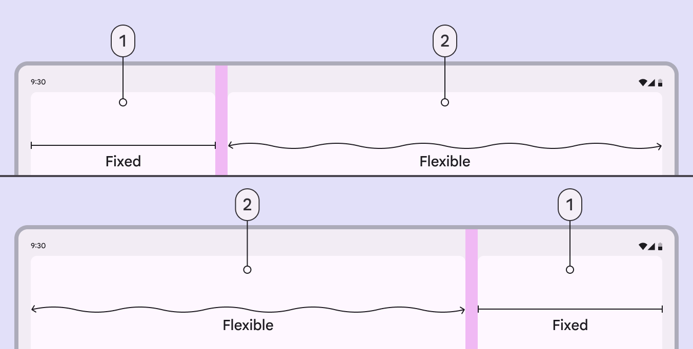

*Fixed pane; Flexible pane*

### Three-pane layouts

While less common, the extra-large window size class supports using a standard side sheet (Standard side sheets display content without blocking access to the screen’s primary content, such as an audio player at the side of a music app. They're often used in medium and expanded window sizes like tablet or desktop. [More on side sheets](https://m3.material.io/m3/pages/side-sheets/overview)) as a third pane. When the side sheet is present, the navigation drawer can remain visible, collapse into a navigation rail, or hide completely. Don't use more than three panes. Note: Fixed panes in this window size are recommended to be 412dp, but side sheets have a default maximum width of 400dp.

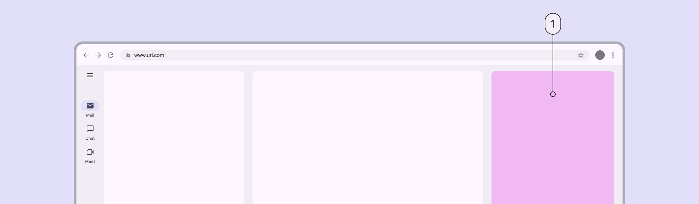

*Standard side sheet as a third pane*

## Pane expansion & resizing

Panes can be resized, expanded, and collapsed using drag handles (A drag handle adjusts the layout when there are 2 or more panes. [More on drag handles](https://m3.material.io/m3/pages/understanding-layout/parts-of-layout/#0fd40797-ced0-4554-bddf-790de7b94d72)).

- In split-pane layouts, both flexible panes can be freely adjusted, or can snap to certain widths.
- In fixed and flexible layouts, the drag handle can fully collapse and expand the fixed pane. This makes it easy to switch between a single-pane and two-pane layout.

The drag handle should also toggle between layout sizes when selected. This can be a tap, double tap, or long press.

[Video: A drag handle is used to collapse a two pane layout into a single-pane layout.](assets/asset-009-drag-handles-can-adjust-pane-size-in-a-9daeb8c5e0.webp)

*Drag handles can adjust pane size in a list-detail layout*

In expanded, large, and extra-large window sizes, two-pane layouts can be customized to snap to set widths when resized.

The recommended custom widths are:

- 360dp
- 412dp
- Split-pane with spacer centered visually

[Video: A drag handle adjusts the panes to common custom widths.](assets/asset-010-panes-can-snap-to-custom-widths-when-releasing-786b6da708.webp)

*Panes can snap to custom widths when releasing the drag handle*

### Persistent pane resizing

The persistent resizing behavior remembers the user's pane width preference. Use this for most resizable layouts.

[Video: Resizing the panes and then resetting the app preserves the set width.](assets/asset-011-pane-widths-persist-even-after-a-user-closes-a7552eda75.webp)

*Pane widths persist even after a user closes the app*

The width persists even after a window size class change. This means that if a two-pane layout is collapsed to one pane at any window size, it will remain collapsed even when changing window sizes.

[Video: Resizing the panes and then rotating a tablet back and forth preserves the set width.](assets/asset-012-when-a-two-pane-layout-is-resized-to-4f032b95ad.webp)

*When a two-pane layout is resized to a single full-width pane, that pane should remain at full-width after switching window sizes*

### Temporary pane resizing

The temporary resizing behavior doesn't remember user preferences for pane width. This is primarily used in supporting pane layouts where resizing is uncommon.

[Video: Resizing the panes and then closing the second pane resets the set width when expanded again.](assets/asset-013-supporting-pane-layouts-can-have-a-pane-drag-5c7f497b3d.webp)

*Supporting pane layouts can have a pane drag handle to temporarily resize the secondary content*

With temporary resizing, panes should always return to the default layout after the pane or app is closed and reopened. This ensures content is a suitable size for most interactions.

[Video: Layouts with temporary resizing reset any custom widths to the default.](assets/asset-014-the-pane-width-can-be-adjusted-using-the-c840e058ca.webp)

*The pane width can be adjusted using the drag handle*

## Displaying multiple panes

There are three ways that multiple panes can be displayed in a layout: co-planar, floating, or docked. Choose the method best for each window size class.

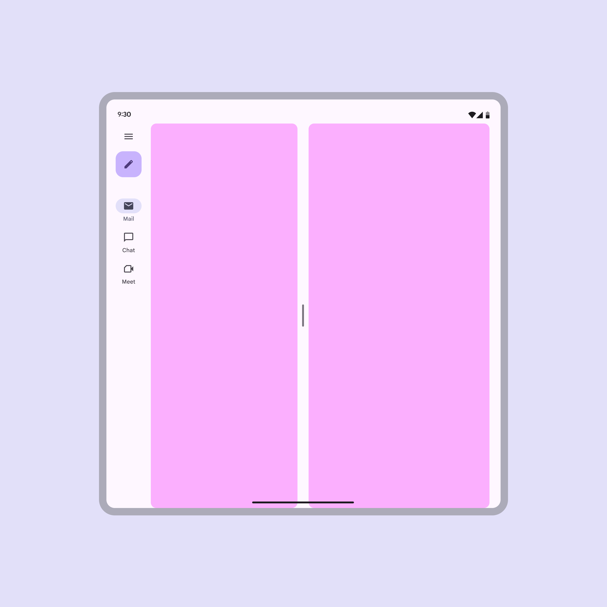

*Co-planar: Panes are displayed side by side*

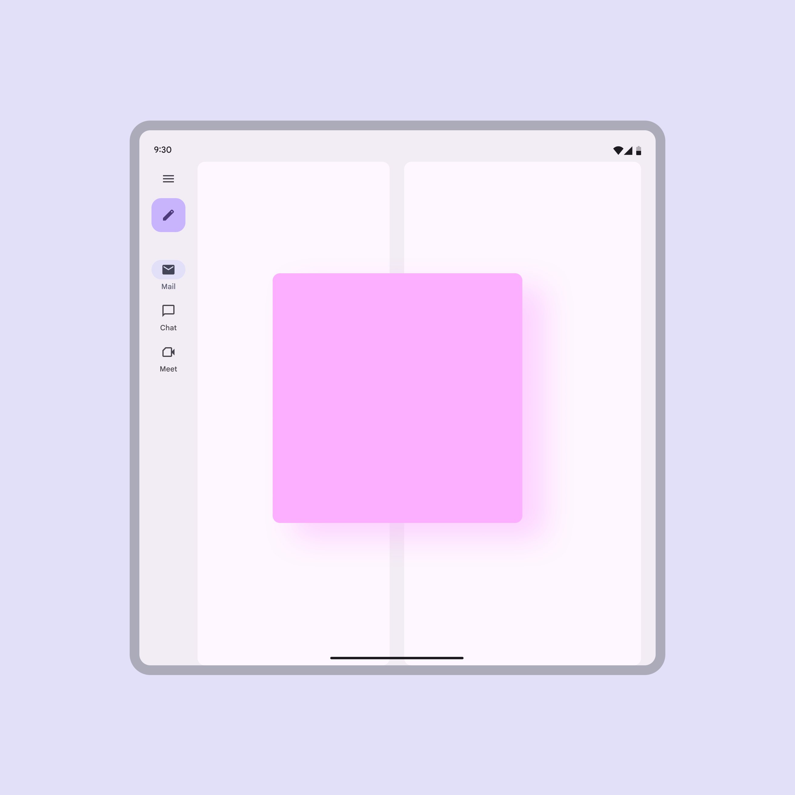

*Floating: A pane is displayed above other panes or content, like a dialog*

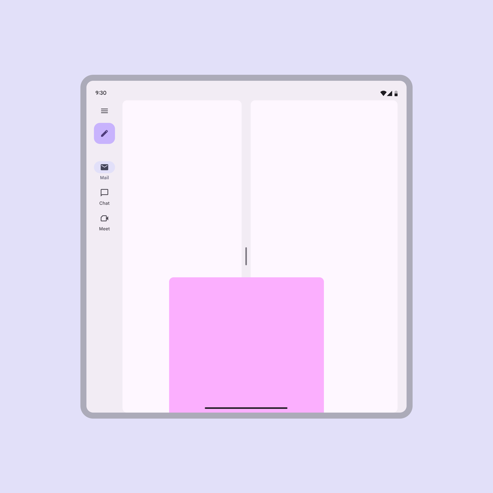

*Docked: A pane is displayed above other panes and one of its edges extends beyond one side of the screen, like a bottom sheet*

## How panes adapt

Pane layouts can adapt using three strategies: show and hide, levitate, or reflow. When the window is resized or changes orientation, these strategies allow panes to reorganize themselves to preserve context and meaning.

### Show and hide

As the window size changes, panes can enter and exit the screen or appear next to one another.

[Video: One pane animates off-screen when the device changes orientation](assets/asset-018-a-pane-can-be-shown-or-hidden-depending-8c81f8508a.webp)

*A pane can be shown or hidden depending on the available window space*

### Levitate

Panes can be elevated above other content as floating or docked panes. This strategy helps panes appear relative to their triggers.

Floating panes appear in front of the body content, and can be customized to be dragged or resized. When adding controls that resize or move a floating pane, provide [accessible controls](https://m3.material.io/m3/pages/understanding-layout/parts-of-layout#c4619e07-cfc6-4d91-a724-0646126e3911).

[Video: One pane floats on top of the other when the device changes orientation](assets/asset-019-a-co-planar-pane-can-float-when-switching-a3c4f6df1d.webp)

*A co-planar pane can float when switching window size classes*

On large screens, the scrim behind a floating pane is optional.

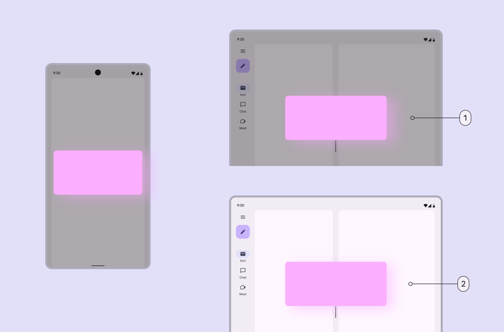

*Floating pane with a scrim; Floating pane without a scrim*

Docked panes are usually at the bottom of the window, like a bottom sheet (Bottom sheets show secondary content anchored to the bottom of the screen. [More on bottom sheets](https://m3.material.io/m3/pages/bottom-sheets/overview)).

In medium and expanded window sizes, docked panes can adapt into floating panes.

[Video: A docked pane on mobile turning into a floating pane on desktop.](assets/asset-021-a-docked-pane-can-adapt-into-a-floating-9a65c80d86.webp)

*A docked pane can adapt into a floating pane*

Alternatively, in medium and expanded window sizes, a docked pane can adapt into a co-planar pane.

[Video: A docked pane on the lower half of the screen changes to a co-planar pane in large screen.](assets/asset-022-a-docked-pane-can-adapt-into-a-co-19f853fe69.webp)

*A docked pane can adapt into a co-planar pane*

On large screens, docked panes can remain docked or become co-planar.

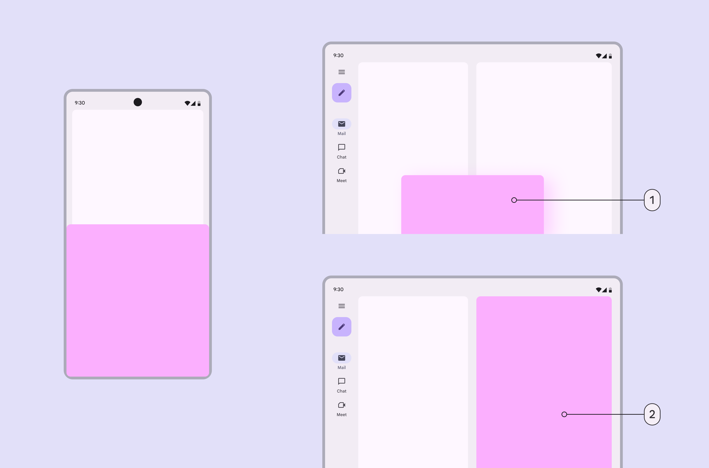

*Docked pane; Co-planar pane*

### Reflow

Panes can be reorganized on screen as the window size or orientation changes, also known as reflow. For example, in a vertical orientation, the supporting pane can move underneath the primary pane.

[Video: A supporting pane changes orientation and location as the screen changes orientation.](assets/asset-024-in-a-vertical-orientation-the-supporting-pane-can-2823ff0efa.webp)

*In a vertical orientation, the supporting pane can move below the primary pane*

Reflow also applies to window sizes. When there’s not enough horizontal space for panes, they can stack vertically instead.

[Video: A supporting pane on the right side of a large horizontal screen moves to the bottom of a vertical small screen.](assets/asset-025-panes-can-change-size-location-and-orientation-when-faf11fefdb.webp)

*Panes can change size, location, and orientation when switching screen sizes*

## Spatial panels

On XR devices, pane layouts can be presented in disconnected spatial panels (In Android XR, a spatial panel is a container for UI elements, interactive components, and immersive content. [More on spatial panels](https://developer.android.com/design/ui/xr/guides/spatial-ui#spatial-panels)). These panels must have clear containment to make them easy to see on any background.

The content in a spatial pane may use implicit grouping (Implicit grouping uses close proximity and open space to group related items.) when the pane has an explicit container to distinguish it from the environment.

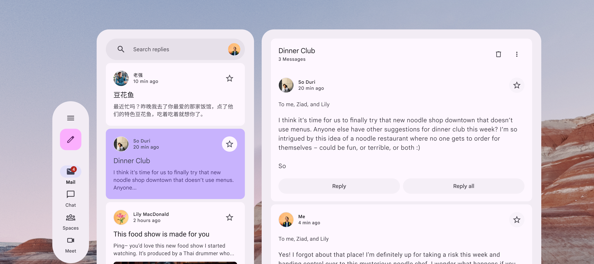

*When the pane uses explicit containment, content can use implicit grouping*

## Accessibility considerations

Coplanar panes

- For coplanar panes, the focus order matches the visual arrangement of the panes on the screen.

Floating

- A modal floating pane disappears when a user interacts with something behind it. When a modal pane is active the elements behind it can’t be interacted with. When a floating pane is modal, focus moves automatically to the first element in the pane, and when the pane is closed, focus moves back to the element that triggered it, like a dialog. If the modal pane was triggered automatically, focus should still move to it, but when it is closed, focus should go to the next most logical element on the screen.
- When a non-modal floating pane is open, other parts of the application can be interacted with. For non-modal panes, focus should be able to move to and from the pane, and the pane should also be available in a logical reading order of the screen.

Docked

- Docked panes have the same focus requirements as modal and non-modal panes. The focus order should match the visual arrangement of panes.
