# Applying layout

Source: https://m3.material.io/foundations/layout/applying-layout/window-size-classes

Devices of different sizes and orientations need different layouts. For example, a newspaper app might have a single column of text on a mobile device, but display several columns on a larger desktop device. This change in layout takes advantage of device capabilities and user expectations.

## Window size classes

A window size class is an opinionated breakpoint, the window size at which a layout needs to change to match available space, device conventions, and ergonomics.

All devices fall into one of five Material Design window size classes: compact, medium, expanded, large, or extra-large. Material window size classes are used on Android and Web.

Rather than designing for an ever increasing number of display states, focusing on window size classes sizes ensures layouts work across a range of devices.

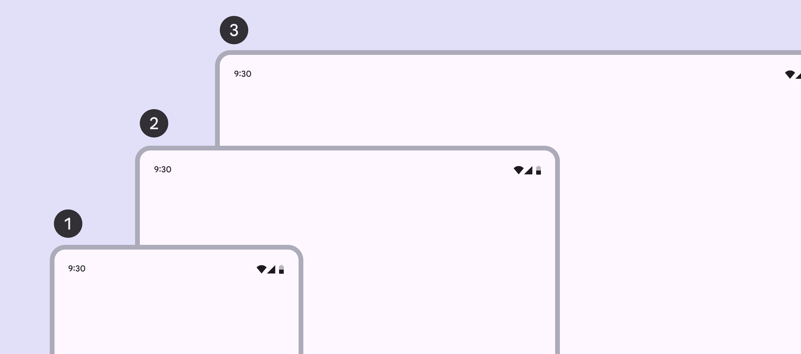

*Compact; Medium; Expanded*

Design for window size classes instead of specific devices because:

- The amount of available window space is dynamic and changes based on user behavior, such as multi-window modes or unfolding a foldable device.
- Devices fall into different window size classes based on orientation.

| Window size class (width) | Width breakpoint (dp) | Common devices |
| --- | --- | --- |
| Compact | Under 600dp | Phone in portrait |
| Medium | 600–839dp | Tablet in portrait Foldable in portrait (unfolded) |
| Expanded | 840–1199dp | Phone in landscape Tablet in landscape Foldable in landscape (unfolded) Desktop |

Large and extra-large window size classes are used on devices like laptops, desktops, and external monitors. These window size classes are supported on MDC-Android. [More on MDC-Android window size classes](https://developer.android.com/develop/ui/views/layout/use-window-size-classes?hl=en)

Note: Large and extra-large window size classes are coming soon to Jetpack Compose.

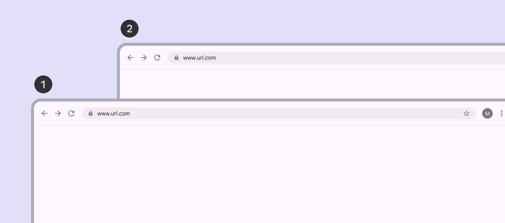

*Large; Extra-large*

| Window size class (width) | Width breakpoint (dp) | Common devices |
| --- | --- | --- |
| Large | 1200–1599dp | Desktop |
| Extra-large | 1600+dp | Desktop Ultra-wide monitors |

### Height window size classes

On Android, compact, medium, and expanded window size classes are also available for [height](https://developer.android.com/guide/topics/large-screens/support-different-screen-sizes#window_size_classes). These can be used to adjust the layout when available vertical space is unusually small or large.

However, since most layouts contain vertically scrolling content, it's rare that layouts need to adjust to available height.

## Designing across window sizes

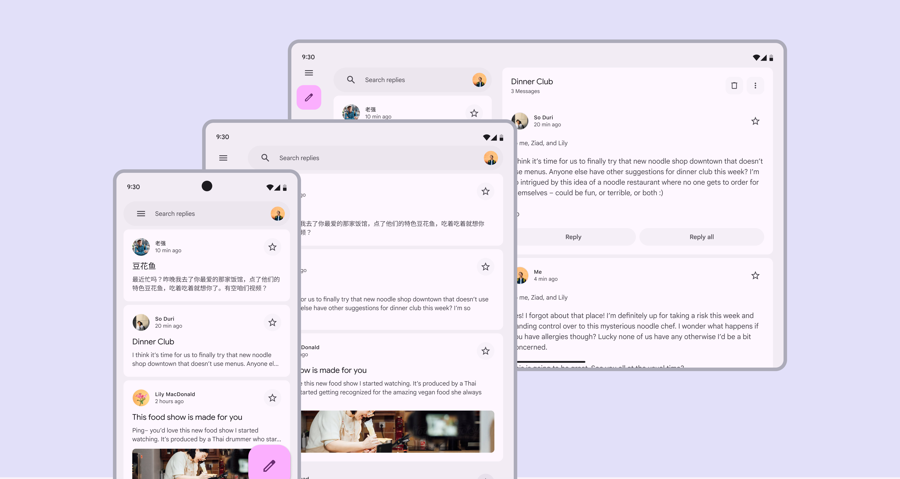

*Email app shown in the three window classes: compact, medium, and expanded*

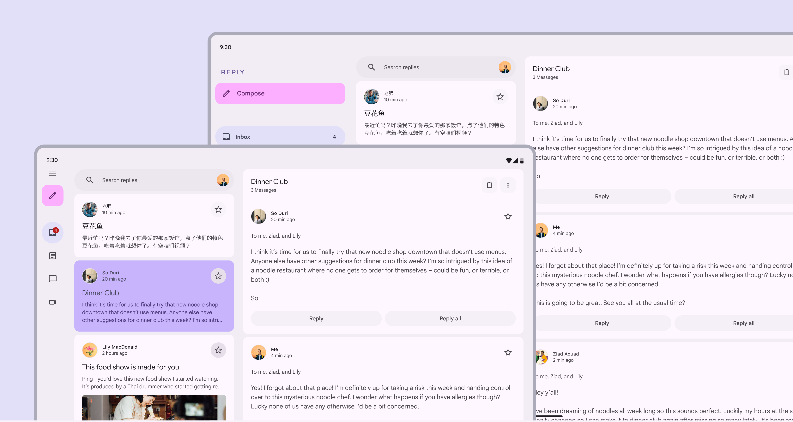

*Email app shown in large and extra-large window classes*

Each product view should have a layout represented for each of the window size classes most appropriate for your platform and users.

Different components are recommended for performing the same function across the five layouts.

| Window size | Panes | Navigation | Communication | Action |
| --- | --- | --- | --- | --- |
| Compact | 1 | Navigation bar, modal expanded navigation rail | Simple dialogFullscreen dialog | Bottom sheet |
| Medium | 1 (recommended) or 2 | Navigation bar, Modal expanded navigation rail | Simple dialog | Menu |
| Expanded | 1 or 2 (recommended) | Modal or standard expanded navigation rail | Simple dialog | Menu |
| Large | 1 or 2 (recommended) | Modal or standard expanded navigation rail | Simple dialog | Menu |
| Extra-large | 1 to 3 (recommended) | Modal or standard expanded navigation rail | Simple dialog | Menu |

Start by designing for one window class size and then adjust your layout for the next class size by asking yourself the five questions below:

### 1. What should be revealed?

Parts of the UI that are hidden on smaller screens can be revealed in medium, expanded, large, and extra-large layouts.

For example, on a compact device the navigation drawer is collapsed by default and accessed via a menu button; on an expanded device, such as a large tablet or laptop, the navigation drawer can be open by default to reveal more actions and features.

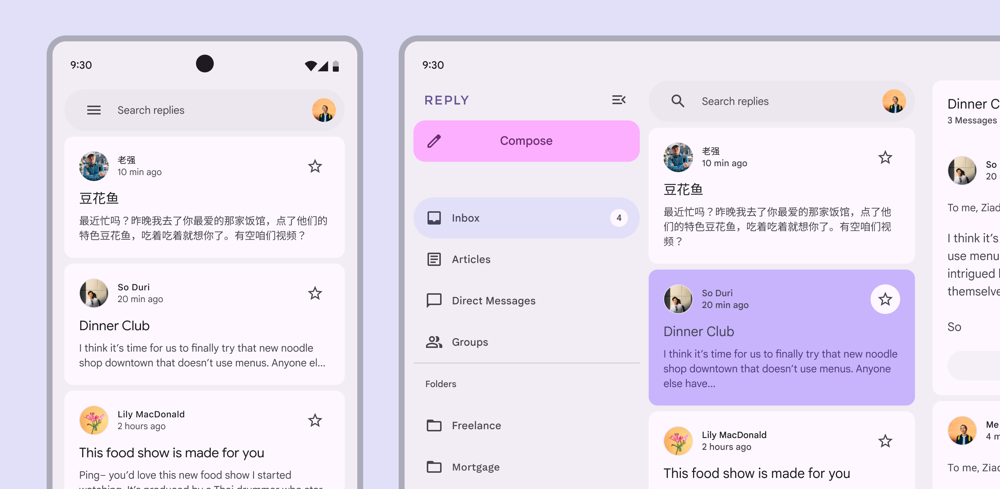

*An email app’s navigation drawer is revealed in the expanded window size class*

The same can be true for revealing additional [panes](https://m3.material.io/m3/pages/understanding-layout/parts-of-layout), such as when an expanded device has room to simultaneously display an inbox pane and a pane containing a selected email. Additional real-estate doesn’t just mean making the same thing bigger.

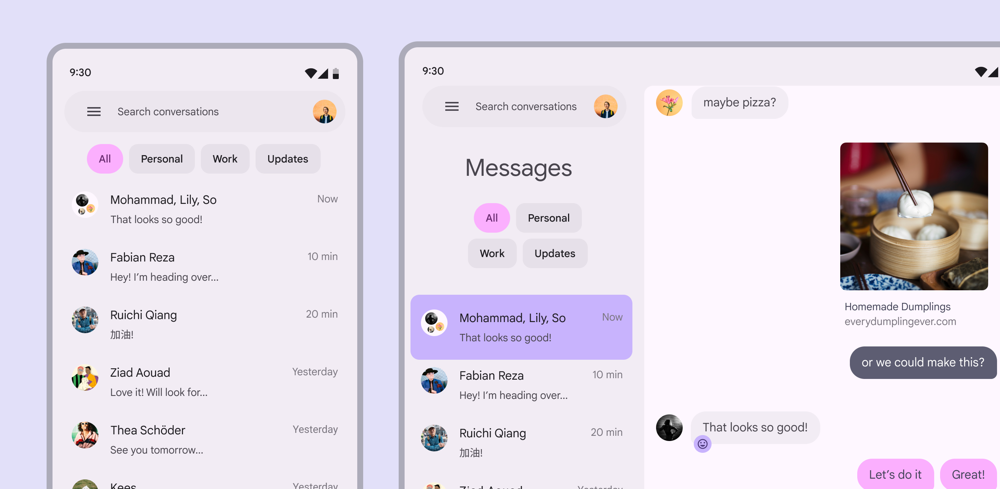

*An expanded layout for this messaging app reveals a second pane showing message threads*

### 2. How should the screen be divided?

When dividing the screen into layout [panes](https://m3.material.io/m3/pages/understanding-layout/parts-of-layout), consider the window size class.

Compositions using a single pane work best on compact and medium window size classes while two panes work best for the expanded, large, and extra-large window size classes.

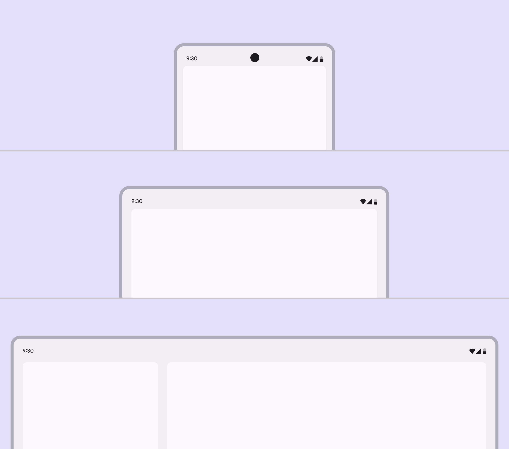

*Rough layout areas across three window class sizes*

Also consider content and interaction needs.

For example, two panes are possible in the medium window class but might not result in the most usable experience. Complex list items can make it hard to comfortably view content across two compressed panes.

However, lower density content that benefits from quick navigation between items might work well.

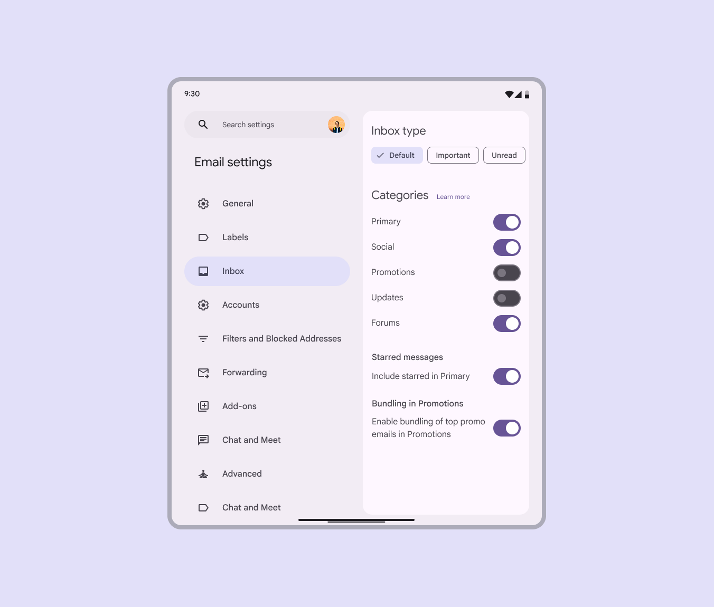

*A settings view offering quick navigation and actions is a good use of two panes in a medium layout*

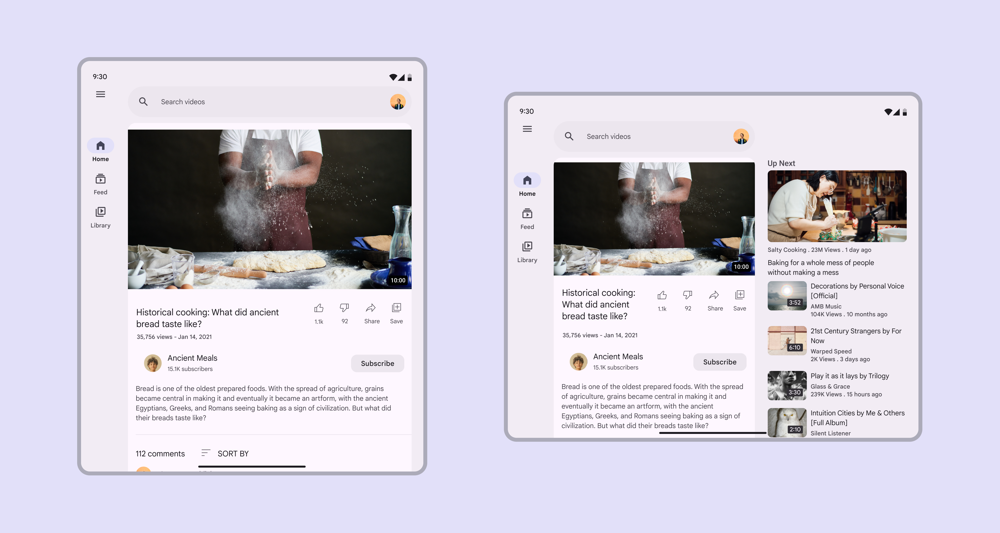

*Rotating a device often changes the window class. A two-pane layout for an expanded window size class may need to adapt to a one-pane layout for medium or compact window size classes.*

Single-pane layouts can create focus attention on one action or view, creating a distraction-free environment for a specific goal such as:

- Playing a game
- Watching a movie
- Video calls
- Creative applications

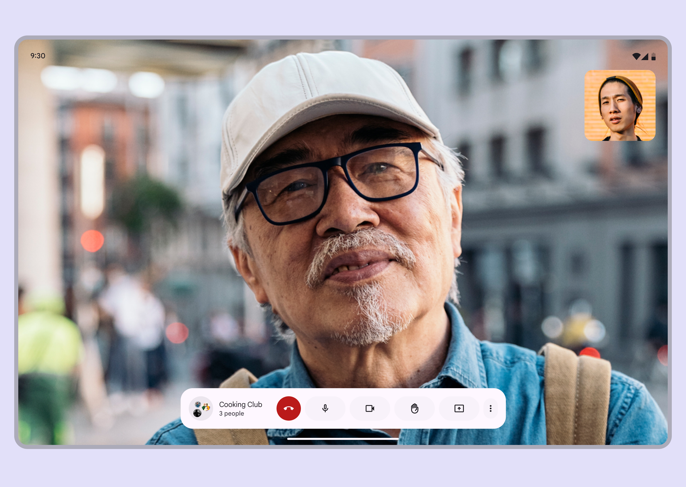

*Immersive single-pane layout for a video call*

### 3. What should be resized?

Parts of the UI that are small on compact screens can become larger on medium and expanded screens. For example, a horizontally-oriented card on a mobile device can become more square-shaped on a larger tablet. The size of a pane can also be increased on larger screens, and its elements rearranged to make better use of the space. See [What should be repositioned?](https://m3.material.io/m3/pages/applying-layout/window-size-classes#2b82eea6-5d69-4a73-a7ab-8d9296f5a26d) for more information.

Consider resizing:

- Cards
- Feeds
- Lists
- Panes

Resizing elements can give imagery more prominence or make room for larger typography styles that enhance readability. This type of adaptation affects the scale of content and objects on screen, as well as their relationship to each other. For example, a text list on a mobile device can have adjusted margins, vertical spacing, and density to better fit medium window class devices like tablets.

In every window class, the ideal line length for text is 40-60 characters. When resizing elements containing text, use margins and typographic properties like line height, font weight, and typography size to keep lines within 40-60 characters.

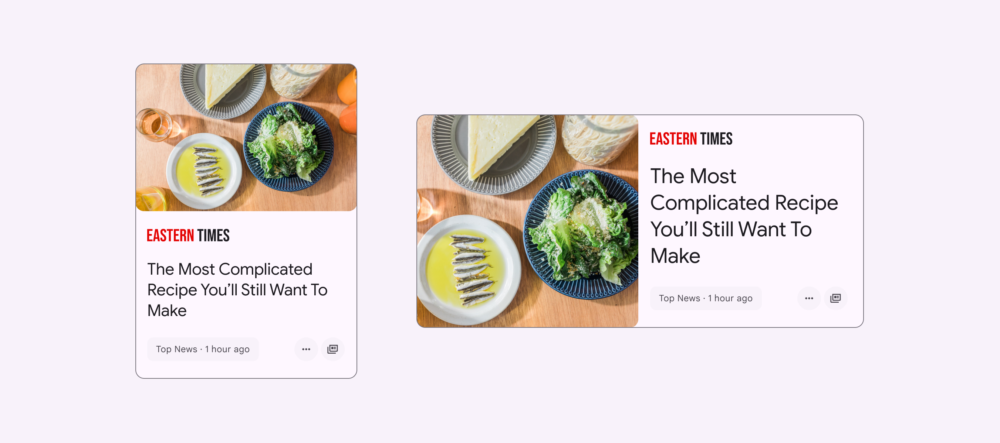

*A smaller card in a compact layout can be resized larger in a medium or expanded layout*

### 4. What should be repositioned?

A UI and its components can reflow or reposition to make use of additional space on expanded screens and in resized panes. Repositioning is also a way to match the ergonomic and input needs that change across device sizes, such as shifting actions from the bottom of a compact screen to the leading edge of medium and expanded screens. This method is similar to responsive design on the web.

Consider:

- Repositioning cards
- Adding a second column of content
- Creating a more complex layout of photos
- Introducing more negative space
- Ensuring reachability for navigation and interactive elements

Internal elements can be anchored to the left, right, or center as a parent container scales. Internal elements can also maintain fixed positions, as seen in the example of a floating action button (FAB) within a navigation drawer.

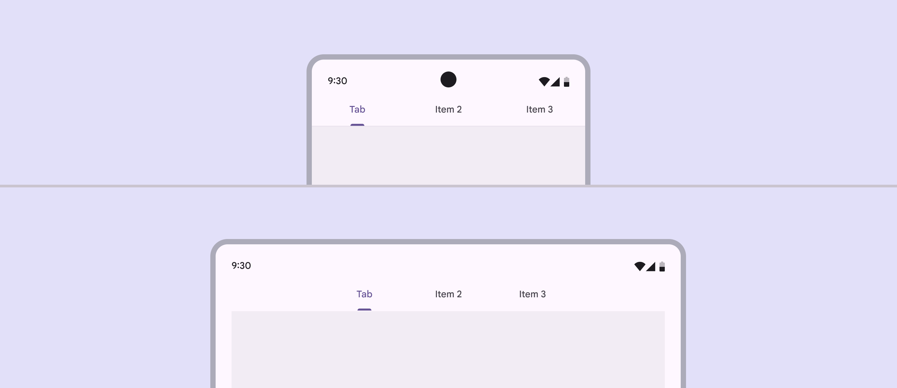

*Tabs can remain anchored to the middle of a layout in both compact and medium window class sizes*

In the case of a button, the icon and text label within the button container can remain anchored to each other, staying centered as the button container scales horizontally.

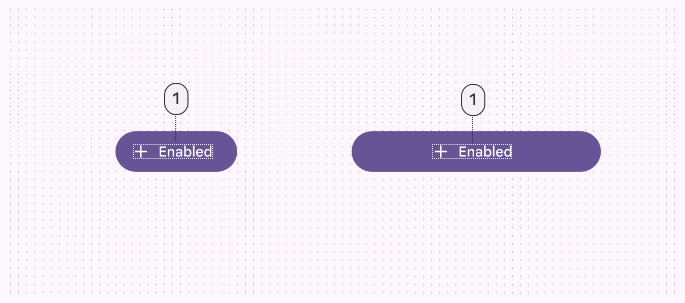

*Button icons and label text can remain anchored to each other no matter the width*

### 5. What should be swapped?

As a layout changes across window size classes, components with similar functions can also be exchanged. This makes it possible to adjust a layout for large-scale changes to the ergonomic and functional qualities of an interface. For example, a bottom navigation bar in a compact layout can be swapped with a navigation rail in a medium layout, and a navigation drawer in an expanded layout.

Use caution when swapping components by ensuring that the interchangeable components are functionally equivalent. Do not, for example, swap a button for a chip. Use caution when changing between list items and cards.

The component swap should always serve a functional and ergonomic purpose for the user.

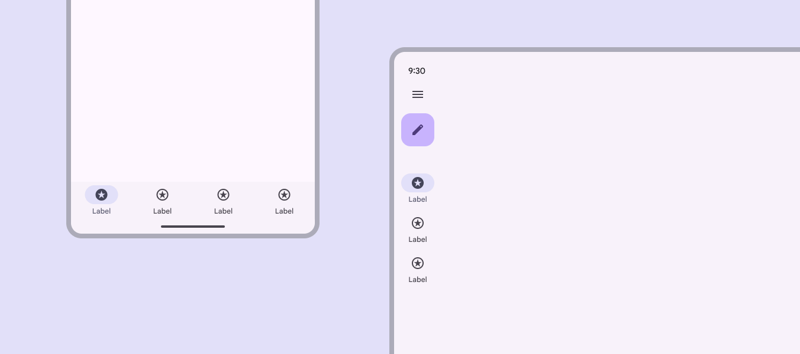

*Do Swap a navigation bar in a compact layout for a navigation rail in a medium or expanded layout*

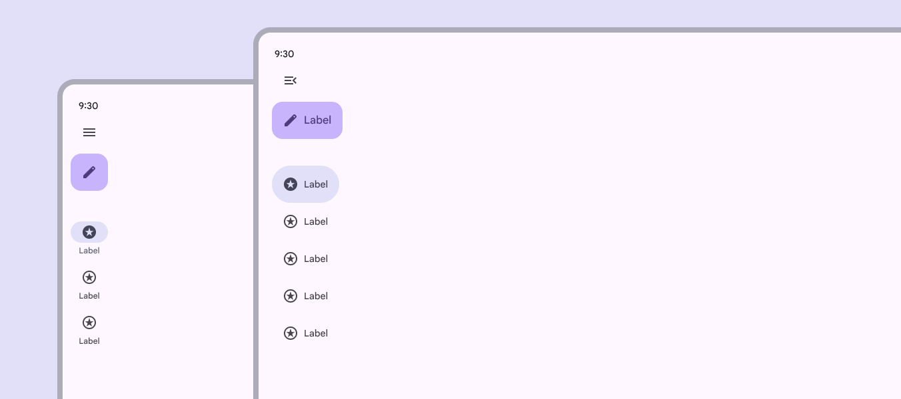

*Do A collapsed navigation rail in medium or expanded layouts can become an expanded navigation rail in large or extra-large layouts*

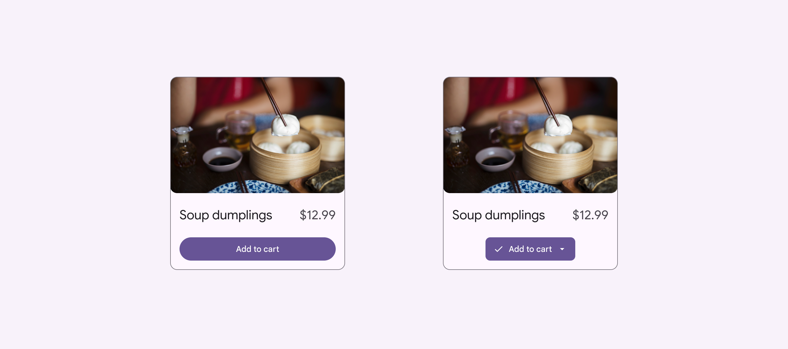

*Don’t arbitrarily swap components that aren’t functionally equivalent, such as swapping a button with a menu*

#### Common swappable components

| Component type | Compact | Medium | Expanded |
| --- | --- | --- | --- |
| Navigation | Navigation bar | Collapsed navigation rail | Collapsed navigation rail |
| Navigation | Modal expanded navigation rail | Modal expanded navigation rail | Standard expanded navigation rail |
| Communication | Simple or full-screen dialog | Simple dialog | Simple dialog |
| Supplemental selection | Bottom sheet | Menu | Menu |
