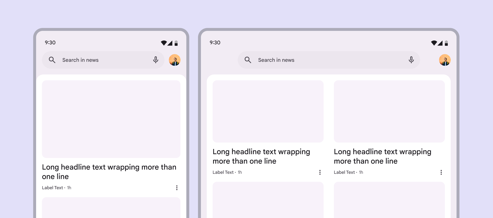
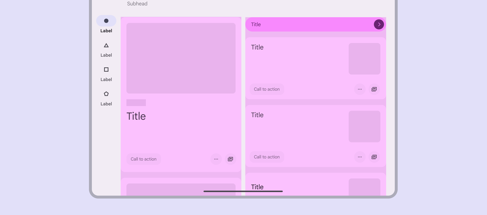
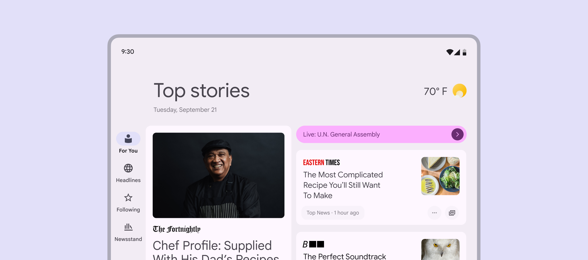
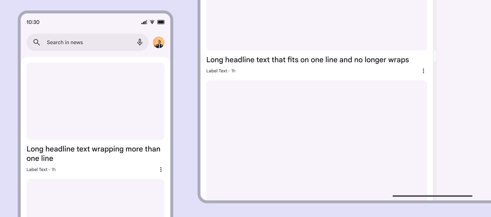
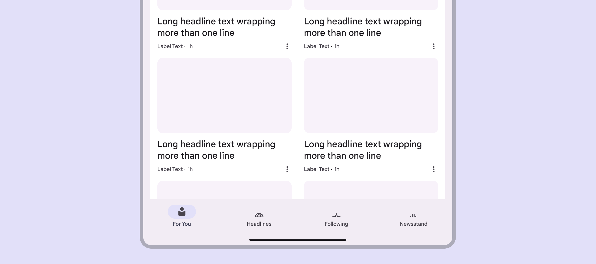
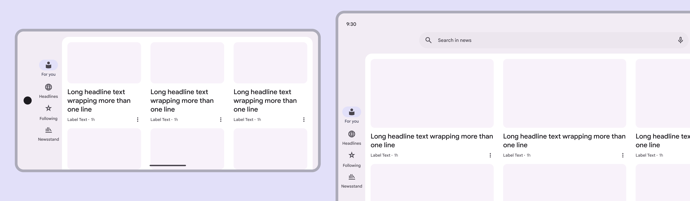

# Canonical layouts

Source: https://m3.material.io/foundations/layout/canonical-layouts/feed

A feed layout uses a grid composition to enable quick content browsing and discovery. Key use cases for the supporting pane layouts include:

- News
- Photos
- Social media

*Photo app using a feed layout*

## Usage

Use a feed layout to show different pieces of content through cards and lists. Feeds support displays of almost any size as grids can adapt from single to multi-column.

*Example news apps using a feed layout for compact and medium window size classes*

## Dividing space

A feed composition is flexible enough to allow for content with varying proportions and sizing.

*Example feed layout with two columns*

Use size and position to establish relationships among content elements. Feed items should reflow when the amount of available space changes, such as rotating or unfolding a device, or entering a multi-window mode. The order of items is determined by their position. Learn more about [cards responsive layout guidance](https://m3.material.io/m3/pages/cards/guidelines#99e8d17d-5bde-4bb9-8784-0ca403325b10).

*News app with a feed layout using two columns*

## Across window size classes

### Compact

A feed layout will stack vertically like a list of cards, with individual items taking up the width of the pane, but not necessarily the full height.

*Cards in two feed layouts for compact window size class*

### Medium

A feed layout can support components with different widths and be split across multiple columns.

*Navigation bar and cards in a feed layout for medium window size class*

### Expanded, large, and extra-large

A feed layout can support components with different widths and be split across multiple columns. The number of columns of content should usually increase for expanded window size classes.

*The number of columns increased from two to three in the expanded window size class*

## Behavior

Feed items should reflow when the amount of available space changes, such as rotating or unfolding a device, or entering a multi-window mode. The order of items is determined by their position. Learn more about [cards responsive layout guidance](https://m3.material.io/m3/pages/cards/guidelines#99e8d17d-5bde-4bb9-8784-0ca403325b10).
