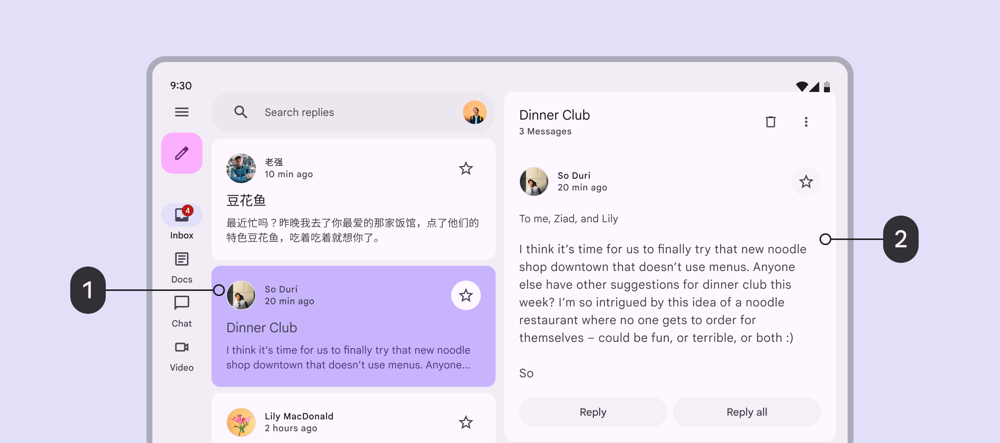
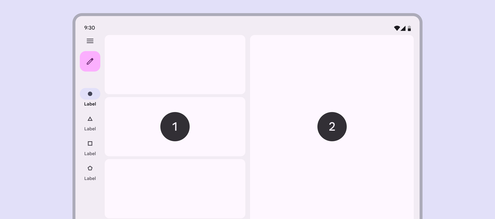
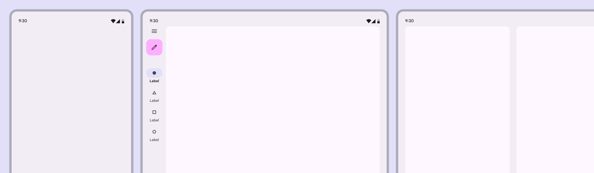
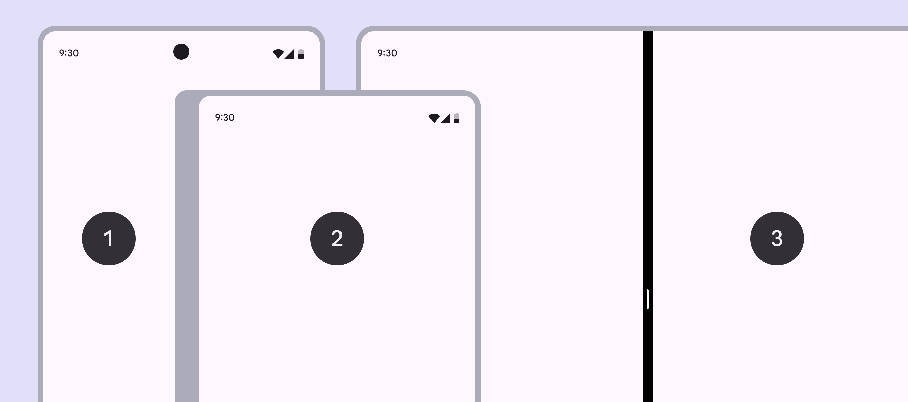
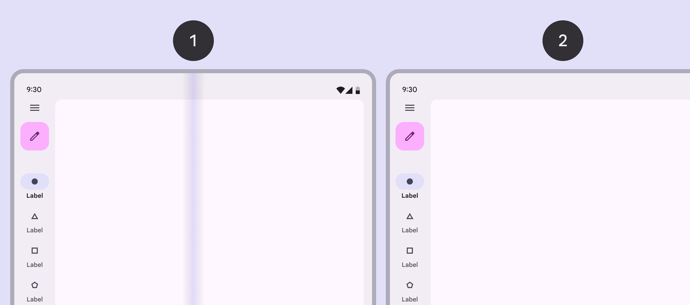
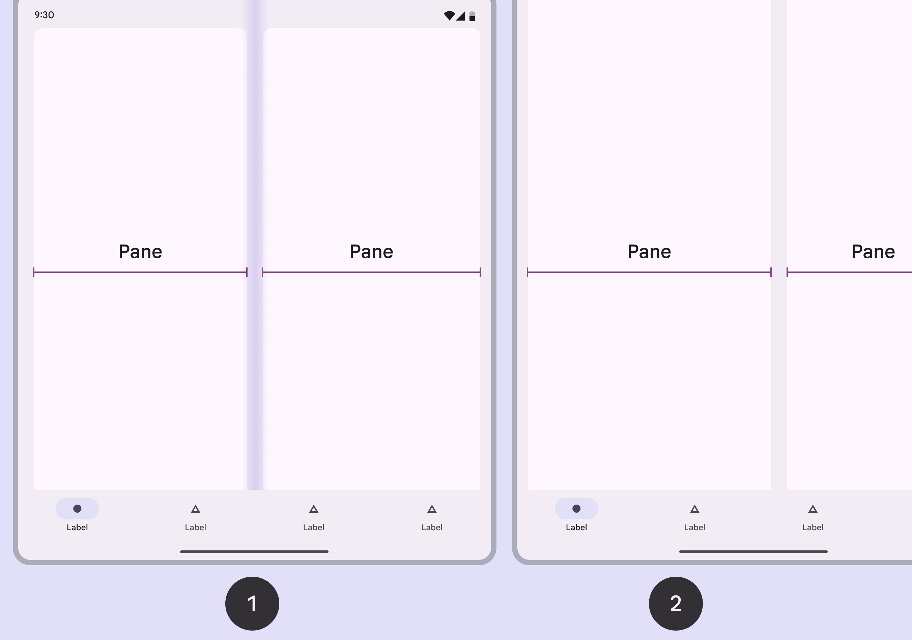
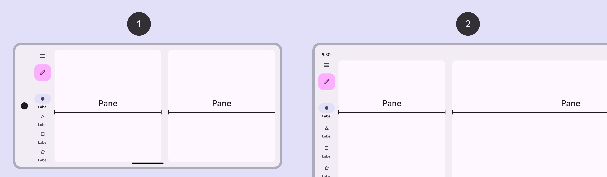
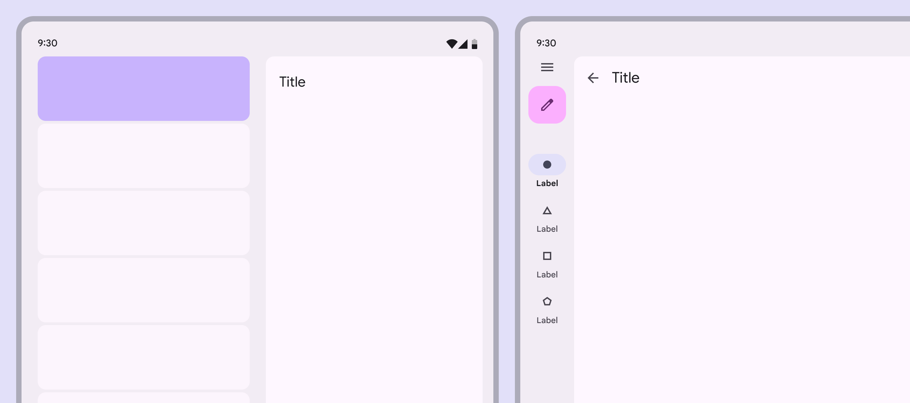

# Canonical layouts

Source: https://m3.material.io/foundations/layout/canonical-layouts/list-detail

Many layouts can be established based on the relationship of a list and a detail view.

Key use cases for this layout include parent-child pairings of information like:

- Text message + conversation
- File browser + open folder
- Musical artist + album detail
- Settings + category detail
- Email inbox + selected email

*List; Detail*

## Usage

Use the list-detail view for displaying browsable content and quickly showing details. Examples include: showing a series of conversations and a text message; browsing files and seeing their details; or browsing multiple albums and seeing individual track information in an adjacent view.

*List area; Detail area*

## Dividing space

*The most basic list-detail views for compact, medium, and expanded layouts*

A list-detail view uses two panes: one for a list or group of items and the other for a detailed view. Depending on the window class, the two panes may appear together in the same layout or across separate layouts. List-detail canonical layouts use the same pane guidance as all single and two-pane layouts, including special behavior for foldables.

| Window size class (dp) | Visible panes |
| --- | --- |
| Compact (0-599) | 1 pane |
| Medium (600-839) | 1 (recommended) or 2 panes |
| Expanded (840+) | 2 panes |
| Large (1200-1599) | 2 panes |
| Extra-large (1600+) | 2 panes |

## Across window size classes

### Compact

- Use a single-pane layout
- Only one view is visible at a time (either list or detail)

*Phone in portrait orientation; Closed foldable; Tablet in split-screen mode*

### Medium

- Use a single-pane layout for information-dense content or longer interactions

*Foldable open flat; Tablet in portrait orientation*

1. Use a two-pane layout for information-dense content, or quicker interactions
2. To avoid cramped pane widths, use a bottom navigation bar or modal navigation drawer with two-pane layouts in medium only

*Foldable open flat; Tablet in portrait orientation*

### Expanded, large, and extra-large

- Use a two-pane layout

*Phone in landscape orientation; Tablet in landscape orientation*

## Behavior

### Single vs two-pane

- Back button: Appears in detail view only for single-pane layouts
- Selected state: Appears only in list view for two-pane layouts
- Visual focus: Use [explicit and implicit grouping](https://m3.material.io/m3/pages/understanding-layout/spacing#efb4667d-f942-4019-8cd8-1fcb366e392d) to direct focus in two-pane layouts

*Navigating between list and detail views is different in each layout*

### Transitioning between layouts

The amount of available space is dynamic and changes based on user behavior, such as rotating or unfolding a device, or entering a multi-window mode.

[Video: Device rotating from landscape to portrait mode, reducing layout panes from 2 to 1.](assets/asset-009-a-two-pane-list-detail-layout-adapts-to-dfa86b92c3.webp)

*A two-pane list-detail layout adapts to a one-pane layout when the device is rotated, changing from expanded to medium window class*

#### No selected list item

The single-pane screen shows the list, and the two-pane screen shows placeholder content in the detail pane.

In some use cases, such as multi-select, the pane last interacted with should remain visible when switching back to single-pane view.

[Video: No list items are selected on a folded device. When unfolded, an empty state appears in the detail pane.](assets/asset-010-if-no-item-in-the-list-view-is-47f17cf075.webp)

*If no item in the list view is selected when a foldable is opened, the revealed pane displays an empty detail view*

Selected list item

When going from a single- to two-pane view, both panes should be shown. The selected item’s details are visible.

When going from a two- to single-pane view, the result depends on the product behavior:

- Generally, the detail pane should be shown on the single-pane view, and an app bar appears.
- However, if the product supports selected list items without navigating deeper, like multi-select, it can show the list view instead with the item selected.
- The most important rule is consistency. If the single pane showed the list view before, it should revert to the list view when going back to a single pane.

[Video: A list item is selected on a folded device. When unfolded, the item details are in the detail view.](assets/asset-011-if-an-item-in-the-list-is-selected-270210a0e7.webp)

*If an item in the list is selected when a foldable is opened, the revealed pane displays that item’s detail view*

[Video: A list item is selected on an unfolded device. When folded, only the detail view is shown.](assets/asset-012-if-an-item-in-the-list-is-selected-d08df53d18.webp)

*If an item in the list is selected when a foldable is closed, the list view is hidden and the detail view is shown in the single pane*

If no list item is selected, list pane remains visible and detail pane hides. In some use cases, such as multi-select, the pane last interacted with should remain visible.

[Video: No list item is selected on an unfolded device. When folded, only the list view is shown.](assets/asset-013-if-no-item-in-the-list-is-selected-b319e8e95a.webp)

*If no item in the list is selected when a foldable is closed, the detail view is hidden and the list view is shown in the single pane*

In most cases, a state should be saved when navigating between detail views. Detail views with read and unread content fall into this use case.

[Video: Scroll position in detail view is retained after folding and unfolding the device.](assets/asset-014-the-scroll-position-of-a-detail-view-is-5c6917083a.webp)

*The scroll position of a detail view is retained even after navigating to other list items*
