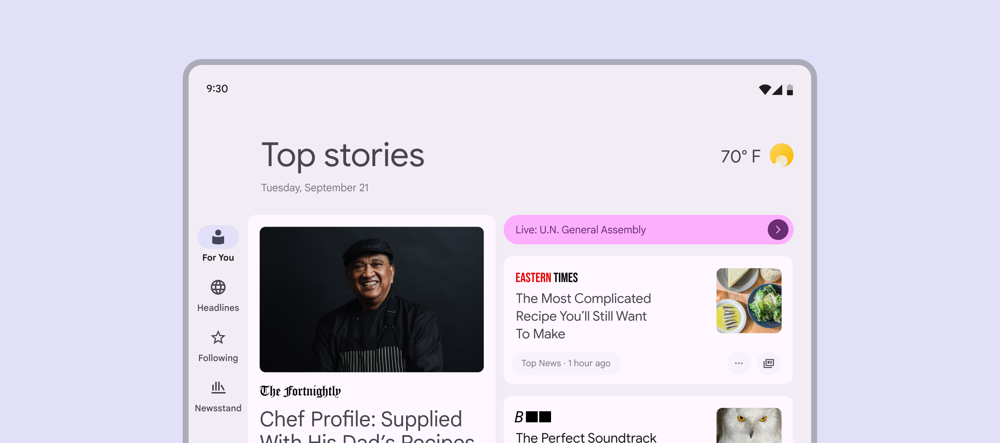
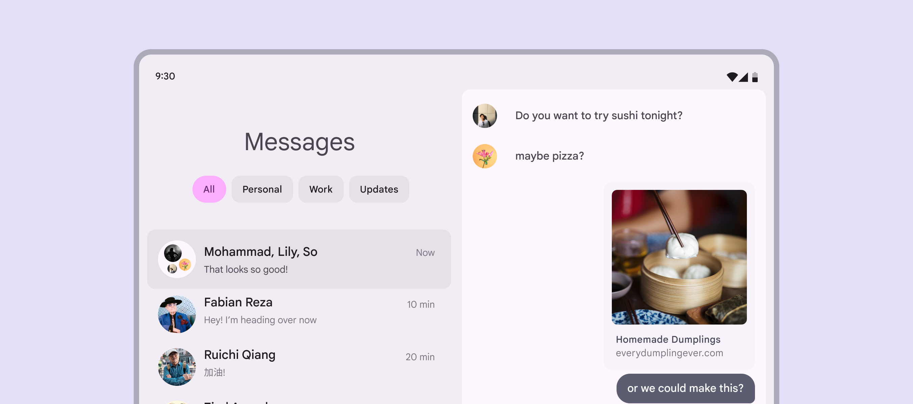
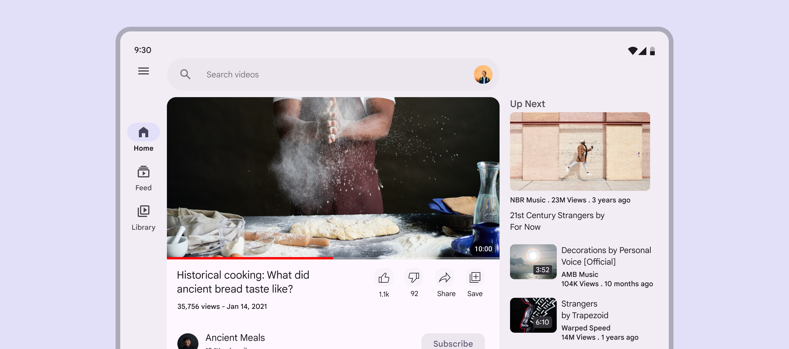

# Canonical layouts

Source: https://m3.material.io/foundations/layout/canonical-layouts/overview

Use the three canonical layouts as starting points for organizing common elements in an app. Each layout considers common use cases and components to address expectations and user needs for how apps adapt across window class sizes and breakpoints.

## Resources

| Type | Resource | Status |
| --- | --- | --- |
| Implementation | [MDC-Android – Canonical layouts](https://github.com/android/user-interface-samples/tree/main/CanonicalLayouts) | Available |
|  | [Flutter –](https://pub.dev/packages/flutter_adaptive_scaffold)[Adaptive scaffold](https://pub.dev/packages/flutter_adaptive_scaffold) | Available |
|  | [Jetpack Compose – Canonical layouts](https://developer.android.com/develop/ui/views/layout/canonical-layouts) | Available |

## Takeaways

- There are three canonical layouts: list-detail, supporting pane, feed
- Each canonical layout has configurations for compact, medium, and expanded window size classes

## Layouts

### [Feed](https://m3.material.io/m3/pages/canonical-layouts/feed)

Use a feed layout to arrange content elements like cards in a configurable grid for quick, convenient viewing of a large amount of content.

*Example feed layout*

### [List-detail](https://m3.material.io/m3/pages/canonical-layouts/list-detail)

Use the list-detail layout to display explorable lists of items alongside each item’s supplementary information—the item detail. This layout divides the app window into two side-by-side panes.

*Example list-detail layout*

### [Supporting pane](https://m3.material.io/m3/pages/canonical-layouts/supporting-pane)

Use the supporting pane layout to organize app content into primary and secondary display areas. The primary display area occupies the majority of the app window (typically about two thirds) and contains the main content. The secondary display area is a panel that takes up the remainder of the app window and presents content that supports the main content.

*Example supporting pane layout*
