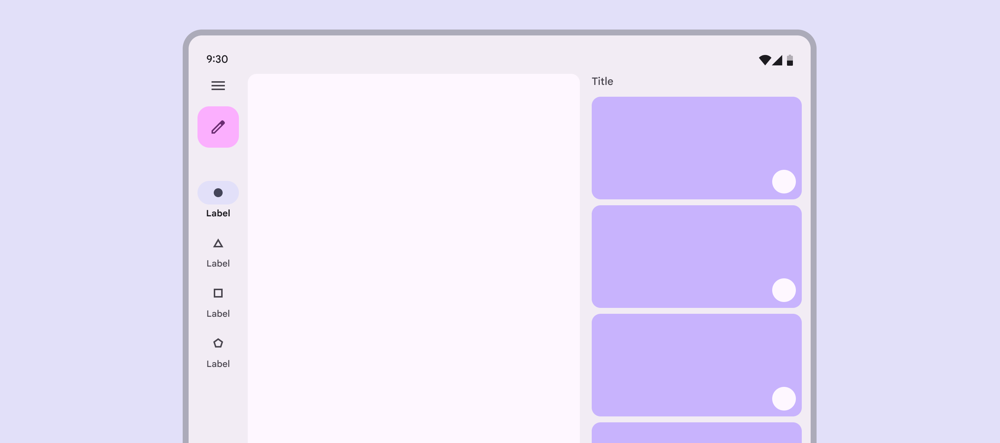
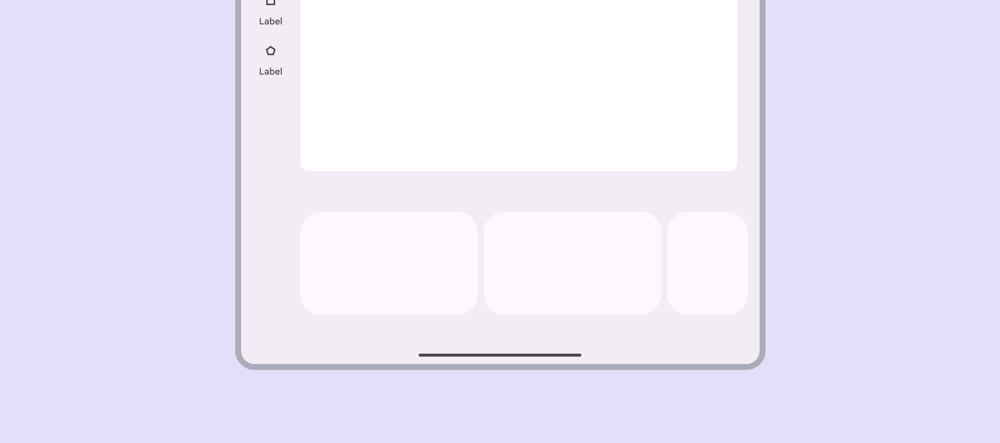
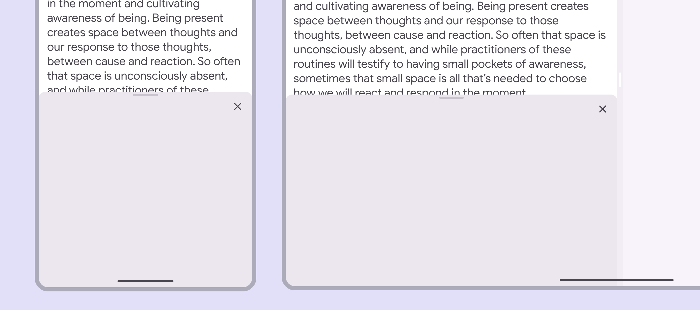
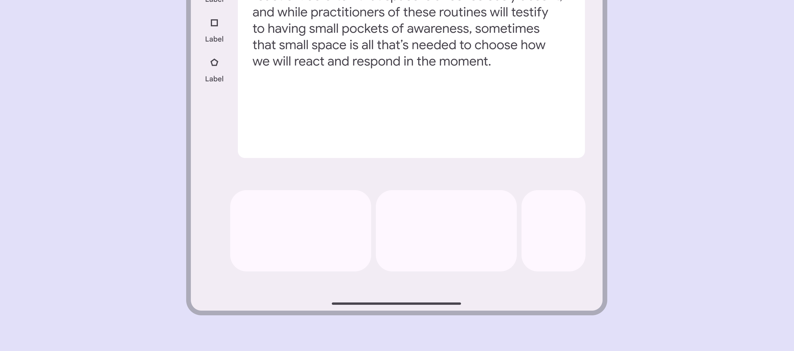
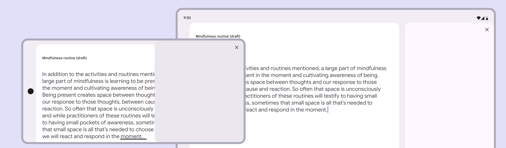

# Canonical layouts

Source: https://m3.material.io/foundations/layout/canonical-layouts/supporting-pane

The supporting pane layout organizes content into primary and secondary areas. The primary area occupies the majority of the body area and contains the main content. The secondary area contains supporting content. Key use cases for supporting pane layouts include:

- Productivity
- Document editing and commenting
- Content and media browsing

*Video app using a supporting pane layout*

## Usage

Use the supporting pane layout when the secondary content is only meaningful in relation to the primary content. For content with a parent-child relationship, use a list-detail view layout instead.

*Simplified diagram of a supporting pane layout*

## Dividing space

The screen is divided between a focus pane and a supporting pane. Depending on the window size class, the supporting pane may appear below or beside the focus pane.

*Diagram of a supporting pane positioned below the primary focus area*

| Supporting pane placement | Pane width | Window size class |
| --- | --- | --- |
| Below | Flexible | Compact or Medium |
| Left-side or right-side | Fixed (360 dp) | Expanded |

## Across window size classes

### Compact

The supporting pane should appear below the focus pane. A bottom sheet can be useful for keeping focus on the primary pane while providing access to supporting information.

*Supporting pane below the primary focus pane in compact layouts*

### Medium

The supporting pane should appear below the focus pane

*Supporting pane below the primary focus pane in medium layout*

### Expanded

The supporting pane should appear on the left or right side of the focus pane

*Supporting pane at the trailing end of the primary focus pane in expanded layouts*
