# Layout basics

Source: https://m3.material.io/foundations/layout/understanding-layout/density

## Overview

- Information density is the consideration of the amount of information visible on the screen
- The default target size should be at least 48x48 CSS pixels
- Users can change density as long as the density controls are accessible
- Apply density thoughtfully; not every layout needs it
- Layout and component scaling (component adaptation or component density) can allow users to scan, view, or compare more information at once

[Video: A website design with a denser arrangement of text and graphics.](assets/asset-001-information-density-2bbc3f1e88.webp)

*Information density*

[Video: Visual representation of component scaling with multiple size examples.](assets/asset-002-component-scaling-5a72fa180f.webp)

*Component scaling*

Information density

- Information density can be achieved through layout and design decisions without using component scaling
- Users may not benefit from increased density

Component scaling

- Components can adapt and change dimensions to allow users to scan, view, or compare different amounts of information
- Don't apply component scaling by default if it would result in a target below 48x48 CSS pixels

[Video: An email app on desktop with a menu open to change information density between cozy, comfortable, and compact.](assets/asset-003-information-density-and-component-scaling-can-be-used-4a50bd42a9.webp)

*Information density and component scaling can be used together to provide more information and additional user control*

## Information density

Information density refers to the amount of content (such as text, images, or videos) in a given screen space.

A layout’s spacing dimensions, including margins, spacers, and padding, can change to increase or decrease its information density. High density layouts can be useful when users need to scan, view, or compare a lot of information, such as in a data table. Increasing the layout density of lists, tables, and long forms makes more content available on-screen.

Consider density settings in the context of a device. Although a user may prefer a denser layout for desktop, they may not for mobile. Density shouldn’t automatically change across window-size classes or device orientation without users changing it.

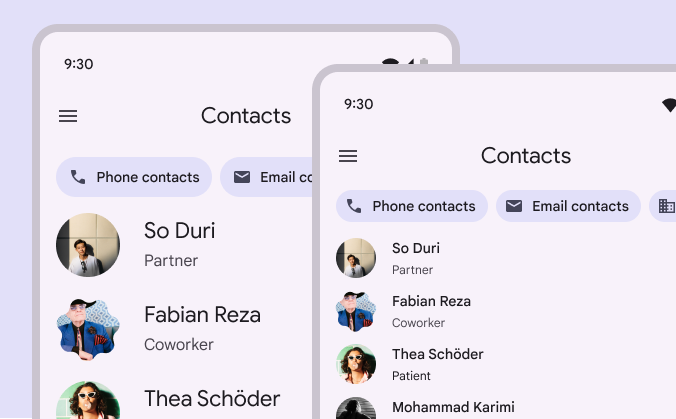

*Do Consider using higher density information design when users need to scan lots of information*

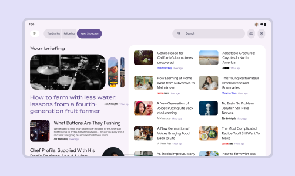

*Consider the amount and priority of information on-screen. Higher density can be useful for data-rich sites (news, financial portals, dashboards) where users expect lots of information quickly.*

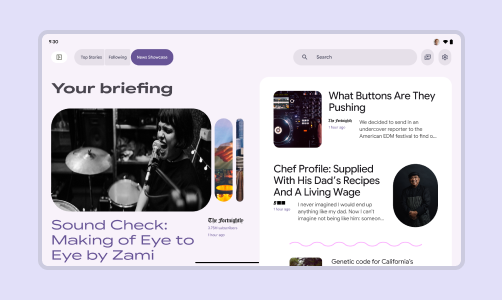

*Lower density can be better for sites prioritizing aesthetics, a focused message, less information, or easier navigation*

## Component scaling

The component density scale controls the internal spacing of individual components.

The density scale is numbered, starting at 0 for a component’s default density. The scale moves to negative numbers (-1, -2, -3) as space decreases, creating higher density.

Higher density is typically applied by decreasing the top and bottom padding or overall height by 4dp.

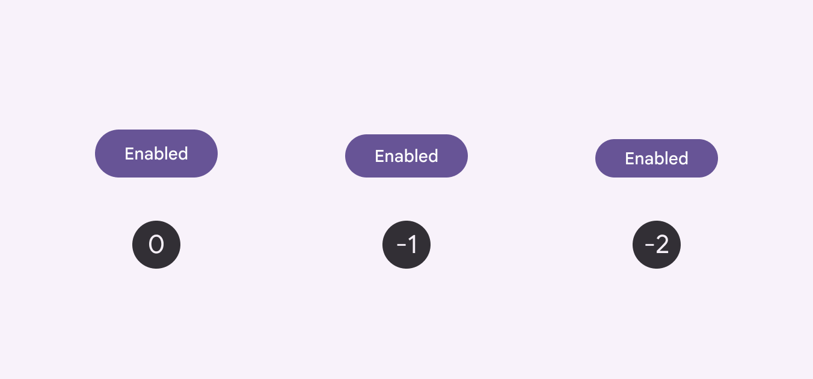

*Buttons in 3 different densities. Apply button density based on the needs and layout of a design.*

Center the grouped element within the component container.

Text size shouldn’t change as the container size scales.

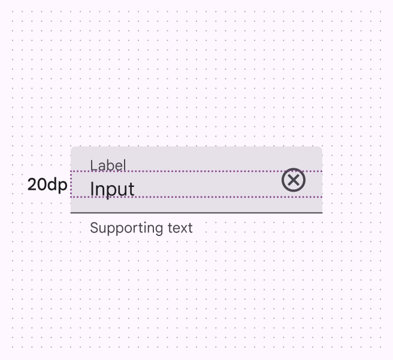

*The measurement between the label and input is 20dp*

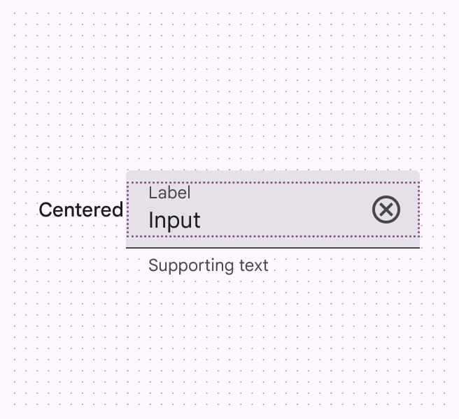

*The label and input are centered within their parent container*

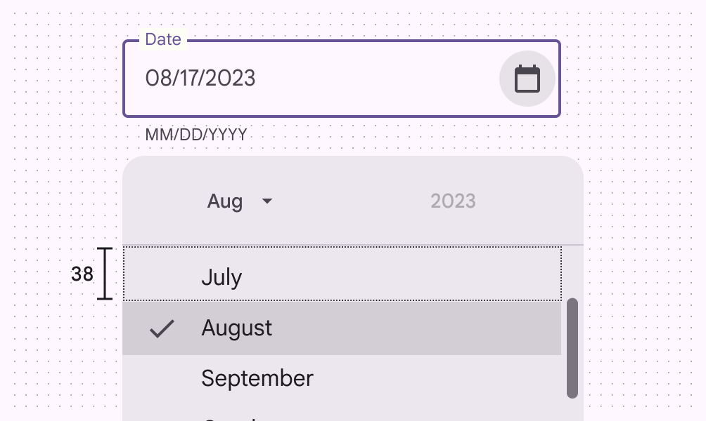

*Don’t increase density in UIs that involve focused tasks, such as selecting from a menu. It reduces usability by limiting selectable space.*

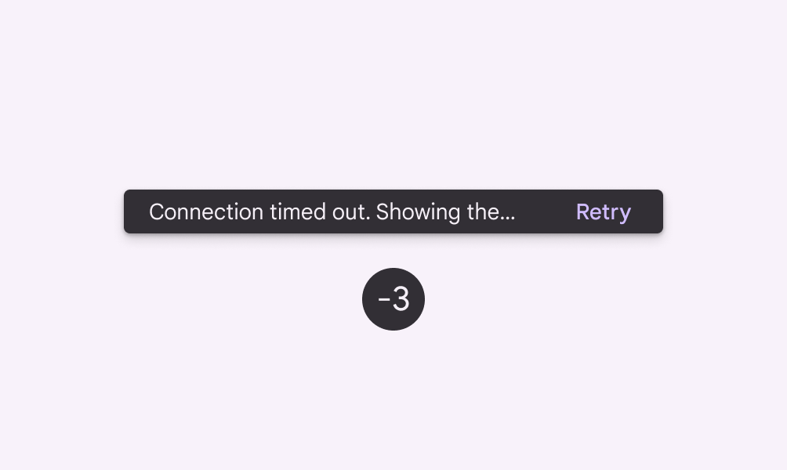

*Don’t Don't increase the density in components that alert the user of changes, such as snackbars or dialogs*

### Avoid applying component scaling by default

- Don't apply component scaling to layouts by default that lower the target size below a default size of 48x48 CSS pixels
- Allow users to opt for a higher density layout or theme, and provide a simple, accessible way to revert to default best practices

People should be able to opt in to dense layouts and components.

To ensure that density settings can be easily reverted, targets in settings interactions must follow defaults (48x48 CSS pixels).

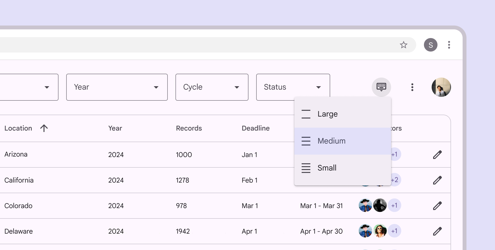

## Targets

Dense components can be less accessible because interactive elements are smaller, so use caution when increasing information density.

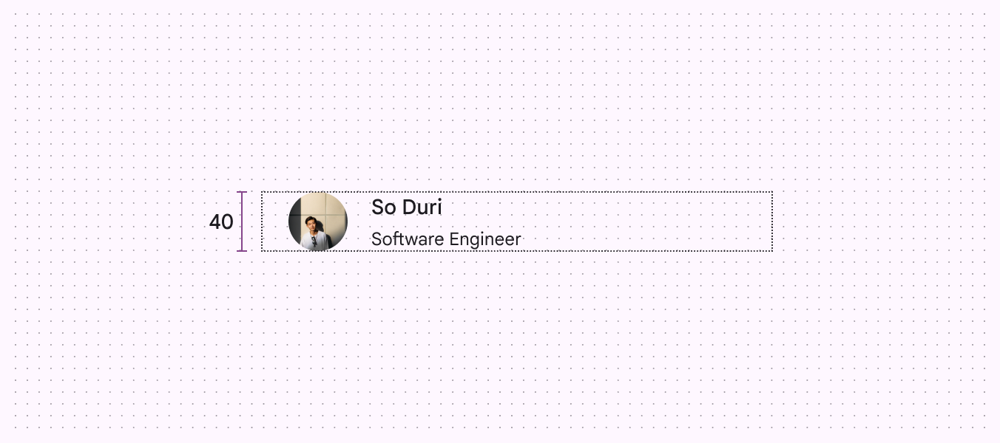

*Caution Use caution when applying component scaling where selectable targets will be reduced to less than the 48x48dp best practice and only apply density where it provides a better user experience.*

Use caution when applying density to interaction targets. Following best practices, accessible targets should retain a minimum of 48x48dp, even if their visual element (such as an icon) is smaller.

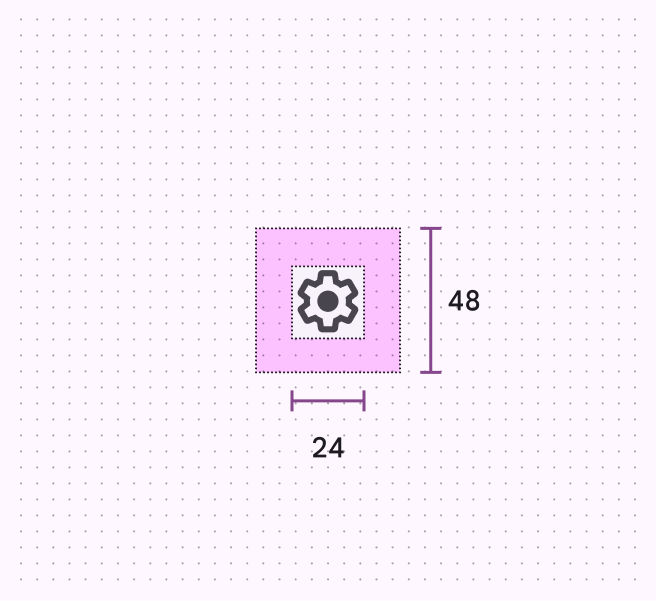

*The target should remain 48x48, even if the icon is smaller.*

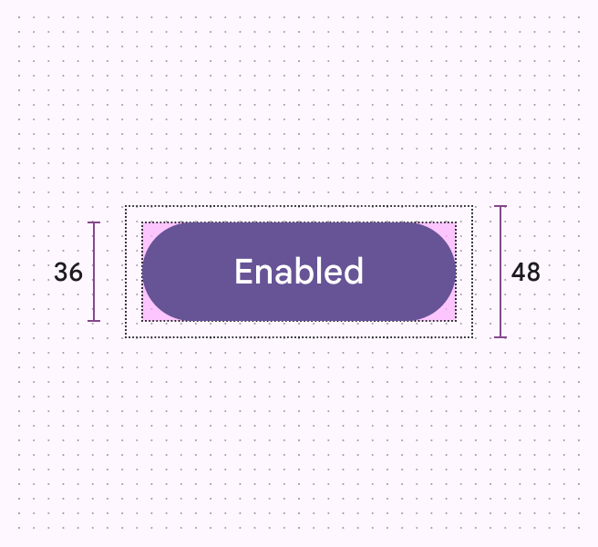

*The interaction target of a common button can be larger, as long as it meets the 48x48dp minimum size.*

## Pixel density

The number of pixels that fit into an inch is referred to as pixel density. High-density screens have more pixels per inch than low-density ones. As a result, UI elements of the same pixel dimensions appear larger on low-density screens, and smaller on high-density screens.

To calculate pixel density:

Screen density = Screen width (or height) in pixels / Screen width (or height) in inches

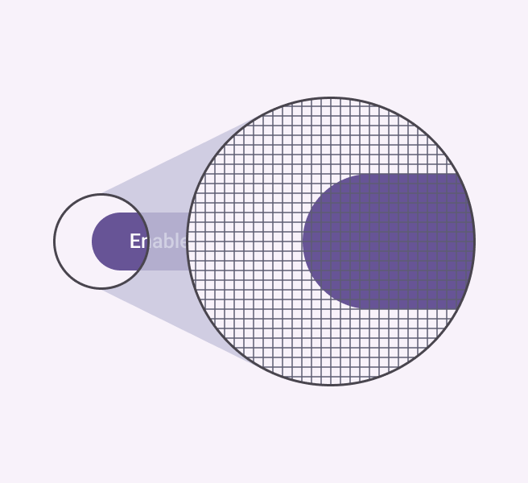

*A high-density ui element*

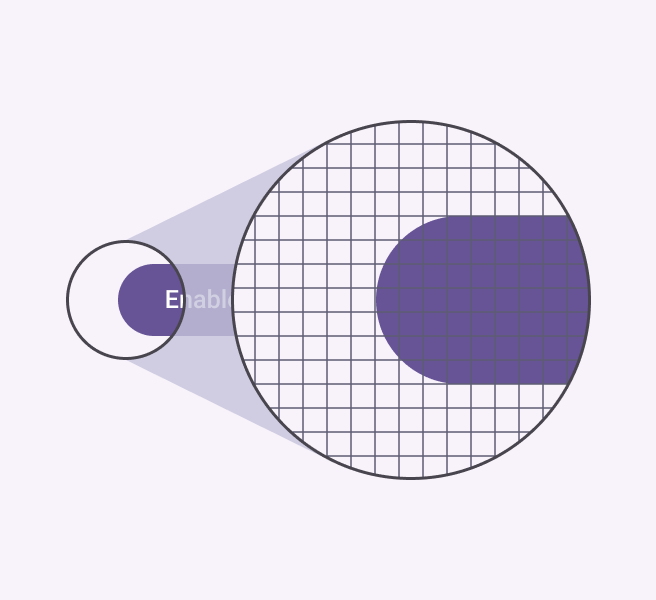

*A low-density UI element*

### Density-independent pixels

Density-independent pixels, written as dp, are flexible units that scale to have uniform dimensions on any screen. They provide a flexible way to accommodate a design across devices. Material design system uses density-independent pixels to display elements consistently on screens with different densities.

A dp is equal to one physical pixel on a screen with a density of 160.

To calculate dp: dp = (width in pixels * 160) / screen density

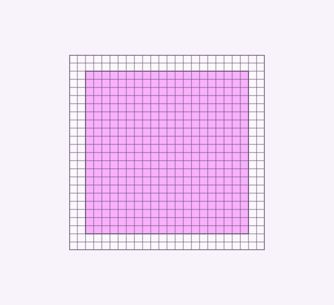

*Low-density screen displayed with density independence*

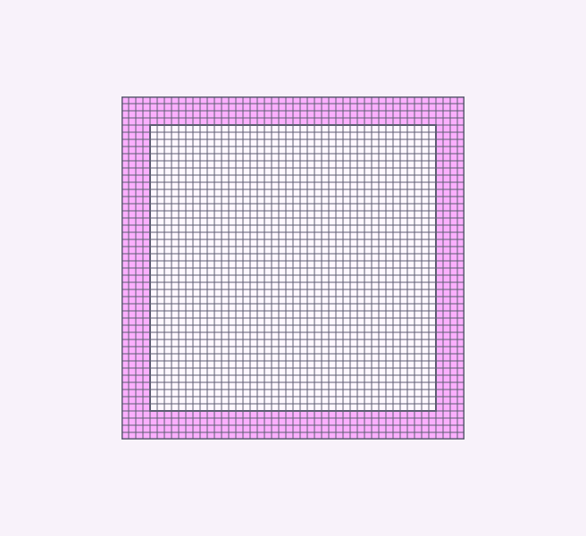

*High-density screen displayed with density independence*

| Screen physical width | Screen density | Screen width in pixels | Screen width in dps |
| --- | --- | --- | --- |
| 1.5 in | 120 | 180 px | 240 dp |
| 1.5 in | 160 | 240 px | 240 dp |
| 1.5 in | 240 | 360 px | 240 dp |
