# Layout basics

Source: https://m3.material.io/foundations/layout/understanding-layout/hardware-considerations

Window size classes (Window size classes are opinionated breakpoints where layouts need to change to optimize for available space, device conventions, and ergonomics. [More on window size classes](https://m3.material.io/m3/pages/applying-layout/window-size-classes)) provide the foundation for top level layout decisions, but display-specific considerations are also needed.

## Display cutout

A display cutout is an area on some devices that extends into the display surface. It allows for an edge-to-edge experience while providing space for important sensors on the screen of the device.

Applications can extend around display cutouts or other features, but some parts of the UI might be obscured.

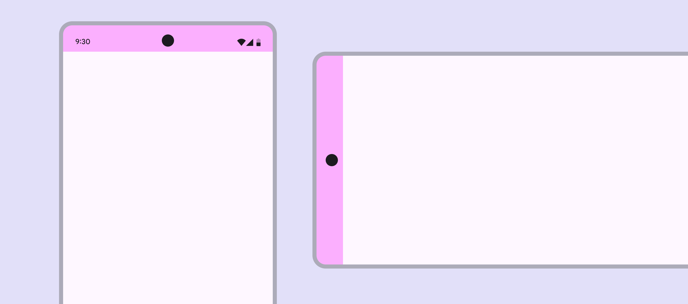

*A mobile device’s content-safe area around a display cutout for the front-facing camera*

## Foldable devices

Foldable devices use a folding mechanism to fold and unfold. They have unique characteristics to consider when designing layouts.

### Fold

The fold of a foldable device divides the screen into two portions, either horizontally or vertically. The fold can be a flexible area of the screen or, on dual-screen devices, a hinge that separates two displays.

A flexible fold is barely visible, although some users may feel a tactile difference on the screen surface. Content can flow over the fold fairly easily.

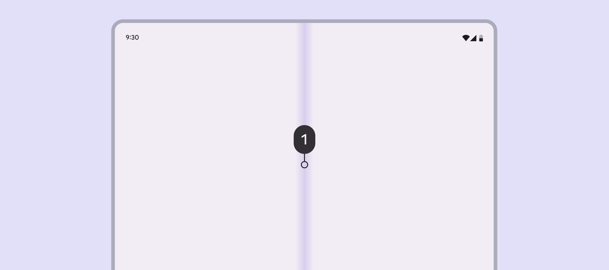

*Folds are typically found in the center of the device screen and can present a seamless experience*

On devices with a physical hinge, designing the screen as two distinct sections (separate window areas or panes) allows a composition to work well across the hinge and screens.

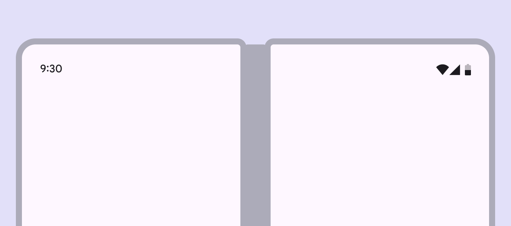

*A physical hinge separates two parts. There is no display hardware in this region.*

### Device state

Foldable devices can have several physical states: folded, open flat, and tabletop.

#### Folded

The folded state can include a front screen, which often fits in the compact window size class, just like a mobile phone in portrait orientation.

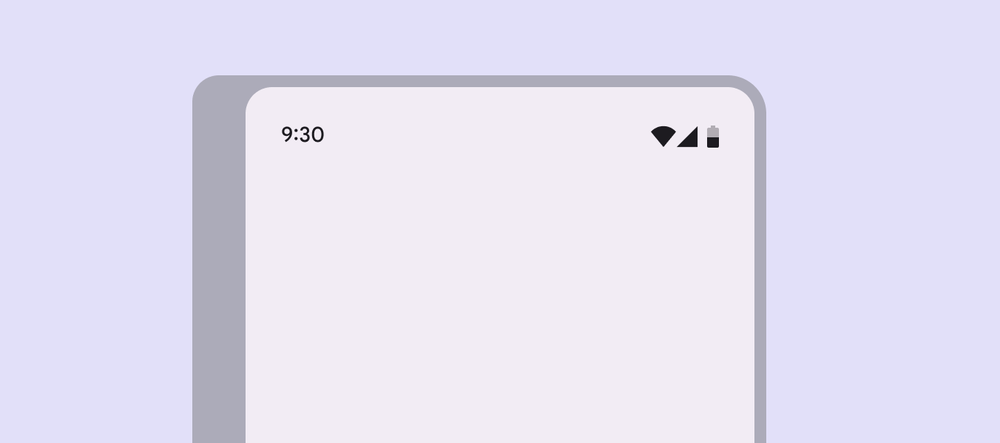

*The front screen of a foldable device*

#### Open flat

An open flat state refers to the fully opened screen, which usually increases the window size class to medium or expanded. An open device can be used in landscape or portrait orientations.

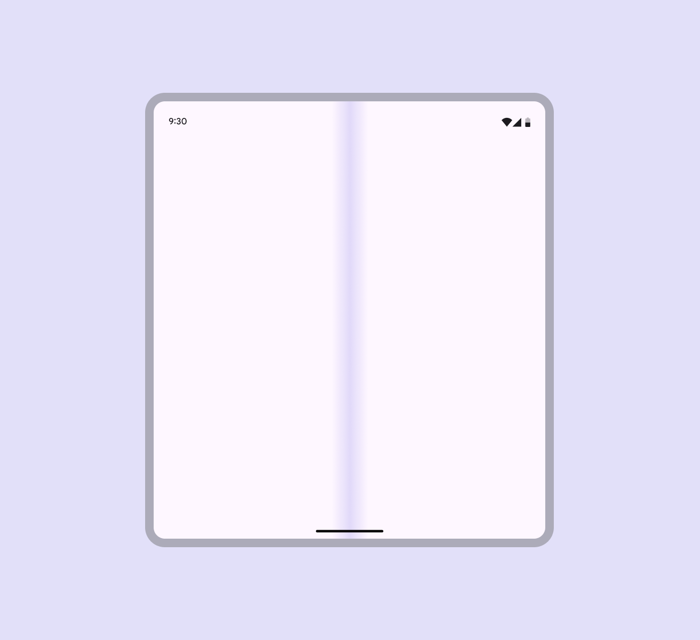

*In an open portrait state, the longer device edge is vertical while the shorter edge is horizontal*

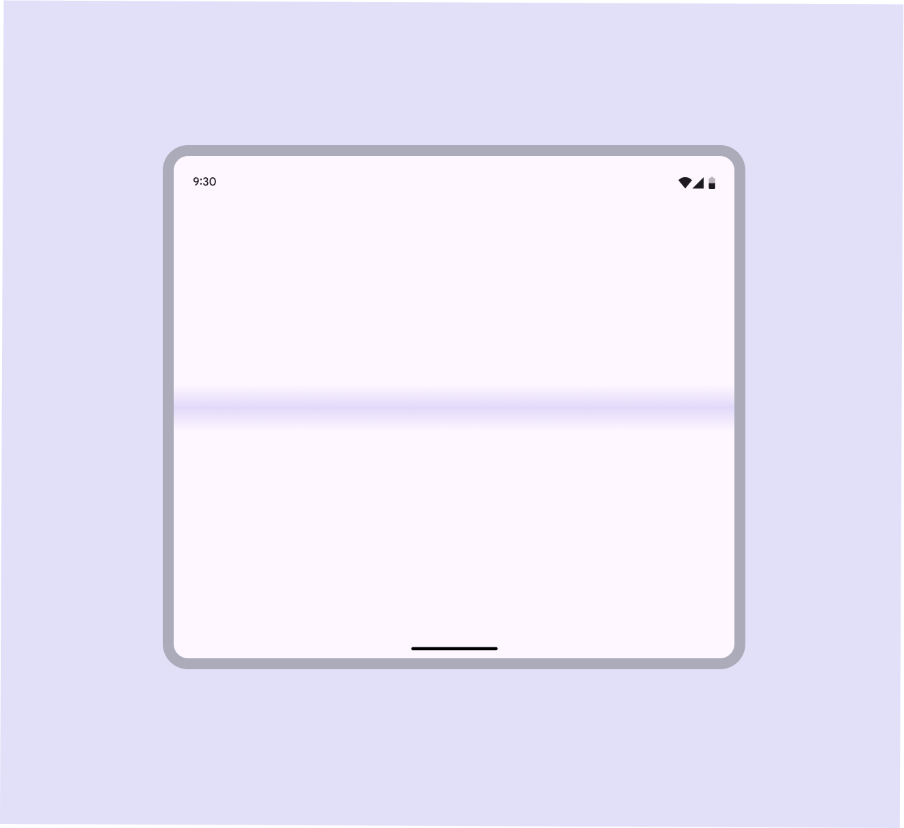

*In an open landscape state, the longer device edge is horizontal while the vertical edge is shorter*

#### Tabletop

Tabletop refers to a half-opened state forming a rough 90 degree angle, with one half of the device resting on a surface. This posture resembles a laptop.

UI controls near the fold can be difficult for users to access, and text overlaying the fold can be hard to read.

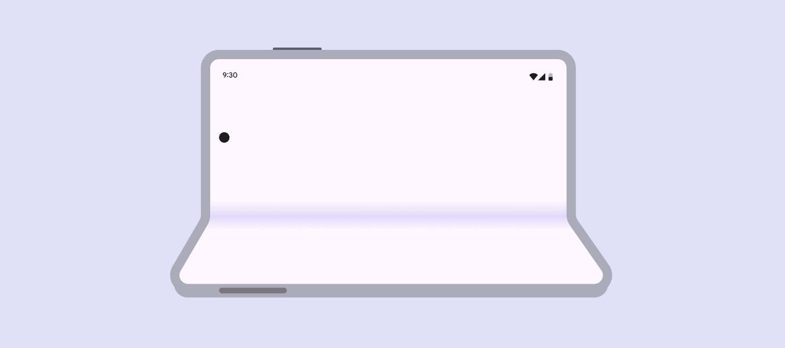

*If camera hardware is present, a tabletop device is best positioned on a side without any protruding hardware elements*

### Interaction

#### App continuity

When running on a foldable device, an app can transition from one screen to another automatically. After the transition, the app should resume in the same state and location, and the current task should continue seamlessly.

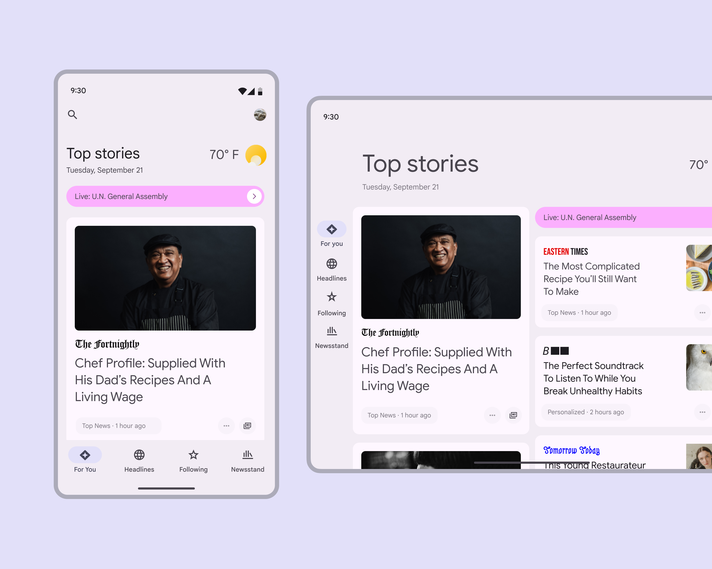

*A news app shows a feed in a compact and expanded window class when a foldable device switches device state*

#### Scrolling and multiple panes

Depending on how your app uses panes, the scroll behavior of a folded design may change in the unfolded design.

If you expand a pane, you can decide whether the whole window will scroll together or if each side (each pane) scrolls independently.

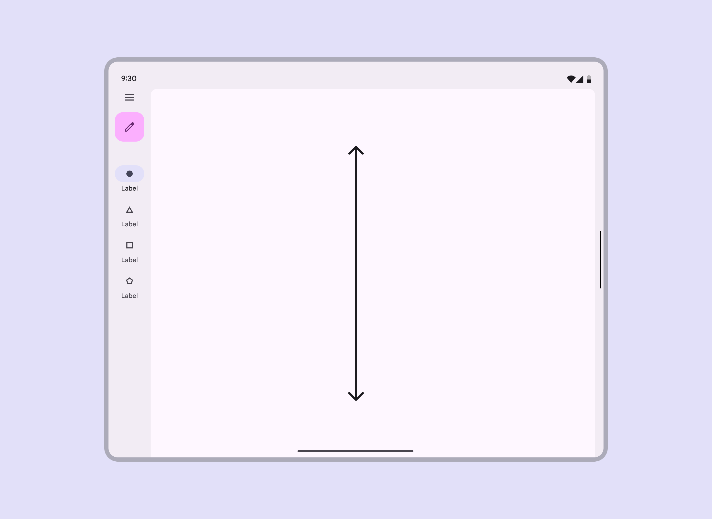

*A single pane can scroll its inside content vertically and horizontally*

If your design has multiple panes, each pane can operate as an independently scrollable area.

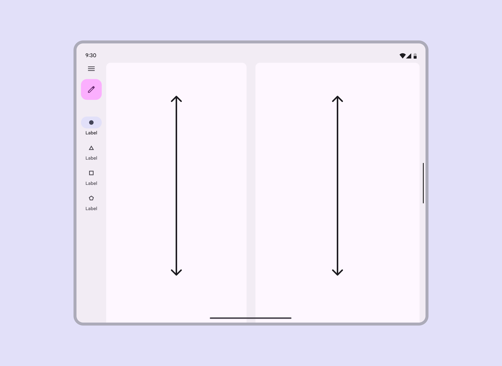

*Multiple panes can scroll inside content independently of one another*

## Multi-window mode

Multi-window mode is an Android system feature for displaying multiple apps on the same screen. This can be especially useful for multi-tasking, or workflows that depend on comparing information.

Note: This concept should not be confused with using multiple panes to display content from a single app. For more on that, see: Panes.

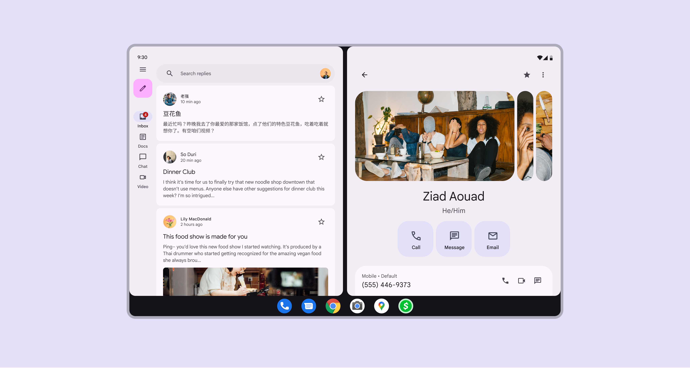

*Screen displaying an email app and a contacts app in multi-window mode*

### User needs

The ways that windows are created, arranged, and adjusted should feel straightforward for all users and across any window size class. Methods for seamless window management include:

- Apply smooth transitions as described in motion guidance
- Ensure that users can create multiple windows easily and move between them as needed
- Keep mental models and interaction patterns simple so that users aren’t required to think about which mode is appropriate for each task
- Design and implement window dynamics consistently across variations in foldable hardware, including those with a hinge that separates two displays

### Window creation and behavior

Android provides several ways for users to create a multi-window view.

### Taskbar

The taskbar provides a launching point for pinned and suggested apps to easily become a separate window.

To create a new window, a user selects and drags an app from the taskbar and moves the app icon to indicate where the new window should be displayed.

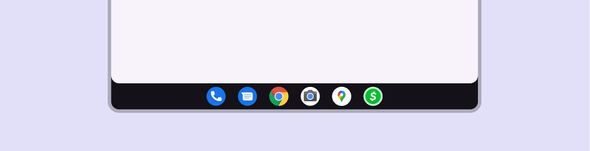

*Android taskbar*

### Context menu

Users can also create multiple windows through the overview by the app context menu.

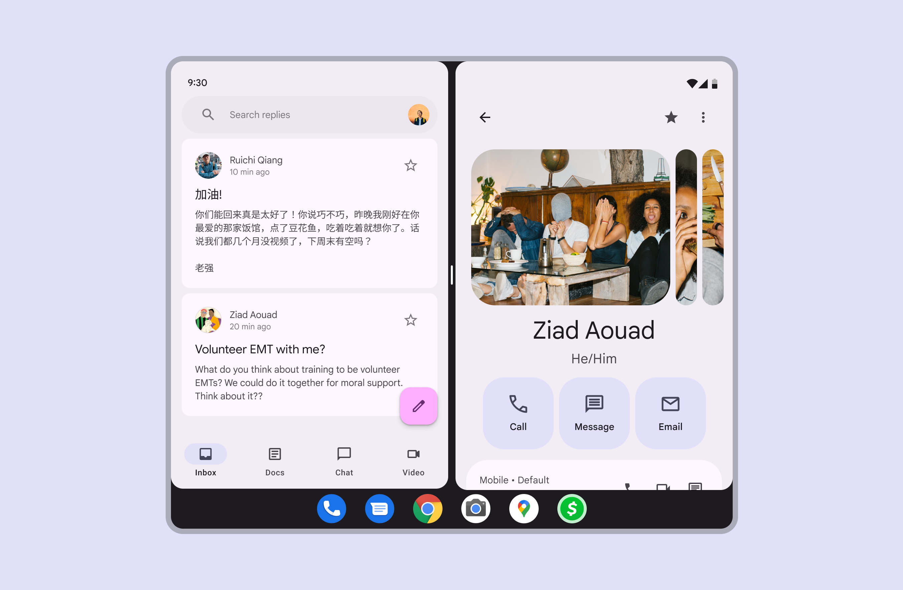

*Multi-window mode can have vertical positioning*

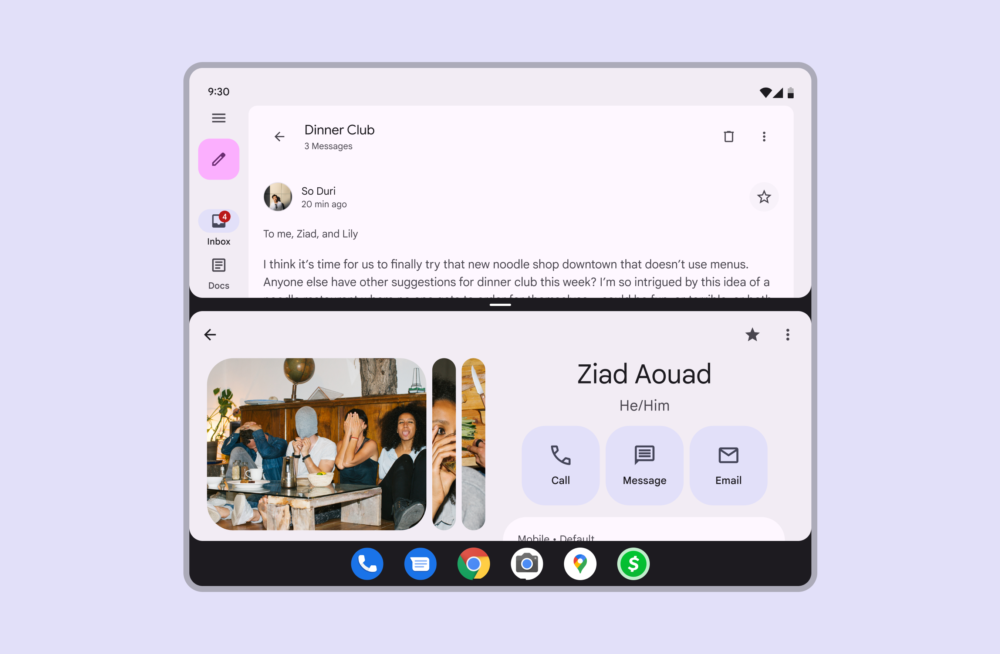

*Multi-window mode can have horizontal positioning*

### Adjusting window sizes

By default multiple windows are created as a 50/50 side-by-side split.

The windows can be adjusted further to 1:3 or 2:3 proportions. These ratios provide a primary and secondary window dynamic, offering greater flexibility and allowing focus on one application as needed.

When in a multi-window mode, the available screen area often changes from medium or expanded window class to compact. Layouts should adapt accordingly.

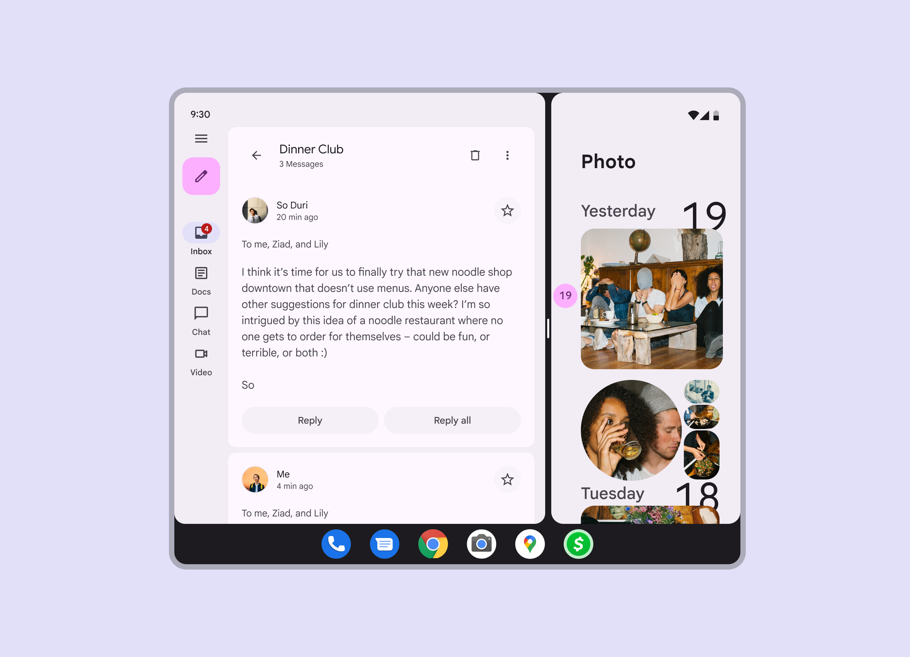

*The screen handle can be dragged and released to create the desired window ratio. The handle automatically adjusts to the closest snap point.*
