# Layout basics

Source: https://m3.material.io/foundations/layout/understanding-layout/parts-of-layout

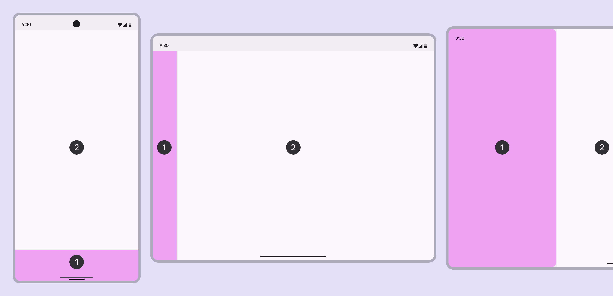

*Navigation; Body*

### Windows

A window frames and contains the product. The window is divided into two primary regions: the navigation region and body region. Multi-window views are a system UI feature used to display more than one app simultaneously. [Multi-window support guide for Android](https://developer.android.com/develop/ui/compose/layouts/adaptive/support-multi-window-mode)

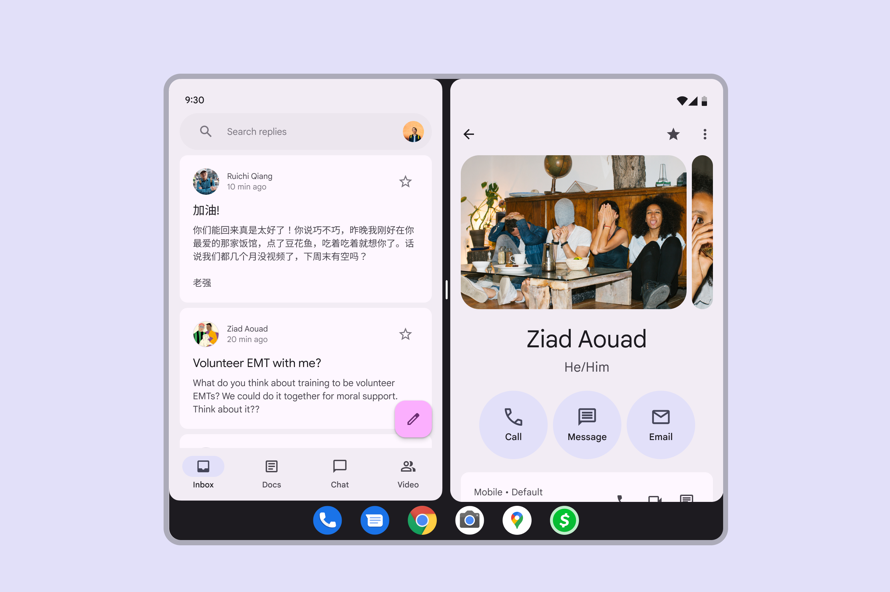

*Two windows shown next to one another with a taskbar underneath*

## Navigation region

The navigation region holds primary navigation components and elements such as:

- Navigation drawer
- Navigation rail
- Navigation bar Elements in this section help people navigate between destinations in an app or to access important actions. Place navigation components close to edges of the window where they’re easier to reach; on the left side for left-to-right (LTR) languages, and on the right side for right-to-left (RTL) languages.

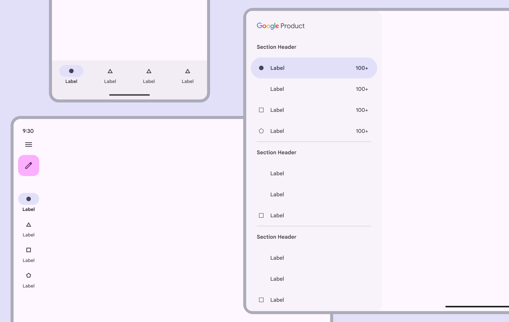

*Three different navigation components suit a variety of device sizes and environments*

## Body region

The body region contains most of the content in an app, including:

- Images
- Text
- Lists
- Cards
- Buttons
- App bar
- Search bar

Content in the body region is grouped into one or more panes.

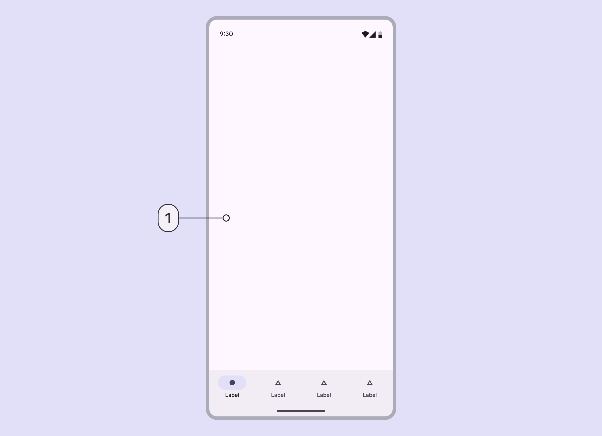

*The body region is the area outside of the navigation region*

## Panes

Just like panes of glass that make up a window in the real world, panes in Material Design make up the body region of the layout in a device window.

All content must be in a pane. A layout can contain 1–3 panes of various widths, which adapt dynamically to the window size class (Window size classes are opinionated breakpoints where layouts need to change to optimize for available space, device conventions, and ergonomics. [More on window size classes](https://m3.material.io/m3/pages/applying-layout/window-size-classes)) and the user’s language setting. For right-to-left (RTL) languages, navigation components will be on the right.

Users can navigate to or between panes. Presenting multiple panes at once can make the app more efficient and easier to use.

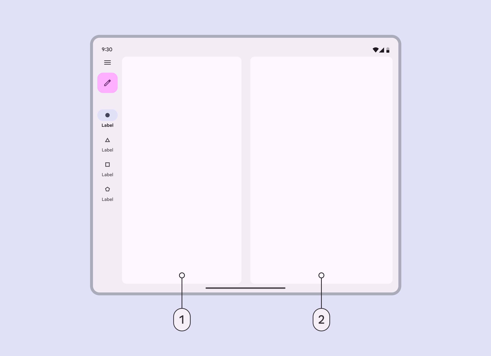

*First pane; Second pane*

There are two pane types:

- Fixed: Fixed width
- Flexible: Responsive to available space, can grow and shrink

All layouts need at least one flexible pane to be responsive to any window size.

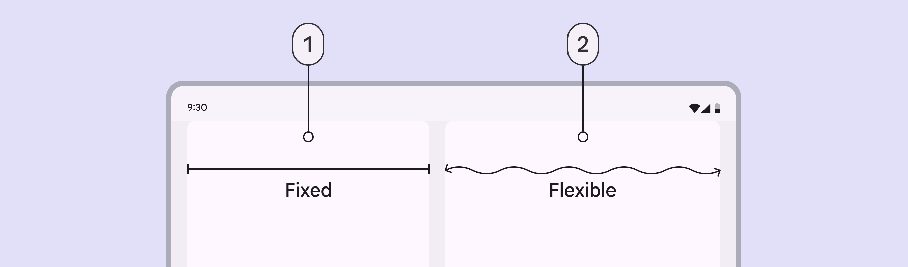

*Fixed pane; Flexible pane*

## How panes adapt

In addition to flexible resizing, pane layouts can adapt using three strategies: show and hide, levitate, and reflow. When horizontal space allows, panes are presented next to each other in a row. When the window is resized or changes orientation, panes use these strategies to reorganize themselves, preserving context and meaning.

[Video: How panes adapt](assets/asset-007-show-and-hide-supporting-panes-enter-and-exit-4cb8eebe1c.webp)

*Show and hide: Supporting panes enter and exit the screen based on available space*

[Video: How panes adapt](assets/asset-008-levitate-one-pane-is-placed-on-top-of-97253bf1c2.webp)

*Levitate: One pane is placed on top of another*

[Video: How panes adapt](assets/asset-009-reflow-panes-change-position-or-orientation-752fa39e27.webp)

*Reflow: Panes change position or orientation*

### Containment

On most devices, panes can blend in with the background while others can use a different color for emphasis. This is called implicit grouping, and helps show relationships between panes.

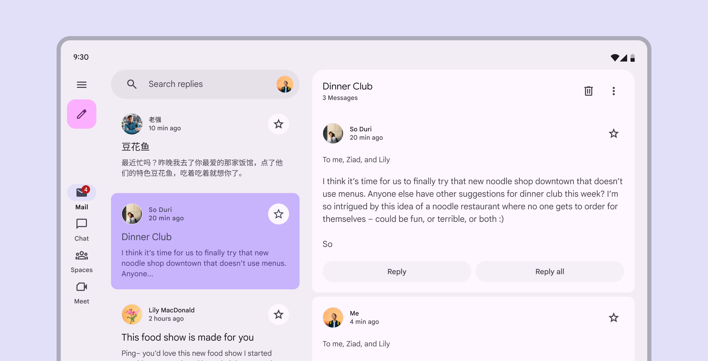

*Implicit grouping can be used to create hierarchy among 2D panes*

In spatial environments, panes use a container color to separate panes from the passthrough or virtual environment.

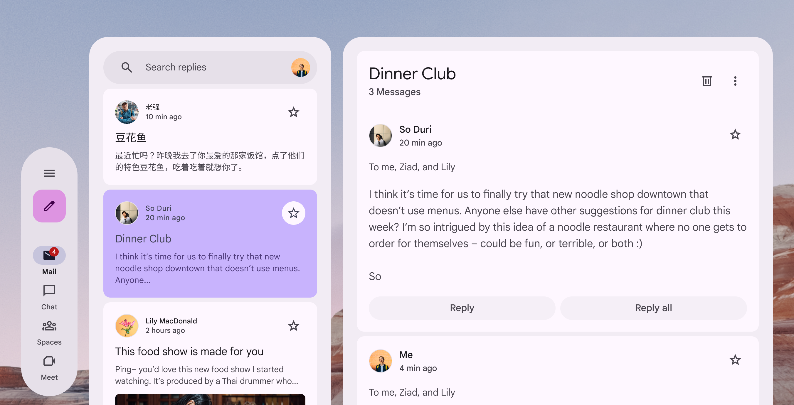

*Explicit containment is recommended in XR*

## App bars

Panes can include a top app bar and bottom app bar.

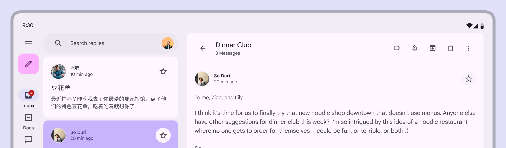

*App bars are placed inside panes*

Any nesting actions within the app bar should be hidden or revealed based on available width.

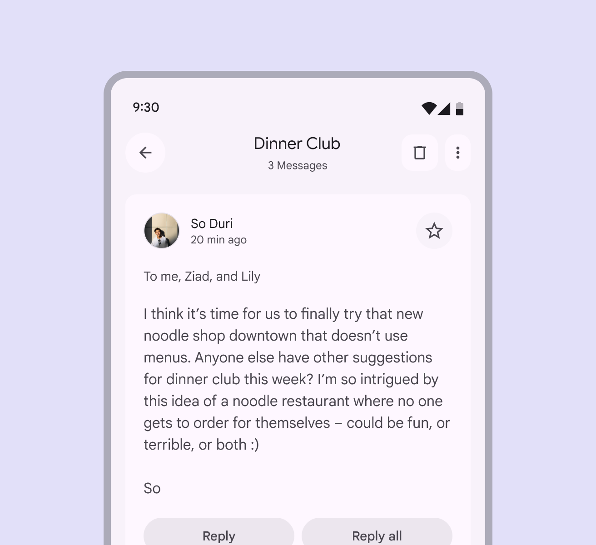

*A compact window with two actions revealed*

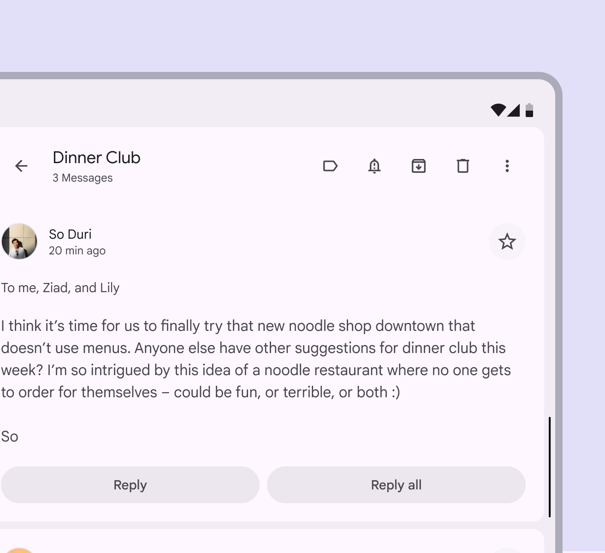

*An expanded window class with five items revealed*

When layouts transition from one to two panes, avoid shifting elements between panes.

*Don’t move elements to different UI objects when switching between window classes*

## Columns

Content in a pane can be displayed in multiple columns to segment and align content.

Columns are exclusive to a pane and are not used at the window level.

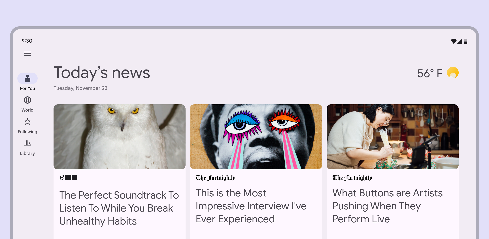

*Using one pane, an app like News uses multiple columns of content to create its layout*

## Drag handle

Drag handles can be used to instantly resize panes in a layout. They adjust the width of flexible panes, and can fully collapse and expand fixed panes to quickly switch between a single-pane and two-pane layout.

[Video: A drag handle is used to collapse a two pane layout into a single-pane layout.](assets/asset-017-drag-handles-can-adjust-pane-size-in-a-c27512787a.webp)

*Drag handles can adjust pane size in a list-detail layout*

Drag handles can be used horizontally or vertically.

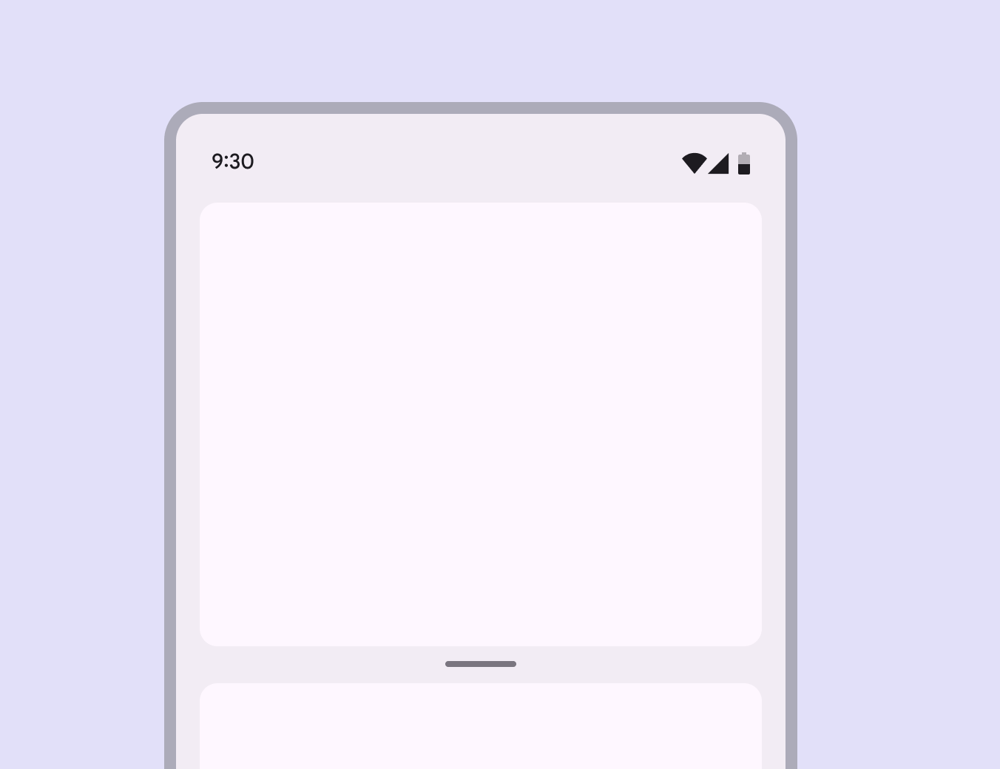

*Drag handles can be used vertically*

### Drag handle tokens

- Columns: Token; Description
- Visible groups: Enabled; Hovered; Focused; Pressed

### Usage

In expanded, large, and extra-large window sizes, two-pane layouts can be customized to snap to set widths when resized. The recommended custom widths are:

- 360dp
- 412dp
- Split-pane with spacer centered visually

[Video: A drag handle adjusts the panes to common custom widths.](assets/asset-019-panes-can-snap-to-custom-widths-when-a-3898b4ef68.webp)

*Panes can snap to custom widths when a user releases the drag handle*

In a two-pane layout, the drag handle is placed in the spacer between the panes.

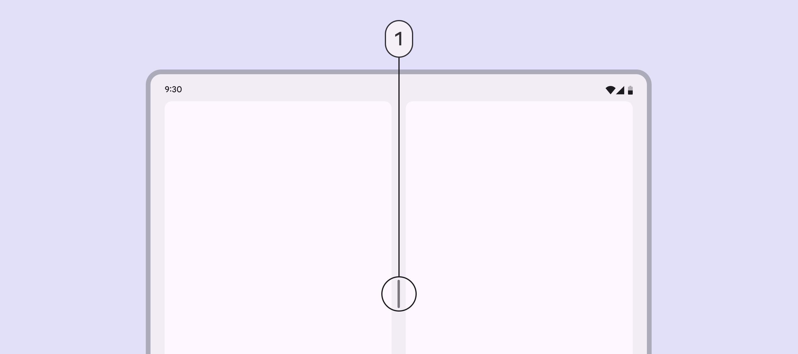

*Pane drag handle between two panes*

When a single pane is fully expanded, the handle is placed inside the right or left pane edge.

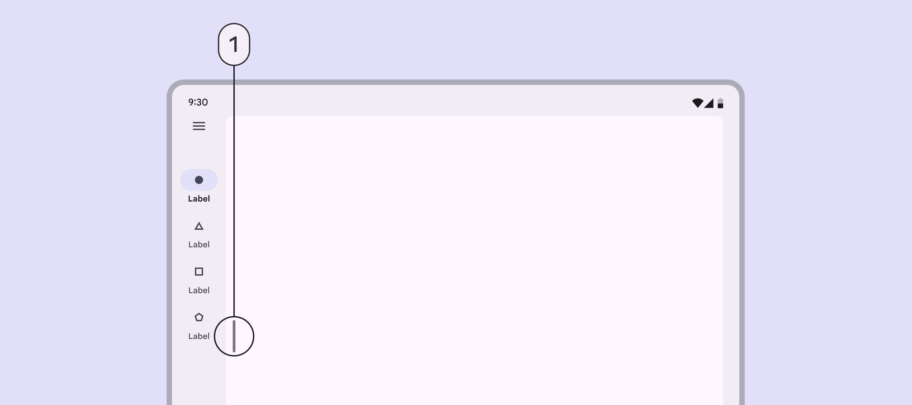

*Pane drag handle on the left edge of a pane*

A touch region (A) around the drag handle takes priority over the back gesture, allowing people to perform a pane drag action instead of a system back gesture (B).

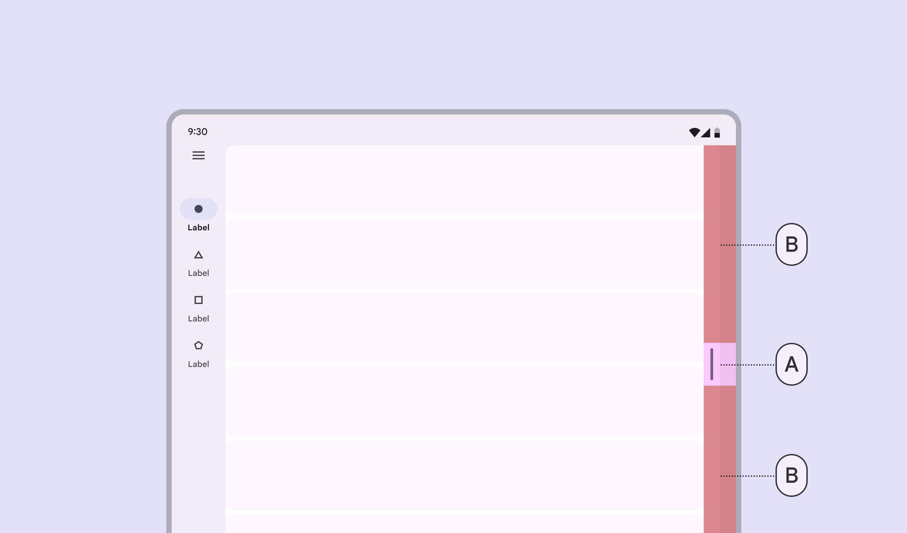

*The pane drag handle UI overrides the back gesture*

In a two-pane[list-detail](https://m3.material.io/m3/pages/canonical-layouts/list-detail) layout, the pane drag handle doesn't appear until an item is selected.

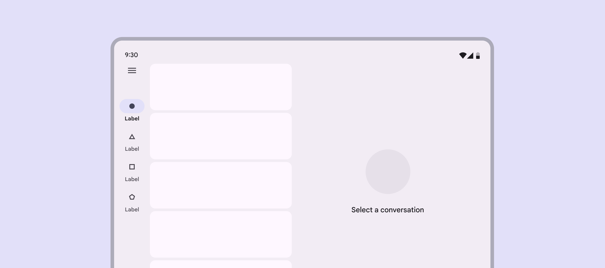

*A list-detail layout doesn’t need a drag handle when no list item selected*

Avoid customizing the drag handle.

For products that can't use a drag handle, consider these other options for changing layouts:

- A toggle button to swap layouts
- In-app layout settings

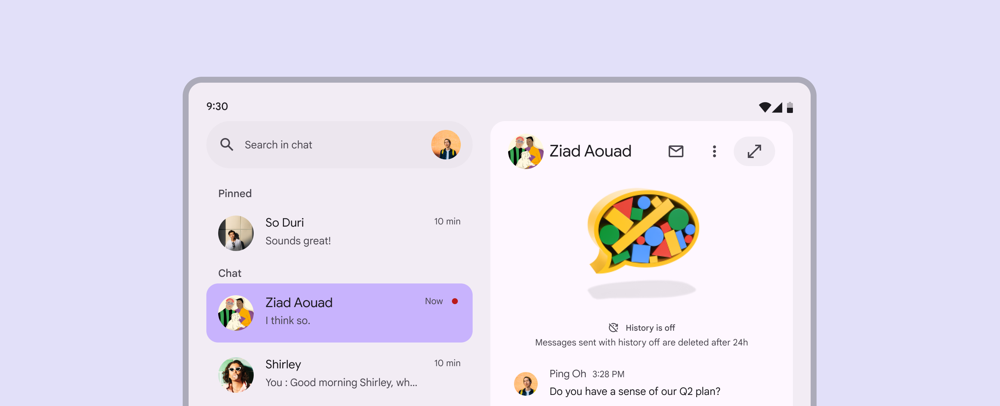

*A layout toggle button could be used if drag handles are not possible*

### Drag handle accessibility

Avoid customizing the visual design of the drag handle. The drag handle should have a hover state, like changing size, to indicate that the handle can be moved. A cursor should change to a hand when hovering. By default, drag handles can only be dragged, not selected. Consider adding the ability to change layouts when tapped, double tapped, clicked, or activated using a keyboard. When using a keyboard, people should:

- Use Tab to navigate to the drag handle.
- Use Space or Enter to activate the drag handle. This can automatically resize the panes to a recommended size, or it can select the handle so Arrows can move the handle to predefined sizes.

For screen readers, describe the function of the drag handle in the accessibility label (like “Resize layout”). Use roles like button to explain that it’s interactive, and states like left pane expanded, right pane expanded, or panes equally sized to explain its current position.

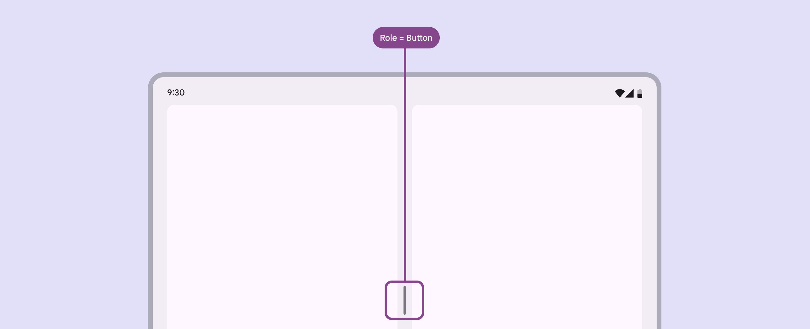

*The drag handle should behave like a button for keyboard users*
