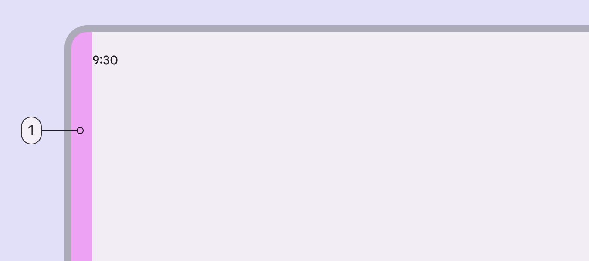
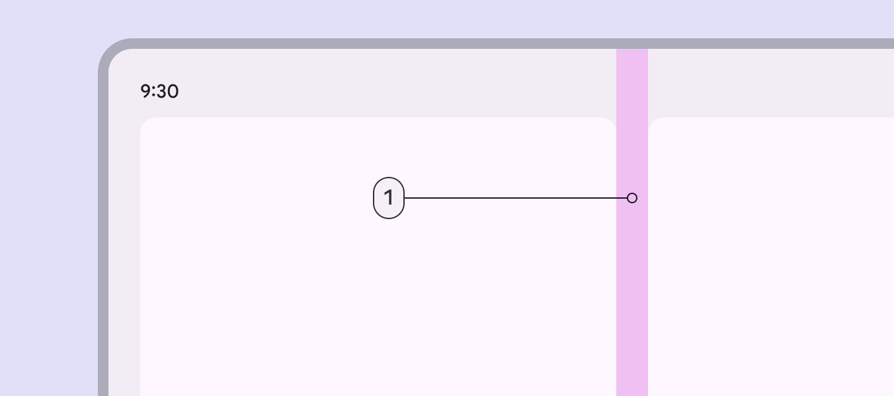
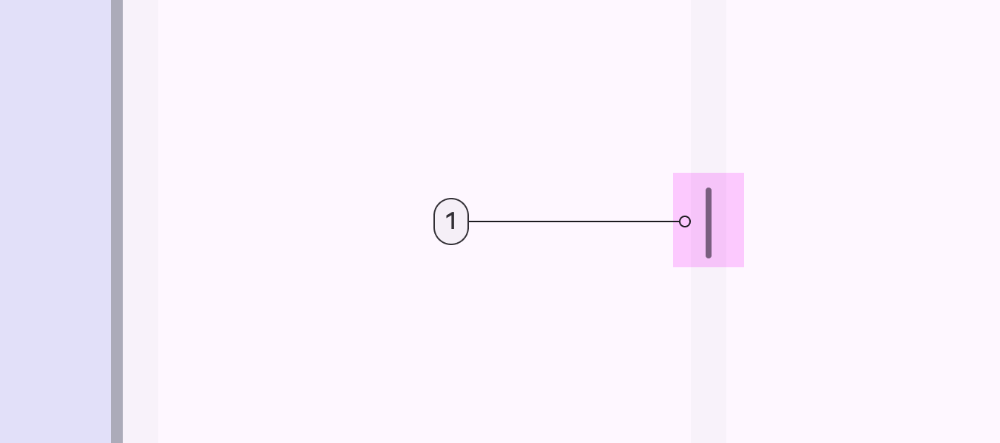
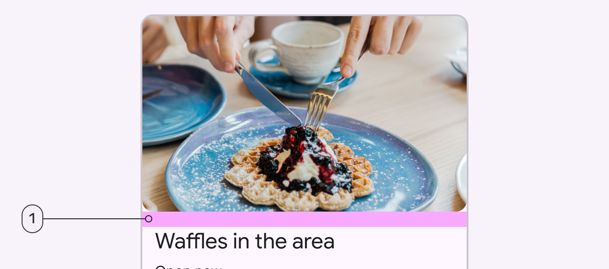

# Layout basics

Source: https://m3.material.io/foundations/layout/understanding-layout/spacing

## Grouping

Grouping is a method for connecting related elements that share a context, such as an image grouped with a caption. It visually relates elements and establishes boundaries to differentiate unrelated elements.

*By placing a caption under an image this composition shows an explicit group*

Explicit grouping uses visual boundaries such as outlines, dividers, and shadows to group related elements in an enclosed area. Explicit grouping can also indicate that an item is interactive, such as list items contained between dividers, or a card displaying an image and its caption.

*The elements in this card are explicitly grouped*

Implicit grouping uses close proximity and open space (rather than lines and shadows) to group related items. For example, a headline closely followed by a subhead and thumbnail image are implicitly grouped together by proximity and separated from other headline-subhead-thumbnail groups by open space.

*Images in a carousel are grouped by their proximity*

## Margins

Margins are the spaces between the edge of a window area and the elements within that window area. Margin widths are defined using fixed or scaling values for each window size class. To better adapt to the window, the margin width can change at different breakpoints. Wider margins are more appropriate for larger screens, as they create more open space around the perimeter of content. See margin measurements for each window class: compact (Window widths smaller than 600dp, such as a phone in portrait orientation. [More on compact window size class](https://m3.material.io/m3/pages/applying-layout/compact)), medium (Window widths from 600dp to 839dp, such as a tablet or foldable in portrait orientation. [More on medium window size class](https://m3.material.io/m3/pages/applying-layout/medium)), expanded (Window widths 840dp to 1199dp, such as a tablet or foldable in landscape orientation, or desktop. [More on expanded window size class](https://m3.material.io/m3/pages/applying-layout/expanded)), large (Window widths 1200dp to 1599dp, such as desktop. [More on large window size](https://m3.material.io/m3/pages/applying-layout/large-extra-large)), and extra-large. (Window widths 1600dp and larger, such as ultra-wide monitors. [More on extra-large window size](https://m3.material.io/m3/pages/applying-layout/large-extra-large))

*A margin separates the edge of the screen from the elements on the screen*

## Spacers

A spacer refers to the space between two panes (Panes are layout containers that house other components and elements within a single app. A pane can be: fixed, flexible, floating, or semi permanent. [More on panes](https://m3.material.io/m3/pages/understanding-layout/parts-of-layout#667b32c0-56e2-4fc2-a618-4066c79a894e)) in a layout. Spacers measure 24dp wide.

*A spacer splits two panes from each other*

A spacer can contain a drag handle (A drag handle adjusts the layout when there are 2 or more panes. [More on drag handles](https://m3.material.io/m3/pages/understanding-layout/parts-of-layout#314a4c32-be52-414c-8da7-31f059f1776d)) that adjusts the size and layout of the panes. The handle's touch target slightly overlaps the panes.

*Drag handle touch target*

## Padding

Padding refers to the space between UI elements. Padding can be measured vertically and horizontally and does not need to span the entire height or width of a layout. Padding is measured in increments of 4dp.

*Padding separates a headline from a image above*
