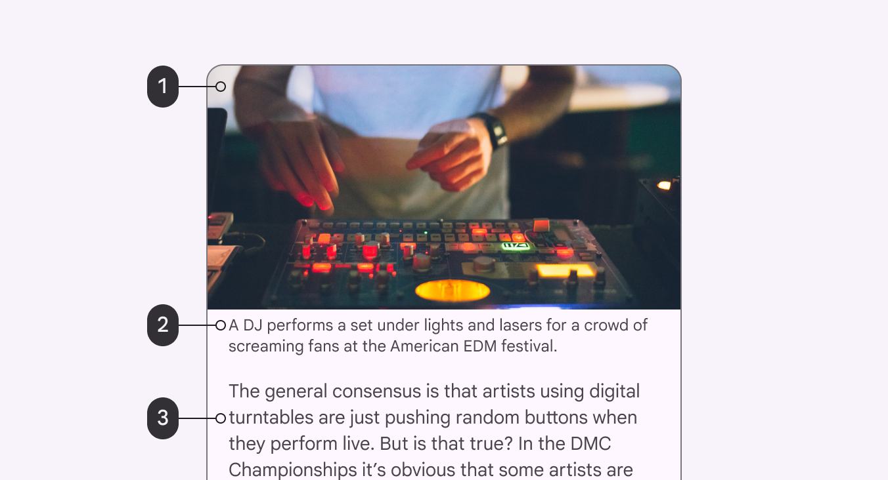
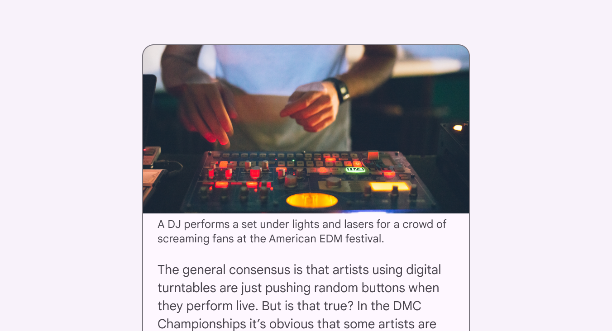
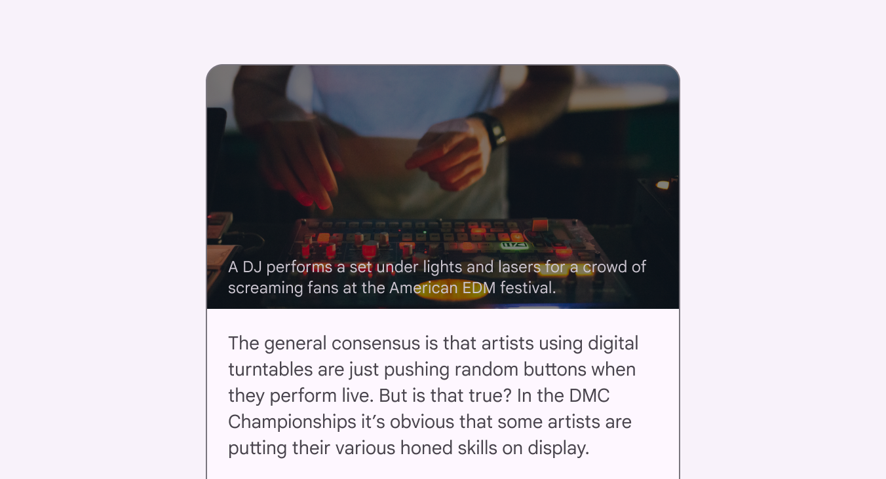
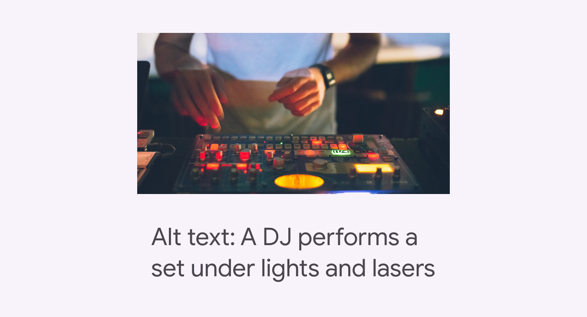
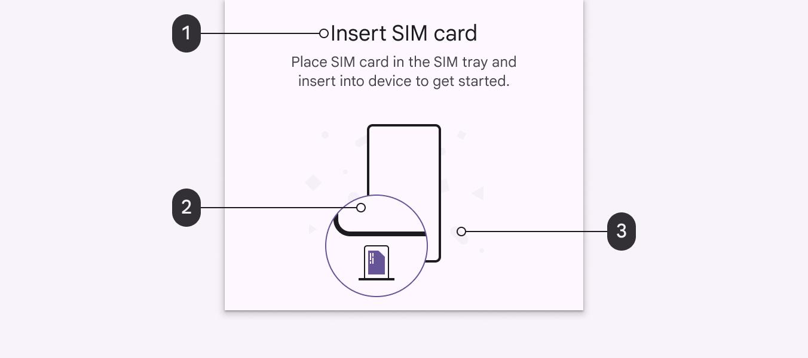

# Writing and text

Source: https://m3.material.io/foundations/writing/best-practices

## Accessibility text

Accessibility text refers to text that is used by screen reader accessibility software, such as Google’s TalkBack on Android, Apple’s VoiceOver on iOS, and Freedom Scientific’s JAWS on desktop. Screen readers read aloud the on-screen text and elements (such as buttons), including both visible and nonvisible alternative text.

### Adjacent text

To make an image more accessible, the text in and around images should consider presenting key information about the image.

*Image; Caption; Adjacent text*

### Captions

Captions are the text that appear below an image. They explain contextual information about the image to help the reader understand how it relates to the content. Both sighted and screen reader users rely on captions for descriptions of images.

*Do Use captions to help readers understand how the image relates to the content*

### Embedded text in images

Screen readers are unable to read text that is embedded in imagery. If there is essential information embedded as text in the image, include the essential information in the [alt text](https://m3.material.io/m3/pages/alt-text).

*Caution Take caution when embedding essential information anywhere a screenreader can't access, like text inside an image*

### Alternative text (Alt text)

Alt text helps translate a visual UI into a text-based UI. Alt text is a short label (up to 125 characters) in the code that describes an image for users who are unable to see them. Since alt text is only for images, there is no need to add “image of” or “picture of” to the alt text. A screen reader will read the alt text aloud in place of the image.

Alt text is valuable for sighted users, as well, because alt text appears if an image fails to load. Include targeted keywords to help inform the user about the image. Keywords can also improve search engine optimization (SEO).

[Learn more about writing alt text](https://m3.material.io/m3/pages/alt-text)

*Do Use alt text to convey what the image is showing in an informative, short phrase. Alt text example: A DJ performs a set under lights and lasers*

## Text color

### Essential and non-essential elements

Informative images have essential and non-essential elements. Essential information should have a 3:1 minimum color contrast for large text and 4.5:1 for small text.

*Essential: The text meets all contrast ratios and size requirements; Essential: An illustrative visual representation of the instructions that follows color contrast guidelines; Non-essential: The decorative elements create background and personality for the illustration. They do not relay information and do not have to meet Material's contrast requirements.*
