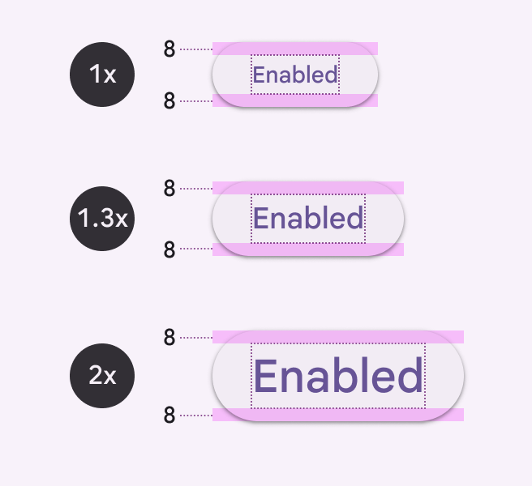
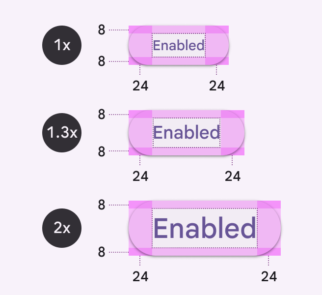
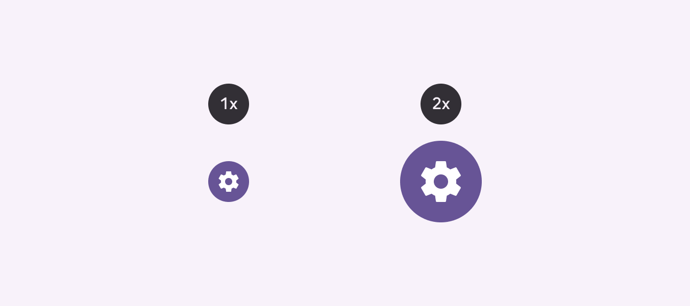
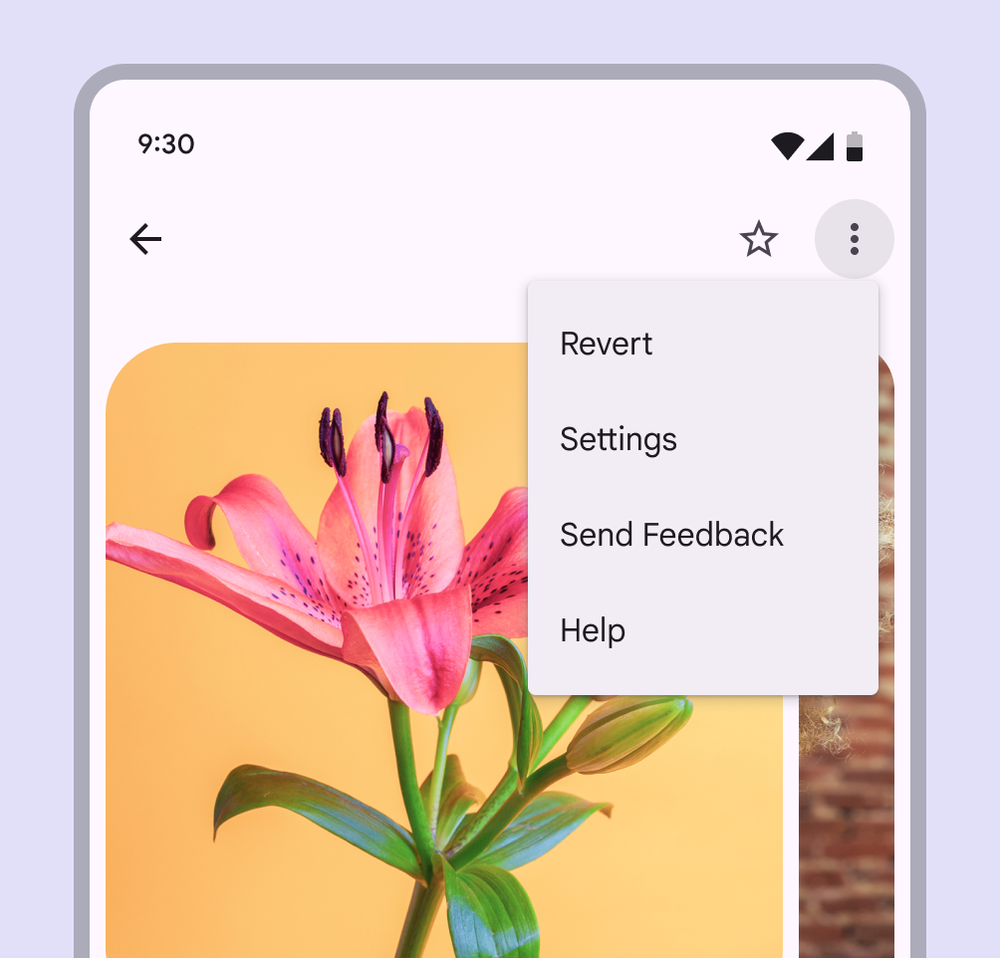
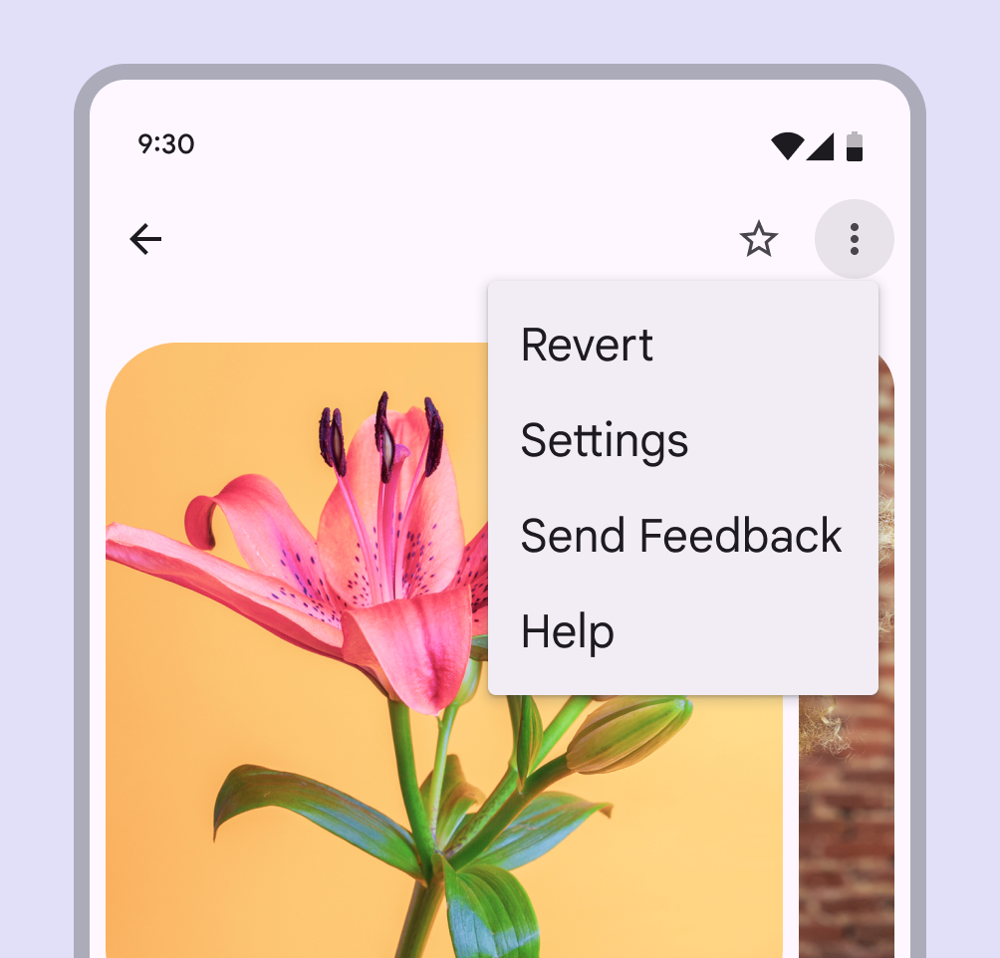
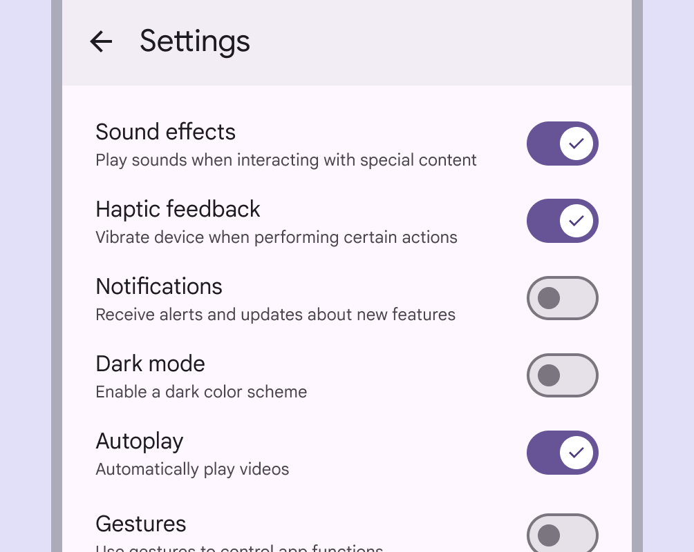

# Writing and text

Source: https://m3.material.io/foundations/writing/text-resizing

## Text resizing

### Background

People with low vision or those who prefer large text must be able to scale up the size of text in a UI. This adjustment is often performed through a device OS setting or in-app option.

UIs should support a minimum text increase of 200%.

Most components behave the same when text is resized:

- Text and line height scale up proportionally, multiplied by scale value
- Padding remains constant at 1x the default size
- Spacing between elements in a component remain constant at 1x the default size

*Button text displayed at 1x, 1.3x, and 2x scales. All have top and bottom padding of 8dp.*

*Left and right padding remains constant at 24dp as the text size increases.*

When text resizing isn't controlled by the device OS, offer multipliers such as 1.5x or 2x to allow users to increase the text size. Using multipliers to scale text can result in values with decimals, but this approach is more feasible for implementation.

To calculate a font's size using multipliers, take the default font size (density = 0) and multiply it by the scale value.

*For example, if a font is 14pt at 1x scale, then the font size should be 28pt when enlarged to 2x scale: (14pt) x (scale value 2) = 28.*

Components that don't include text, like progress indicators, checkboxes, or radio buttons, aren't affected by text resizing.

*Don’t When designing for text resizing, don't resize components without text*

*UI text displayed at 1x*

*UI text displayed at 2x in which only text and line height is enlarged; the padding between components remains the same as in the 1x UI.*

### Designing for large type

Large type is used regularly by people with low vision and those with difficulty processing written words. They tend to increase text size:

- To make it easier to read
- To limit interruptions and focus on one task
- To avoid overwhelming their senses

Use these methods to design a product to handle large type properly.

*Text that is too small and dense can appear overwhelming and difficult to read*

*Larger text can help people focus on one decision at a time and improve understanding*

### Methods

Avoid common text resizing issues by increasing container size, reflowing layout, enabling scrolling, and adding tooltips.

*Unresponsive container; unintentionally clipped text; Unresponsive text; Overlapping elements; Unwanted truncation*

#### Increase container size

Resizing containers can prevent text from overlapping, clipping, or truncating.

Consider how text might reflow in a way that allows the eye to follow the end of one line to the beginning of the following line.

#### Reflow the layout

Consider reflowing the layout, especially when components grow very long. To accommodate larger text, components can be stacked on top of one another, rather than fixed side-by-side.

*UI displayed at 1x: buttons positioned side-by-side in a standard layout; UI displayed at 2x: buttons stacked to fit the limited horizontal width after text is resized*

#### Enable content to scroll

When long strings of enlarged text don’t fit on one screen, consider adding a scrollbar to provide access to more content.

Vertical scrolling is preferable to horizontal. Users should only be asked to scroll in one direction, rather than both vertically and horizontally.

*Some screens may not be able to resize and display necessary content. In this situation a scrollbar can be used to access more text.*

#### Use touch & hold tooltips to provide enlarged labels

Some components, such as app bars and navigation bars, position text in spaces with stricter space and character limits. In these situations, you can add a tooltip to display enlarged content in the UI.

In this case, the text size in the component remains displayed at 1x while the scaled up text is displayed in a tooltip on touch & hold.

Tooltips are the best choice for displaying enlarged text in:

- Top app bar
- Navigation bar
- Navigation rail
- Tabs, when fixed to the top of a screen and don’t move off-screen upon scrolling

*Do Scale up text in an adjacent tooltip to maintain space in a UI for consuming content.*
