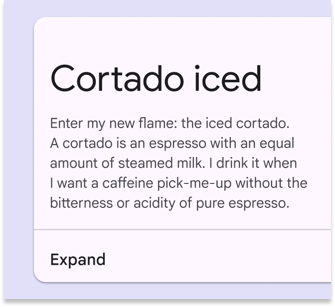
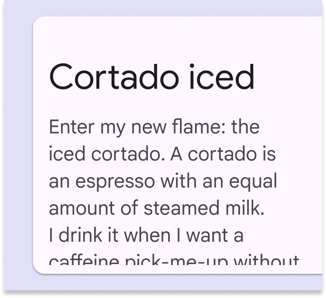
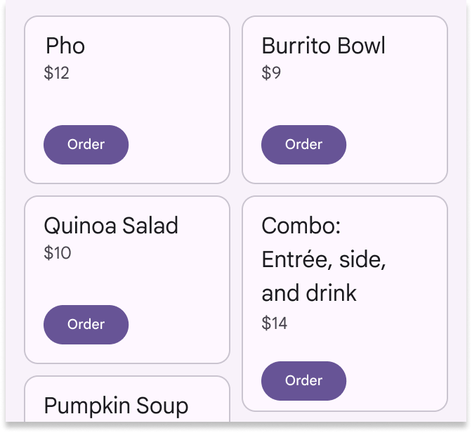
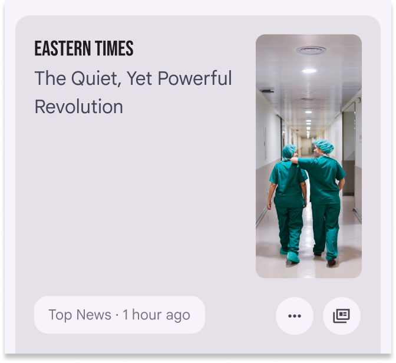
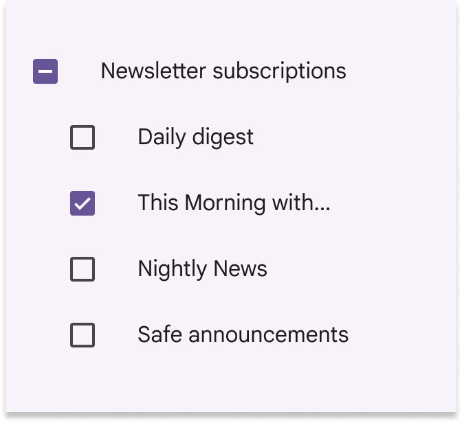

# Writing and text

Source: https://m3.material.io/foundations/writing/text-truncation

## Text truncation

Information should always be available to readers, even if text is truncated or wrapped.

### Background

Increased size of text, increased spacing between text, and translation into longer languages shouldn’t result in losing content. This requires designing for text truncation and creating designs flexible enough to accommodate any viewport size or increase in zoom. Some common methods of designing for larger text include text wrapping, increased height or width of components, and truncation with ellipses and hover or link.

### Requirements

Content, understandability, and functionality must not be lost when users modify their type settings. There may be exceptions to these requirements for non-Latin alphabet languages.

### Text wrapping

- “Wrapped” text extends from one line to another, increasing the height of the text container
- Text should be wrapped when it’s critical, to ensure understandability, or when there’s space in the component

*Do Wrap text, and if it still doesn’t fit, provide a way for users to see more*

*Don’t cut off text without providing a way for users to view it*

### Height and width of components

- Some components can extend vertically or horizontally for more text

*Do Use flexible component containers that change size to fit their content*

*Don’t Avoid setting text size limits that don’t fit the space in a component. Use all space available.*

### Ellipses with hover or link

- Truncated text can be replaced with an ellipsis if the text is available through a tooltip or link
- Links can be used when they’re contained in the text that’s truncated, and when the link displays what's been truncated
- If there's an ellipsis, but no way to show the truncated text, it is not accessible
- Note that this option can add difficulty for some people

[Video: A calendar with a cursor hovering over a day of the week displays a tooltip that reads “Tuesday.”](assets/asset-005-do-use-links-to-reveal-truncated-text-when-b98eb7f92d.webp)

*Do Use links to reveal truncated text when space is limited, such as the ability to click a linked card to see an expanded view of its text*

*Don’t truncate content without providing users another way to see it*
