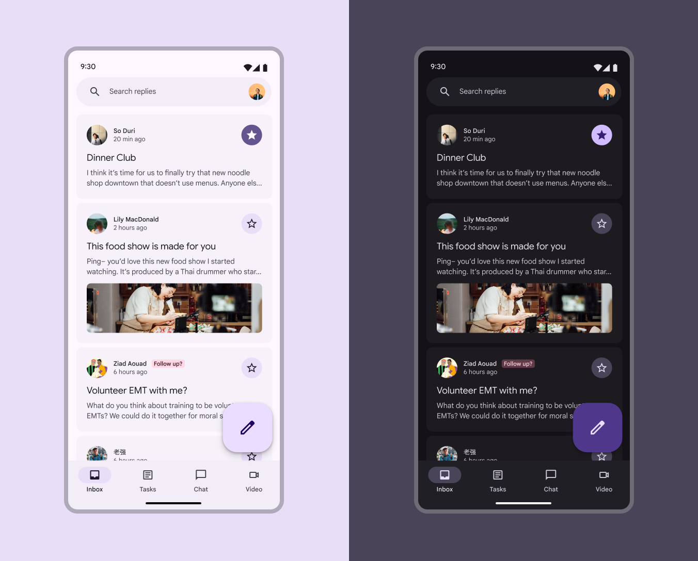
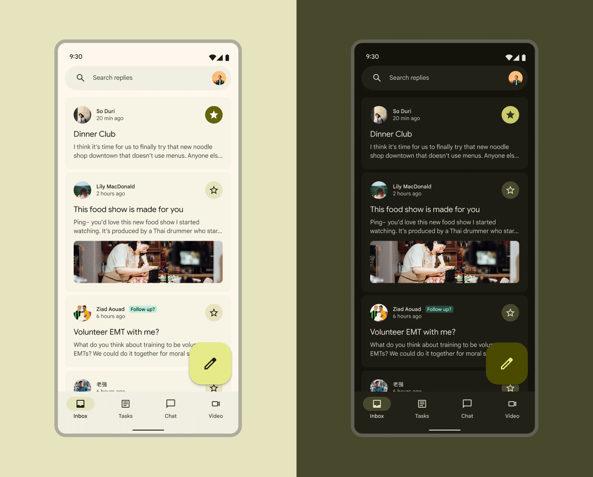

# Choosing a scheme

Source: https://m3.material.io/styles/color/choosing-a-scheme

A color scheme describes all of a product's colors, color roles, and color relationships across light and dark themes.

There are two kinds of color schemes in Material:

1. Static (Static colors are UI colors that don't change based on the user's wallpaper or in-app content. Once assigned to their respective color roles and UI elements, the colors remain constant. [Jump to static color](https://m3.material.io/m3/pages/choosing-a-scheme/tab-1#3e05eecf-d91d-446f-b478-47cd144cce17))
2. Dynamic (Dynamic color takes a single color from a user's wallpaper or in-app content and creates an accessible color scheme assigned to elements in the UI. [Jump to dynamic color](https://m3.material.io/m3/pages/choosing-a-scheme/tab-1#00d5b65d-dd10-42c5-baaf-cd129cc2c1b5))

[Video: Types of color schemes in Material Design 3.](assets/asset-001-discover-when-and-how-to-use-different-color-c8ac223345.webp)

*Discover when and how to use different color schemes, including static baseline, dynamic user-generated, and dynamic content-based color schemes*

## Static color

Working with static color will be the most like other color workflows you may have used. Static colors won't ever change based on user input or in-app content.

Material provides a static baseline color scheme including default color assignments and mappings.

*Colors are static in the baseline color scheme*

What you get:

✓ Accessible colors ✓ Pre-made baseline color scheme ✓ Colors that won't break an M2 app ✓ Ability to easily update to dynamic color in the future

What you don't get:

✗ Personalized colors ✗ Colors that change based on user's wallpaper or in-app content ✗ User-controlled contrast settings

### Use static (baseline) color if

- You're not ready to implement dynamic color (though it'll be easy to switch when you are)
- Your product is migrating from M2 and you want to get M3 features without breaking your app
- Your product is for enterprise users who wouldn't benefit from personalized color or user-controlled contrast settings
- Your product is built for iOS

Choosing baseline? [Start designing with the baseline colors](https://m3.material.io/m3/pages/static/baseline)

## Dynamic color

Dynamic color will automatically create an accessible color scheme based on a specific source color.

Because the UI could end up with any number of different source colors, it's best to initially design it using the baseline color scheme so you can ensure the right color roles are mapped to the right components in your product. You'll use the Material Theme Builder (Material Theme Builder (MTB) is a Figma plugin that allows markers to emulate the color extraction process for dynamic color and create custom tonal schemes. [Get the MTB](https://www.figma.com/community/plugin/1034969338659738588/material-theme-builder)) to see how your UI mocks look across a range of source colors and adjust it as-needed.

*While the actual colors may change, the color role mappings remain the same across dynamic color schemes*

What you get:

✓ Accessible colors ✓ Personalized colors that change based on a user's wallpaper or in-app content ✓ Ability to use advanced customizations like chroma fidelity to alter the dynamic color output ✓ User-controlled contrast settings

What you don't get:

✗ Exact same UI colors across all devices

### Use dynamic color if

- You want your product to showcase personalization
- You want the colors to change base on a user's wallpaper or in-app content
- You want your product to offer user-controlled contrast settings
- You aren't sure if you'll need to also use a mix of dynamic and static colors (you can customize your color scheme to include static colors as your work progresses)

Choosing dynamic color? Next [pick a dynamic color source](https://m3.material.io/m3/pages/dynamic/choosing-a-source)
