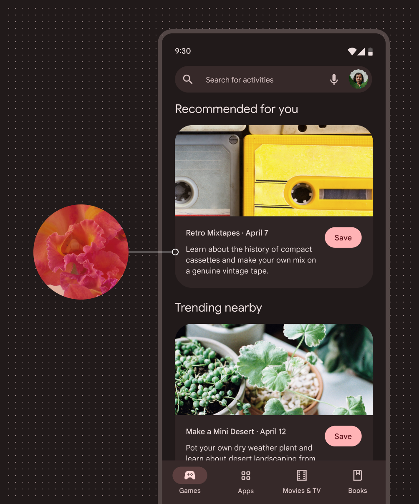
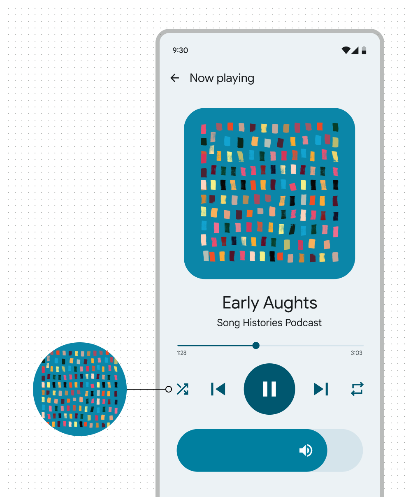
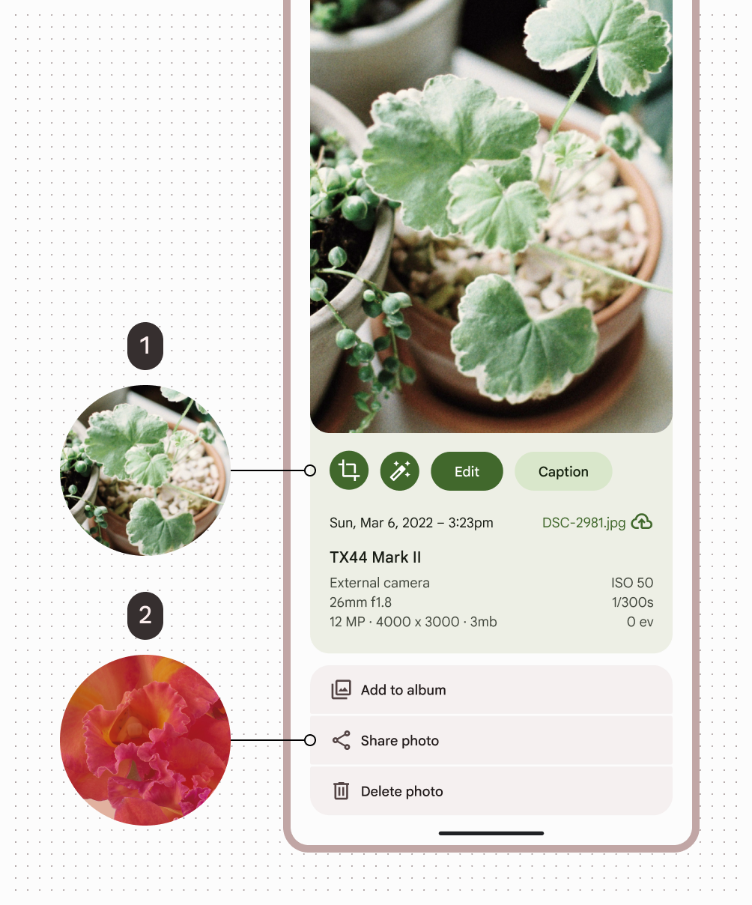

# Dynamic color schemes

Source: https://m3.material.io/styles/color/dynamic/choosing-a-source

There are two ways your product can get a source color:

1. User-generated color from a user's wallpaper
2. Content-based color from in-app content like a music album or book cover

Learn [how dynamic color works](https://m3.material.io/m3/pages/color/how-the-system-works)

Both types of dynamic color are accessible and personalized, so deciding which type to use is based on what's most important in the product: content or user preference.

## User-generated color

Choose a user-generated color source if:

- Your users would benefit from a personalized experience that's tested well
- You want your product to showcase the latest and greatest Material features

[Get started with user-generated color](https://m3.material.io/m3/pages/dynamic/user-generated-source)

*An app colored with a dynamic user-generated scheme sourced from the user's red wallpaper.*

## Content-based color

Choose a content-based color source if:

- Content is front-and-center in your product
- Your team can do a bit of advanced customization
- Content-based color would support usability of specific features like media players
- Content-based color is best used for contained screen elements adjacent to the source image, though the source image is not always visible.

[Get started with content-based color](https://m3.material.io/m3/pages/dynamic/content-based-source)

*An app colored with a dynamic content-based scheme sourced from the in-app album art.*

## Multiple color sources

Choose to use multiple color sources if:

- Your product requirements meet multiple criteria above
- You don't mind doing a bit of advanced customization

[Get started with user-generated color](https://m3.material.io/m3/pages/dynamic/user-generated-source) before customizing

*Content-based color sourced from the in-app photo; User-generated color sourced from the user's wallpaper*
