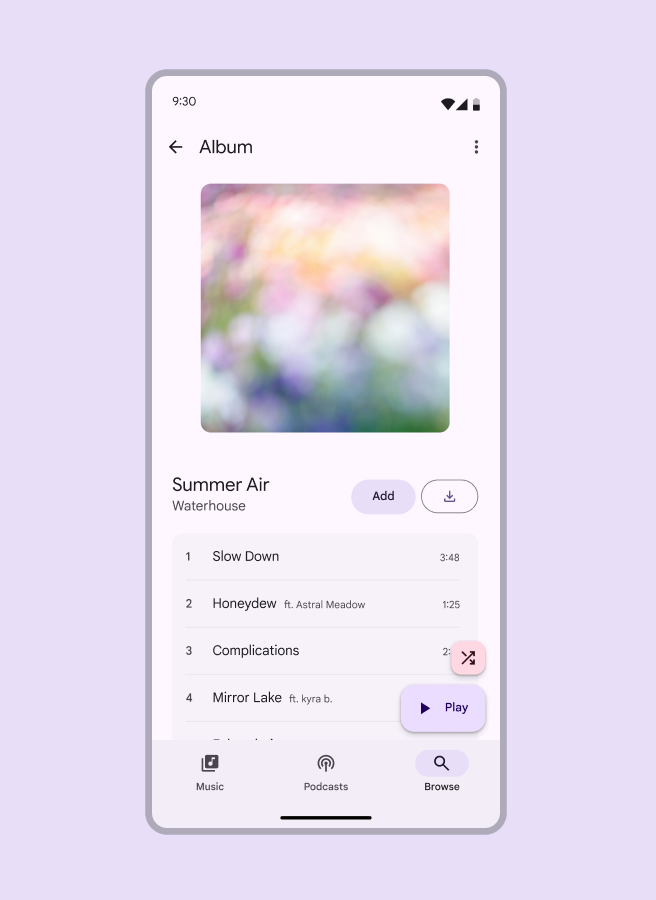
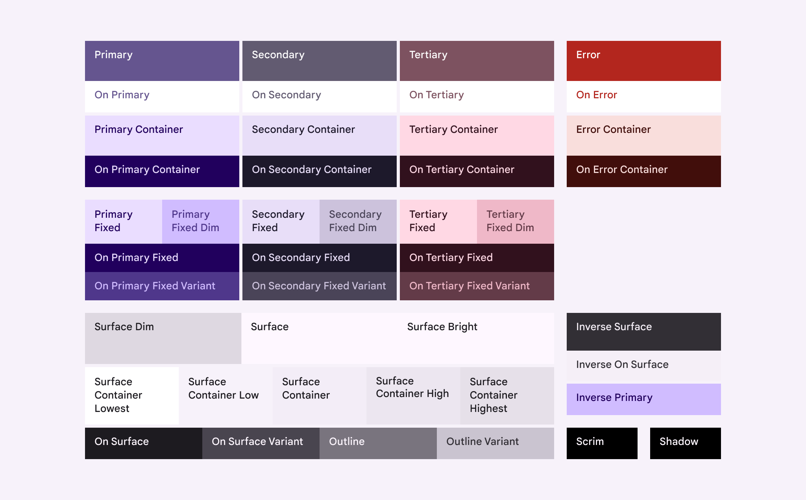
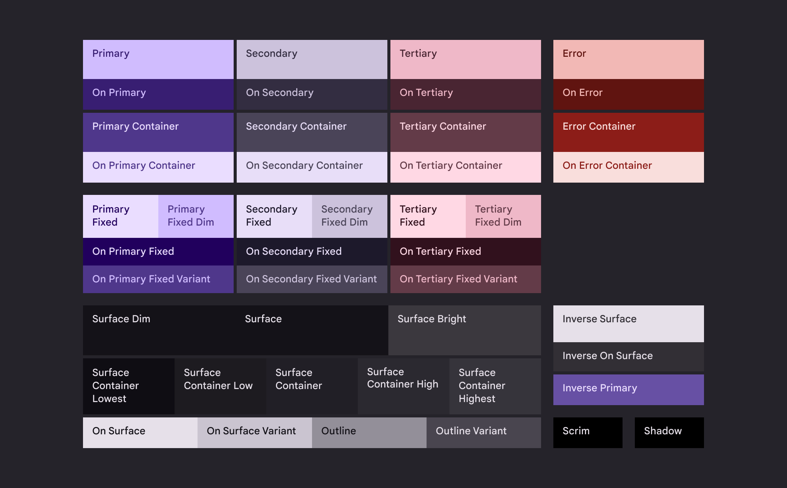

# Static color schemes

Source: https://m3.material.io/styles/color/static/baseline

Baseline is the default static color scheme. It uses accessible color pairings and includes colors for both light and dark themes.

With the baseline color scheme, end-users see

- An accessible UI with static colors

*Music app with the static baseline color scheme*

*News app with the static baseline color scheme*

## Baseline colors

Get baseline colors in Figma using the Material Theme Builder (Material Theme Builder (MTB) is a Figma plugin that allows markers to emulate the color extraction process for dynamic color and create custom tonal schemes. [Get the MTB](https://www.figma.com/community/plugin/1034969338659738588/material-theme-builder)).

*Baseline scheme colors in light theme*

*Baseline scheme colors in dark theme*

## Baseline color tokens

- Token sets: Color schemes; Palettes
- Visible groups: Primary colors; Secondary colors; Tertiary colors; Error colors; Surface colors; Outline colors; Add-ons

## Design with baseline

### Use the Design Kit and M3 baseline colors in new design files

1. Create your Figma file. Enable the [M3 Design Kit](https://www.figma.com/community/file/1035203688168086460) in your Assets panel.
2. Compose screens and layouts using Material Components from the design kit
3. Apply M3 baseline color roles to custom components and UI elements by hovering on the element's color property in the Design panel on the right of the screen and selecting the Style icon (four dots). This opens a selection dialog.
4. Search for "M3" to see the baseline color roles
5. Select the baseline color role that most closely matches the use case and intent (see [Color roles](https://m3.material.io/m3/pages/color-roles) for more information on what color to use where)
6. Repeat until all custom elements are using M3 baseline color roles

### Apply baseline colors to an existing file

First, get the M3 baseline colors into your file

1. Open your Figma design file. Select the Actions menu (or Ctrl/Command+K).
2. Find the [Material Theme Builder plugin](https://www.figma.com/community/plugin/1034969338659738588/material-theme-builder) and select Run. This will open a plugin dialog showing the default color scheme, including Core colors and Extended colors.
3. Open the plugin's Settings (gear icon at lower right of dialog) and select the checkbox for Generate State Layers. This makes sure there are color for the state layers needed to design interactions. [Learn more about state layers](https://m3.material.io/m3/pages/interaction-states/state-layers)
4. Navigate out of settings.
5. With the Current Theme dropdown at the top of the dialog, select Baseline.
6. Select the frames or components in your file and then hit Swap in the bottom right of the dialog. This will automatically update the colors for any M3 Design Kit components.

Then, update any remaining non-M3 color styles

1. Manually change any hex values or non-M3 color styles by selecting all and looking through the Selection colors in the Design panel on the right of the screen.
2. Any colors that don't start with "M3" need to be replaced with a corresponding baseline color.
3. Hover on a non-M3 color row in the Design panel and select the Style icon (four dots). This opens a selection dialog.
4. Search for "M3" to see the baseline color roles.
5. Select the baseline color role that most closely matches that color's use case (see [Color roles](https://m3.material.io/m3/pages/color-roles) for more information on what color to use where) and select Use style to apply it to the selected objects.
6. Repeat until all non-M3 colors in the file have been replaced with M3 baseline color roles.

Need to make adjustments to the scheme? Check out [Advanced customizations](https://m3.material.io/m3/pages/advanced/overview)
