# Color system

Source: https://m3.material.io/styles/color/system/how-the-system-works

## It's like paint-by-number

Imagine your product screen as a paint-by-number canvas:

- Each element on the screen has a number
- Each number is assigned a color

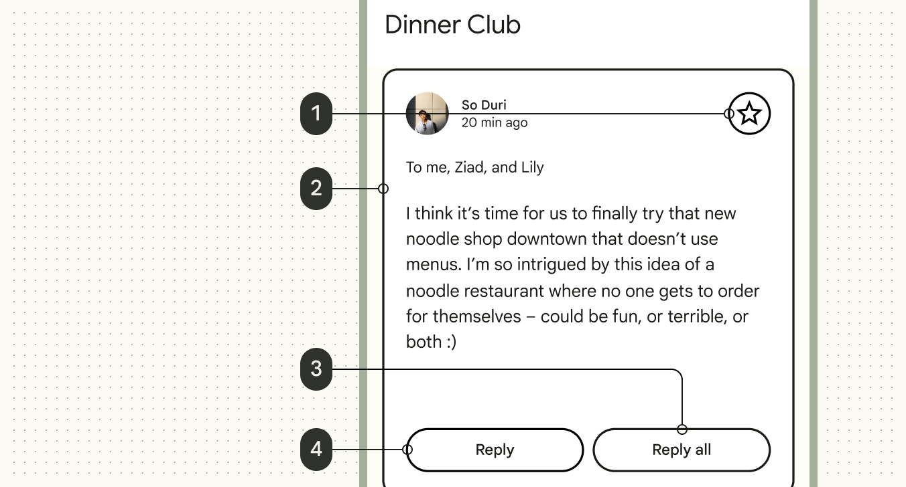

*Each part of a UI is assigned a "number," and each "number" is assigned a color*

You can hand-pick a color for every "number" to create a static color scheme.

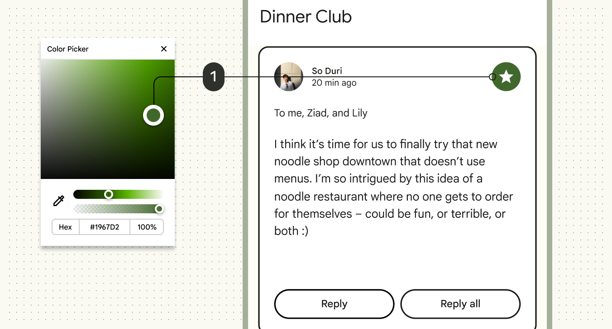

*Static colors are hand-picked, like this green icon button*

But now, you can also use Material's dynamic color system to automatically generate an entire palette of accessible colors for each "number" from a single source.

This source can be a user's wallpaper, or in-app content like imagery. If the source changes, the product colors update to match.

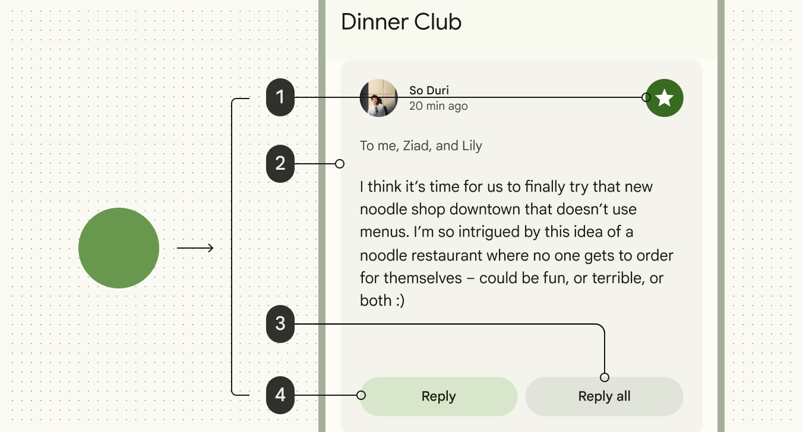

*Colors are generated dynamically from a user's wallpaper or in-app content*

You can customize how dynamic color appears in your product by:

- Setting the color source
- Adding static or harmonized colors
- Changing which "numbers" are assigned to which elements

[Learn about advanced customizations](https://m3.material.io/m3/pages/advanced/define-new-colors)

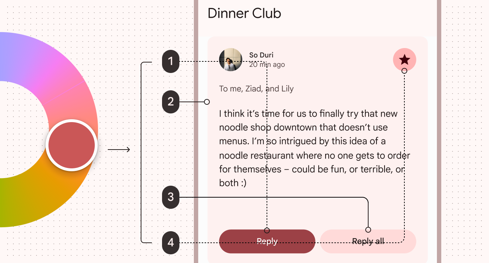

*The color source can be changed, automatically changing the color scheme. The UI elements can have other "numbers" assigned to them.*

## Essential terms

### Color role

Like the "numbers" on a paint-by-number canvas, color roles are assigned to specific UI elements. They have semantic names like primary, on primary, and primary container, and matching color tokens. [See all color roles](https://m3.material.io/m3/pages/color-roles)

### Dynamic color

Dynamic color takes a single color from a user's wallpaper or in-app content and creates an accessible color scheme assigned to elements in the UI. If the user's wallpaper or the in-app content changes, the colors in the UI will change to match.

### Static color

UI colors that don't change based on the user's wallpaper or in-app content. Static colors can be hand-picked or generated in design tools like the Material Theme Builder (Material Theme Builder (MTB) is a Figma plugin that allows markers to emulate the color extraction process for dynamic color and create custom tonal schemes. [Material Theme Builder](https://www.figma.com/community/plugin/1034969338659738588/material-theme-builder)). Once assigned to their respective color roles and UX elements, the colors remain constant.

#### Baseline static color

The default static color scheme for Material products. [See the baseline color scheme](https://m3.material.io/m3/pages/static/)

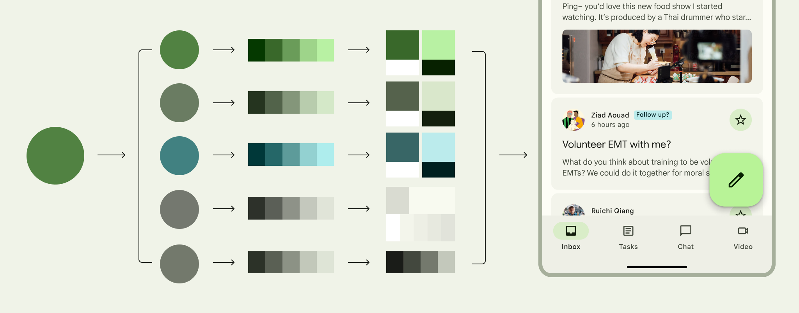

*The dynamic color process is automatic. A single source color is used to generate five key colors, which are used to make tonal palettes. Tones from the palettes are then assigned to color roles, which are in turn assigned to elements of the UI.*

[Video: How dynamic color schemes are created.](assets/asset-006-the-system-generates-dynamic-color-schemes-using-colors-aa52808f54.webp)

*The system generates dynamic color schemes using colors from images like wallpapers and in-app content*

## How dynamic color generates color schemes

### 1. It starts with a source color

There are three ways to get a source color.

#### A. Generate it from a wallpaper

User-generated color is sourced from a user's personal wallpaper. The wallpaper is digitally analyzed through a process called quantization, and a single color is selected as the source color.

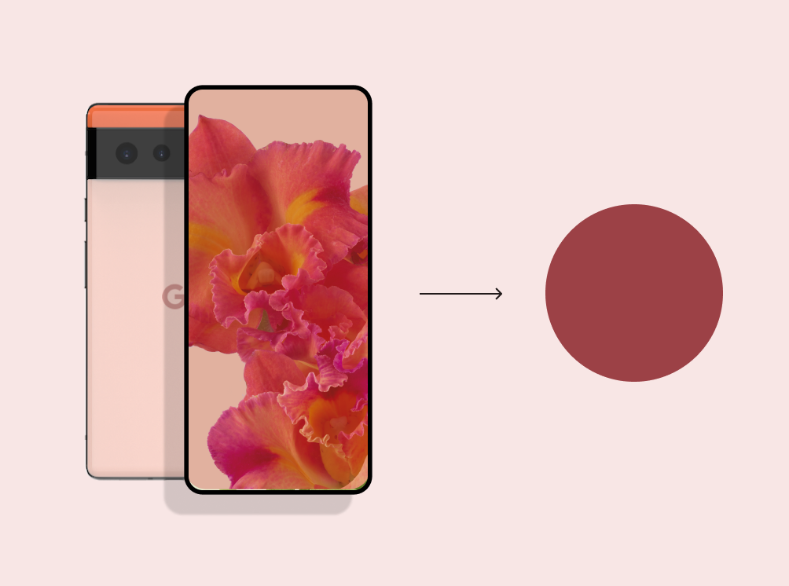

*Source color from a user's wallpaper*

#### B. Generate it from in-app content

Content-based color is sources from in-app content, like an album thumbnail image, logo, or video preview.

Like user-generated color, the image is digitally analyzed through quantization, and a single color selected as the source color.

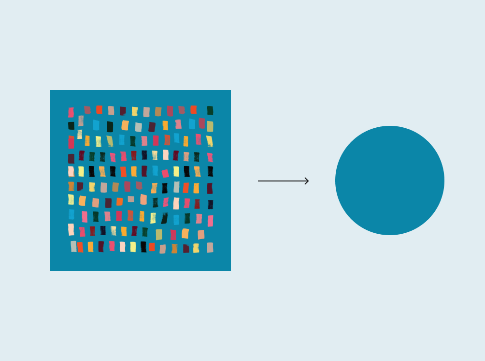

*Source color from in-app-content*

#### C. Pick it by hand

A hand-picked source color is deliberately selected by a designer.

Did you know? The baseline static color scheme (Baseline is the default static color scheme for Material products. It includes colors for both light and dark themes. [More on baseline color](https://m3.material.io/m3/pages/static/)) uses a hand-picked source color.

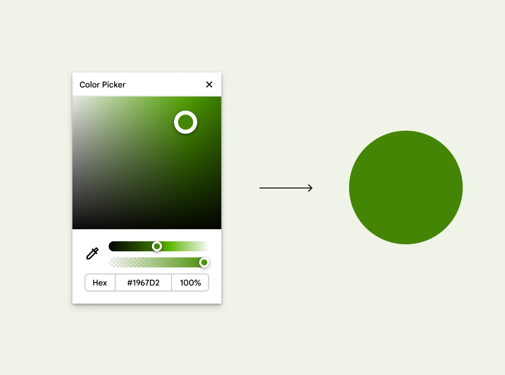

*Source color hand-picked by a designer*

### 2. Feed the source color into an algorithm

Dynamic color is powered by the [Material Color Utilities](https://github.com/material-foundation/material-color-utilities) (MCU), a set of color libraries containing algorithms and utilities that develop color themes and schemes in your app.

There are many color algorithms, but the most common ones are:

- User-generated color algorithm Uses personal wallpaper to identify source color. Maps colors of specific tones (lighter or darker) into the scheme according to a combination of system design choices and user preferences.
- Content-based color algorithm Uses image for source color. Tones are adjusted to match the appearance of the source image, while maintaining accessible contrast.
- Custom colors Colors closely match the chosen input colors, such as those representing brand or semantic meaning.

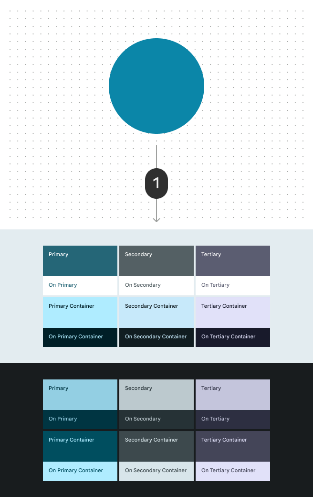

*1. When run through the user-generated color algorithm, the source color is turned into a full color scheme*

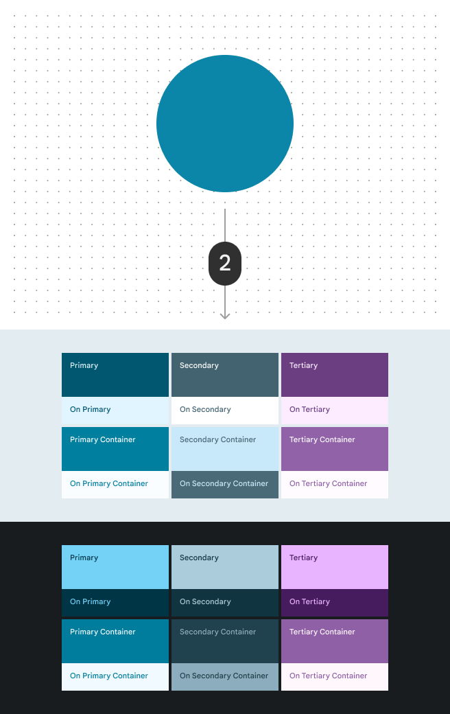

*2. When run through content-based color algorithm, the same source color creates a slightly different color scheme. Some tones are adjusted to better match the appearance of the source image.*

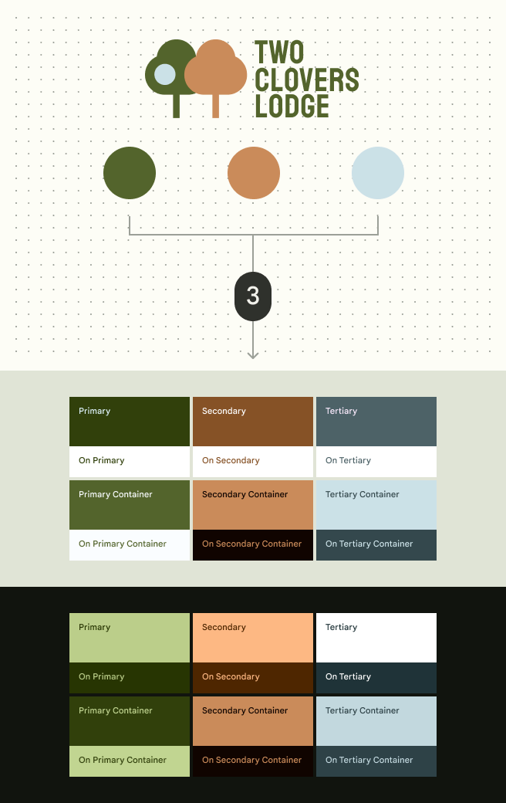

*3. Custom colors, such as brand colors, can individually run through the algorithm to create a custom scheme that matches the brand*

### 3. The algorithm generates key colors

Material's color algorithms manipulate the source color's hue (Hue is the perception of a color as red, orange, yellow, green, blue, violet, and so on. [More on hue, chrome, and tone](https://m3.material.io/m3/pages/color/how-the-system-works#395813c8-b314-48d1-bb55-266f421eb3a4)) and chroma (Chroma is how colorful or neutral (grey, black or white) a color appears. [More on hue, chrome, and tone](https://m3.material.io/m3/pages/color/how-the-system-works#395813c8-b314-48d1-bb55-266f421eb3a4)) to generate five complimentary key colors.

1. Primary
2. Secondary
3. Tertiary
4. Neutral
5. Neutral variant

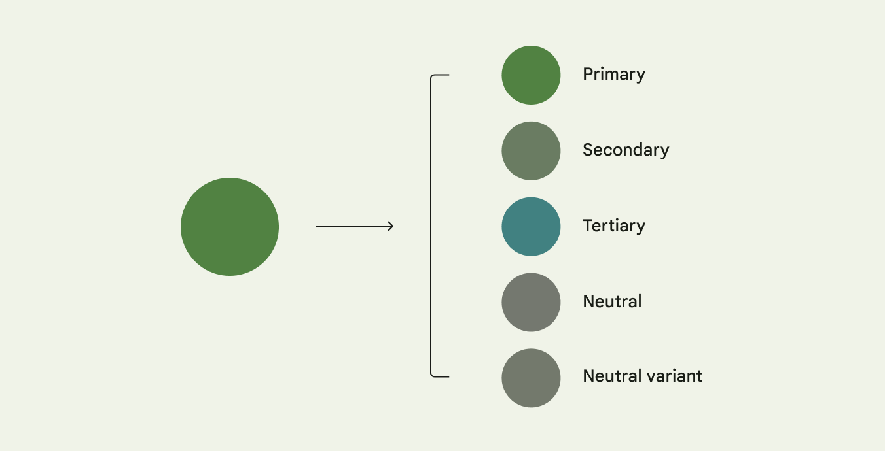

*A source color generates five key colors*

### 4. The algorithm creates tonal palettes

The system then manipulates tone (Tone is how light or dark a color appears. Tone is sometimes also referred to as luminance. [More on hue, chroma, and tone](https://m3.material.io/m3/pages/color/how-the-system-works#dc7848f3-b094-4f9a-9e50-bfa5a5029617)) and chroma (Chroma is how colorful or neutral (grey, black or white) a color appears. [More on hue, chroma, and tone](https://m3.material.io/m3/pages/color/how-the-system-works#e4d1c787-e92f-4d6e-a757-cd6d5c3b298e)) values to create a tonal palette for each key color. Colors in these palettes are given a number from 0 to 100 in increments of 10, as well as 95, 98, and 99. Some palettes include more values.

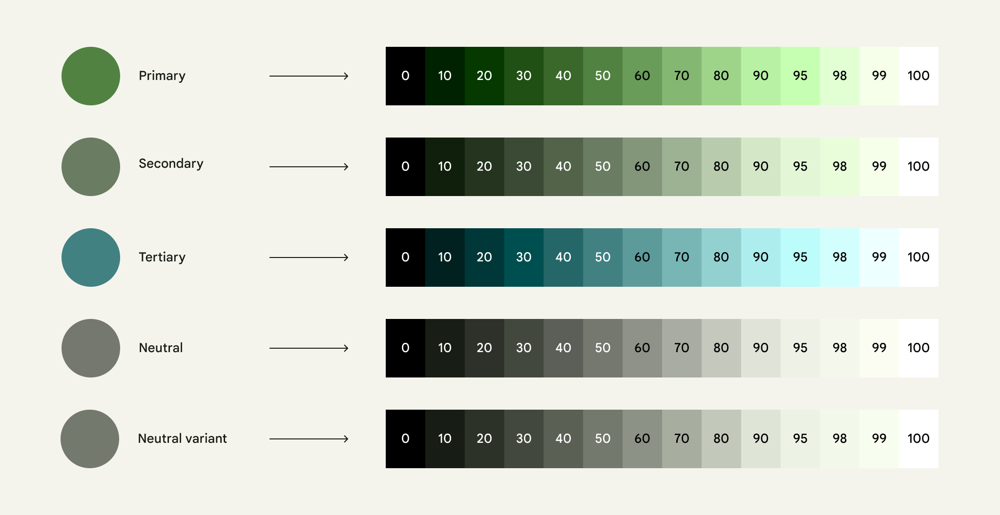

*The smaller the tonal value, the darker the color*

### 5. The algorithm assigns tones to color roles

The algorithm uses accessible color relationships (For example, a dark surface color is algorithmically paired with a light text label color so the UI automatically meets contrast requirements. [More on color relationships](https://m3.material.io/m3/pages/color/how-the-system-works#e1e92a3b-8702-46b6-8132-58321aa600bd)) to assign specific tones to the 26 color roles (Color roles are assigned to UI elements based on emphasis, container type, and relationship with other elements. This ensures proper contrast and usage in any color scheme. [More on color roles](https://m3.material.io/m3/pages/color-roles)) in both light and dark theme.

For example, the algorithm assigns the color tone primary40 to the p rimary role and the tone primary100 to the o n primary role.

[See all color roles](https://m3.material.io/m3/pages/color-roles)

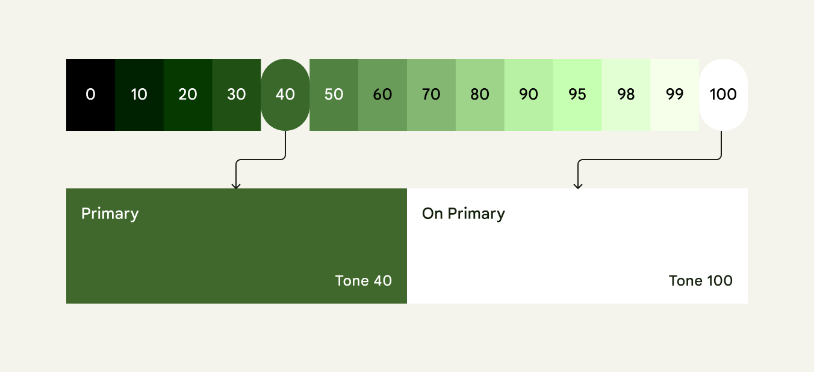

*Tones from the tonal palette are assigned to different roles*

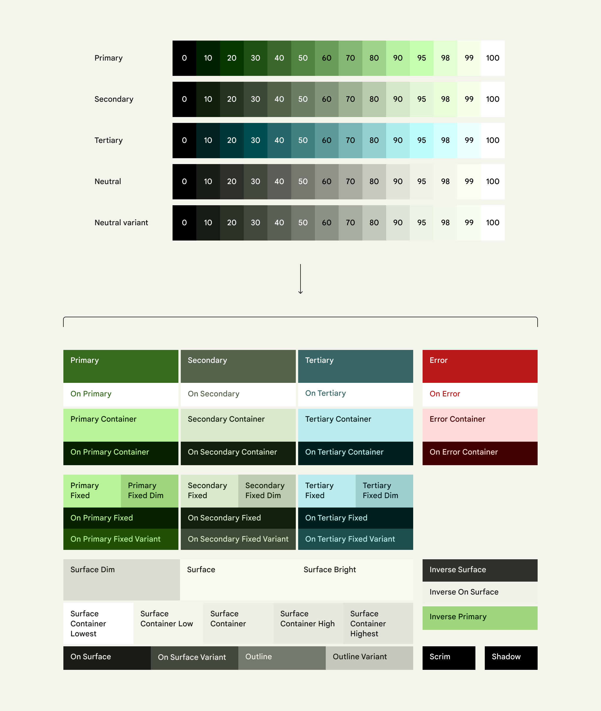

*Colors from the five tonal palettes are assigned to color roles. For example, primary roles are picked from the primary tonal palette, while surface roles are picked from the neutral tonal palette.*

Dark theme (A dark theme is a low-light version of a UI that displays mostly dark surfaces.) colors are also automatically assigned so that apps receive both light and dark themes through a single set of color roles.

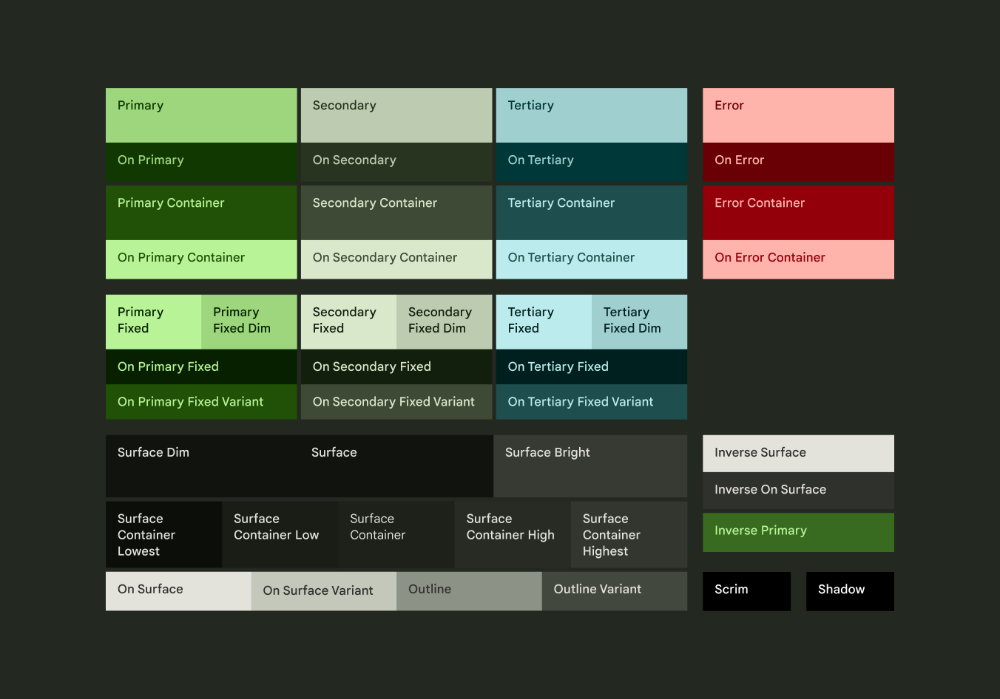

*The same color roles are used in light and dark themes*

### 6. The new colors are applied to the UI

The 26 standard color roles are already assigned to elements of the UI. When a new source color is picked, the UI dynamically changes color.

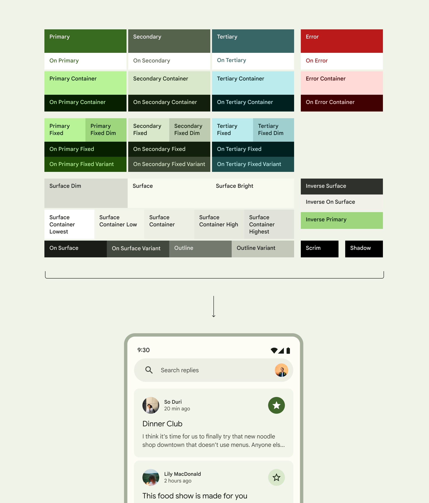

*Color roles assigned to the UI*

## Color roles support three levels of contrast

In addition to light and dark theme, color roles also support three levels of contrast. This helps people select the contrast setting that best suits their vision needs:

- Standard (default)
- Medium
- High

The standard contrast emphasizes visual hierarchy using high and low contrast elements. People with vision disabilities may choose medium or high contrast options for better support.

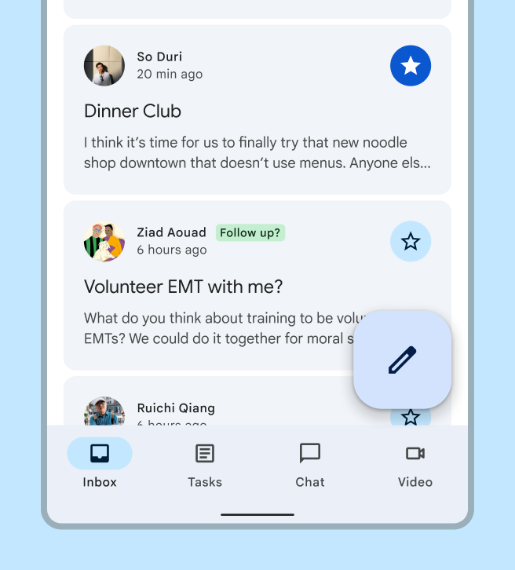

*Standard contrast The baseline color scheme already uses mixed levels of contrast to reduce cognitive load*

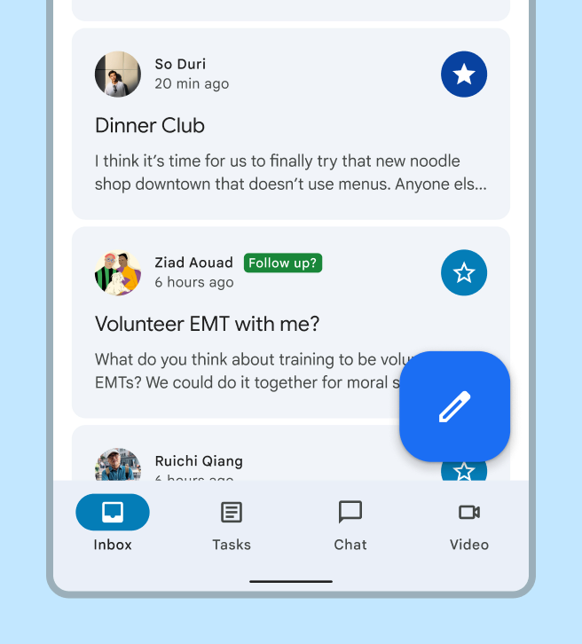

*Medium contrast Provides a minimum contrast ratio of 3:1 for those who need more contrast, but may experience visual discomfort with higher contrasts from effects like halation.*

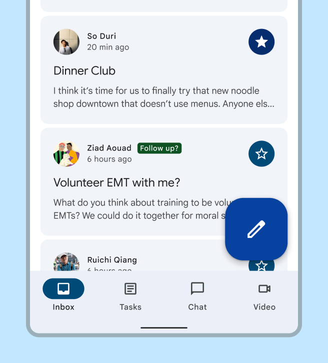

*High contrast Further emphasizes essential elements with a 7:1 contrast ratio to reduce visual distractions and enable users to focus. For example, high contrast is applied to the content in a card but not the card container.*

The contrast settings are automatically applied to both light and dark themes.

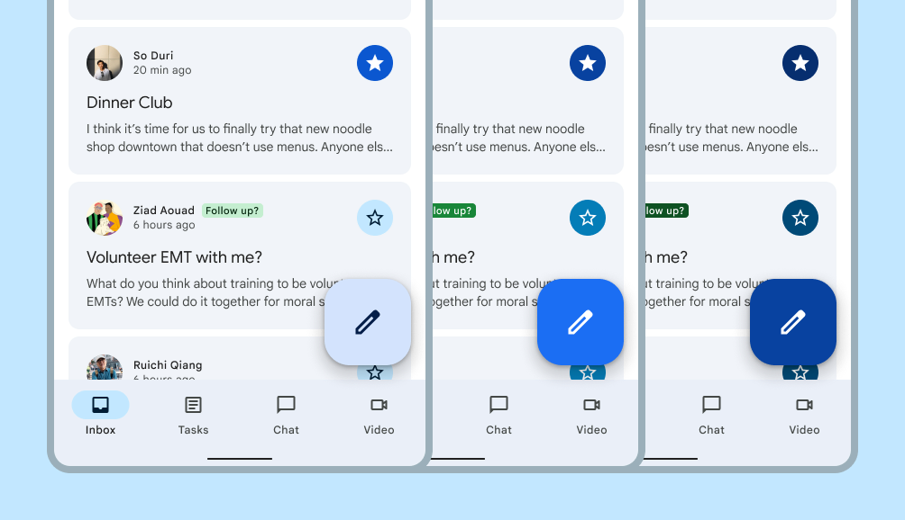

*Light theme*

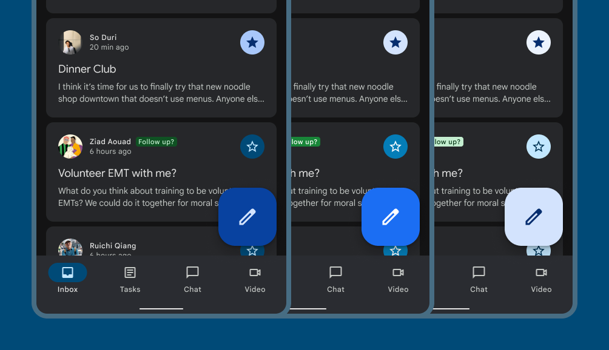

*Dark theme*

Custom components can support contrast levels by using Material's appropriate color roles (Color roles are assigned to UI elements based on emphasis, container type, and relationship with other elements. This ensures proper contrast and usage in any color scheme. [More on color roles](https://m3.material.io/m3/pages/color-roles)). For example, use primary container and on primary container.

Use design tokens (Design tokens are the building blocks of all UI elements. The same tokens are used in designs, tools, and code. [More on design tokens](https://m3.material.io/m3/pages/design-tokens/overview)) to apply color roles to custom components.

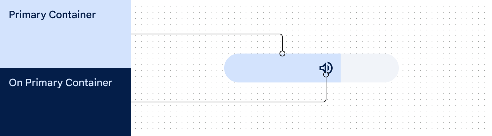

*A custom volume slider can use p rimary container and on primary container color roles to support contrast levels*

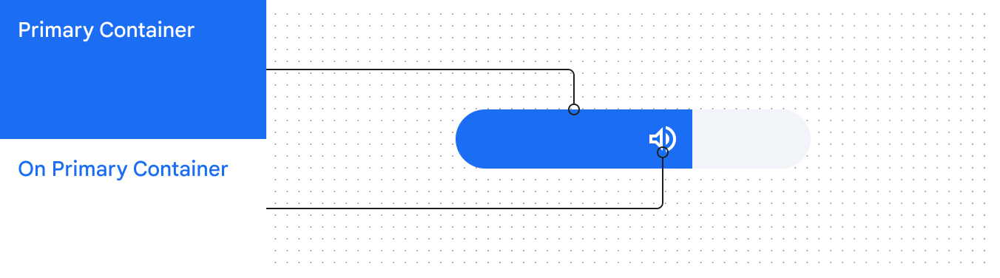

*At medium and other contrast levels, those color roles apply the necessary new color values*

## Pairing accessible tones

The system manipulates hue, chroma, and tone ( HCT) values (HCT is a color space which defines all colors by assigning number values for three dimensions: hue, chroma, and tone. [More on hue, chroma, and tone](https://m3.material.io/m3/pages/color/how-the-system-works#395813c8-b314-48d1-bb55-266f421eb3a4)) to create a tonal palette for each color with tones ranging from 0 to 100.

Color has physical limitations—whether it's actual physics, our own biological visual limitations, or the limitations of on-screen color rendering. For example, some hues cannot exist with certain chroma or tones. Color limitations are the reason colors such as bright light blue or bright light red are not quite possible. This is why the chroma value may increase or decrease for some tones in a tonal palette.

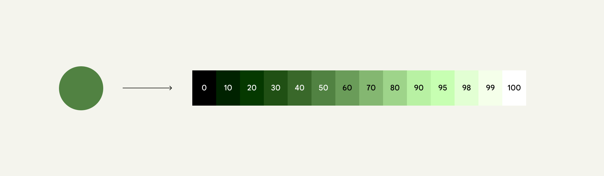

*Tonal values range from 0 (black) to 100 (white). The smaller the tonal value, the darker the color.*

Material's color algorithms use these palettes to find and pair contrasting tones, creating accessible color combinations.

Because tone can describe the lightness or darkness of a color, it's used to define accessible color relationships. Those relationships are built into Material's color algorithms.

For example, the algorithms assign a dark tone to a button's container color and a light tone to its label color, ensuring that the colors have a 3:1 contrast.

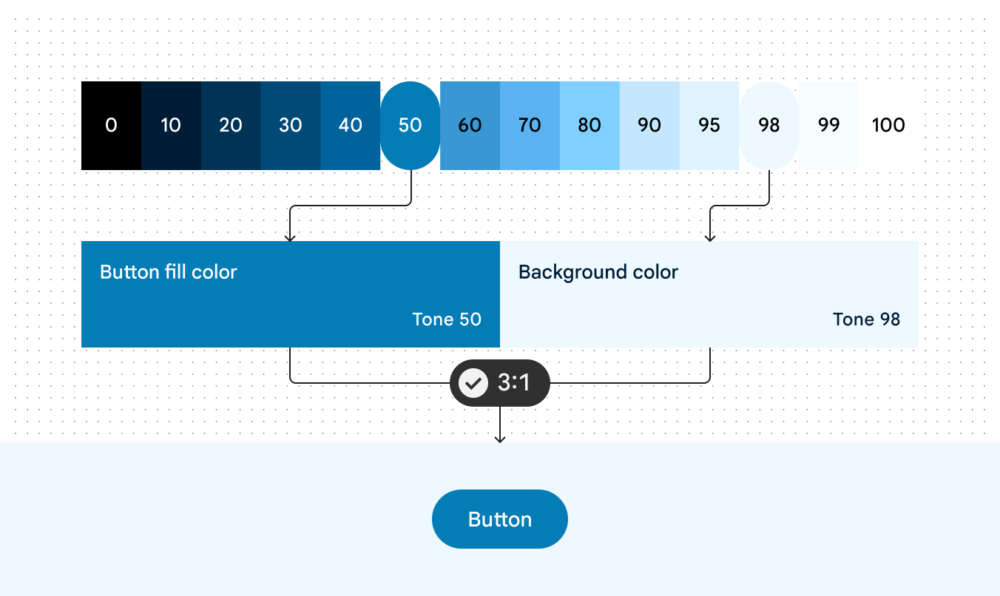

*Using tones 50 and 98 for a button and its label creates an accessible 3:1 contrast*

For even more contrast, the algorithms assign tones even farther apart, achieving a 7:1 contrast.

This is the concept powering user-controlled contrast features.

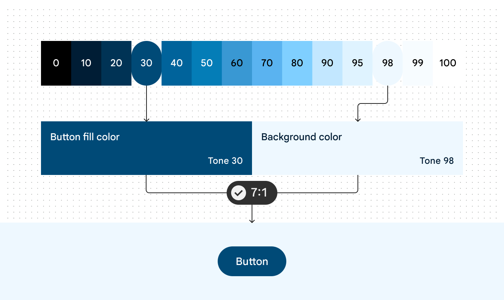

*Using colors of tones 30 and 98 for a button and its label create a 7:1 contrast*

## Defining colors with hue, chroma, and tone (HCT)

The system uses a color space called HCT, which defines all colors using three dimensions: hue, chroma, and tone.

Changing HCT values lets you manipulate colors in flexible but predictable ways. Unlike other color spaces (like HSL or RGB), HCT allows the manipulation of a color's hue and chroma without affecting its tone. Watch to learn more:

[Video: Animated video explaining the three color dimensions (hue, chroma, and tone) and how they relate to accessible color schemes.](assets/asset-029-hue-chroma-and-tone-are-the-three-color-9aa029765b.webp)

*Hue, chroma, and tone are the three color dimensions used to create accessible color schemes*

### Hue

Hue is the perception of a color as red, orange, yellow, green, blue, violet, and so on. Hue is quantified by a number ranging from 0-360 and is a circular spectrum (values 0 and 360 are the same hue).

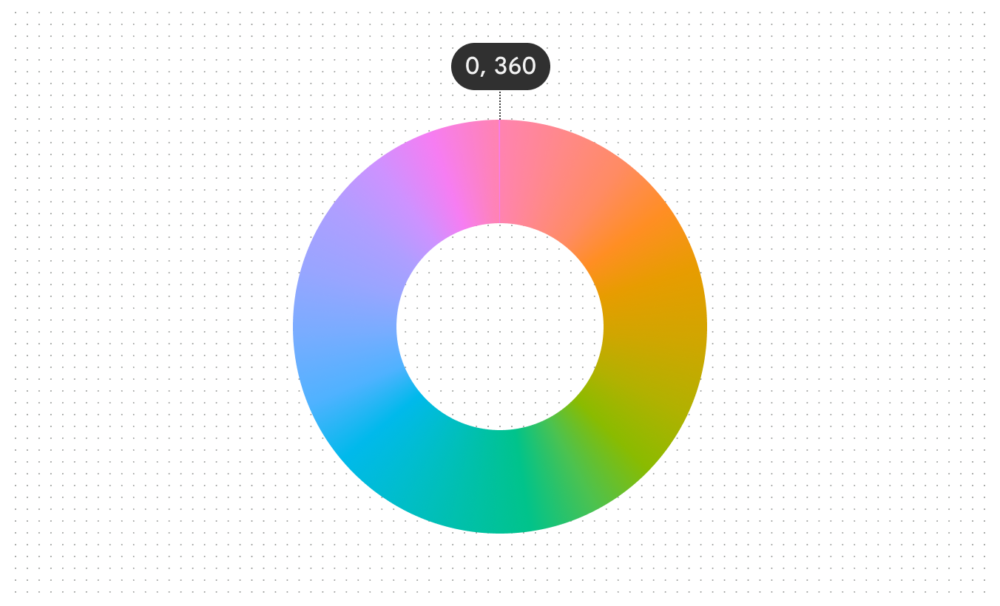

*360 degree hue spectrum*

### Chroma

Chroma is how colorful or neutral (grey, black or white) a color appears. Chroma is quantified by a number ranging from 0 (completely grey, black or white) to infinity (most vibrant), though Chroma values in HCT top out at roughly 120.

Because of biological and screen rendering limitations, different hues and different tones will have different maximal chroma values.

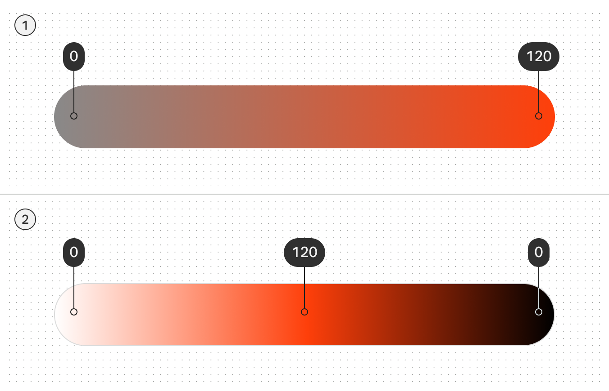

*The higher the color purity, the higher the chroma; Note how lightening and darkening a hue also affects its chroma value*

### Tone

Tone is how light or dark a color appears. Tone is sometimes also referred to as luminance. Tone is quantified by a number ranging from 0 (pure black, no luminance) to 100 (pure white, complete luminance).

Tone is crucial for visual accessibility because it determines contrast. Colors with a greater difference in tone create higher contrast, while those with a smaller difference create lower contrast.

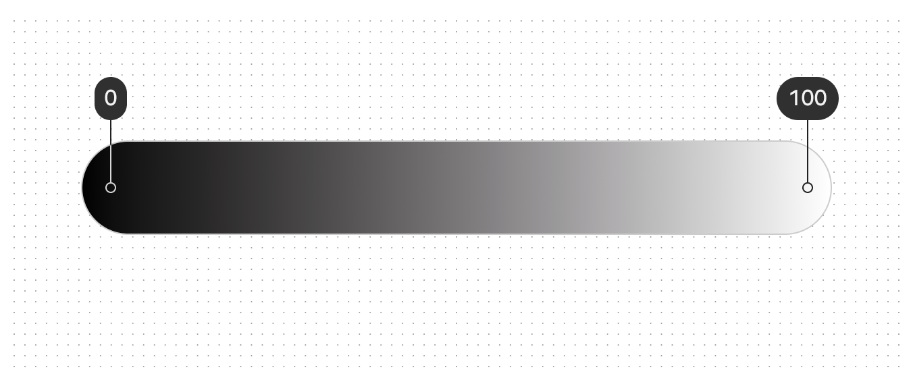

*The 100 tone is always 100% white, the lightest tone in the range; the 0 tone is 100% black, the darkest tone in the range*
