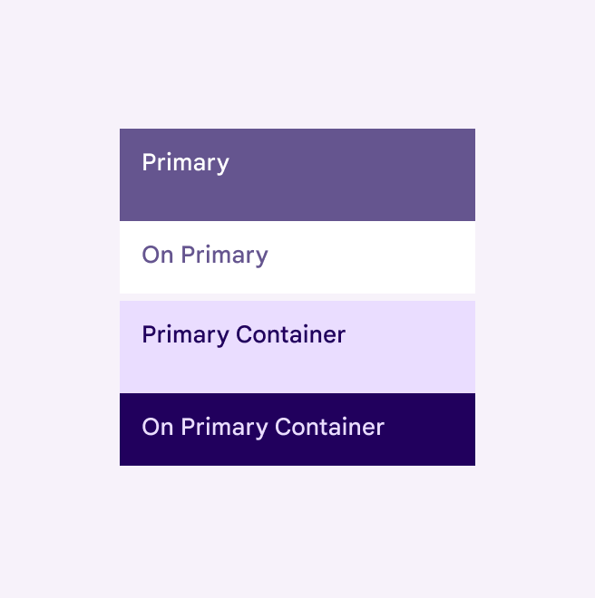
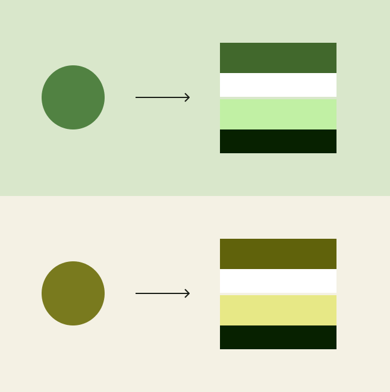
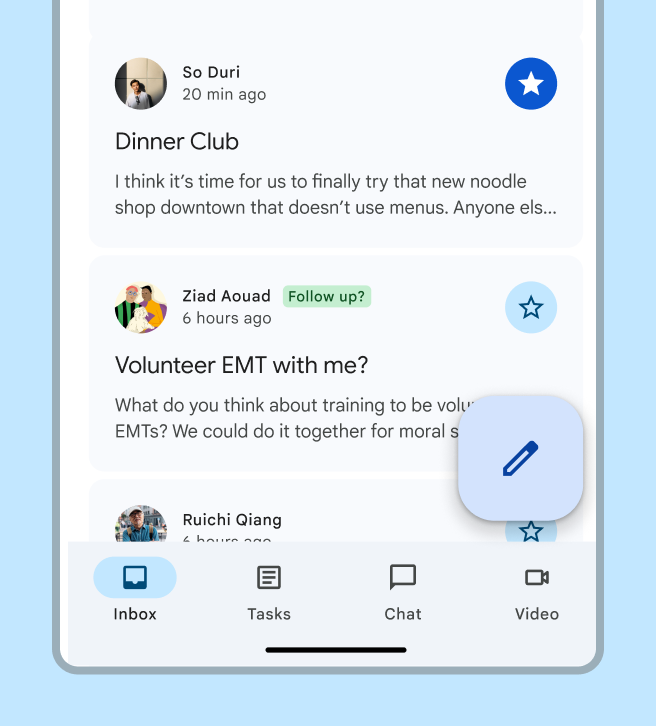
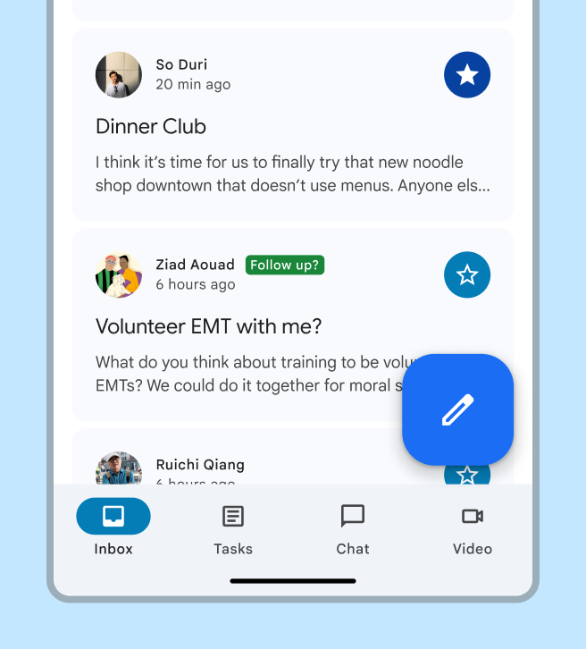
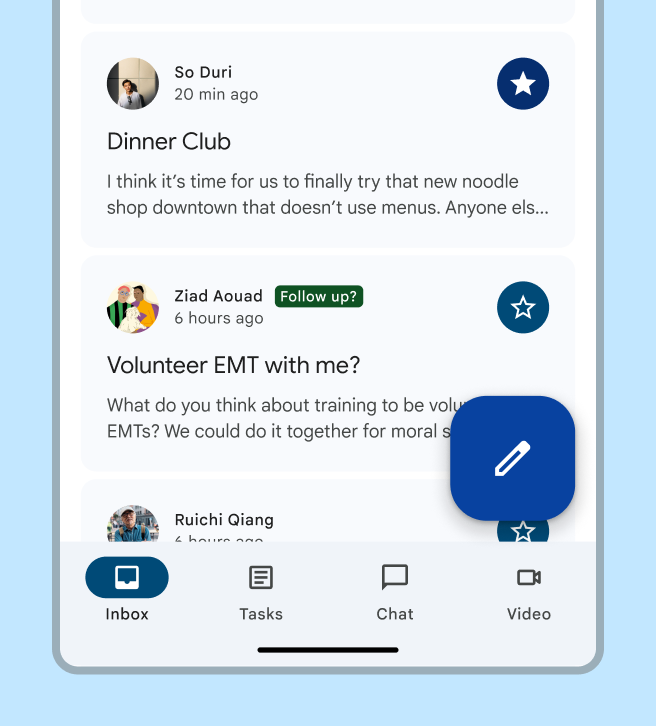
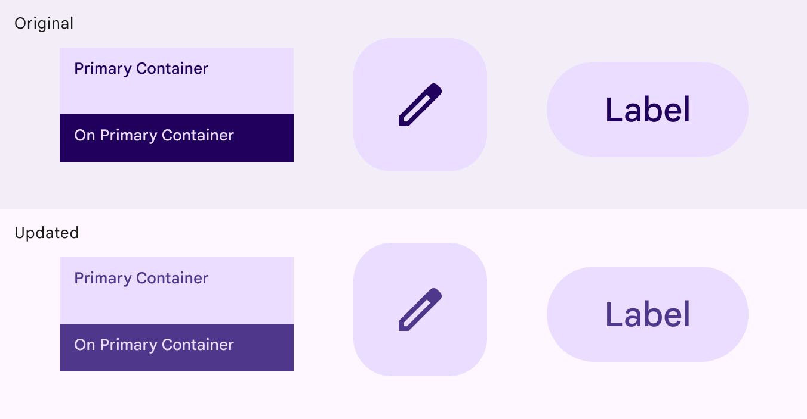
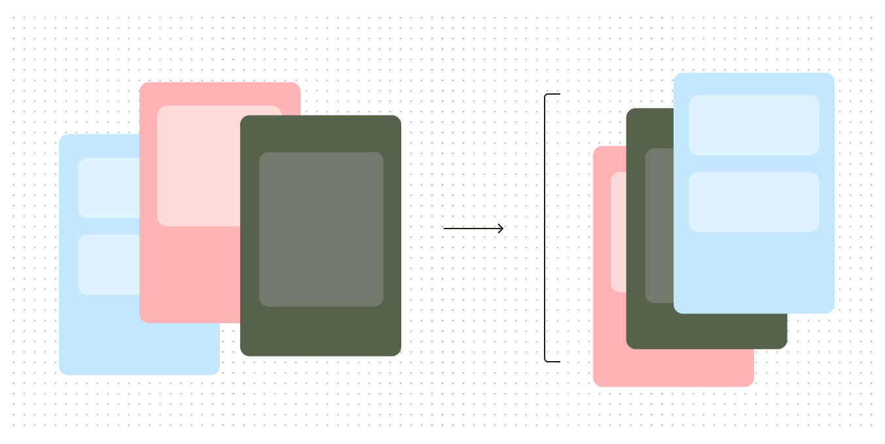
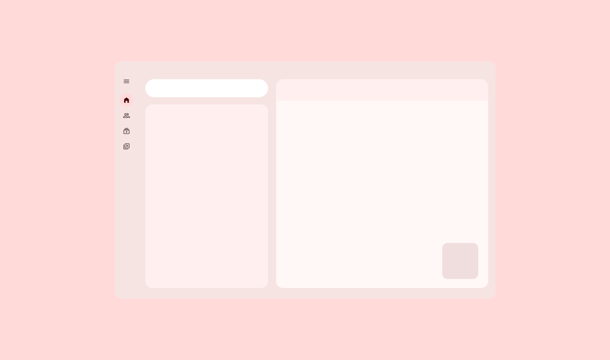
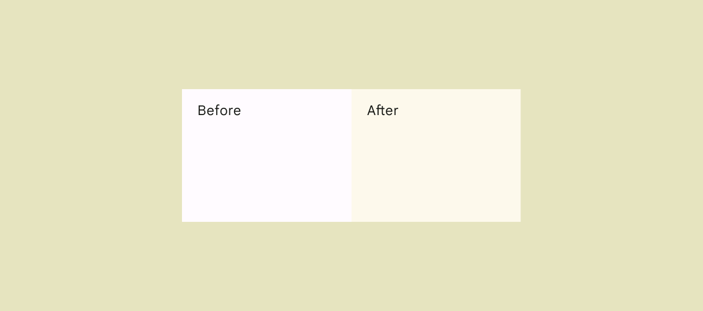

# Color system

Source: https://m3.material.io/styles/color/system/overview

The Material color system includes:

- Built-in set of accessible color relationships (For example, a dark surface color is algorithmically paired with a light text label color so the UI automatically meets contrast requirements. [More on color relationships](https://m3.material.io/m3/pages/color/how-the-system-works#e1e92a3b-8702-46b6-8132-58321aa600bd))
- 26+ color roles (Color roles are assigned to UI elements based on emphasis, container type, and relationship with other elements. This ensures proper contrast and usage in any color scheme. [More on color roles](https://m3.material.io/m3/pages/color-roles)) mapped to Material Components
- Built-in dark theme (A dark theme is a low-light version of a UI that displays mostly dark surfaces.) colors
- Static baseline color scheme (Baseline is the default static color scheme for Material products. It includes colors for both light and dark themes. [More on the baseline color scheme](https://m3.material.io/m3/pages/static/baseline)) with default colors assigned to each color role
- Dynamic color (Dynamic color takes a single color from a user's wallpaper or in-app content and creates an accessible color scheme assigned to elements in the UI. [More on dynamic color](https://m3.material.io/m3/pages/dynamic/choosing-a-source)) features including user-generated (User-generated color dynamically creates a color scheme from a user's wallpaper. [More on user-generated color](https://m3.material.io/m3/pages/dynamic/user-generated-source)) and content-based color (Content-based color dynamically creates a color scheme from in-app content like a music album or book cover. [More on content-based color](https://m3.material.io/m3/pages/dynamic/content-based-source))

[Learn how the system works](https://m3.material.io/m3/pages/color/how-the-system-works)

For products migrating from M2 to M3, start by mapping the baseline color scheme (Baseline is the default static color scheme for Material products. It includes colors for both light and dark themes. [More on the baseline color scheme](https://m3.material.io/m3/pages/static/baseline)) to your existing product. It can easily switch to dynamic color when ready.

[Video: Introduction to color guidance](assets/asset-001-learn-about-the-value-and-function-of-material-360f5049e8.webp)

*Learn about the value and function of Material 3’s dynamic color system and how it differs from past color systems*

*The baseline color scheme doesn't dynamically change*

*A dynamic color scheme changes the UI's colors based on different inputs, like a wallpaper*

*Specific colors, such as semantic colors, can be set to not dynamically change*

Products with dynamic color (Dynamic color takes a single color from a user's wallpaper or in-app content and creates an accessible color scheme assigned to elements in the UI. [More on dynamic color](https://m3.material.io/m3/pages/dynamic/choosing-a-source)) can automatically generate and assign colors to each element in the UI.

This provides:

- Personalized UI
- Accessible contrast
- User-controlled contrast
- Automatic dark theme

[Video: Screen of an email app changing color from red to green to yellow](assets/asset-005-the-ui-colors-change-dynamically-8f06acfe0f.webp)

*The UI colors change dynamically*

## Resources

| Type | Link | Status |
| --- | --- | --- |
| Design | [Design Kit](https://www.figma.com/community/file/1035203688168086460) (Figma) | Available |
| Implementation | [MDC-Android](https://github.com/material-components/material-components-android/blob/master/docs/theming/Color.md) | Available |
| Implementation | [Jetpack Compose](https://developer.android.com/develop/ui/compose/designsystems/material3#dynamic_color_schemes) | Available |
| Implementation | [Flutter](https://pub.dev/packages/dynamic_color) | Available |
| Tools | [Material Theme Builder](https://www.figma.com/community/plugin/1034969338659738588/material-theme-builder) | Available |

## What's new

May 2025

### Three levels of contrast

Color roles support three levels of contrast so people can select the one that best suits their vision needs. Contrasts also are tokenized.

*Standard contrast*

*Medium contrast*

*High contrast*

August 2024

### More colorful text and icons

The following color roles are updated in light theme to be more colorful while still having accessible color contrast:

- On primary container
- On secondary container
- On tertiary container
- On error container

Affected components:

- Badges
- Bottom app bar
- Buttons Buttons Extended FAB FAB Icon buttons Segmented buttons
- Chips
- Lists
- Menus
- Navigation bar
- Navigation drawer
- Navigation rail
- Switches

- Buttons
- Extended FAB
- FAB
- Icon buttons
- Segmented buttons

*Colors used for text and icons now appear more colorful*

Oct 2023

### Reorganized guidelines

Same color system, explained in a new way. Updated sections include:

- [How the system works](https://m3.material.io/m3/pages/color/how-the-system-works)
- [Advanced customizations](https://m3.material.io/m3/pages/advanced/overview)
- [Color resources](https://m3.material.io/m3/pages/color-resources)

*The guidelines have been reorganized and updated*

Feb 2023

### Tone-based surface colors

[Tone-based surface color roles](https://material.io/blog/tone-based-surface-color-m3) have replaced the previous approach of surfaces at +1 to +5 elevation. The new color roles are not tied to elevation (Elevation is the distance between two surfaces on the z-axis. [More on elevation](https://m3.material.io/m3/pages/elevation/overview)) and offer more flexibility and support for color features, such as user-controlled contrast (User-controlled contrast is a dynamic color feature enabling users to choose from one of three levels of color contrast: standard, medium, and high. [More on user-controlled contrast](https://m3.material.io/m3/pages/color/how-the-system-works#0207ef40-7f0d-4da8-9280-f062aa6b3e04)).

*New tone-based surface colors offer more flexibility and support*

Technical changes were made to align the color system with Android SysUI:

- Updated the default light theme surface from tone 99 to tone 98
- Updated the chroma for the neutral palette, increasing it from 4 to 6
- Slightly darkened surface roles in dark theme

*Changes in tone and chroma in the default light theme surface*

Feb 2023

### Additional accent colors

Additional accent colors in the scheme provide more flexibility and choice for color application. In particular, a new set of fixed colors (Fixed colors keep the same color value in light and dark themes, as opposed to regular container colors, which change tone between themes, or static colors, which don't change at all. [More on fixed colors](https://m3.material.io/m3/pages/color-roles/tab-1#26b6a882-064d-4668-b096-c51142477850)) for the primary, secondary, and tertiary accent groups provide colors which stay the same across light and dark themes.

*Additional accent colors provide more choice for color application*
