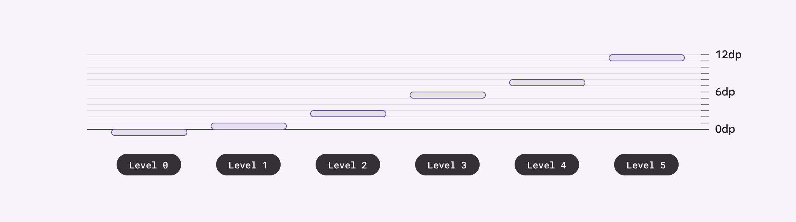
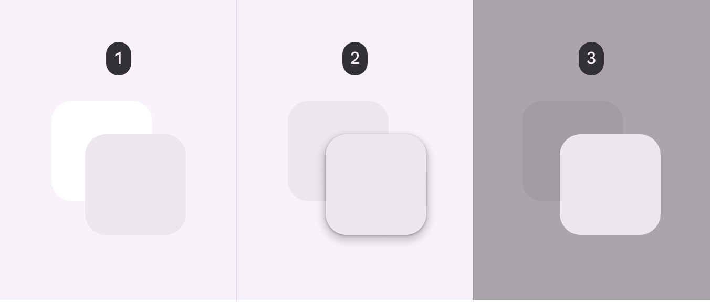
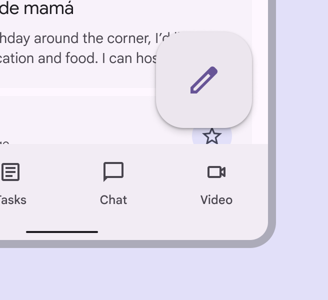
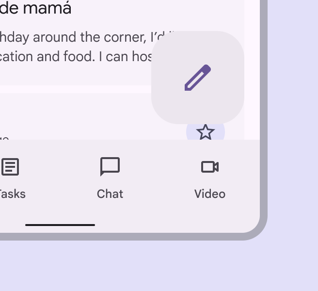
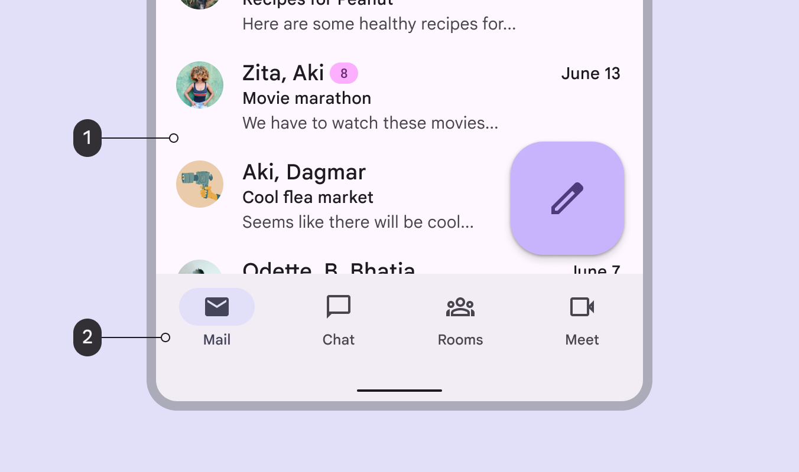
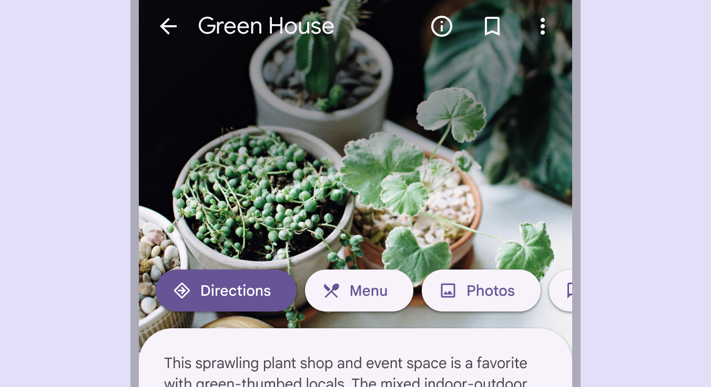

# Elevation

Source: https://m3.material.io/styles/elevation/applying-elevation

Material 3’s elevation system is deliberately limited to just a handful of levels. This creative constraint means you need to make thoughtful decisions about your UI’s elevation story.

*Material uses six levels of elevation, each with a corresponding dp value. These values are named for their relative distance above the UI’s surface: 0, +1, +2, +3, +4, and +5. An element’s resting state can be on levels 0 to +3, while levels +4 and +5 are reserved for user-interacted states such as hover and dragged.*

## Depicting elevation

Elevation can be depicted using shadows or other visual cues, such as surface fills with a tone difference or scrims.

To successfully depict elevation, a surface must show:

- Surface edges, contrasting the surface from its surroundings
- Overlap with other surfaces, either at rest or in motion
- Distance from other surfaces

*Two overlapping surfaces with distinct tonal values; Two overlapping surfaces with the same tonal values separated via shadow; Two overlapping surfaces with the same tonal values separated via scrim*

### Tonal difference

Tonal difference between surfaces helps to express the tactile quality of Material surfaces. They show where one surface ends and another begins by separating different parts of a UI into identifiable components. For example, the edges of an app bar show that it's separate from a grid list, communicating to the user that the grid list scrolls independently of the app bar.

By default, Material 3's surfaces use tonal difference to indicate separation. Other methods can be used to indicate edges, such as:

- Giving surfaces a drop shadow
- Placing a scrim behind a surface

*A FAB's elevation helps separate it from body content; A scrim appears below a modal to communicate importance; Tonal differences between a navigation bar and body content indicate separate surfaces*

For interactive components, edges must create sufficient contrast between surfaces (by meeting or exceeding accessible contrast ratios) for them to be seen as separate from one another.

*Do Ensure floating elements have sufficient contrast with surfaces beneath*

*Don’t Don't use colors with insufficient contrast. The relationship between surfaces must be clear.*

### Surface color roles & elevation

You can pick from a range of surface and surface container color roles. These roles are not tied to elevation, and provide flexibility for defining containment areas. Any overlapping containment areas or components should have different color roles in order to visually communicate separation. [More on surface color roles](https://m3.material.io/m3/pages/color-roles/tab-1#89f972b1-e372-494c-aabc-69aea34ed591)

*Surface; Surface container*

## Shadows

Shadows can express the degree of elevation between surfaces in ways that other techniques can't.

Both a shadow’s size and amount of softness or diffusion express the degree of distance between two surfaces. For example, a surface with a shadow that's small and sharp indicates a surface’s close proximity to the surface behind it. Larger, softer shadows express more distance.

*Smaller, sharper shadows indicate a surface’s close proximity to the surface behind it*

*Larger, softer shadows express more distance between a surface and the one behind it*

When it comes to applying shadows, less is more. The fewer levels in your UI, the more power they have to direct attention and action.

### When to use visible shadows

#### Protect elements

When a background is patterned or visually busy, the hairline style might not provide sufficient protection. In these cases, use elevation to separate and emphasize elements such as cards, chips, or buttons.

*Interactive elements are emphasized with elevation*

#### Encourage interaction

Elements can temporarily lift on focus, selection, or another kind of interaction, like swipe. A raised element can also lower when a higher element appears.

[Video: Screen in an email app in which sliding over an email card allows you to delete it.](assets/asset-010-elevation-encourages-interaction-465f928876.webp)

*Elevation encourages interaction*

## Scrims

A scrim can bring focus to specific elements by increasing the visual contrast of a large layered surface. Use the scrim beneath elements like modals and expanded navigation menus.

Scrims use the scrim color role (Color roles are assigned to UI elements based on emphasis, container type, and relationship with other elements. This ensures proper contrast and usage in any color scheme.) at an opacity of 32%.

*Scrims help bring focus to important elements like the navigation rail*
