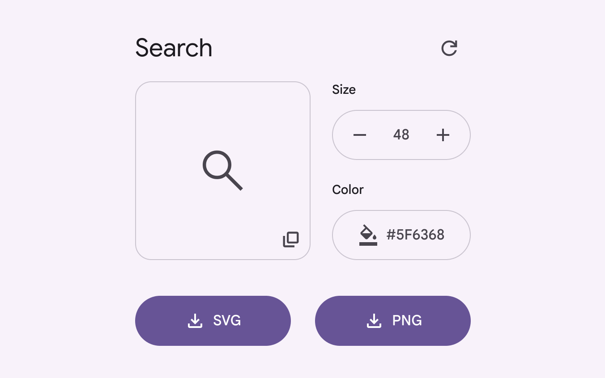
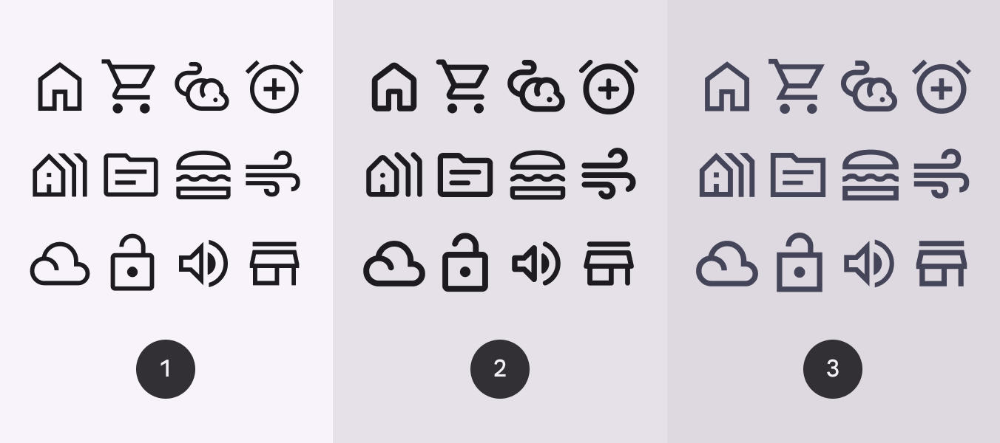
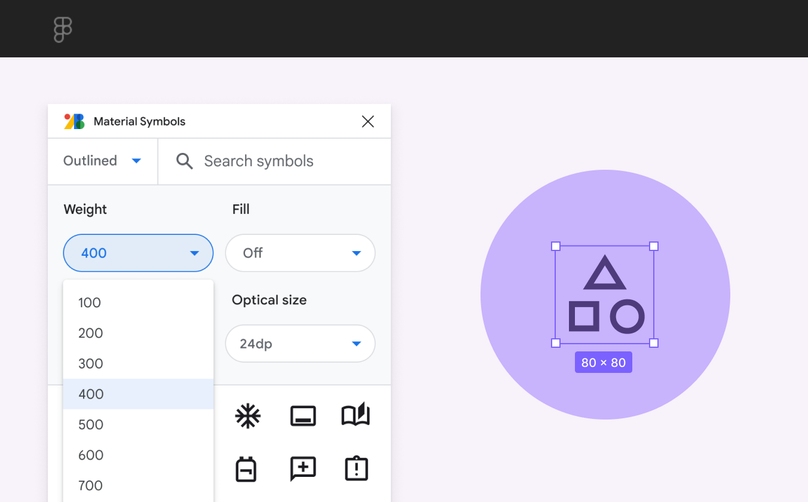

# Icons

Source: https://m3.material.io/styles/icons/overview

- Get Material Symbols icons at [fonts.google.com/icons](https://fonts.google.com/icons). Recolor, resize, and copy and paste icons.
- Use the Material Symbols variable font to enable dynamic styling in product
- You can change the weight, fill, optical size, and grade of variable font icons

[Video: Array of icons with various stylistic attributes.](assets/asset-001-array-of-icons-with-various-stylistic-attributes-1c08dc9f2d.webp)

## Resources

| Type | Link | Status |
| --- | --- | --- |
| Design | [Icons catalog](https://fonts.google.com/icons) | Available |
| Design | [Material Symbols Figma plugin](http://goo.gle/material-symbols-figma) | Available |
| Design | [Icon keyline template (ZIP)](https://storage.googleapis.com/material-io-design/downloads/gm_icon_template.ai.zip) | Available |

## What's new

### Copy & paste customized Material Symbols

You can now copy and paste icons from [Google Fonts](http://fonts.google.com/icons). Once you search for and select the desired icon, options will appear in the right-hand panel to resize, recolor, and copy the customized icon to clipboard.

*Icons can now be copied with a single click*

### Material Symbols

The new variable icon font set supports three styles: outlined, rounded, and sharp. All Material Symbols are newly drawn to be pixel-crisp and modernized.

*Outlined; Rounded; Sharp*

### Adjustable axes

Material Symbols have four adjustable stylistic variable font attributes called axes. An axis refers to an attribute of a symbol that can be altered to create visual variations. The attributes are: weight, fill, optical size, grade.

[Video: Four icons shown with adjusted weight, fill, grade, and optical sizes.](assets/asset-004-a-range-of-symbols-shown-with-the-same-e49750dd72.webp)

*A range of symbols shown with the same weight, fill, grade, and optical sizes*

### Material Symbols Figma plugin

Easily [incorporate Material Symbols](http://goo.gle/material-symbols-figma) into your latest designs on Figma.

*Figma Symbols plugin*
