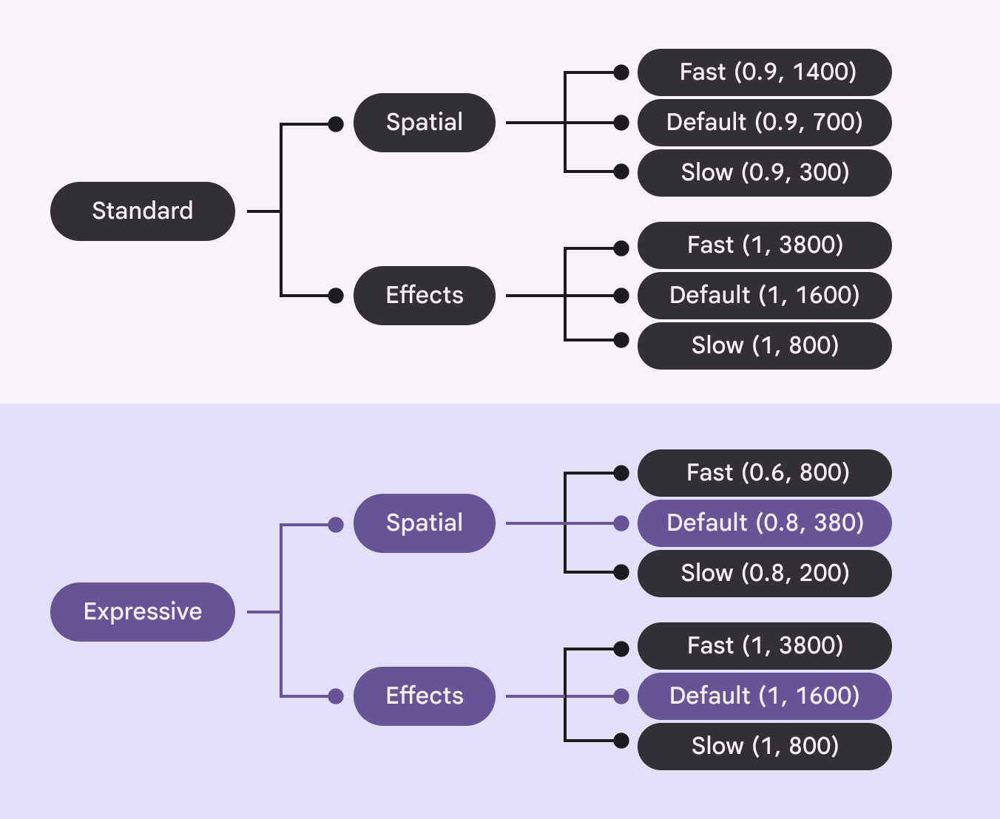

# Motion physics system

Source: https://m3.material.io/styles/motion/overview/how-it-works

[Video: Showcase of expressive components and motion curves.](assets/asset-001-showcase-of-expressive-components-and-motion-curves-cb0d3f47d9.webp)

## A motion system designed for expression

May 2025

Material introduced the motion physics system with M3 Expressive. This new physics-based system makes interactions and transitions feel more alive, fluid, and natural. It represents a new motion language for Google products, and is easier to implement and customize than ever before.

The physics system is replacing the previous system based on [easing and duration](https://m3.material.io/m3/pages/motion-easing-and-duration/applying-easing-and-duration/).

[More on M3 Expressive](https://m3.material.io/blog/building-with-m3-expressive)

## Availability & resources

| Type | Link | Status |
| --- | --- | --- |
| Implementation | [MDC-Android](https://github.com/material-components/material-components-android/blob/master/docs/theming/Motion.md) | Available. Not yet added to components. [See specs](https://m3.material.io/styles/motion/overview/specs) |
| Implementation | Flutter | Unavailable |
| Implementation | [Jetpack Compose](https://developer.android.com/reference/kotlin/androidx/compose/material3/MotionScheme) | Available |
| Implementation | Web | Compatible with Compose springs. [See specs](https://m3.material.io/styles/motion/overview/specs) |

## The basics: Motion schemes

The physics system has two preset motion schemes: expressive and standard. The motion scheme you choose defines how your product feels. While most motion in a product should use the same scheme, products can make [advanced customizations](https://m3.material.io/m3/pages/motion-overview/how-it-works#fef83d57-b139-4c40-b538-9f1e9872df1b) to swap the scheme to emphasize key moments.

Expressive is Material’s opinionated motion scheme, and should be used for most situations, particularly hero moments and key interactions.

[Video: A circle moves across the screen with expressive motion. It has a trail showing the level of bounce applied.](assets/asset-002-the-expressive-motion-scheme-overshoots-the-final-values-f95615c8b3.webp)

*The expressive motion scheme overshoots the final values to add bounce*

Standard feels more functional with minimal bounce, and should be used for utilitarian products.

[Video: A circle moves across the screen with standard motion. It has a trail showing the lack of bounce applied.](assets/asset-003-the-standard-motion-scheme-eases-into-the-final-eba3c75b18.webp)

*The standard motion scheme eases into the final values*

Need something other than the preset schemes? [Create your own!](https://m3.material.io/m3/pages/motion-overview/how-it-works#f4ec8b84-3e39-4699-bba3-0fe7ec5cb79e) The physics system makes it easy to create custom motion schemes beyond expressive and standard, while still leveraging theming. Schemes can be easily switched between expressive, standard, or custom as needed.

## How it works: Springs

Motion schemes use springs. A spring is a combination of three attributes which control all motion behavior: stiffness (Stiffness defines the hardness of the spring. Higher stiffness resolves the motion faster.), damping (Damping defines how fast the bounce wears out. Higher damping stops the bounce faster. A damping value of 1 completely removes spring bounce.), and initial velocity (Initial velocity defines the initial speed of the spring, which influences the total spring duration in combination with stiffness and damping.).

Springs are versatile. One spring can apply to many situations, such as transitions, button effects, or gestures. This makes the motion and expression feel consistent throughout the product.

Springs feel natural. Springs are designed to be predictable, like how objects move and bounce. They handle gestures, interruptions, and retargeting animations seamlessly.

[Video: Buttons, FAB menus, and toolbars moving with expressive motion springs.](assets/asset-004-all-component-motion-is-driven-by-two-tokens-56c37f8375.webp)

*All component motion is driven by two tokens: expressive fast spatial and expressive fast effects*

## Spring tokens

On Jetpack Compose and MDC-Android, these springs are available as [spring tokens](https://m3.material.io/m3/pages/motion-overview/specs/). Use tokens to easily apply motion to any element, making all motion feel predictable and consistent across multiple platforms. See [specs](https://m3.material.io/styles/motion/overview/specs) for how to convert springs to other platforms like Web.

There are tokens for spatial movement and effects, with three durations each: default, fast, and slow.

For example, to apply fast, spatial, expressive motion, call the "expressive" motion scheme, then use the token: md.sys.motion.spring.fast.spatial.

Notice that the "expressive" scheme isn't part of the token itself. Rather, it's called at the product level and applied to all tokens. This makes it easier to swap schemes without changing assigned tokens.

*Each scheme (expressive, standard) has three speeds (fast, default, slow) for two types of movement (spatial, effects)*

### Style

Spatial spring tokens are used for animations that move something on screen, for example the x and y position, rotation, size, rounded corners. This spring overshoots the final value and bounces into place.

[Video: A moving shape bounces into place.](assets/asset-006-spatial-springs-apply-to-movement-e92d845658.webp)

*Spatial springs apply to movement*

[Video: A spinning shape bounces into place.](assets/asset-007-spatial-springs-apply-to-rotation-0fa39bc64f.webp)

*Spatial springs apply to rotation*

Effects spring tokens are used to animate properties such as color and opacity animations, where there shouldn’t be any overshoot.

[Video: A shape fades in and eases into view.](assets/asset-008-effects-springs-applied-to-opacity-4537b6dd71.webp)

*Effects springs applied to opacity*

[Video: A shape changes color and eases into the final result.](assets/asset-009-effects-springs-applied-to-color-3535a753a3.webp)

*Effects springs applied to color*

### Speed

Spatial and effect spring tokens come in three speeds: default, fast, and slow. Most motion should use the default speed, while smaller elements may use fast and larger elements may use slow.

| Speed | Spatial example | Effects example |
| --- | --- | --- |
| Default | Animations that partially cover the screen, such as bottom sheet (Bottom sheets show secondary content anchored to the bottom of the screen. [More on bottom sheets](https://m3.material.io/m3/pages/bottom-sheets/overview)) and expanded navigation rail (Expanded navigation rails show text labels and an extended FAB, and can be default or modal.) | Opacity of the content within a navigation rail (Navigation rails let people switch between UI views on mid-sized devices. [More on navigation rails](https://m3.material.io/m3/pages/navigation-rail/overview)) |
| Fast | Small components, such as switches (Switches toggle the state of an item on or off. [More on switches](https://m3.material.io/m3/pages/switch/overview)) and buttons (Buttons let people take action and make choices with one tap. [More on buttons](https://m3.material.io/m3/pages/common-buttons/overview)) | Color change of the switch (Switches toggle the state of an item on or off. [More on switches](https://m3.material.io/m3/pages/switch/overview)) handle |
| Slow | Full-screen animations | Full-screen content refresh |

[Video: Effects motion in fast, default, and slow speeds](assets/asset-010-spatial-motion-in-fast-default-and-slow-speeds-050e6746a4.webp)

*Spatial motion in fast, default, and slow speeds*

[Video: Spatial motion in fast, default, and slow speeds](assets/asset-011-effects-motion-in-fast-default-and-slow-speeds-1a45a30326.webp)

*Effects motion in fast, default, and slow speeds*

Spring tokens work across devices. For example, the spatial fast token will always be faster than default or slow, but the exact values of each token differ depending on if the device is a wearable, phone, or tablet. This ensures the movement feels fast in the context of the device.

## Application

### Components

On Jetpack Compose, 21 Material components use the motion physics system by default. MDC-Android support is coming soon. To add the motion physics system to other components, including custom-built components, use spring tokens. [View full specs](https://m3.material.io/styles/motion/overview/specs)

[Video: A collection of expressive components in motion.](assets/asset-012-material-components-use-the-physics-motion-system-to-938bbc942b.webp)

*Material components use the physics motion system to feel more expressive*

## Advanced customizations

There are a few different levels for applying motion. Choose the level that applies best to your product or specific component.

### Level 1: Use a default motion scheme

The expressive and standard schemes should be sufficient for all motion needs. On Jetpack Compose, components use these schemes by default.

[Video: Switch using the expressive motion scheme.](assets/asset-013-switch-using-the-expressive-motion-scheme-8fa03b6492.webp)

*Switch using the expressive motion scheme*

[Video: Switch using the standard motion scheme.](assets/asset-014-switch-using-the-standard-motion-scheme-8b41a73449.webp)

*Switch using the standard motion scheme*

### Level 2: Create a custom motion scheme

On Jetpack Compose, to change the default motion scheme that all components and transitions use, create a custom MotionScheme object, and return different AnimationSpec for each property of the motion scheme.

[Video: FAB menu with an extra stiff custom scheme.](assets/asset-015-fab-menu-with-an-extra-stiff-custom-scheme-a6e79ea140.webp)

*FAB menu with an extra stiff custom scheme*

[Video: FAB menu with a minimally stiff custom scheme.](assets/asset-016-fab-menu-with-very-low-stiffness-custom-scheme-22281d70e0.webp)

*FAB menu with very low stiffness custom scheme*

### Level 3: Swap the default motion scheme per element

Why use just one scheme when you can use multiple? On Jetpack Compose, to use one scheme for most of the product, such as expressive, but on certain elements swap it for another scheme, like standard, override the CompositionLocal for that particular composable, screen, or element.
