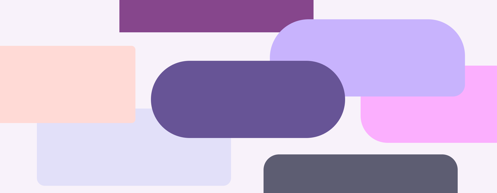
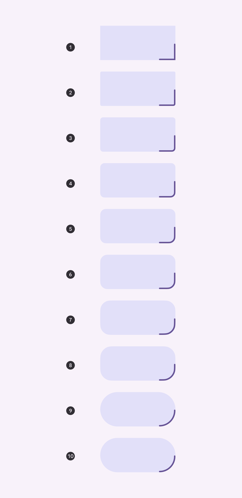
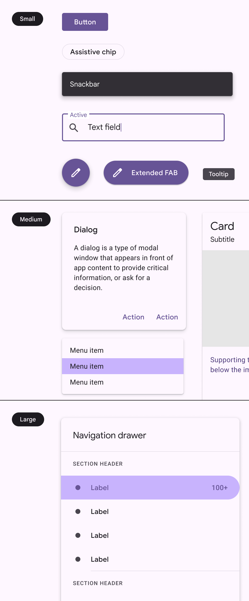
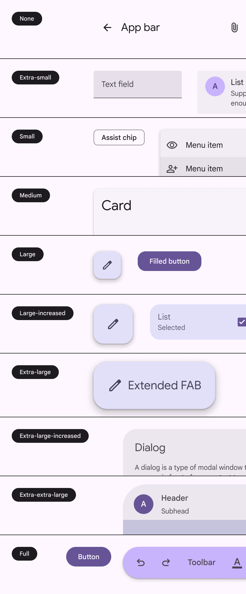
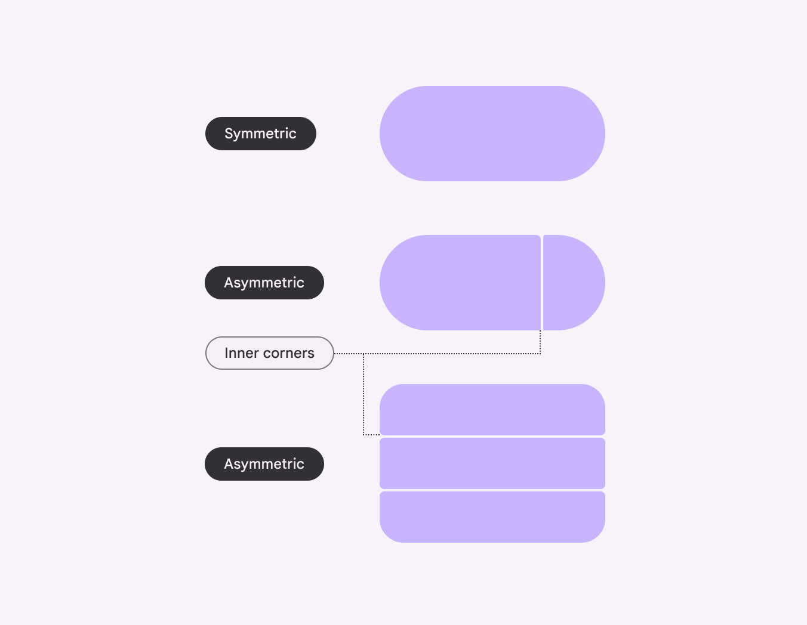
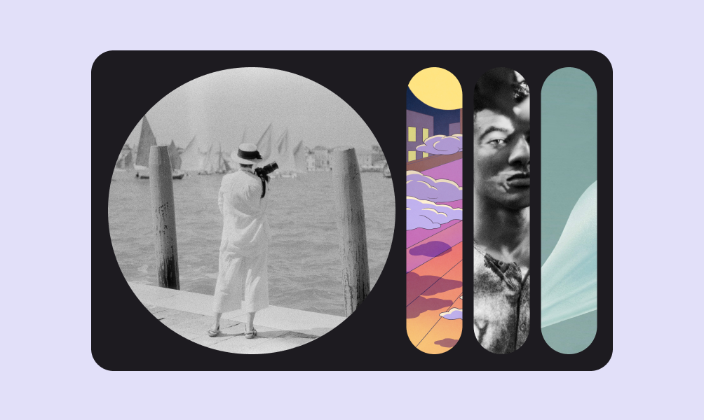
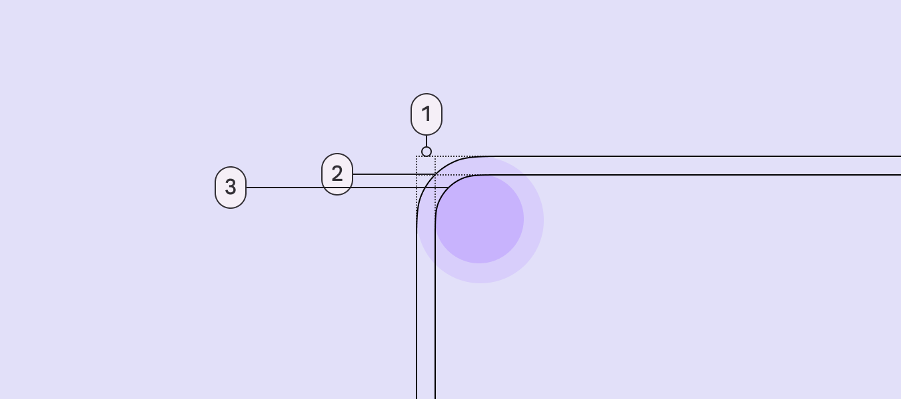
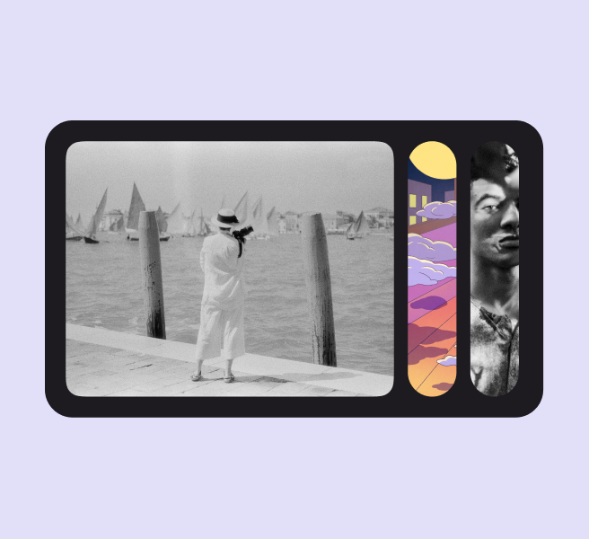
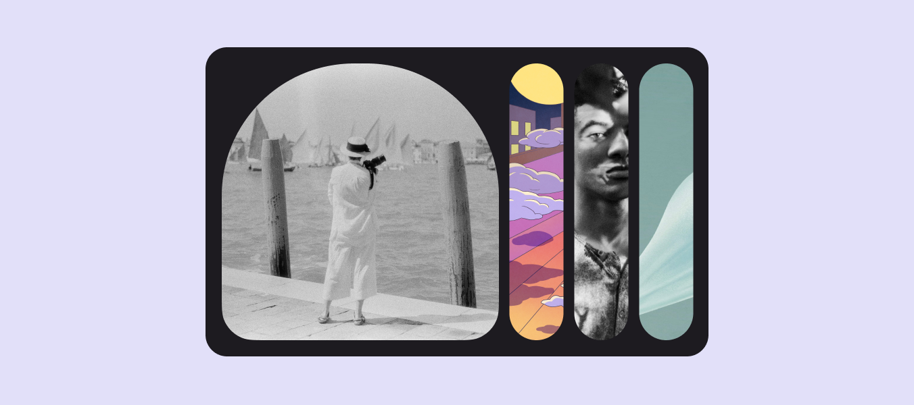

# Shape

Source: https://m3.material.io/styles/shape/corner-radius-scale

Material components use a corner radius scale to define all rectangular shapes, such as buttons, carousels, and dialogs.

*M3 defines corner radii using a shape scale. This can be used to create both uniform and asymmetrical shapes.*

## Shape tokens

Material has shape corner tokens to define all corners, and corner-value tokens for individual corners. [Learn more about design tokens](https://m3.material.io/m3/pages/design-tokens/overview)

- Token sets: Shape

### Corner radius scale

The Material 3 shape system uses a size-based scale with ten styles. Styles are assigned to components based on the desired amount of roundedness.

1. None - 0dp
2. Extra small - 4dp
3. Small - 8dp
4. Medium - 12dp
5. Large - 16dp
6. Large increased - 20dp
7. Extra large - 28dp
8. Extra large increased - 32dp
9. Extra extra large - 48dp
10. Full - fully rounded corners

[Apply shape styles using tokens](https://m3.material.io/m3/pages/design-tokens/overview)

*Steps on the scale are named for the amount of roundedness applied to the corner*

*M2: Three-level shape scale based on the size of the component container*

*M3: Ten-level shape scale based on the roundedness of shape corners*

## Symmetry

Components can have either symmetric or asymmetric corner shapes. Symmetric shapes have the same values for all corners, while asymmetric shapes can have corners with different values.

Both symmetric and asymmetric shapes use the same 10-step scale.

Asymmetrical shapes are used in M3 components with closely-grouped items, such as menus and split buttons. These are called inner corners.

*Inner corner component tokens always map to individual corner shape tokens*

## Customizing shapes

Generally, products should consistently use the Material 3 shape styles. However, customization is sometimes necessary, and even encouraged, for hero moments or custom components. Shapes can be customized at the style or component level.

### Style changes

The corner radius shape style, like medium, can be customized to be a different size.

This applies the change to all components mapped to that shape style, unless they have an override.

[Video: Shapes with different corner radii.](assets/asset-006-customizing-the-corner-size-of-the-medium-style-4c812f2249.webp)

*Customizing the corner size of the medium style applies the change to all components using this style, such as cards and small FABs*

### Component changes

The style of a specific component, such as a button, can be changed by customizing which corner radius shape style it maps to.

For example, by default, buttons are mapped to the full corner radius shape style. If your product needs a less rounded shape, remap the token to another style in the shape scale, such as small or medium.

[Video: Components with different corner radii.](assets/asset-007-remapping-the-shape-for-a-component-to-a-c4d1406973.webp)

*Remapping the shape for a component to a different style applies the change to just that component across the UI*

The shape style family can be customized from rounded to cut. This makes the corner a straight line instead of curved.

Add extra padding to avoid cutting off content in information-dense components.

For example, a large cut corner on a card will clip content and images in the area more than a rounded corner of the same size.

[Video: Card with text and full corners.](assets/asset-008-caution-be-careful-not-to-apply-large-or-c1bf6b284b.webp)

*Caution Be careful not to apply large or full corners to information-dense components, such as cards*

*Do Shapes can be intentionally rounder to add more visual variety*

*Do Add unexpected moments by switching between square and fully rounded shapes*

### Adjust for optical roundness

When nesting rounded objects, avoid using the same corner radii for both objects. This can make the corners look unbalanced.

Instead, adjust the corner radii to be proportional to each other; this is called optical roundness. To calculate optical roundness:

- Outer radius - padding = inner radius
- For example: 48dp - 14dp = 34dp

*Padding; Outer radius; Inner radius*

*Do Use different corner radii values for nested components so they have optical roundness*

*Don’t Avoid using the same corner radius value for nested objects*

### Using the shape library

The Material 3 shape library can be used to create more interesting containers. Use the shape library for mostly visual elements. Avoid applying unconventional shapes to text-heavy containers.

Shapes should be used sparingly to provide a stronger emphasis and moments of delight.

*Leverage the Material shape library for moments of delight*
