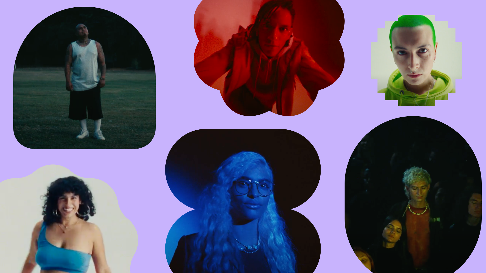
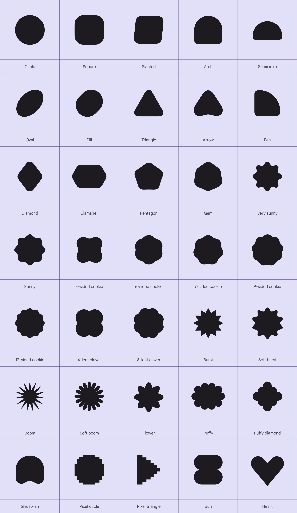
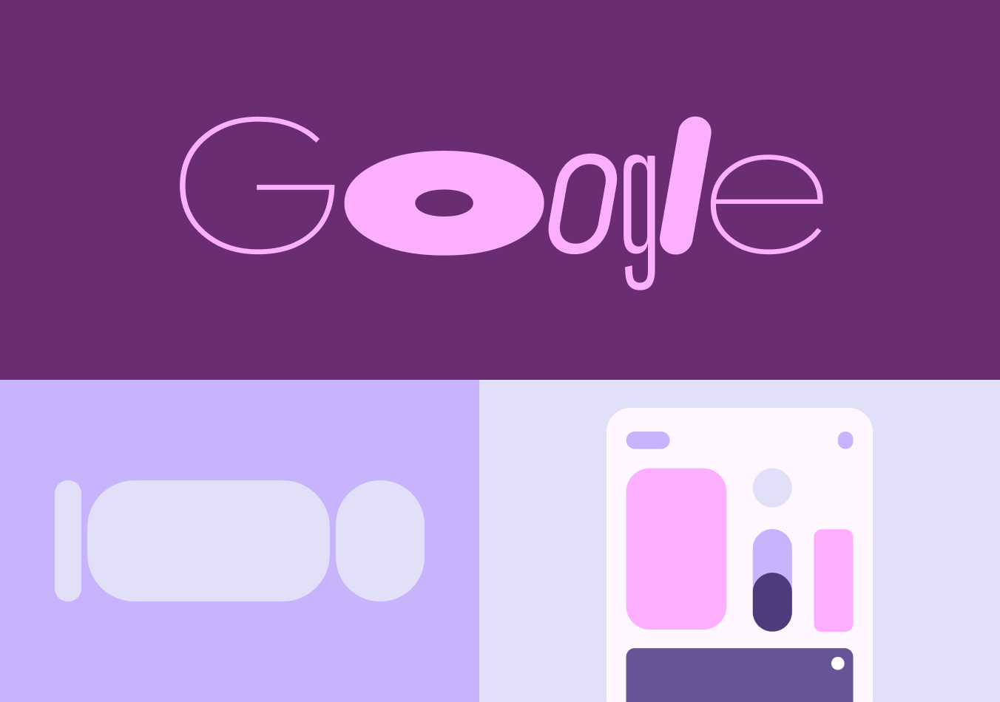
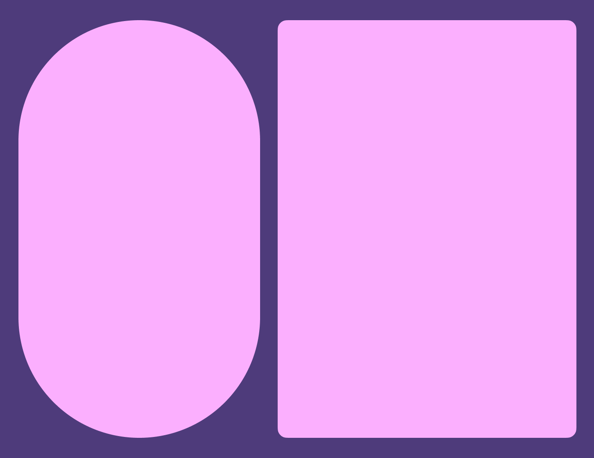
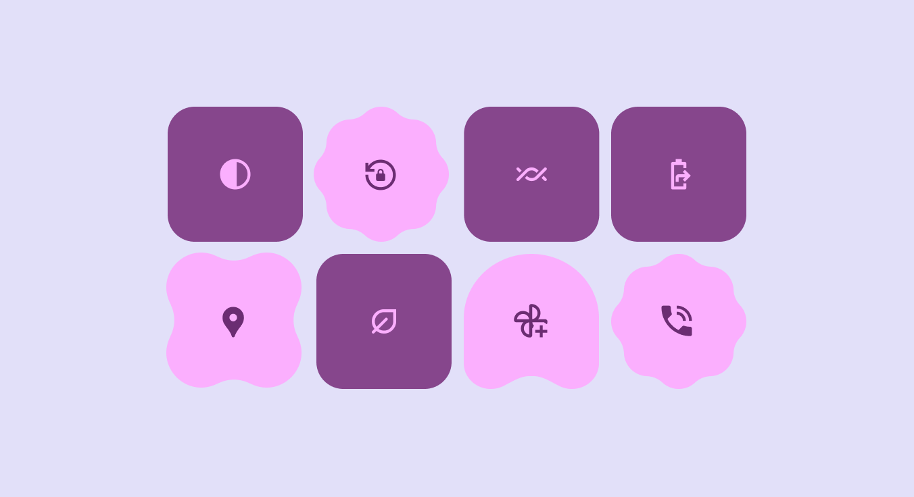

# Shape

Source: https://m3.material.io/styles/shape/overview-principles

- Use abstract shapes thoughtfully to add emphasis and decorative flair
- Leverage Material shapes for built-in shape morphing
- Rectangular shapes are fully rounded in all corners by default
- Individual corners can be adjusted to create asymmetrical rectangular shapes

*Abstract shapes can help people express themselves*

## Availability & resources

| Type | Resource | Status |
| --- | --- | --- |
| Design | [Shape library](http://figma.com/community/file/1035203688168086460/material-3-design-kit) (Figma Design Kit) | Available |
| Implementation | [Jetpack Compose](https://developer.android.com/reference/kotlin/androidx/compose/material3/MaterialShapes) (Shape Library) | Available |
| Implementation | [MDC-Android](https://github.com/material-components/material-components-android/blob/master/docs/theming/Shape.md) | Available |

## M3 Expressive update

May 2025

Added 35 new shapes and shape morphing to [Material Shape Library](https://www.figma.com/community/file/1035203688168086460) (Figma Design Kit) and [Jetpack Compose](https://developer.android.com/reference/kotlin/androidx/compose/material3/MaterialShapes).

Added new shape principles and a refreshed art direction.

Added corner radii tokens:

- Large increased (20dp)
- Extra large increased (32dp)
- Extra extra large (48dp)
- Updated fully rounded corners to use full. Previously, this was defined using 50% of the component size.

[More on M3 Expressive](https://m3.material.io/blog/building-with-m3-expressive)

[Video: Animation of available Material shapes.](assets/asset-002-overview-of-material-shapes-4162505283.webp)

*Overview of Material shapes*

## Shape library

*M3 has 35 shapes to easily apply to designs*

## Use shapes and text in harmony

Shapes are expressive elements of Material 3 that echo key visual attributes of [M3 typography](https://m3.material.io/m3/pages/typography/overview/).

Use shape and type together for products to feel cohesive and polished.

*M3 shapes and Google Sans Flex share roundness visual attributes*

[Video: While a person taps water and squeezes a soft cube, a button in the middle responds similarly.](assets/asset-005-shape-morphing-should-respond-to-user-interaction-4f6390cc95.webp)

*Shape morphing should respond to user interaction*

## Morph shapes to connect function and feeling

Shapes should morph to improve understanding and add moments of delight. Use shape morph to better communicate:

- Interaction states, like when a button is selected
- Actions in progress, like a friend typing, or a page loading
- Changes in the environment, like sound, temperature, or time of day

Think about how shapes could react to different interactions, such as tapping, swiping, scrolling, releasing, and long pressing.

## Be bold and dare to embrace tension

Tension happens when the shape story changes unexpectedly, such as when contrasting shapes are used. This can be created using both square and rounded shapes, unconventional shapes, and other contrasting elements.

Material historically focused on rounded shapes. However, using sharp shapes, thereby adding tension, creates more dynamic design, one that’s more memorable and expressive.

This tension can be used in many ways, like conveying states, drawing attention to an element, or to improve the visual aesthetic.

*Create tension by using a combination of round and square shapes*

[Video: Use different types of shape in loading indicators to show progress.](assets/asset-007-shapes-and-motion-can-communicate-actions-in-progress-7bd29a0215.webp)

*Shapes and motion can communicate actions in progress*

## Shape is versatile, not semantic

Avoid making shapes literal or assigning a specific function or meaning to a single shape.

For example, the loading indicator (Loading indicators show the progress of a process with a short wait time. [More on loading indicators](https://m3.material.io/m3/pages/loading-indicator/overview)) can be wavy, but the waveform is not a strict symbol of progression. Progress could just as easily be shown using rotating shapes or shape morph. Plus, waveforms could be used in other places unrelated to progress, like button containers.

## Use abstract shapes sparingly

Be intentional when using shapes in product UI. Don’t compromise clarity for the sake of visual design.

When incorporating diverse shapes, think about how they fit into the overall design and consider how they balance with the entire composition. Ensure that shapes resonate with the product's narrative. Consider the 'why' behind their inclusion and the value they contribute to the overall user experience.

*Caution Shapes without clear meaning behind why they’re different can add more visual clutter than delight*

[Video: Shapes morphing to indicate different states.](assets/asset-009-essential-shapes-can-use-shape-morph-to-communicate-b6668b2ce4.webp)

*Essential shapes can use shape morph to communicate change*

[Video: Shapes being applied as masks on photos to make them more interesting.](assets/asset-010-use-abstract-shapes-on-imagery-and-decorative-ui-0d190b6a11.webp)

*Use abstract shapes on imagery and decorative UI*

## Emphasize aesthetic moments with shape

Get creative when using shape in graphics, for photography cropping, personalized avatar masking, and other non-interactive elements.

Decorative moments offer the most flexible and creative uses of shape.

## Shape can be 2.5D

When effectively used, shape and motion can make 2D visuals feel 3D. They provide the illusion of depth and volume, making visuals more eye-catching and natural.

[Video: Shapes spinning and a weather icon transforming into the current temperature.](assets/asset-011-apply-motion-and-shape-differently-on-each-layer-d2600e4ea4.webp)

*Apply motion and shape differently on each layer to give it the illusion of depth*
