# Typography

Source: https://m3.material.io/styles/typography/applying-type

## Applying type

The Material 3 type scale organizes styles into five roles that are named to describe their purposes: display, headline, title, label, body. Each role has three sizes: large, medium, and small. These roles and sizes create clear page hierarchy and work across many devices.

## Roles

### Display

There are three display styles in the default type scale: Large, medium, and small. As the largest text on the screen, display styles are reserved for short, important text or numerals. They work best on large screens.

For display type, consider choosing a more expressive font, such as a handwritten or script style.

If available, set the appropriate optical size to your usage.

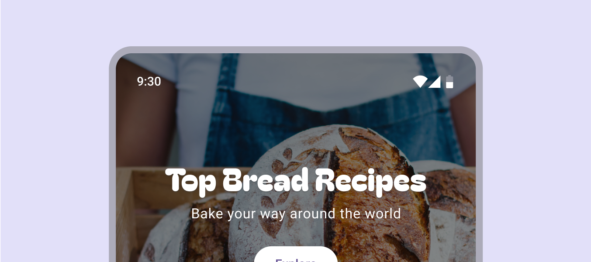

*An expressive typeface can be used for display styles, as shown here with Bagel Fat One*

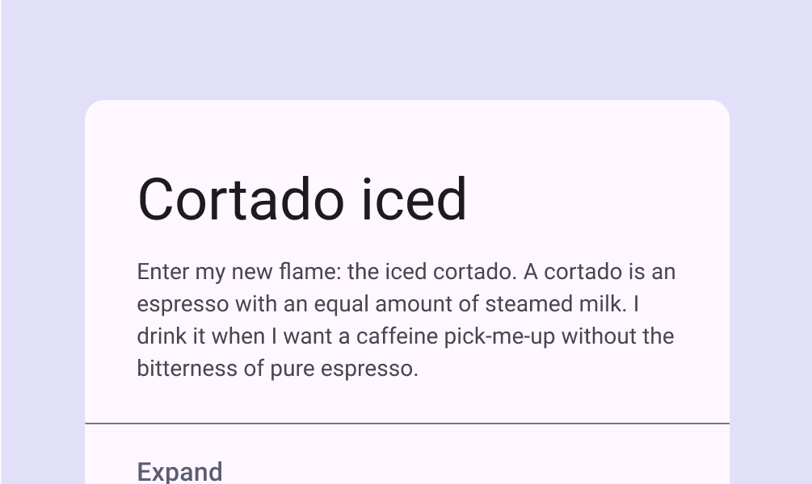

*A card using a display size*

*An expressive typeface can entice readers to engage with an eye-catching design, as shown here with Anton*

### Headline

Headlines are best-suited for short, high-emphasis text on smaller screens. These styles can be good for marking primary passages of text or important regions of content.

Headlines can also make use of expressive typefaces, provided that appropriate line height and letter spacing is also integrated to maintain readability.

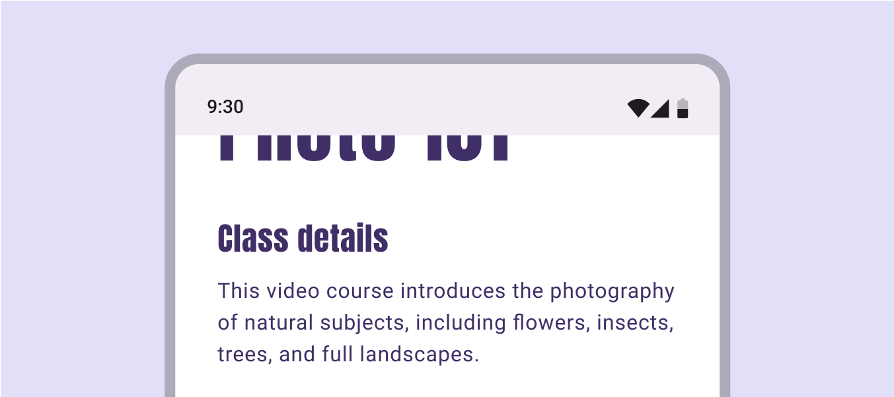

*Expressive typefaces can be used for headlines styles as well, as shown here with Anton*

*Headline style used for short text on a small screen*

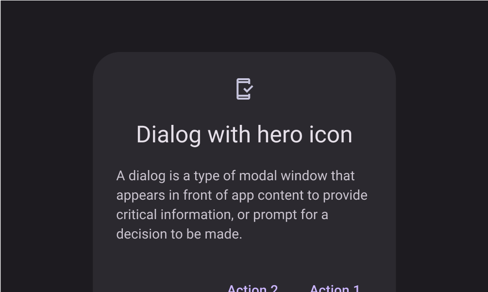

*Dialog using a headline style*

### Title

Titles are smaller than headline styles, and should be used for medium-emphasis text that remains relatively short. For example, consider using title styles to divide secondary passages of text or secondary regions of content.

For titles, use caution when using expressive fonts, including display, handwritten, and script styles.

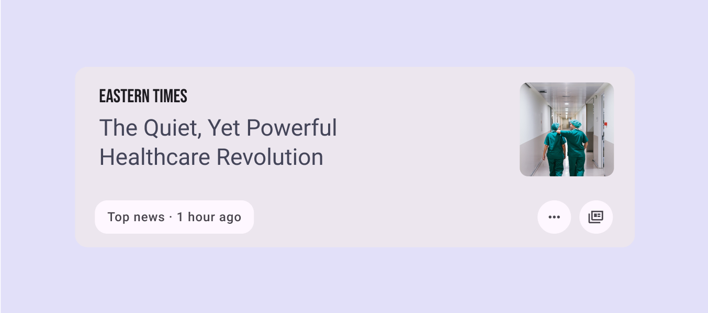

*A news article title using the title style to capture attention, as shown here with Bebas Neue*

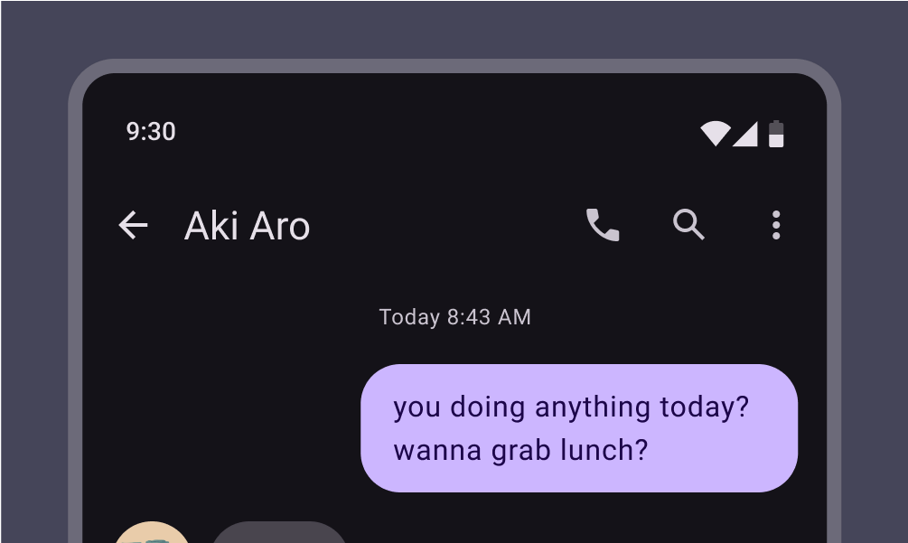

*App bar using title style*

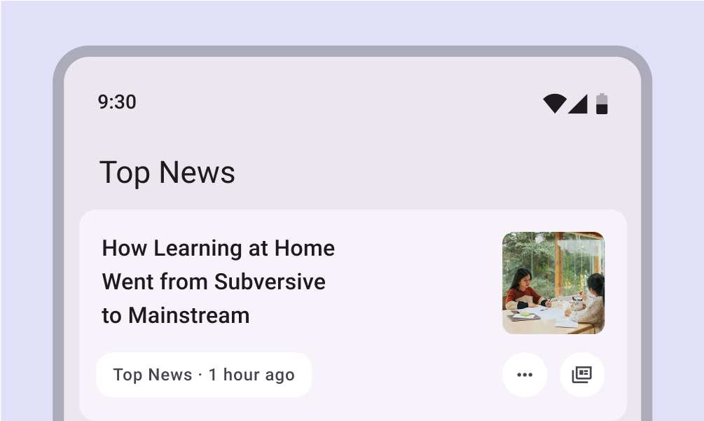

*Example of title style applied to a category header: Top News*

### Body

Body styles are used for longer passages of text in your app.

Use typefaces intended for body styles, which are readable at smaller sizes and can be comfortably read in longer passages.

Avoid expressive or decorative fonts for body text because these can be harder to read at small sizes.

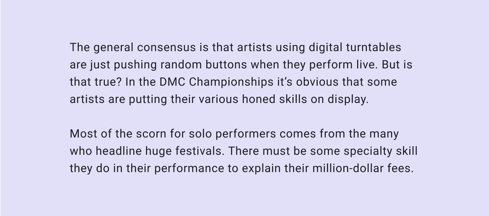

*Body styles must be readable for long passages*

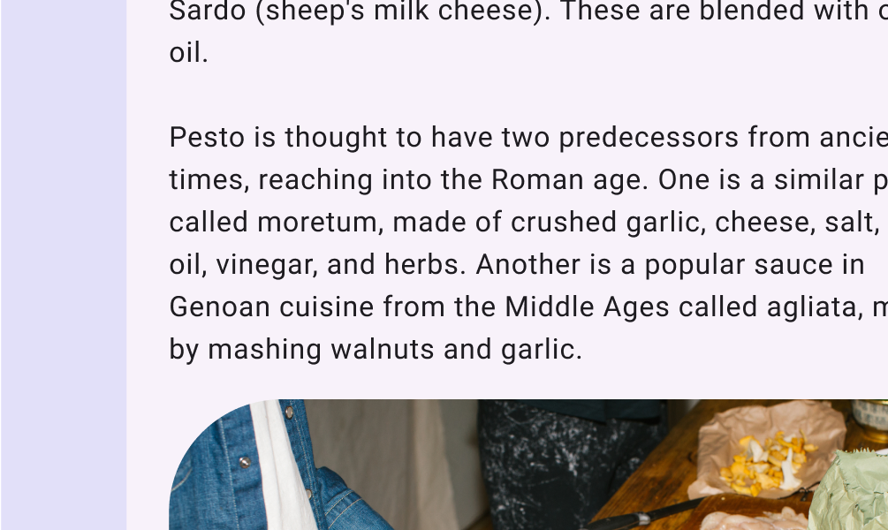

*Body style used throughout an article about pesto*

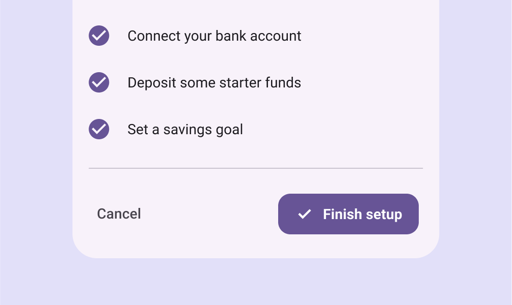

*Example of body style used throughout a setup flow*

### Label

Label styles are smaller, utilitarian styles, used for things like the text inside components or for very small text in the content body, such as captions.

Buttons, for example, use the label large style.

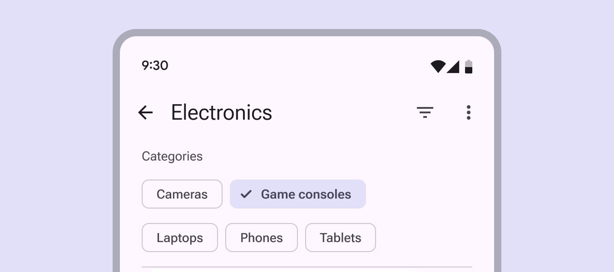

*Label styles should enable quick reading at small sizes, such as in buttons*

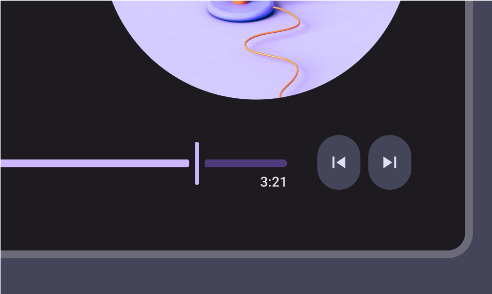

*A music player using label style for the timecode*

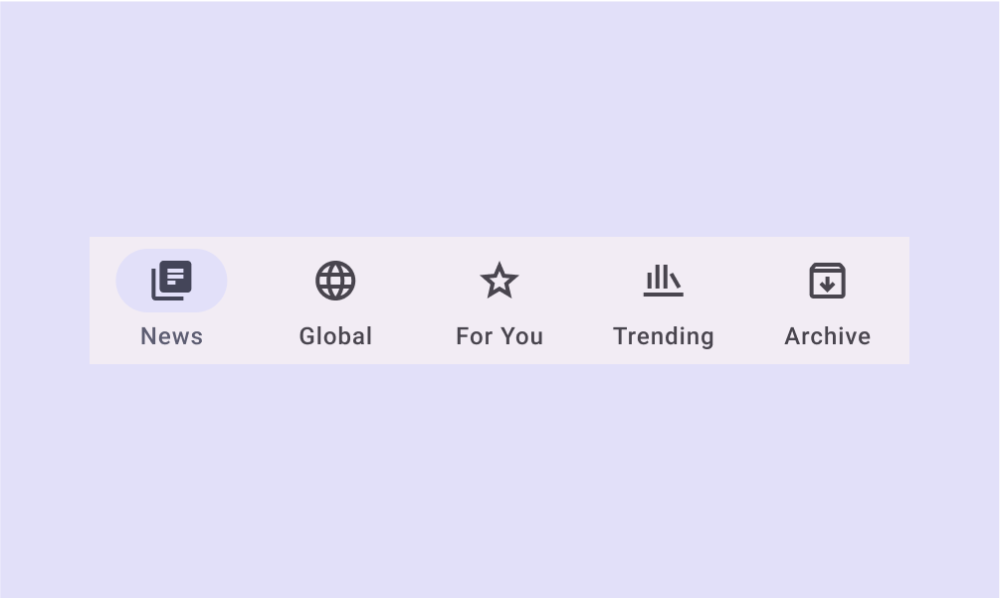

*A navigation bar using label style for the destination text*

## Typesetting

Vertical typesetting relies on padding, bounding boxes, and baselines to ensure text legibility at any size.

Take engineering considerations and the conventions of your platform into account when making decisions for typesetting, text resizing, density, and using text in adaptive layouts.

### Using padding and bounding boxes

Use this method for web products, and iOS products, where applicable. Note that some design tools also use bounding boxes for typesetting, but their methods vary and will need to be reconciled with the engineering implementation.

In web UIs, the line height and bounding box height are the same. Text is vertically centered within the bounding box, following the “[half-leading](https://www.w3.org/TR/css-inline-3/#leading-trim)” behavior established by CSS.

The vertical position of the text isn’t controlled directly, but through the combination of the bounding box and font metrics.

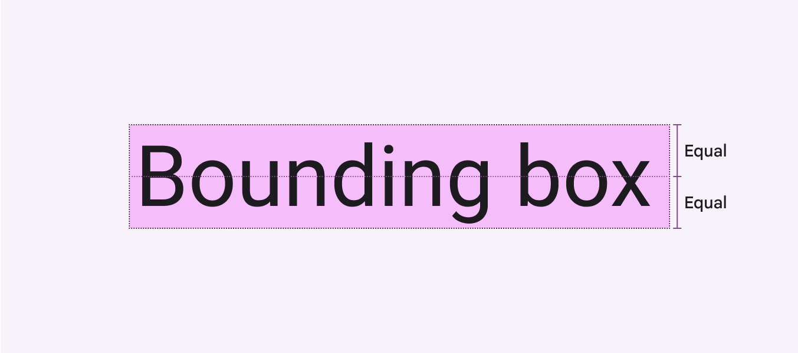

*The bounding box height is defined by the line height specified, with equal space placed above and below the text*

Padding is the space between UI elements, such as between an image and a bounding box, or between the inner edge of the bounding box and the text.

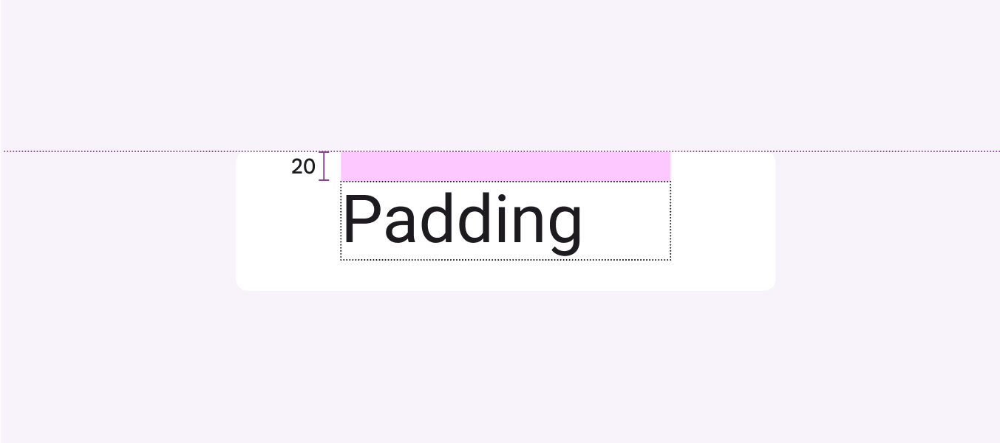

*The padding surrounding the text bounding box*

Specify the distance of UI elements from fixed reference points, such as the container edge. For the web, automate this calculation using Sass or CSS.

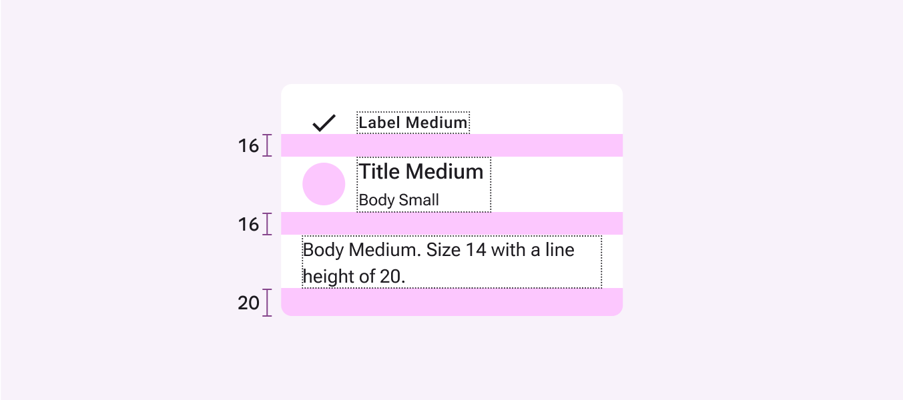

*Do Use line-height, padding, and container measurements for setting typography on the web and iOS*

Vertical alignment using padding and bounding boxes:

1. Line height Measure the height of the bounding box.
2. Centering Ensure equal top and bottom padding around the inner edge of the bounding box by using center align
3. Spacing Use the height of the bounding box, and top and bottom padding to determine spacing

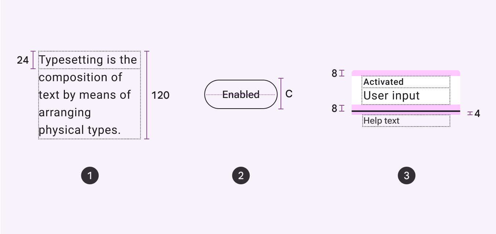

### Using the baseline

Use this method for Android products or platform-agnostic specs.

The baseline is the invisible line upon which a line of text rests. In Material Design, the baseline is an important specification in measuring the vertical distance between text and an element.

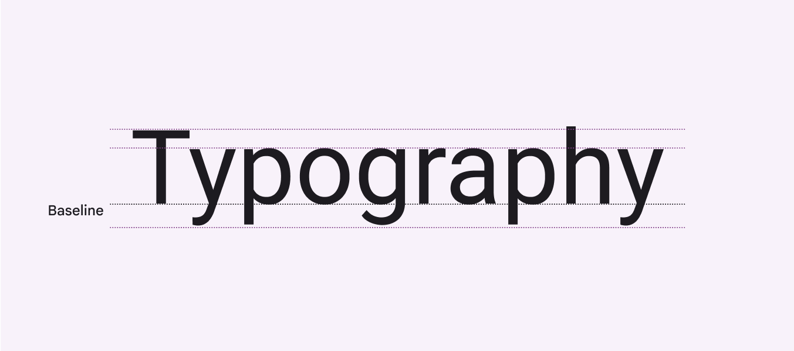

*A line of text rests on the invisible baseline*

For Android, specifying distances relative to baseline enables accurate implementation.

The baseline can also be used to communicate text position between designers in a way that's agnostic to the platform or design tool.

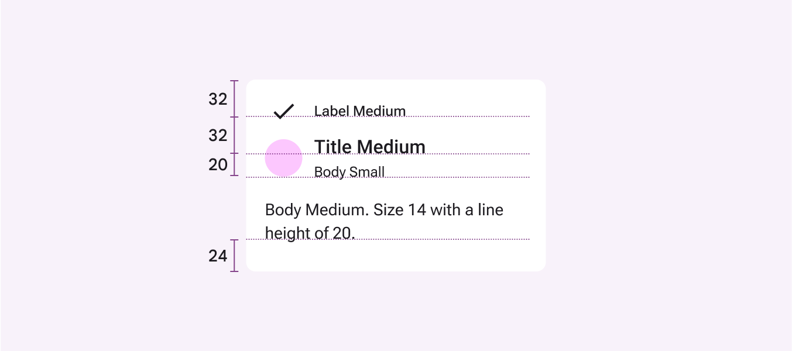

*Do Android screens rely on distance to baselines for spacing*

Vertical alignment using the baseline:

1. Line height Measure distance from the text baseline of one line to the text baseline of the next line
2. Centering Specify center alignment as a reference instead of measuring the distance to the text baseline
3. Spacing Use the distance from a reference point to the text baseline

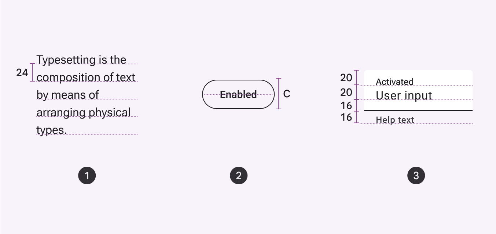

## Ensuring readability

Line height

Line height is the space between each line of text and is directly connected to type size.

Material’s type tokens are optimized for intended size and use.

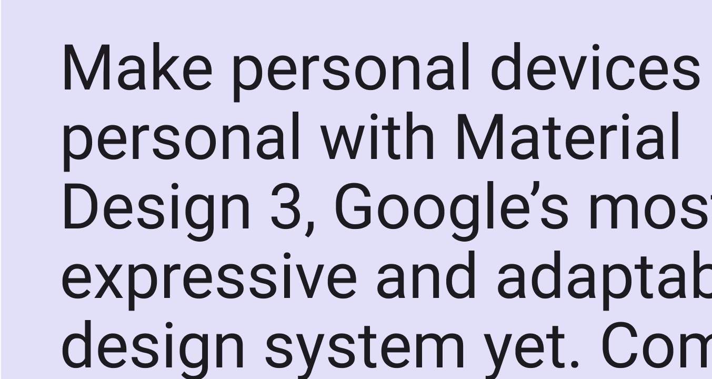

*For larger type legibility using styles like title, headline, and display, we recommend a line height ratio of 1.2 times the type size*

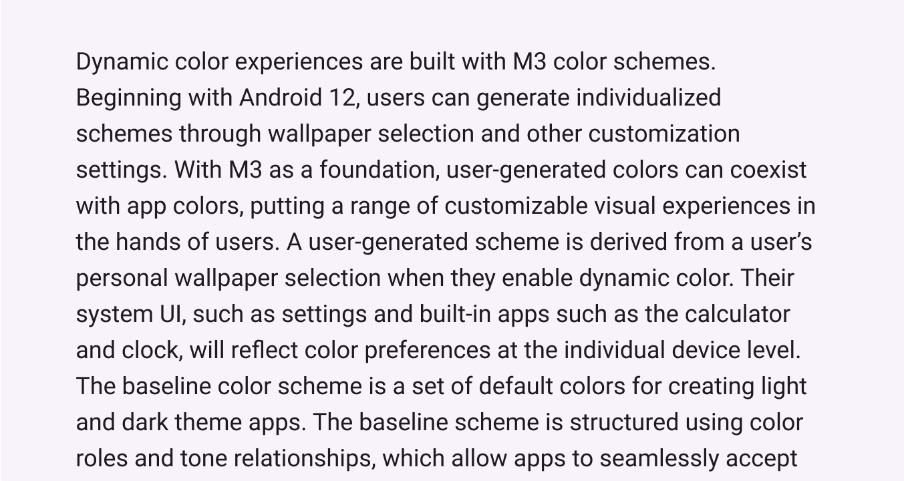

*For smaller body copy using styles like body and label, we recommend a line height ratio around 1.5 times the type size. If your line height is too tight, you’ll undermine the flow of the text. Too loose, and the lines won’t feel cohesive.*

Tabular numbers

Use tabular figures (also known as monospaced numbers) rather than proportional digits in tables or places where values may change often, such as clocks.

Use monospaced tabular numbers to keep values optically aligned for better scanning.

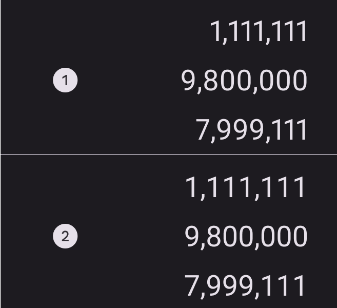

*Proportional numbers; Monospaced tabular numbers*

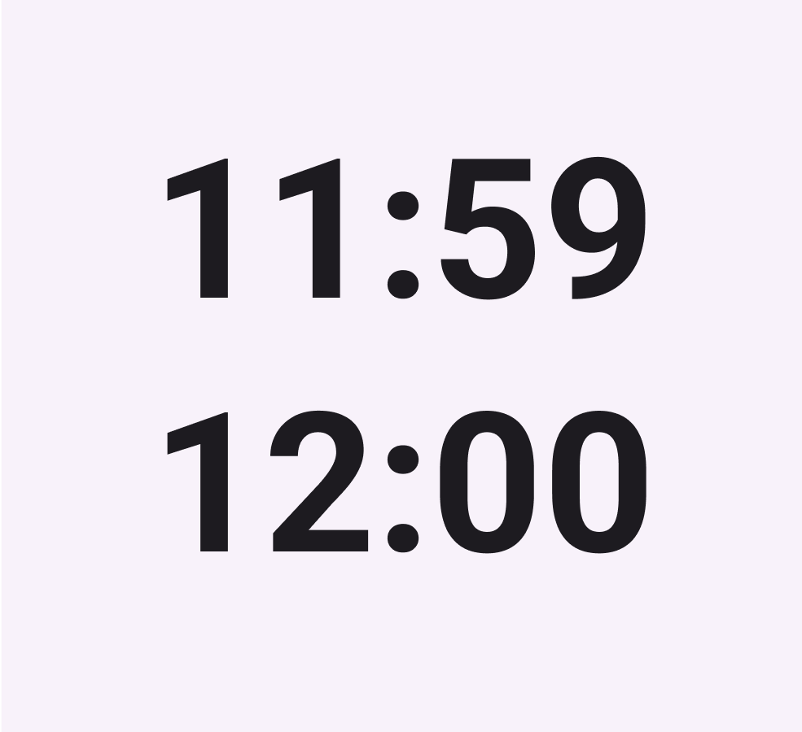

*Use tabular numbers to prevent layout shifting when values change, such as in a clock UI*

## Using Material Symbols with typography

Properly aligning typography with Material Symbols can improve cohesion and unity in your product. [Learn more about matching icons and text](https://m3.material.io/m3/pages/icons/applying-icons#f9db4adc-ca78-473f-85eb-a351b73c39ac)

## Accessibility

### Color & contrast

Support visual accessibility by choosing the appropriate color contrast between your product’s text and background. Contrast is the perceived difference between the lightness or darkness of two colors, and is quantified by a contrast ratio.

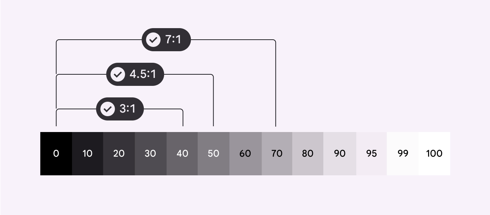

*Label styles should enable quick reading at small sizes, such as in buttons*

Text should achieve sufficient contrast between its color and that of its background.

Material aims for two main text contrast levels:

- 3:1 for large text
- 4.5:1 for small text

[Learn more about contrast ratios](https://m3.material.io/m3/pages/designing/color-contrast#b248ecd2-9abd-4877-8f5e-ebfbb87e2048)

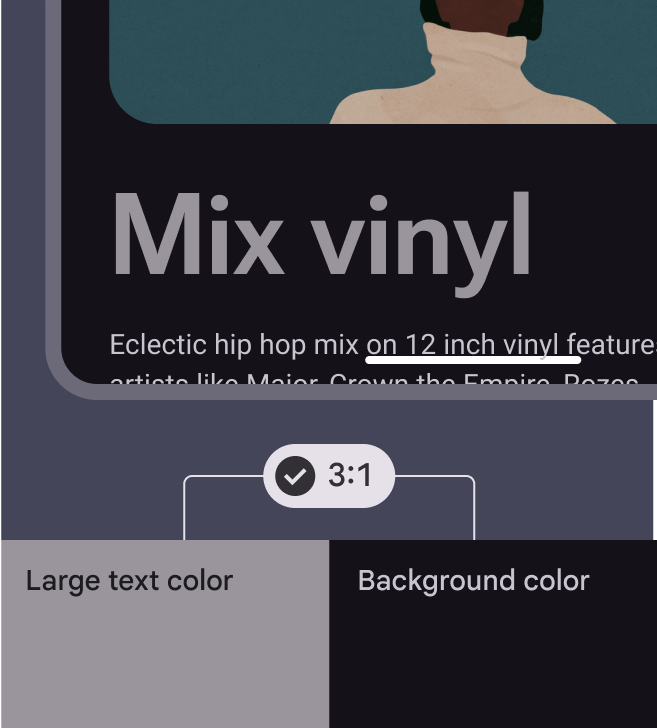

*Large text should achieve a contrast ratio of 3:1*

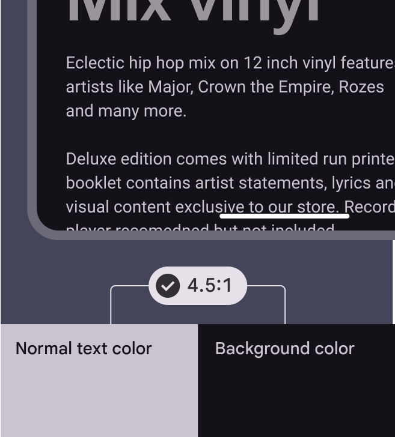

*Small text should achieve a contrast ratio of 4.5:1*

The default color for typography is on surface, although on surface variant is a strong alternative.

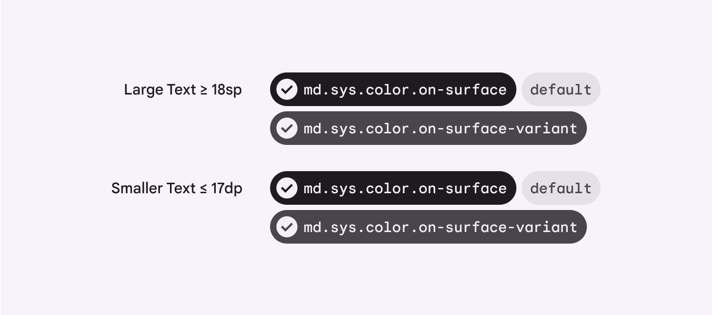

*Default typography colors*

For hyperlinked text appearing on top of a surface color (Color role used for the default color for backgrounds.), use primary (High-emphasis fills, texts, and icons against surface.). However, tertiary (Complementary fills, text, and icons against surface.) can be used to make links less prominent.

Hyperlinked text must also be underlined.

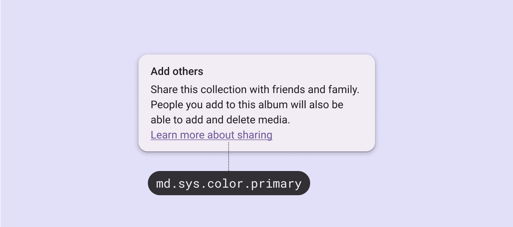

*Hyperlinks should be underlined and use primary or tertiary color*
