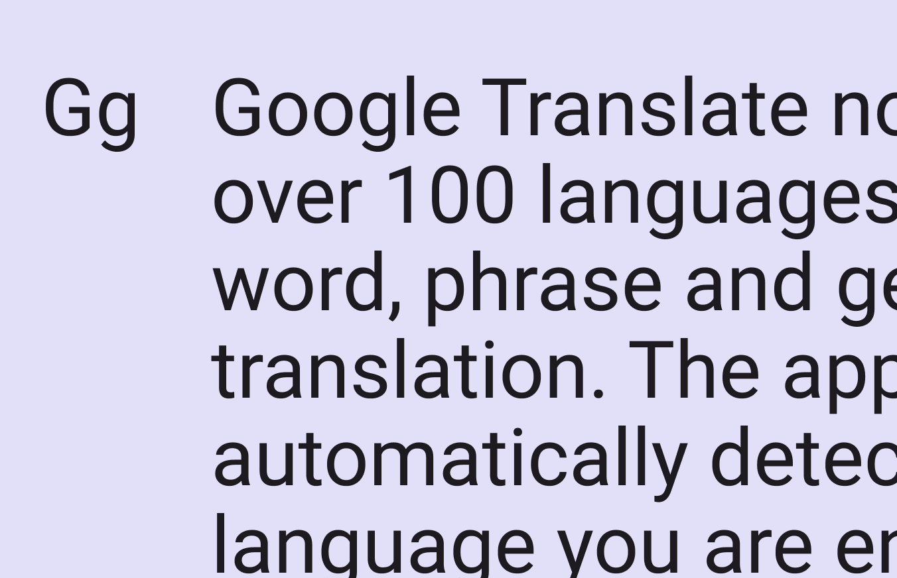
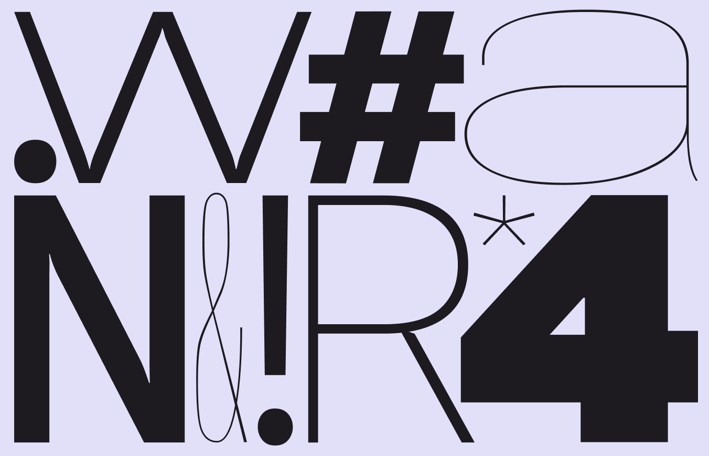
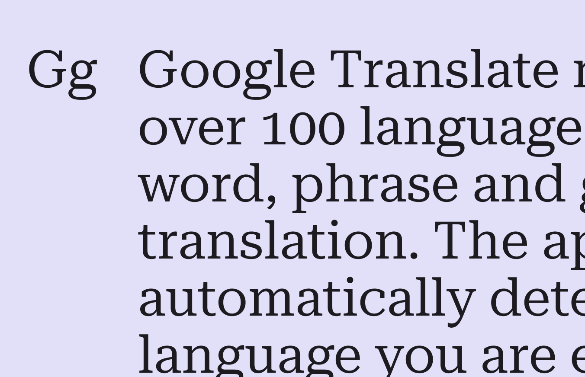
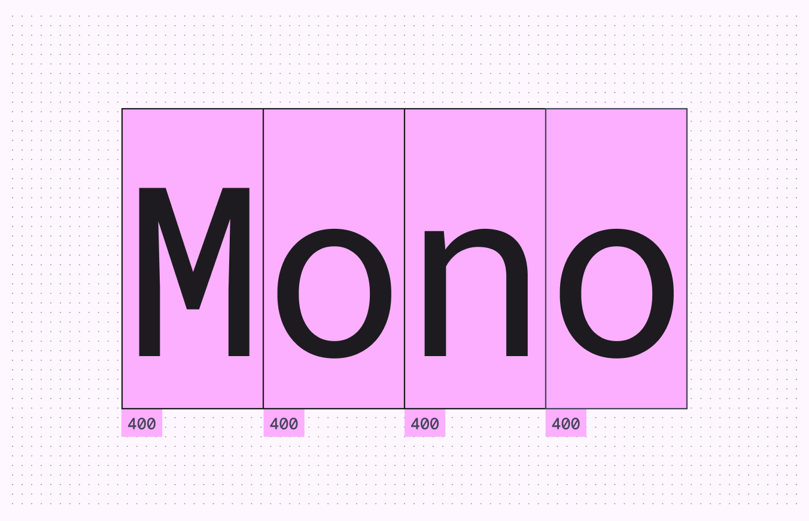
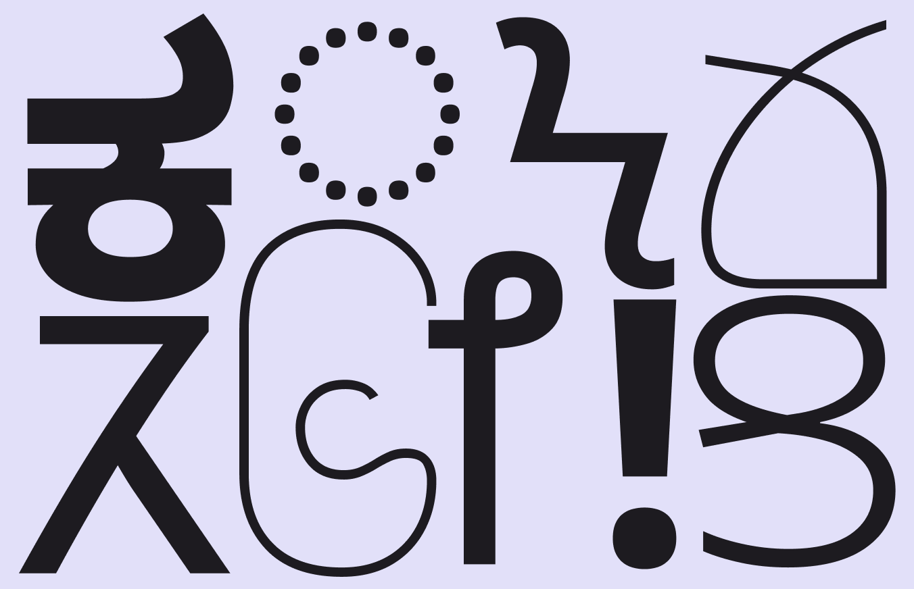
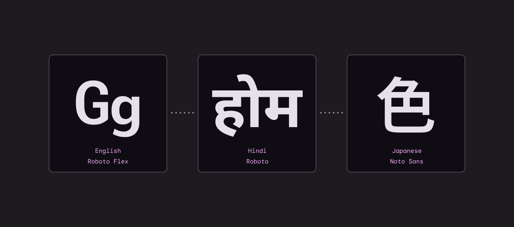

# Typography

Source: https://m3.material.io/styles/typography/fonts

Static fonts like [Roboto](https://fonts.google.com/specimen/Roboto) are currently applied by default to all Material 3 components. [Variable fonts](https://fonts.google.com/knowledge/introducing_type/introducing_variable_fonts) like [Roboto Flex](https://fonts.google.com/specimen/Roboto+Flex) have many more axes for expression, but aren't yet part of the M3 typescale.

## Default typefaces

### Roboto

[Roboto](https://fonts.google.com/specimen/Roboto) is the default typeface for Android, and is used in the [M3 typescale](https://m3.material.io/m3/pages/typography/type-scale-tokens#6a9f9f26-99bb-4185-82fc-a49725da0d01).

Roboto includes over 3,300 glyphs for representing hundreds of languages around the world.

*Roboto is the default typeface in Android and Material 3*

### Roboto Flex

[Roboto Flex](https://fonts.google.com/specimen/Roboto+Flex) is a variable font which adds more flexibility to typography. It has an extended range of weights, widths, and additional customizable attributes (like size-specific designs), and includes over 900 glyphs with support for Latin, Greek, and Cyrillic.

[Roboto Flex is available](https://fonts.google.com/specimen/Roboto+Flex) as a standalone font.

*Roboto Flex includes the styles of Roboto plus many more weights and widths optimized for larger and smaller sizes*

### Roboto Serif

[Roboto Serif](https://fonts.google.com/specimen/Roboto+Serif) is another variable font family, designed to create a comfortable reading experience. Minimal and highly functional, it can be used anywhere (even in app interfaces) due to its extensive set of weights and widths across a broad range of sizes.

*Roboto Serif offers a functional set of weights and widths*

### Roboto Mono

[Roboto Mono](https://fonts.google.com/specimen/Roboto+Mono?query=roboto) is a monospaced version of the classic Roboto design. Being monospaced means each letter has equal space, and letterforms are adjusted to properly fill the space.

Monospaced fonts are easier to scan vertically, so are particularly useful for code and keeping numbers aligned. [Learn more about monospaced numbers](https://m3.material.io/m3/pages/typography/applying-type#f0f79df7-3174-4012-871e-93ce9a89d08b)

*Equal sizing for each character keeps uniformity of spacing*

### Noto Sans

[Noto Sans](https://fonts.google.com/noto/specimen/Noto+Sans) is a global font collection for all modern and ancient languages.

Each Noto Sans family is compatible with Roboto and Noto Sans supports more than 150 scripts and thousands of languages. It is used as a “fallback” font, when a language is unsupported.

[Learn more about typography language considerations](https://m2.material.io/design/typography/language-support.html#language-considerations)

*Several Noto Sans fonts for different writing systems*

| Variable font | Available axes |
| --- | --- |
| Roboto Flex | Slant, Width, Weight, Grade, Optical Size. Advanced axes: Thick stroke (XOPQ), thin stroke (YOPQ), counter width (XTRA), uppercase height (YTUC), lowercase height (YTLC), ascender height (YTAS), descender depth (YTDE), figure height (YTFI) |
| Roboto Mono | Weight, Italic |
| Noto Sans | Width, Weight, Italic |

## Fallback protection with variable fonts

Font fallback is when a similar font is used as a replacement when the current font doesn't support the text's characters.

For example, products using the variable font Roboto Flex should apply font fallback in the following order:

1. Roboto Flex
2. Roboto
3. Noto Sans font collection

This ensures that text will have a consistent visual style regardless of font support. Designers should connect with their product and engineering partners to confirm that font fallback is available.

*Font branding is preserved when moving from Roboto Flex to Roboto to Noto Sans Japanese*
