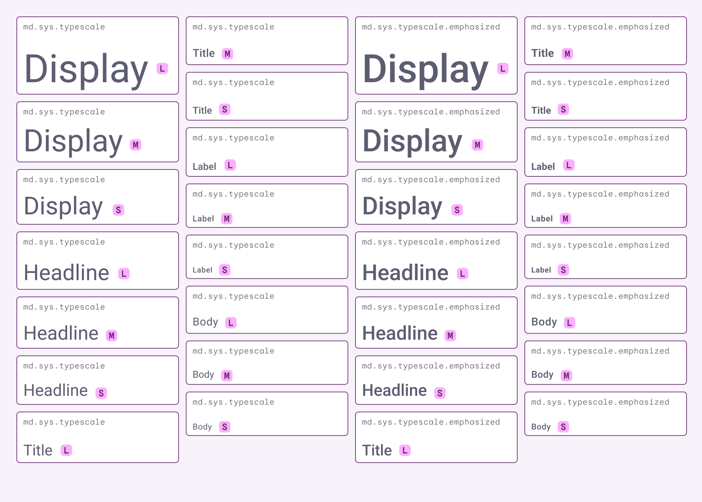
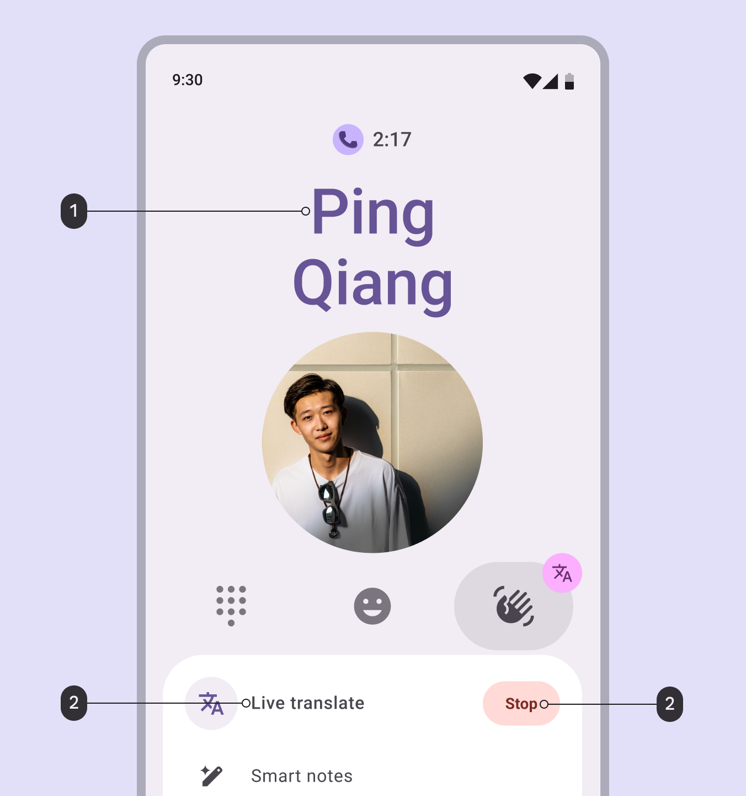
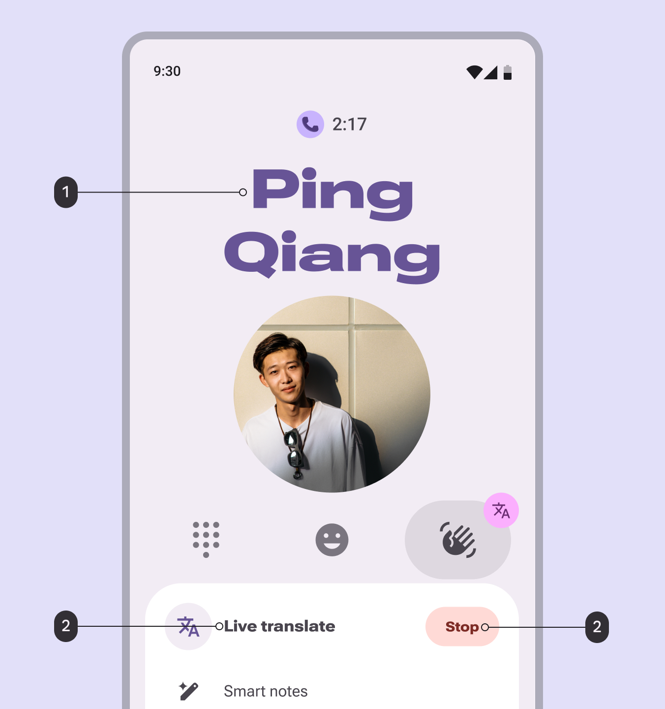
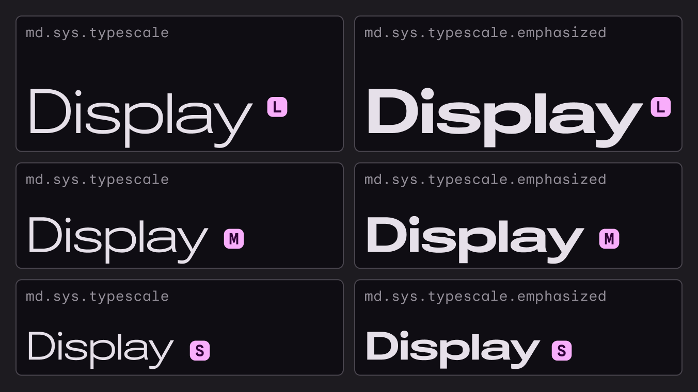
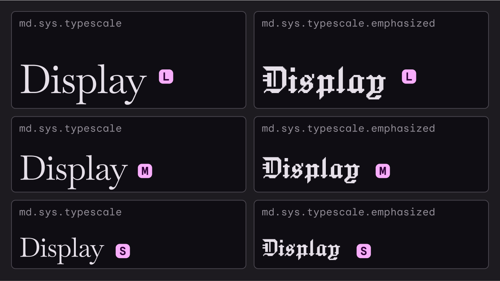
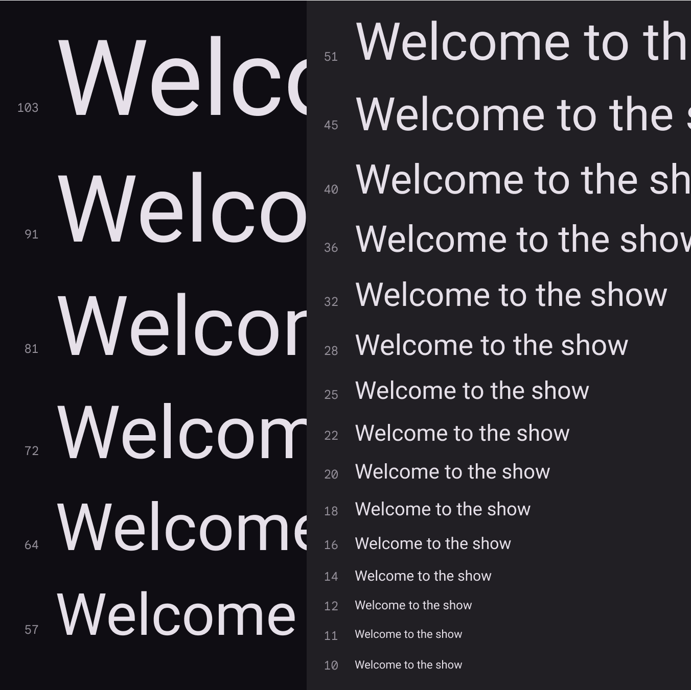
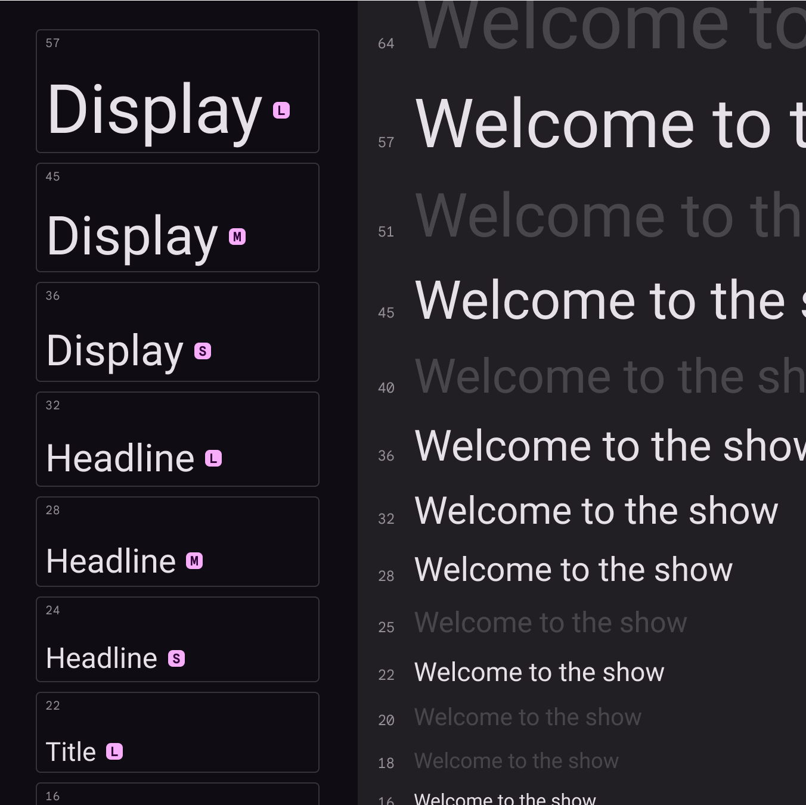
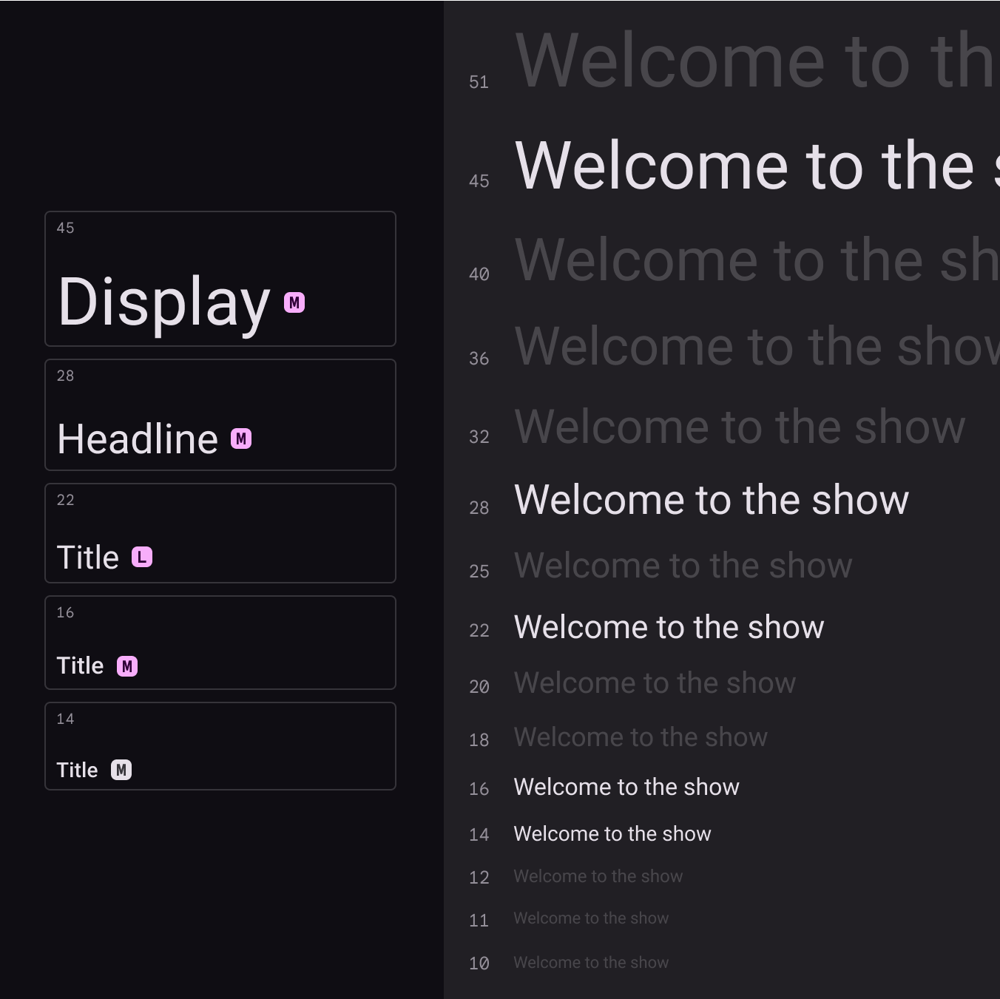
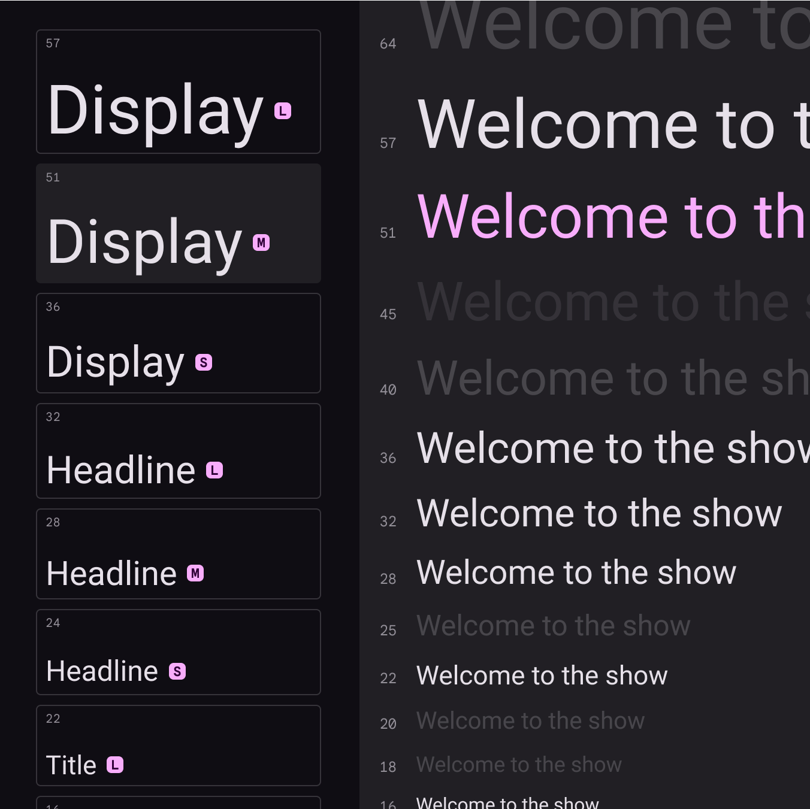

# Typography

Source: https://m3.material.io/styles/typography/type-scale-tokens

## Type scale

A type scale is a selection of type styles used across a product to ensure consistency.

### M3 type scale

Material 3 has one type scale containing two sets of type styles: 15 baseline and 15 emphasized. Both of these style sets follow the same scale from Display Large to Label Small.

The emphasized styles were added in the expressive update (The expressive update is a major update to Material 3, adding visually stunning features, components, and variants, plus updates to the shape, motion, and typography systems. [More on M3 Expressive](https://m3.material.io/blog/building-with-m3-expressive)). They have a higher weight and other minor adjustments compared to the baseline styles, and are best applied to bold, selection, and other areas of emphasis. Baseline and emphasized styles are meant to be used together.

*The scale is a range of contrasting styles that support the needs of various product contexts and content. No single product will use all the styles. Instead, select styles from the scale that are most appropriate.*

## Type scale tokens

Each of the 30 styles has a single token (Design tokens are the building blocks of all UI elements. The same tokens are used in designs, tools, and code. [More on tokens](https://m3.material.io/m3/pages/design-tokens/overview)) that captures all the default properties. Tokens are separated into the baseline and emphasized sets. Each axis and property, such as font, line height, size, tracking, and weight, also has an individual token for greater customization. [Learn more about design tokens](https://m3.material.io/m3/pages/design-tokens/overview)

### Baseline type style tokens

- Token sets: Type scale
- Visible groups: Display styles; Headline styles; Title styles; Body styles; Label styles

## Emphasized type styles

The M3 type scale has 15 emphasized type styles. Use both baseline and emphasized type styles together to achieve expressive experiences. Material recommends using emphasized styles for selection, actions, headlines, and other [editorial treatments](https://m3.material.io/m3/pages/typography/editorial-treatments#19e5796e-9db8-4687-b20c-c6cee77e7df8).

### Emphasized type style tokens

- Token sets: Type scale - Emphasized
- Visible groups: Emphasized Display styles; Emphasized Headline styles; Emphasized Title styles; Emphasized Body styles; Emphasized Label styles

## Where emphasized styles can be used

### Components

When used in components, emphasized type styles can communicate hierarchy or importance, such as an active or selected component, or an unread message. The emphasized styles work well with:

- Badges
- Buttons (for primary actions)
- Extended FAB
- Selected list items
- Selected menu items

Material components don’t use emphasized type styles by default. To use an emphasized type style, swap the baseline token for the emphasized token of the same style. For example:

- Baseline: md.sys.typescale.display-large
- Emphasized: md.sys.typescale.emphasized.display-large

### Weight

Use the emphasized styles on text that already uses weight (such as medium, bold) to communicate hierarchy.

### Context

Use emphasized styles to draw attention to specifics aspects of components, such as selected states, unread messages, or key interactions.

Emphasized context and weight can be used at the same time.

*Weight: Apply emphasized styles to text already bolded for an expressive style; Context: Apply emphasized styles to text in selective places to better communicate hierarchy or state*

## Customize the typeface

The M3 type scale has the option to set different typefaces at different sizes.

- The brand typeface is used for larger type styles, like Headline and Display, to focus on expression.
- The plain typeface is used for smaller type styles, like Body and Label, to focus on readability.
- Roboto is the default for both typefaces.

Consider replacing Roboto with different typefaces to boost brand expression in your product. On emphasized styles, this can help important text stand out even more.

*Roboto can be replaced with another font, like Roboto Flex*

### Brand and plain typeface tokens

- Token sets: Fonts & weights
- Visible groups: Brand; Plain; Weight

## Customizing type styles

To customize existing type styles, follow these steps:

1. If using a different typeface, change the brand and plain typeface tokens.
2. Adjust properties like line height and letter spacing to refine the appearance. Avoid changing the type size; this can affect how components render and reflow.
3. Repeat for both baseline and emphasized type styles. Try to keep emphasized styles visually consistent, like all wider than baseline.

Heavier fonts may require wider letter spacing, while fonts with long ascenders and descenders will require different line heights. Axes can be further adjusted as necessary.

Note: Customizing the M3 type scale or individual styles may prevent you from receiving typography token updates from Material.

*Adjust variable axes, like weight and width, to customize fonts like Roboto Flex*

Different typefaces can be used for baseline and emphasized type styles.

*Custom typefaces can be used together, like Baskervville and Jacquard*

## Customizing your type scale

When different sizes from the defaults are needed, such as for different devices, you can customize the type scale by adding or removing styles, and even swapping out Roboto for a font of your choice.

Material Design uses the [Major Second](https://cieden.com/book/sub-atomic/typography/different-type-scale-types#:~:text=with%2520dense%2520content.-,Major%2520Second%2520(1.125),-The%2520Major%2520Second) type scale with 14 as its key base size. This anchors to the most essential style used most often for typesetting body text.

*The Material Design type scale uses the Major Second scale (1.125)*

Sizes on the rendered type scale should aim to provide impactful contrast between sizes by avoiding small differences.

*Material’s default typescale of 15 styles allows distinction between each*

*Your product likely will not need all 15 default styles from the Material Design type scale. In this example, five sizes are chosen for a reduced set while the rest are removed.*

*If the default sizes from the Material Design type scale do not meet your needs, values can be changed instead. Here the default size of display medium is adjusted to another size from the Major Second type scale.*

### Font size units

The following units are used to express font size on Android and the web.

| Platform | Android | Web |
| --- | --- | --- |
| Font size unit | sp | rem |
| Conversion ratio | 1.0 | 0.0625 |

Web browsers calculate the REM (the root em size) based on the root element size. The default for modern web browsers is 16px, so the conversion is SP_SIZE/16 = rem.

#### Example conversions

| Android | Web |
| --- | --- |
| 10sp | 0.625rem |
| 12sp | 0.75rem |
| 24sp | 1.5rem |
| 60sp | 3.75rem |

### Letter spacing units

The following units are for spacing letters in a UI.

| Platform | Android | Web |
| --- | --- | --- |
| Letter spacing unit | em | rem |
| Conversion ratio | (Tracking value in px / font size in sp) = letter spacing | (Tracking value in px / font size in sp) = letter spacing |

#### Letter spacing examples

| Android | Web |
| --- | --- |
| (.2 tracking / 16sp font size) = 0.0125 em | (.2 tracking / 16px font size) = 0.0125 rem |
